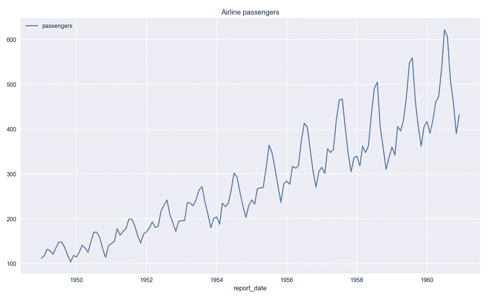
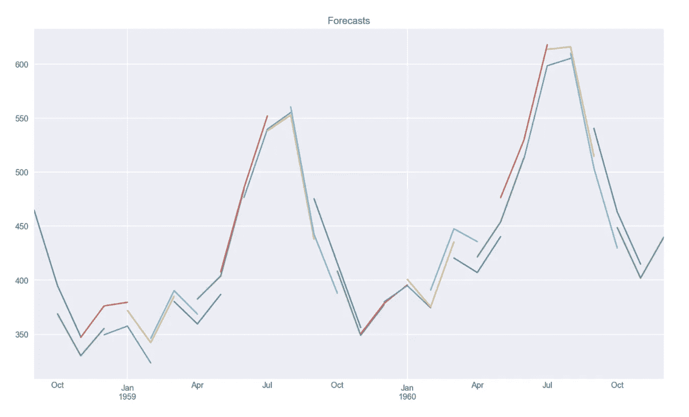

# 关于线性回归，有一点你可能不知道

> 原文：<https://towardsdatascience.com/one-thing-you-might-not-have-known-about-linear-regression-634446de7559?source=collection_archive---------11----------------------->


[NeONBRAND](https://unsplash.com/@neonbrand?utm_source=unsplash&utm_medium=referral&utm_content=creditCopyText) 在 [Unsplash](https://unsplash.com/s/photos/time?utm_source=unsplash&utm_medium=referral&utm_content=creditCopyText) 拍摄的照片

## 如何训练具有多个输出的单个模型

可能在超过 95%的使用线性回归的案例中(至少在主流媒体报道的案例中)，我们有一组特征(X)和一列目标(y)要预测。然而，线性回归是能够同时处理多个输出的算法之一。神经网络也能做到这一点，而决策树(以及基于树集合的模型)则不能。

在这篇短文中，我们展示了如何在一个简单的时间序列预测示例中使用多输出线性回归—我们使用相同的特征集预测多个步骤。然而，多输出回归也可以用于不同的任务。例如，当我们想用一组特征预测两个经济指标系列时，因为我们认为它们对两者都相关。

# Python 中的示例

## 设置

和往常一样，我们从导入所需的库开始。

## 数据

然后，我们加载著名航空公司的乘客数据集，这个数据集在`seaborn`库中很容易找到。这是一个非常受欢迎的数据集，所以我们将只提到我们有 12 年的每月数据供我们处理。



作者图片

我们已经可以看到，有一个明显的增长趋势(可能是倍增的，因为变化似乎随着时间的推移而增加)和一些强有力的年度季节性。

## 准备功能和目标

我们需要记住这是一个非常简化的例子，所以我们不会在特性工程上花太多时间。此时，我们必须定义特性和目标:

*   假设数据中似乎存在年度季节性模式，我们将使用 12 个独立的滞后作为特征，
*   我们将预测未来 3 个月的航空乘客数量。

数据如下所示:


作者图片

当然，由于我们无法从不可用的时间段创建滞后/超前，因此会有很多缺失值。这就是我们删除缺少值的行的原因。

然后，我们从目标中分离出特征。这是与最常见的任务不同的时刻——目标实际上由 3 列组成。完成后，我们将数据分成训练集和测试集。我们使用 20%的观察值作为测试集。请记住，在处理时间序列时，我们不应该在拆分数据时打乱观察结果。

## 训练模型

训练模型看起来与单输出模型的情况完全相同。

## 检查结果

我们不会评估我们预测的准确性，因为我们没有投入太多精力来建立一个准确的模型。相反，我们专注于研究预测在图中的样子。首先，我们需要创建一个简单的助手函数来可视化多输出序列。

我们首先看看地面的真相。

```
plot_multistep_forecast(y_test, "Actuals", freq="M");
```


作者图片

正如所料，在连续的时间段内有很多重叠。这是因为这些值在同一期间内不会发生变化，无论它被视为范围 1 还是范围 3。现在，让我们来看一下预测，这些预测很可能会有很大差异。

```
plot_multistep_forecast(y_pred, "Forecasts", freq="M");
```



作者图片

说实话，没那么糟糕！我们可以清楚地看到与上面实际情况相同的模式，尽管有一些变化。例如，对于几乎所有的日期，预测都会根据我们所关注的时间范围而变化(有时变化很大)。但是对于这个简单的练习来说，结果绝对够好了。

# 外卖食品

*   一些算法能够同时预测多个输出，线性回归就是其中之一，
*   对于最简单的实现，我们只需要在目标中有更多的列。

您可以在我的 [GitHub](https://github.com/erykml/medium_articles/blob/master/Machine%20Learning/multi_output_linear_regression.ipynb) 上找到本文使用的代码。此外，欢迎任何建设性的反馈。你可以在[推特](https://twitter.com/erykml1?source=post_page---------------------------)或评论中联系我。

喜欢这篇文章吗？成为一个媒介成员，通过无限制的阅读继续学习。如果你使用[这个链接](https://eryk-lewinson.medium.com/membership)成为会员，你将支持我，而不需要额外的费用。提前感谢，再见！

您可能还会对以下内容感兴趣:

</verifying-the-assumptions-of-linear-regression-in-python-and-r-f4cd2907d4c0>  </interpreting-the-coefficients-of-linear-regression-cc31d4c6f235>  </phik-k-get-familiar-with-the-latest-correlation-coefficient-9ba0032b37e7> 