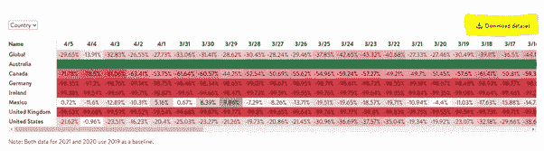
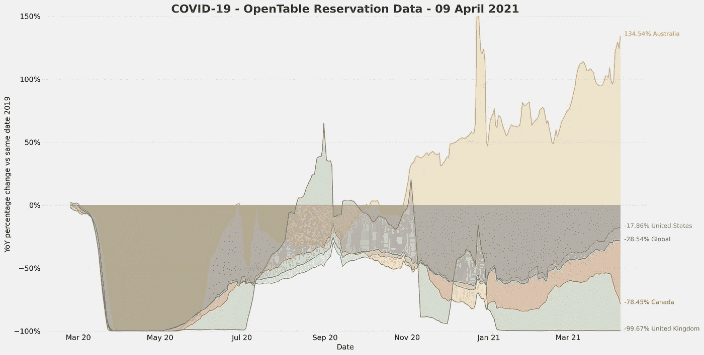
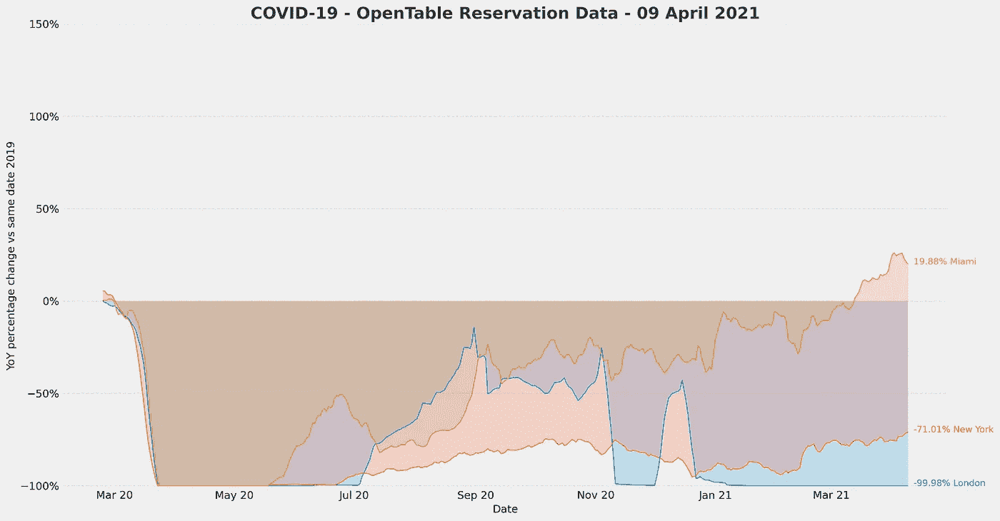
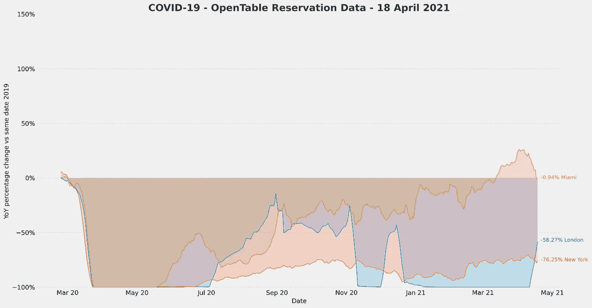
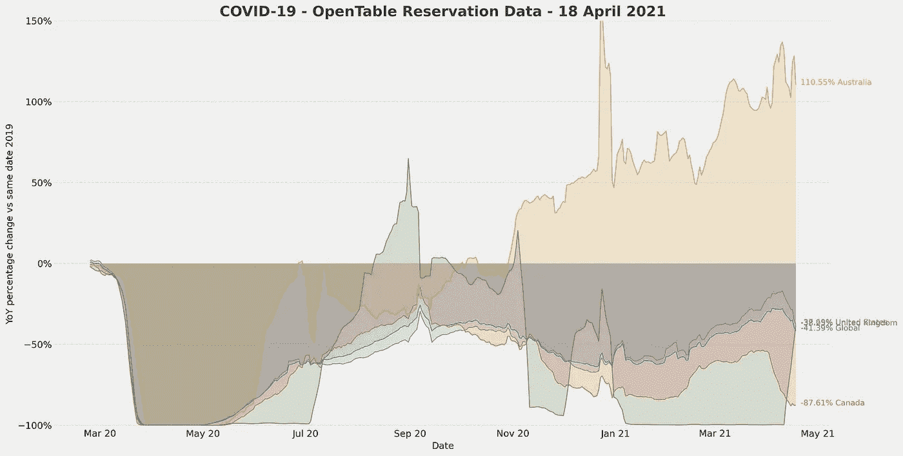
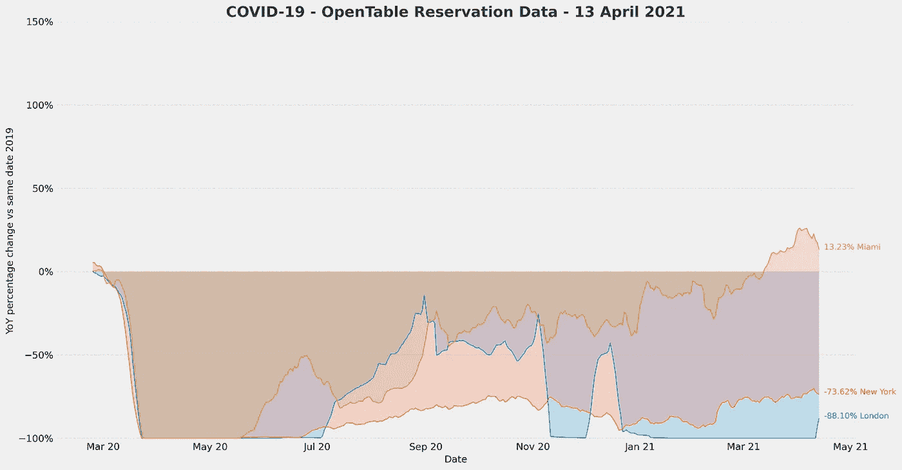
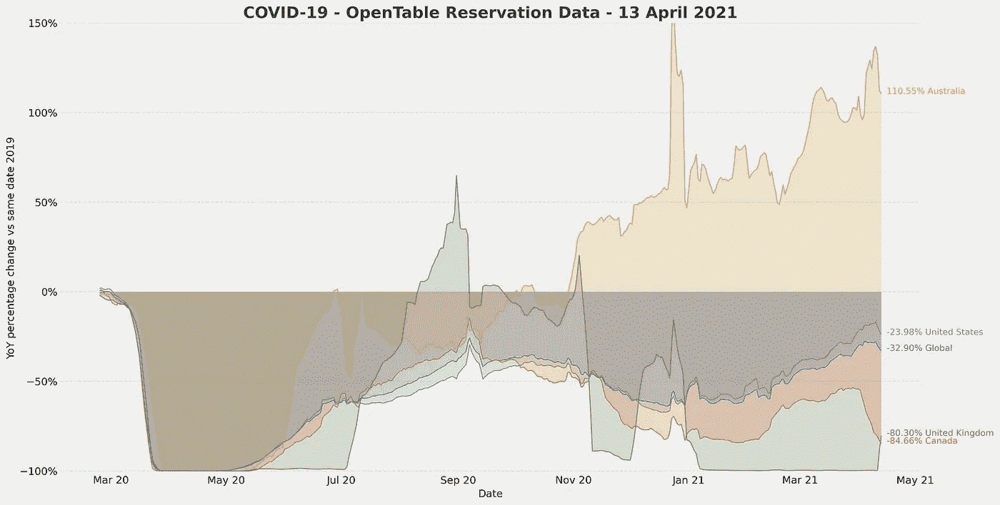
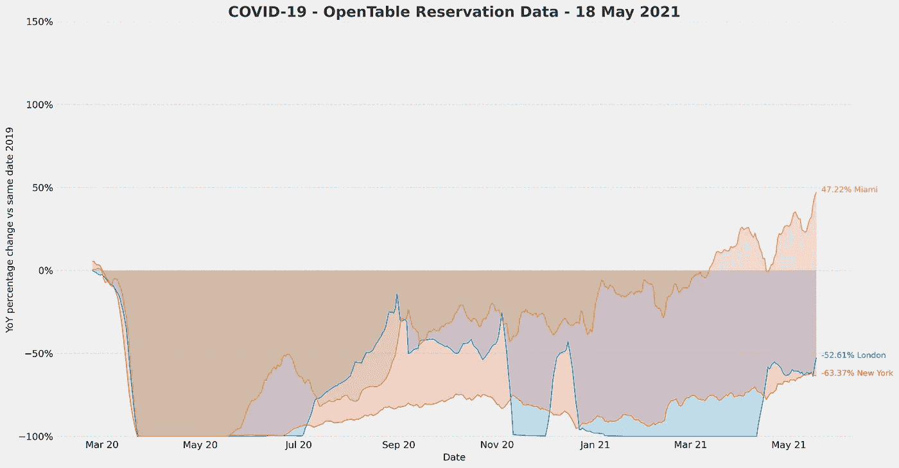
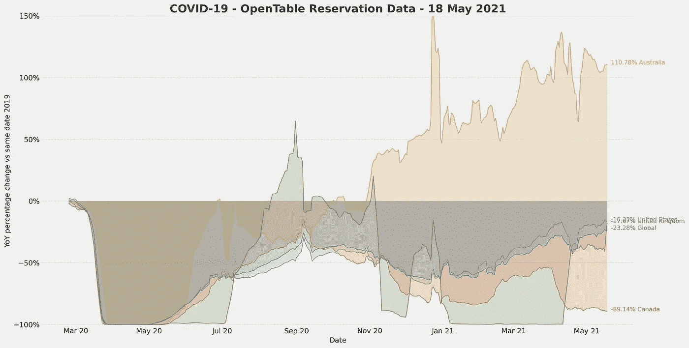

# 如何使用 Python 跟踪锁定的结束

> 原文：<https://towardsdatascience.com/one-useful-way-to-track-the-end-of-lockdown-using-python-936809116a0a?source=collection_archive---------48----------------------->

## 使用 Python 和 OpenTable 的行业公开可用数据来跟踪全球酒店行业走出封锁和复苏的情况

乔纳森·阮在 [Unsplash](https://unsplash.com?utm_source=medium&utm_medium=referral) 上的照片

随着英国正在摆脱封锁的限制，没有比现在更好的时机来利用数据和可视化来显示这一点的影响。在 2020 年的大部分时间里，以及到目前为止的整个 2021 年，由于新冠肺炎，英国一直处于封锁状态，酒店行业几乎完全关闭。【2021 年 4 月 12 日标志着餐厅将能够为食客提供座位的日期，这意味着在线预订将再次开放。本文将向您展示如何利用公开可用的数据来监控回归正常的路线。

# 什么是 OpenTable？

OpenTable 是一家在线餐厅预订服务公司，总部位于加利福尼亚州旧金山，但在以下国家/地区拥有强大的全球影响力；澳大利亚、加拿大、法国、德国、日本、墨西哥、英国和美国。根据该公司的网站，

> “OpenTable 的软件每年在 60，000 家餐馆、酒吧、酒厂和其他场所为超过 10 亿人提供座位”

# 为什么这对我们有用？

自从疫情开始以来，OpenTable 就提供了对他们所服务的餐厅和酒吧的预订和就餐数据的访问。他们的“行业状况”数据集每天更新，可以用来说明新冠肺炎对他们通常经营的一些特定全球区域的餐厅预订的影响。

这在跟踪所覆盖地区的封锁放松情况时非常有用，因为餐厅预订可以作为更广泛的酒店业的代理，甚至在一定程度上，可以作为特定经济的健康状况的代理。

从这些数据中，我们可以得出关于恢复正常的速度和行业现状的结论。这最终会给我们一个时间表，告诉我们什么时候能够忘掉疫情。

# 如何下载数据

要获取数据集，导航至 OpenTable 的行业状态页面 [**此处**](https://www.opentable.com/state-of-industry) 。

向下滚动并单击您看到的第一个“下载数据集”，如下图中突出显示的:

按作者下载数据集|图像

# 清理和绘制数据

我已经创建了下面的函数，它将清理数据并生成一个包含指定国家、城市或州的图表。

要使用该功能，请输入以下内容:

*   从上一步导入的熊猫数据帧。
*   指定“城市”、“州”或“国家”的字符串(参见 DataFrame 列“类型”)
*   城市、州或国家的列表(见数据框架列“名称”)

该函数的输出是一个 matplotlib 图形。

**注意:**该函数对数据集应用 7 天滚动平均值。这种滚动周平均值减少了数据中的噪声，有助于以明确的方式描绘总体趋势。

使用此功能，我在以下区域运行了可视化:

国家/地区—全球、英国、美国、加拿大、澳大利亚

城市—伦敦、纽约、迈阿密

# 形象化

下面的图表显示了我们上面指定的国家和城市的可视化。下面是截至 2021 年 4 月 12 日**的图表(更多最新图表和用于运行您自己的图表的功能，请参见本文末尾)。)**

****国家:****

****

**国家图表-全球、美国、加拿大、英国和澳大利亚|作者图片**

****城市:****

****

**城市图表——迈阿密、纽约和伦敦|作者图片**

# **分析**

**这些图表的 y 轴上显示的百分比说明了 2019 年的某一天与 2020 年和 2021 年的同一天之间的百分比变化(同比)。通过将 2019 年作为这两年的基线，我们可以比较在有封锁限制的 COVID 期间就座用餐者的变化，以及一切正常时就座用餐者的变化。**

**从这些图表中，我们可以看到，由于所有餐厅和酒吧被迫关闭，英国的比例为-99.67%，美国的平均水平略高，仅比 2019 年的用餐者人数下降了-17.86%。澳大利亚经历了相对很少的 COVID 病例，现在急剧上升，达到 134.54%。**

**伦敦和纽约是两个可比较的城市，都经历了类似的封锁限制，目前正在兴起。这种情况使它们成为运行我们的 OpenTable 函数的完美城市。检查结果，我们可以看到伦敦的就餐人数为-99.98%，纽约的活动人数为-71.01%。对比这两个城市，你可以看到迈阿密目前在 2019 年的用餐人数上增长了 19.88%，显示出他们目前更宽松的封锁限制。**

# **展望未来**

**在未来几周到几个月，我们应该预计英国将恢复到疫情之前的活动水平。如果预订量达到 2019 年的水平，这将在上面绘制的图表中显示为 0%。我们甚至可能经历被压抑的需求效应，导致类似于澳大利亚的反应，那里的餐馆和酒吧将远比 COVID 之前繁忙。如果是这样的话，我们应该很快就会看到英国远远超过 2019 年的水平。**

**这将是令人着迷的，因为这个数据集可以作为一个很好的代理，可视化多个地区的酒店业的当前状况。**

**如果您对特定于美国的数据感兴趣，您可以从同一个数据集中访问城市和州级数据。对于其他地方，目前可用的国家包括澳大利亚、加拿大、德国、爱尔兰、墨西哥、英国和美国。**

**在接下来的几个月里，我可能会定期用最新的图表更新本文，但是，我建议您下载数据集的最新副本，并使用提供的函数来研究它。这样做将有助于你及时跟踪复苏情况，并最终通过比较城市、州和国家得出你自己的结论。**

****更新:****

**【2021 年 4 月 20 日- 从下面图表中的数据可以看出，英国重新开业的趋势仍在继续。伦敦股市目前从一周内的-100%上涨至-58.27%，整个英国股市为-37.85%。**

**2019 年英国用餐人数的百分比变化现在与美国的数字一致，并将很快超过美国。伦敦现在也明显高于纽约，而此前纽约要低得多。**

**一个有趣的观察是，加拿大现在已经稳定下来，很可能是由于 COVID 病例的增加和一些旅行限制的实施。**

****

**城市数据—2021 年 4 月 20 日|作者图片**

****

**国家数据—2021 年 4 月 20 日|作者图片**

**【2021 年 4 月 15 日— 在英国，随着所有餐厅和酒吧开放户外座位，用餐人数出现了明显的激增。**

**我们可以看到，伦敦已经从-100%跃升至-88%，英国作为一个整体，现在已经超过了加拿大，与 2019 年相比。**

**再过一周就能看到这些图表的样子，这将是令人兴奋的。**

****

**城市数据—2021 年 4 月 15 日|作者图片**

****

**国家数据—2021 年 4 月 15 日|作者图片**

**【2021 年 5 月 20 日— 总体趋势继续向好的方向发展，更多的餐厅和酒吧如期开业。这使得我们下面的跟踪图表持续增长。有趣的是，英国从 5 月 17 日星期一开始开放室内餐饮。从下面的图表中，我们可以看到伦敦的餐饮数据开始飙升。**

****

**城市数据—2021 年 5 月 20 日|作者图片**

****

**国家数据—2021 年 5 月 20 日|作者图片**

**如果你还有任何问题，请在下面的评论区留言。**

***注:本文仅代表个人观点和经验。***