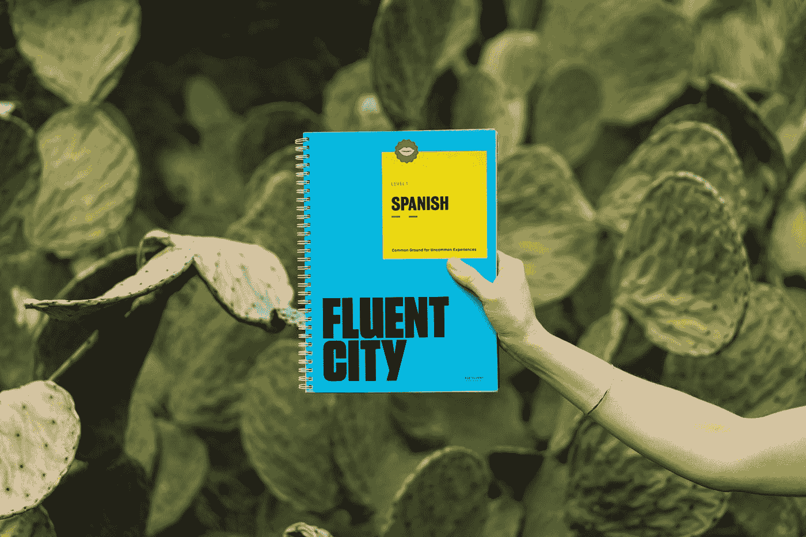

# 结合数据科学和语言学习的一种方法

> 原文：<https://towardsdatascience.com/one-way-to-combine-data-science-and-language-learning-d0ccc455ac6b?source=collection_archive---------36----------------------->

## 分析你的个人言语模式



照片由[丹金](https://unsplash.com/@danielcgold?utm_source=medium&utm_medium=referral)在 [Unsplash](https://unsplash.com?utm_source=medium&utm_medium=referral) 上拍摄

# 前言

我是默克公司的一名数据科学家，但在工作之余，我一直在学习法语。这不是我第一次学习语言——我学习西班牙语已经很多年了，我觉得我已经达到了自己满意的流利程度。本文不会讨论语言学习的原则，但我想分享一个关于语言学习的个人假设，它将推动数据科学和语言学习之间的交叉。是这样的:

> 我们想学习如何说我们通常用母语说的话。

这看起来很明显，因为事实就是如此！教授和建立口语产出的传统方式通常是使用**非个人化的**文档——教科书之类的材料，这些材料具有预先定义的陈述，然后由学习者练习和重复。但是也许我们应该采取一种更加个性化的方法，一种更加系统化的方法来反映任何语言学习者都熟悉的“如何用[目标语言]表达”的情况。

# 如何在 R 中实现它

## 通用方法

方法是分析你自己的语音数据来识别你倾向于使用的词汇、短语和句法结构！未来可能会有许多不同的方向，但我采取的初步方法可以用以下步骤来描述:

1.  使用一个应用程序(如[草稿](https://getdrafts.com/))来记录你简单谈论一个话题大约 5 分钟的语音转文本
2.  将生成的文本复制并粘贴到某个电子表格或文本文件中(任何平面文件格式都可以)
3.  将数据读入 R
4.  使用 tidyverse 原理分析单词和 n-gram 频率
5.  翻译以创建您的英语-法语学习材料

## 细节

第一步

*   我认为，当我们对不同的人谈论不同的话题时，我们当然不仅会使用不同的词汇，还会使用不同的句法选择。例如，与你的朋友交谈和做一个演示可能是非常不同的。所以你应该意识到选择你的话题/假设的听众可能会改变随后的词频。
*   如果你想要更多的数据，记录你自己更长时间的讲话。数据越多，你的典型语音模式的代表性词频就越多。

第二步

*   您的文本可以在电子表格的一个“单元格”中，也可以在多个“单元格”中。稍后将对其进行去标记(即解析)

第三步

*   因为我是一个喜欢潮流的人，所以我倾向于使用`[readr](https://readr.tidyverse.org/)`和`[readxl](https://readxl.tidyverse.org/)`

第四步

*   对于这个分析，我使用了 [tidytext](https://www.tidytextmining.com/) 和[停用词](https://www.rdocumentation.org/packages/stopwords/versions/2.2)(关于停用词的更多信息，请阅读这篇 [wiki 文章](https://en.wikipedia.org/wiki/Stop_word))包
*   我抽出一个单词的频率来反映我最常用的**词汇选择**
*   然后我找出二元模型和三元模型的频率(两个和三个连续的词集；更多关于什么是 n-gram 的信息[在这里](https://en.wikipedia.org/wiki/N-gram))来反映我最常见的**语法构造选择**

第五步

*   最后，我使用`[googleLanguageR](https://cran.r-project.org/web/packages/googleLanguageR/vignettes/setup.html)`。为了让 googleLanguageR 访问云翻译 API，您需要一个 JSON 文件。我建议先阅读[这篇文章](https://cran.r-project.org/web/packages/gargle/vignettes/get-api-credentials.html)来设置你的 Google Cloud 账户，然后阅读 [StackOverflow 回答](https://stackoverflow.com/questions/58460476/where-to-find-credentials-json-for-google-api-client)来了解如何为你的 Google Cloud 项目下载云翻译 API 所需的 JSON 凭证。
*   一旦你有了英法翻译的数据框架，你就可以测试自己的法语翻译，或者开始练习用你最常用的说话方式造不同的句子。

## 密码

# 总结想法

作为练习，我录下了自己用大约 5 分钟时间讲述我的语言学习方法，背景是草稿的语音到文本转录功能。按照上述步骤，我发现我最常选择的 10 个词汇是:

```
# A tibble: 10 x 3
   word           n french_text 
   <chr>      <int> <chr>       
 1 french         8 français    
 2 speak          7 parler      
 3 words          6 mots        
 4 english        5 Anglais     
 5 practice       5 entraine toi
 6 spanish        5 Espanol     
 7 ability        4 capacité    
 8 repetition     4 répétition  
 9 choices        3 les choix   
10 learn          3 apprendre
```

我最常见的二元模型:

```
# A tibble: 10 x 3
   bigram        n french_text      
   <chr>     <int> <chr>            
 1 i would      11 je voudrais      
 2 i think       8 je pense         
 3 and i         7 et moi           
 4 that i        7 que je           
 5 so i          6 donc je          
 6 want to       6 vouloir          
 7 i want        5 je veux          
 8 when i        5 quand je         
 9 would use     5 voudrais utiliser
10 in a          4 dans un
```

我最常见的三元模型是:

```
# A tibble: 10 x 3
   trigram              n french_text       
   <chr>            <int> <chr>             
 1 i want to            5 je veux           
 2 i would use          5 j'utiliserais     
 3 so i think           3 donc je pense     
 4 the ability to       3 la capacité à     
 5 a certain way        2 une certaine façon
 6 a lot of             2 beaucoup de       
 7 ability to speak     2 capacité de parler
 8 and i would          2 et je voudrais    
 9 and learn them       2 et les apprendre  
10 and then i           2 et puis je
```

我希望你对这种方法感兴趣，尤其是如果你自己正在学习一门新语言的话！如果你已经试用过，或者有任何问题/建议，请随时给我发电子邮件！