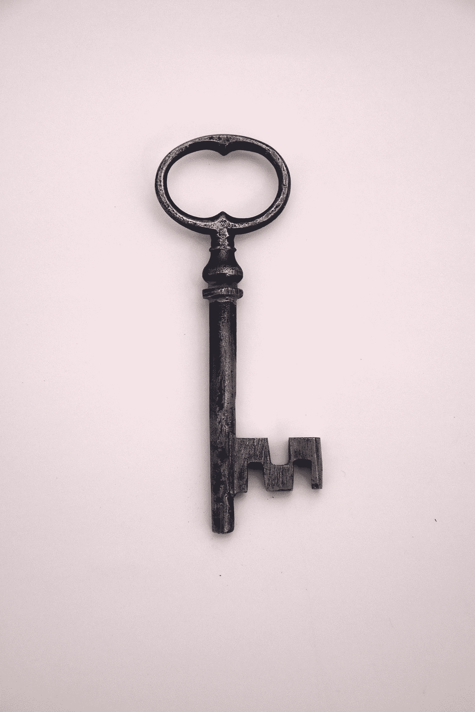

# 防止数据库被清除一种方法

> 原文：<https://towardsdatascience.com/one-way-to-prevent-your-database-from-wipe-out-de0ec8bb9111?source=collection_archive---------45----------------------->

## 用两个词

照片由[日常基础](https://unsplash.com/@zanardi?utm_source=medium&utm_medium=referral)在 [Unsplash](https://unsplash.com?utm_source=medium&utm_medium=referral)

我丢失了没有备份的 SQL 数据库。

我不得不重新重写。然后我发现，没有这两个字的触发器是没有用的——“回滚事务”。

作为数据库管理员或所有者，这些话是对您的数据的保护。如果没有它们，两个词——删除数据库——就能抹去你一生中的全部数据。

顺便说一句，触发器使人们不可能改变你的数据。一些数据库管理员保护他们的数据不被插入、删除、更新、删除等等。

我在 SQL 数据库丢失期间发现的另一个令人震惊的启示是，当你在谷歌上搜索如何创建触发器时，排名靠前的文章并不清晰明了。

在本文中，您将学习如何创建触发器以及保护数据库的一种方法。

# 如何创建触发器

我们开始吧。

运行上面的。“命令成功完成”将显示在您的屏幕下方。创建一个触发器。

要确保创建了触发器，请转到您的表或数据库—您在其上创建了触发器的表或数据库。它位于 Microsoft SQL Server Management Studio 的左侧。单击加号展开表或数据库。点击“触发器”。您将看到新创建的触发器的名称。

现在，为了测试触发器是否工作，运行下面的查询:

这个错误信息会出现在你的屏幕上:

恭喜你，你的扳机起作用了！

请注意，您的数据库没有针对更新、插入等进行保护，因为我们只创建了一个针对数据库删除的触发器。

现在是惊喜。

如果在触发器查询中省略“回滚事务”并运行触发器，同样会显示“命令成功完成”。这意味着您已经成功创建了一个触发器。当您检查时，触发器甚至可以在您的表或数据库下找到。

但是，嘿，山上有火。如果触发器中没有这些关键字，将不会创建触发器—回滚事务。

为了测试这一点，创建一个小表。然后像上面一样在小表上创建一个删除触发器，并省略' ROLLBACK TRANSACTION '。启动你的扳机。运行触发器后，运行:

要检查您的小表，请运行:

你的小桌子现在是空的！

小心点。永远记住把“回滚事务”放在触发器中。

要删除正常工作的触发器，请运行:

触发关闭！

快乐查询。

感谢您的阅读。