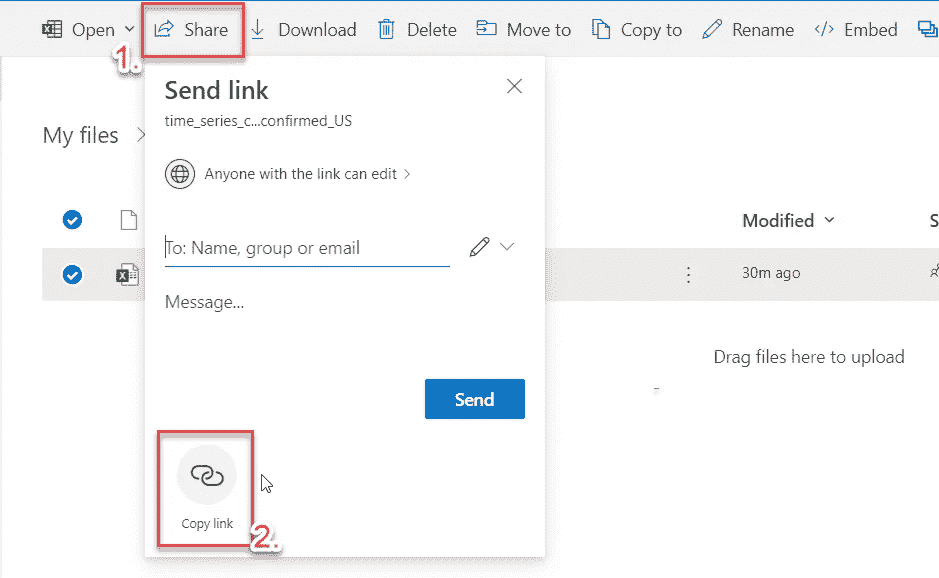
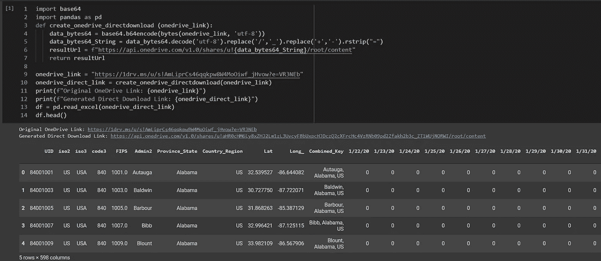

# OneDrive 作为 Python 项目的数据存储

> 原文：<https://towardsdatascience.com/onedrive-as-data-storage-for-python-project-2ff8d2d3a0aa?source=collection_archive---------3----------------------->

## 使用 OneDrive API 将 OneDrive 文件直接同步到您的 Python 项目

*本文插图由* [*金彩云*](https://www.chaeyun.com/) 提供

我们可能已经听过这句话**“数据是新的石油”**。此外，我们作为数据科学家致力于数据科学过程——提炼这种新的石油，使其变得有价值并随时可用。数据科学过程中最基本的步骤是**数据存储**。在本文中，我将展示一个如何使用云技术作为数据存储的例子。

就价格和容量而言，OneDrive 是最高效的可用云存储之一。而且，也很容易得到一个。随着免费版本，你可以使用它，你得到 5 GB 的免费存储空间。但是你可以随时订阅它的服务来获得更多的存储空间。我自己已经订阅了微软 365 系列，并获得了总共 6 TB 的云空间以及 MS Office 软件以供使用。我认为这是一个将这个空间用于 Python 数据科学项目的绝佳机会。

## 问题！？

遗憾的是，您不能通过 OneDrive 的 URL 共享直接使用该文件，因为它会以 HTML 页面的形式从 OneDrive.com 返回，需要您点击下载按钮才能在您的项目中使用该文件。

在这篇短文中，我将重点介绍如何用几行代码**将文件从 OneDrive 直接同步到 Python。**

# 创建 OneDrive 直接下载链接

## 第一步:通过 OneDrive 共享文件并获取下载链接

这一步相对简单。您可以使用 OneDrive 上传或共享文件，然后单击“共享”和“复制链接”按钮来创建云链接。

**创建 OneDrive 链接**(作者)

## 步骤 2:将 OneDrive URL 转换为直接下载 URL

为了能够直接在 Python 中下载您的 OneDrive 文件，步骤 1 中的共享 URL 必须转换为符合 OneDrive API 指南[的直接下载 URL，此处为](https://docs.microsoft.com/en-us/graph/onedrive-concept-overview)。或者，您可以使用`base64`模块按照我下面的脚本进行操作。

[**one drive _ DD _ generator . py**](https://gist.github.com/JoeThunyathep/5293f3bbdb87840b67aa027b4ee0b4d0)(作者)

使用上面的函数，您可以将步骤 1 中共享的 OneDrive URL 传递到该函数中。

# 用例

## 将 OneDrive 上的 Excel 导入熊猫的数据框架

让我们尝试使用上面的步骤和下面的样本时间序列数据集。它存放在我的 OneDrive 上。

<https://1drv.ms/u/s!AmLiprCs46qqkpw8W4MoOiwf_jHvow?e=VR3NEb>  

我们可以使用上面两步中的脚本来生成直接下载链接，然后使用 Pandas 直接导入 excel 数据。完整的示例脚本如下所示:

**将 OneDrive 上的 Excel 导入 Python 数据框架**(作者)

# 结论

本文介绍了如何使用 OneDrive API 将 OneDrive 中的文件作为 Python 项目内部的直接链接进行同步。

我希望你喜欢它，并发现它对你的日常工作或项目有用。如果你有任何问题，请随时联系我。

关于我&查看我所有的博客内容:[链接](https://joets.medium.com/about-me-table-of-content-bc775e4f9dde)

**平安健康！**
**感谢阅读。👋😄**