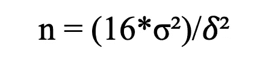
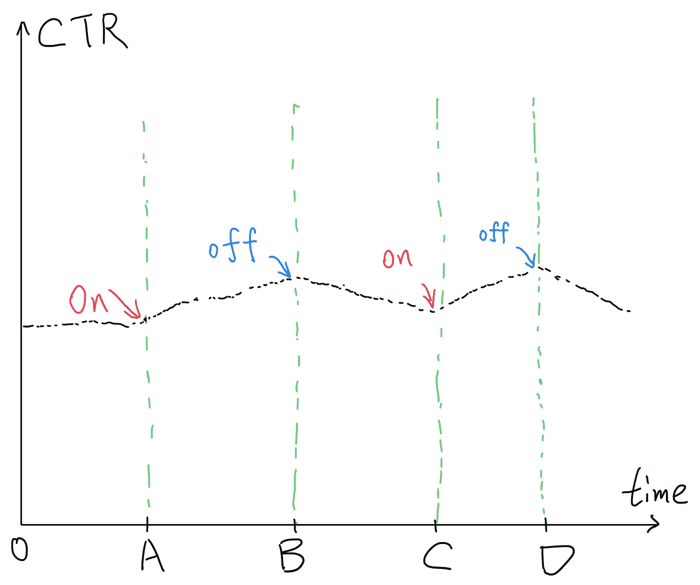
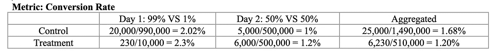

# 运行 A/B 测试的 8 个常见陷阱

> 原文：<https://towardsdatascience.com/online-controlled-experiment-8-common-pitfalls-and-solutions-ea4488e5a82e?source=collection_archive---------6----------------------->

## [入门](https://towardsdatascience.com/tagged/getting-started)，实验和因果推理

## 如何不让你的网上受控实验失败


照片由[罗尔夫·布利彻·戈弗雷](https://unsplash.com/@godfrey15?utm_source=unsplash&utm_medium=referral&utm_content=creditCopyText)在 [Unsplash](https://unsplash.com/?utm_source=unsplash&utm_medium=referral&utm_content=creditCopyText) 拍摄

在线实验已经成为产品创新和决策的行业标准。通过设计良好的 A/B 测试，科技公司可以更快地迭代他们的产品线，并提供更好的用户体验。在 FAANG 中，网飞是最公开其实验方法的公司。在一系列的帖子中，网飞介绍了[如何提高实验效率](https://netflixtechblog.com/improving-experimentation-efficiency-at-netflix-with-meta-analysis-and-optimal-stopping-d8ec290ae5be)，[减少方差](https://www.kdd.org/kdd2016/papers/files/adp0945-xieA.pdf)，[准实验](https://netflixtechblog.com/quasi-experimentation-at-netflix-566b57d2e362)，[关键挑战](https://netflixtechblog.com/key-challenges-with-quasi-experiments-at-netflix-89b4f234b852)，以及[更多](https://netflixtechblog.com/reimagining-experimentation-analysis-at-netflix-71356393af21)。

事实上，在控制了所有其他外部因素后，在线控制实验提供了高水平的内部有效性，并且只允许一个因素(治疗条件)发生变化。与其他统计工具(如回归)不同，实验可以得出因果关系，并提供将因果关系与相关性分开的最佳解决方案。

然而，一些人在没有检查异常的情况下匆忙得出结论，由于首要效应和新奇效应而过早结束实验，并在混淆了负面和正面结果后推出损害其收入的产品。这个清单还在继续。

> 糟糕的测试设计比没有设计更糟糕！

进行科学研究需要纪律，我们需要明白什么是合适的，什么是不合适的。在今天的帖子中，我列出了行业人士经常犯的 8 个常见错误，以及如何分别解决每个问题。我的初衷是写一本如何正确运行 A/B 测试的端到端实用手册。我会牵着你的手走过在实验前、实验中和实验后阶段发生的常见错误。

## 1.功率分析

*   样本量不足
*   提前结束

让你的在线实验失败的方法有成千上万种，样本量不足是测试失败的主要原因。我见过一些公司推出 A/B 测试，在看到治疗组有更好的指标后，立即结束实验。

> 你做过功效分析来决定样本量吗？
> 
> 你是否过早结束了你的实验？

没有复杂数据人力的公司可能会发现这两个问题很陌生，很难回答。A/B 检验的基本统计支持被称为假设检验:我们试图将指标的差异(如果有的话)归因于治疗的存在，而不是随机噪声(随机性)。

为此，我们需要一个“足够大”的样本量来拒绝零假设。在这里，我用引号引起来，因为不同的业务场景的样本大小不同。

样本大小取决于三个参数:

1.  **显著性水平**，即[假阳性的概率](/crack-data-science-interviews-essential-statistics-concepts-d4491d85219e)。通常情况下，我们定在 0.05。
2.  **统计功效**，即在确实存在效果的情况下，正确识别效果的概率。还有，Power = 1 — [类型二错误](/crack-data-science-interviews-essential-statistics-concepts-d4491d85219e?sk=af5291865f239ad505e8a8a1a80cceb8)。通常，我们将功率设置为 0.8。
3.  **最小效果**。这是一个商业问题。进行成本和收益分析后，治疗组和对照组之间最小可接受的差异是多少？假设，在实验组之间有 0.000000001%的统计学显著改善。你会推出新版本吗？不。考虑到更新的业务成本(例如，工程时间、业务周期、不良 UX 等)，如果我们坚持旧版本而不推出更改，情况会更好。).与你的商业伙伴，尤其是产品经理，讨论权衡并设定最低门槛。

设置正常显著性水平(0.05)和统计功效(0.8)，我们有以下公式:



其中:

*   σ:样本方差(总体评价标准的方差，aka。感兴趣的度量)
*   𝛿:治疗组和对照组之间的差异

为了获得样本方差，我们可以在推出 A/B 测试之前运行 A/A 测试。以下是样本量和参数之间的关系:

*   显著性水平降低→更大的样本量
*   统计功效增加→更大的样本量
*   最小影响降低→更大的样本量

> *陷阱 0:不懂功耗分析，过早结束实验。*

**解决方案**:我们可以使用[在线计算器](https://www.evanmiller.org/ab-testing/sample-size.html#!20;80;5;20;1)或者 [Python](/introduction-to-power-analysis-in-python-e7b748dfa26) 来计算所需的样本量。假设在进行功效分析后，您需要为每组收集 5000 个样本。网站日访问量 500，分为 2 组，每组 500/2=250。因此，您需要保持测试运行 5000/250 = 20 天，大约 3 周。这属于合理的时间范围。不要过早地结束实验，因为你已经看到治疗组在最初几天出现了积极的上升。等到第三周结束时，当你有足够大的样本量来做出明智的决定。


照片由 [Erol Ahmed](https://unsplash.com/@erol?utm_source=unsplash&utm_medium=referral&utm_content=creditCopyText) 在 [Unsplash](https://unsplash.com/s/photos/twin?utm_source=unsplash&utm_medium=referral&utm_content=creditCopyText) 上拍摄

## 2.随机选择

*   随机分配水平
*   重度用户与轻度用户
*   A/A 测试

在线实验的成功取决于治疗条件的随机分配。我们必须确保任务是真正随机的。然而，确保行业内的随机分配说起来容易做起来难。并不是每个公司都有所需的数据人力来正确地做这件事。

为了实施随机化，公司使用散列法和“聚类”系统将用户随机分配到治疗组和对照组。基本思想是为每个访问者创建一个散列值，并将他/她直接分配给治疗条件，或者通过暴露于治疗条件的“集群”来分配。

**具有挑战性的部分是他们不能保证一致地将用户分配到相同的治疗条件**。如果访问者多次访问网站，他们可能会接触到不同的治疗条件。例如，一家在线视频流媒体公司正在测试一种新的内容推荐算法，其实验平台采用了“集群”系统。每次，该公司随机将用户分配到这两个版本，并分别记录他们的流媒体播放时间(感兴趣的指标)。

有问题吗？

是的，一个大问题。如果用户一天多次访问该网站，他/她可能会暴露于治疗和控制条件下，这将使任何因果结论无效。

> ***陷阱 1:公司不能保证一致的集群分配，因此不是真正的随机过程。***

**解决方案**:最常见的解决方案是采用“集群”系统，确保分配的一致性。首先，工程团队将用户分配到不同的集群。第二，在集群级别随机化，而不是在用户级别。这种方法可以在很大程度上解决上述不一致的分配问题。不幸的是，并不是每家公司都有像网飞和谷歌那样的工程人员和技术来设计这样的系统。此外，一些商业模式不适合“集群”系统。

下一个陷阱也是关于随机化的。对于面向消费者的公司来说，有重度用户和轻度用户之分。重度用户通常只占总人口的一小部分，但贡献了大部分流量。简单的随机分配无法确保小样本量的重度用户的平均分布，从而导致较大的方差。

顺便提一下，这也解释了传统 A/B 检验的低统计功效和小的治疗效果。我将在另一篇文章中解释如何通过方差缩减技术来提高统计能力。

这里有一个假设的例子。进行功效分析后，我们需要每个变体的 1000 个样本。在目标人群中，重度用户约占 5%，但贡献了 60%的网站流量。特别是当样本量相对较小时(例如，1000)，随机分配可能导致一组中的重度用户多于另一组中的重度用户。

重度用户是最忠诚的顾客，他们比轻度用户对刺激反应更积极。如果我们将实验组之间的最终差异仅归因于治疗条件，我们将高估治疗效果。

> ***陷阱二:随机分配未能平均分配重度用户。***

这个陷阱最让我担心:人们没有意识到这是一个问题。他们天真地认为随机分配会产生两个可比较的组，这在理论上成立，但在实践中很少。如果有一小部分重度用户，随机分配不能保证重度用户的平均分布。

> 有几十种方法来摸索你的实验，但只有一种方法是正确的。

**解决方案:**与[分层抽样](https://en.wikipedia.org/wiki/Stratified_sampling)一样，我们为重度用户设置阈值，并使用虚拟变量将他们随机分配到治疗组和对照组。通过这样做，实验组中重度用户与轻度用户的比例达到平衡。数据科学家需要与产品团队合作来设置阈值。随机化后，我们需要检查实验组之间关键协变量的分布。

另一个公司通常不知道的解决方案是进行 A/A 测试。

> 版本差异的 A/B 测试；A/A 测试版本稳定性和一致性。

工程团队已经解决了所有的技术难题，并创建了两个可比较的组。现在，让我们对两组进行相同的治疗条件，也就是 A/A 测试。由于实验组具有相同的属性，面临相同的治疗条件，我们应该观察不到差异。

从统计学上来说，我们应该不能拒绝零假设，并且在 95%的时间里观察不到这些组之间的差异，将α水平设置为 5%。请记住，即使实验组是相同的，仍然有 5%的机会检测出[假阳性](/crack-data-science-interviews-essential-statistics-concepts-d4491d85219e)。


照片由[约尔根·哈兰](https://unsplash.com/@jhaland?utm_source=unsplash&utm_medium=referral&utm_content=creditCopyText)在 [Unsplash](https://unsplash.com/s/photos/twin?utm_source=unsplash&utm_medium=referral&utm_content=creditCopyText) 上拍摄

## 3.污染源

*   *其他条件不变*
*   溢出效应

假设经过真正的随机过程，我们已经收集了足够大的样本量和可比较的实验组。

现在还能相信治疗效果吗？

直到我们检查这两个额外的因素:*其他条件不变*和溢出效应。

首先，其他条件不变的假设是否有效？也就是说，很可能在一个实验组中引入额外的变化，而在另一个实验组中没有。这里有一个微软的真实案例研究( [Crook 等人，2009](https://www.researchgate.net/profile/Ron_Kohavi/publication/221653160_Seven_pitfalls_to_avoid_when_running_controlled_experiments_on_the_web/links/0046351bcbe19c6dcd000000.pdf) )。按照相同的 A/B 测试逻辑，他们对一组进行治疗，而不是对另一组。然而，治疗条件需要运行 JavaScript 来加载其内容，这会产生影响结果变量的响应延迟。对照组没有延迟。

> ***陷阱 3:无法检查其他条件不变的假设。***

如果发生这种情况，治疗组和对照组之间的差异可归因于真实的治疗效果(版本变化)和额外的反应延迟。

> 总体差异=真实治疗效果+延迟效果

总体差异是对治疗效果的有偏估计，低估了治疗效果。姑且说新版本确实比老版本好。由于治疗组中引入的延迟效应，我们可能无法识别实际效果并决定不更新。从经济上来说，公司在竞争中失败，并招致巨大的机会成本。

**解决方案**:为了实验成功，我们必须在任务前、任务中和任务后做平衡检查。如果干预引入了额外的延迟，我们应该给对照组引入相同量的延迟时间。这样做，我们消除了外来因素的影响。

此外，我们还要检查实验组之间的溢出效应。你的治疗组和对照组有互动吗？他们是 LinkedIn、脸书或 Twitter 上的朋友吗？他们在网上谈论治疗吗？如果这些问题的答案是肯定的，那么我们就处于交叉污染和稀释处理效果的困境中。

溢出效应的另一个来源来自同一个地理位置。这里有一个简单的例子。对于优步和 Lyft 这样的打车公司来说，如果他们试图评估两种匹配算法的性能，并将洛杉矶的司机随机分配到治疗组和对照组。无论哪种算法更好，处理组中的驱动程序都会吃掉控制组驱动程序的总请求份额。同样，这导致了有偏见的估计。

> ***陷阱 4:治疗组和对照组之间的交叉污染。***

**解决方案**:我们可以分别从空间和时间维度解决交叉污染效应。从空间上来说，一个非常标准的方法是在宏观层面(例如，城市)而不是个体层面(例如，驾驶员)管理随机化过程，并选择两个地理位置偏远的案例。查看这个案例研究，了解 Airbnb 如何解决这个问题([链接](https://medium.com/airbnb-engineering/experimentation-measurement-for-search-engine-optimization-b64136629760))。

两个样本的比较对于拥有大量用户的公司来说是一个有效的设计，在那里可以选择控制和治疗案例。相比之下，大多数公司没有这种奢侈，只有有限的用户群。如果是这样的话，我们可以从时间维度来解决问题。我们仍然可以牵线搭桥，人为地创建一个控制和治疗组。

> 有效的因果推理来源于两个维度:空间和时间。

为了比较两个版本，我们可以在第一周对整个人群使用一个版本，并检查指标是增加还是减少。然后，我们取消治疗，并在第 2 周重新记录指标，检查它是否回到正常水平。我们将治疗条件视为一个开关:多次打开和关闭它，并观察指标的任何跳跃以获得显著效果。

例如，我们对评估新版本对点击率(CTR)的影响感兴趣。由于某些未知的原因，没有办法将用户群分为治疗组和对照组。



我的笔迹

在时间点 A，我们打开切换开关，向所有用户推出新的更新。一小段时间后，我们在时间点 b 将其关闭。在时间点 C 和 d 重复开关过程。每次开关打开时，我们都会观察到指标中的尖峰，关闭后会回归到平均值。这种方法在治疗效果上提供了相当好的方向性，例如，新版本在上述情况中具有积极的影响。然而，不利的一面是，由于过去几周的持续影响，很难给出精确的估计。

> 嗯，有方向性的选择对决策来说已经足够好了。

## 4.实验后分析

*   多重比较
*   例如，谷歌的 41 种蓝色

好的，我们在实验前和实验中做了所有正确的事情。我们的统计结果建议用一个小 p 值来拒绝零假设，我们推出新版本并到此为止好吗？

不要！你不应该。

对于多次比较，累积的 alpha 水平增加，很容易得到[假阳性](/crack-data-science-interviews-essential-statistics-concepts-d4491d85219e) s，这里有一个真实的案例。谷歌希望为其产品挑选最吸引人的颜色，并测试了 41 种蓝色。

以下是多重比较的详细数学分类:

```
- Set α level to 5%-  P([False Positive](/crack-data-science-interviews-essential-statistics-concepts-d4491d85219e)) = 5%: no effect but falsely concludes there is an effect- P(Rejecting a False H0) = 1 — 5% = 95%- For 41 comparisons, P(at least one significant result) = 1 — (95%)⁴¹ = 88%
```

对于 41 次比较，错误地观察到一个显著结果的概率是 88%，即使没有统计学上的显著差异。问题是增加的累积阿尔法水平，它增加并对测试的有效性构成威胁。没有适当的调整，很容易观察到多重比较的[假阳性](/crack-data-science-interviews-essential-statistics-concepts-d4491d85219e)。


照片由[艾米·里德](https://unsplash.com/@amybethreed?utm_source=unsplash&utm_medium=referral&utm_content=creditCopyText)在 [Unsplash](https://unsplash.com/s/photos/twin?utm_source=unsplash&utm_medium=referral&utm_content=creditCopyText) 拍摄

> ***陷阱五:多次比较时被*** [***误判***](/crack-data-science-interviews-essential-statistics-concepts-d4491d85219e) ***s 犯规。***

**解决方案**:我们可以使用 Bonferroni 校正，即将α水平除以比较次数，α/n，并在除以的水平上检查统计显著性。在前面的示例中，我们将显著性水平重新设置为 0.05/41 = 0.0012，并且仅在 p 值小于调整后的阈值时拒绝 H0。

然而，一些批评者认为，Bonferroni 的修正过于保守，这意味着更难拒绝 H0。在谷歌的例子中，

**P(至少一种显著效果)**

**= 1 — P(无显著影响)**

**= 1 — (1 — 0.0012)⁴**

**= 0.048**

结果(0.048)小于传统的 5%，即 0.05。([看看伯克利的讲义](https://www.stat.berkeley.edu/~mgoldman/Section0402.pdf))。

*   **辛普森悖论**

推广实验的典型方法是对一小部分受试者进行实验，然后逐渐扩大到更广泛的受众。谨慎的加速方法的原因是，如果试验显示对关键业务指标有负面影响，就立即结束试验。

下面是一个真实的例子。在一个实验中，微软采用了 99%(对照组)对 1%(治疗组)的比率，并在第一天观察到治疗组的转化率较高。他们将比例提高到 50%对 50%，并在第 2 天观察到治疗组的转化率更高( [Crook 等人，2009 年](https://www.researchgate.net/profile/Ron_Kohavi/publication/221653160_Seven_pitfalls_to_avoid_when_running_controlled_experiments_on_the_web/links/0046351bcbe19c6dcd000000.pdf))。

这是细目表。



资料来源:[克鲁克等人，2009 年](https://www.researchgate.net/profile/Ron_Kohavi/publication/221653160_Seven_pitfalls_to_avoid_when_running_controlled_experiments_on_the_web/links/0046351bcbe19c6dcd000000.pdf)

在第 1 天和第 2 天，治疗组表现更好。令人惊讶的是，这种模式在总体水平上发生了逆转:对照组的转化率更高(1.68%)。从数学上讲，数据聚合前后的模式是可以颠倒的。我们在个人和集体层面做出不同的决定。我在另一篇 [**帖子**](/crack-data-science-interviews-essential-statistics-concepts-d4491d85219e) 中讨论过辛普森悖论。

> ***陷阱 6:单个模式和聚集模式在扩大试验中看起来不同。***

**解**:有三种解( [Crook et al .，2009](https://www.researchgate.net/profile/Ron_Kohavi/publication/221653160_Seven_pitfalls_to_avoid_when_running_controlled_experiments_on_the_web/links/0046351bcbe19c6dcd000000.pdf) )。首先，当比例稳定时，我们可以对数据采用配对 t 检验，即比较第 1 天的治疗和第 1 天的对照以及第 2 天的治疗和第 2 天的对照。其次，我们可以使用加权和来调整第 1 天和第 2 天的不同比率。第三，我们可以抛开斜升期的数据，斜升期相对于实验来说更短。丢弃初始数据的另一个好处是，由于首要和新奇的影响，它太杂乱和嘈杂。

*   **首因效应和新奇效应**

首因效应是指有经验的用户适应新版本。例如，我们对了解新版本更新如何影响 CTR 很感兴趣。新版本与旧版本如此不同，让有经验的用户感到困惑，点击(打开)多个链接。

新奇效应是指现有用户希望尝试所有新功能，从而导致指标的增加。由于第一性和新颖性效应而导致的任何度量的增加或减少都会在几天内迅速消失。

很可能这两种心理效应搞乱了最初的治疗数据，夸大或稀释了治疗效果。

> ***陷阱 7:没有检查首因效应和新奇效应，偏向治疗效应。***

**解决方案**:梳理出这两种效果的最好方法就是求助于没有接触过老版本的新用户。换句话说，对新用户的治疗效果应该是治疗效果。当然，我们可以比较新用户和现有用户的治疗效果，以检查两种效果的存在。

## 8 个常见陷阱 0-索引:

*   *陷阱 0:不懂功耗分析，过早结束实验。*
*   *陷阱 1:公司不能保证一致的集群分配，因此不是一个真正随机的过程。*
*   陷阱 2:随机分配无法平均分配大量用户。
*   *陷阱 3:无法检查其他条件不变的假设。*
*   *陷阱 4:治疗组和对照组之间的交叉污染。*
*   *陷阱 5:进行多重比较时被* [*假阳性*](/crack-data-science-interviews-essential-statistics-concepts-d4491d85219e) *s 弄脏。*
*   *陷阱 6:单个模式和聚集模式在放大实验中看起来不同。*
*   *陷阱 7:没有检查首要效应和新奇效应，偏向了治疗效应。*

*Medium 最近进化出了自己的* [*作家伙伴计划*](https://blog.medium.com/evolving-the-partner-program-2613708f9f3c) *，支持像我这样的普通作家。如果你还不是订户，通过下面的链接注册，我会收到一部分会员费。*

<https://leihua-ye.medium.com/membership>  

## 参考

t .克鲁克、b .弗拉斯卡、r .科哈维和龙博瑟姆，2009 年 6 月。在网上进行受控实验时要避免的七个陷阱。第 15 届 ACM SIGKDD 知识发现和数据挖掘国际会议论文集*(第 1105-1114 页)。*

2020 年，唐博士和徐。可信的在线控制实验:a/b 测试实用指南。剑桥大学出版社。

[Eryk Lewinson](https://medium.com/u/44bc27317e6b?source=post_page-----ea4488e5a82e--------------------------------) ，[Python 中的功耗分析介绍](/introduction-to-power-analysis-in-python-e7b748dfa26)

[艾玛丁](https://medium.com/u/1b25d5393c4f?source=post_page-----ea4488e5a82e--------------------------------)、 [7 数据科学面试 A/B 测试问答](/7-a-b-testing-questions-and-answers-in-data-science-interviews-eee6428a8b63)

# 进一步阅读

</an-a-b-test-loses-its-luster-if-a-a-tests-fail-2dd11fa6d241>  </a-practical-guide-to-a-b-tests-in-python-66666f5c3b02>  </how-user-interference-may-mess-up-your-a-b-tests-f29abfcfccf8>  

# 喜欢读这本书吗？

> 请在 [LinkedIn](https://www.linkedin.com/in/leihuaye/) 和 [Youtube](https://www.youtube.com/channel/UCBBu2nqs6iZPyNSgMjXUGPg) 上找到我。
> 
> 还有，看看我其他关于人工智能和机器学习的帖子。