# 在线实验技巧——方差减少

> 原文：<https://towardsdatascience.com/online-experiments-tricks-variance-reduction-291b6032dcd7?source=collection_archive---------4----------------------->

## [实践教程](https://towardsdatascience.com/tagged/hands-on-tutorials)

## *分层、CUPED、方差加权估计量和基于 ML 的方法 CUPAC 和 MLRATE*

照片由[马雷克·皮尼基](https://unsplash.com/@marekpiwnicki?utm_source=unsplash&utm_medium=referral&utm_content=creditCopyText)在 [Unsplash](https://unsplash.com/?utm_source=unsplash&utm_medium=referral&utm_content=creditCopyText) 拍摄

# **为什么我们需要方差缩减？**

当我们进行在线实验或 A/B 测试时，我们需要确保我们的测试具有很高的统计功效，以便我们有很高的概率发现实验效应(如果它确实存在的话)。有哪些因素可能会影响权力？样本大小、实验度量的采样方差、显著性水平α和效应大小。

提高功效的标准方法是增加样本量。然而，动态范围是有限的，因为最小可检测效应 MDE 与 1/sqrt(sample_size)成比例。此外，在现实中，获取更多的样本或运行更长时间的实验来增加样本量可能并不总是容易或可行的。

我们能做的下一个最好的事情是减少实验指标的抽样方差。人们可以做的最简单的事情就是转换度量标准。Winsorize、binarize 或其他更复杂的度量转换将有助于显著减少差异。然而，度量转换会引入偏差。所以这种方法有一个偏差-方差权衡。

许多其他方差减少方法在技术产业中被开发和生产，以提高实验的灵敏度/功效。在本文中，我将介绍一些流行的方差缩减方法，并用 Python 演示一些简单的例子:

*   **分层和后分层**
*   **CUPED** (使用预实验数据的受控实验)
*   **方差加权估值器**

基于 ML 的方法:

*   **CUPAC** (使用预测作为协变量的控制)
*   **MLRATE** (机器学习回归调整治疗效果估计器)

# **分层**

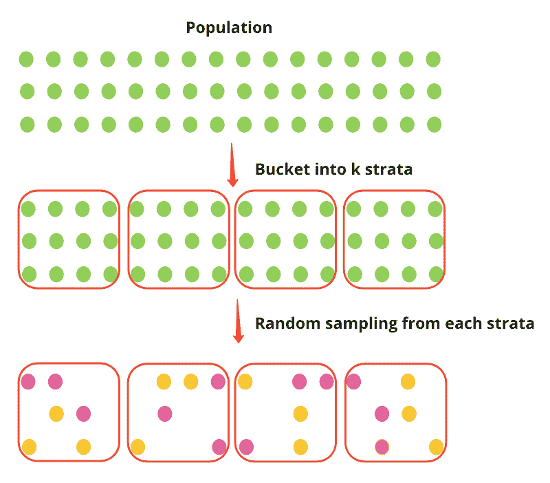

分层抽样将人口分成 k 个阶层(例如，国家)，然后实验从每个阶层独立地随机抽样个体。设 Y_strat 为分层抽样下的处理效果，p_k 表示来自 k 层的样本量比例，下面的等式告诉我们，处理效果是各层处理效果的汇集平均值，是无偏的。方差是层内方差的加权平均值，并且有效地去除了层间方差。方差小于简单随机抽样下的方差，简单随机抽样既包括层内方差，也包括层间方差(更多信息见本[论文](https://www.kdd.org/kdd2016/papers/files/adp0945-xieA.pdf))。

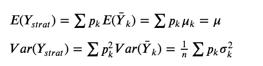

## ***利弊***

分层方法提供了治疗效果的无偏估计，并有效地消除了层间差异。然而，在实践中，通常很难在实验前实施分层抽样。

> “在网络世界中，由于我们是随着时间的推移收集数据，我们通常无法从提前形成的地层中取样。”(邓、徐、科哈维和沃克，2013 年)
> 
> 实际上，实施分层抽样既复杂又昂贵。它“需要一个排队系统和多台机器的使用。”(谢和奥里塞特，2016 年)

## ***后期分层***

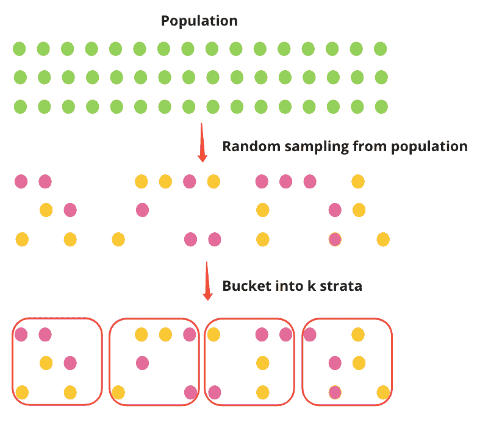

在实践中，后分层比分层更常见。后分层首先对人口进行随机抽样，然后将个人分成不同的阶层。类似于分层，后分层可以实现类似的方差减少。

这里有一个非常简单的例子，我们从四个不同的正态分布(4 层)中生成数据，将个体随机分配到治疗组和对照组，将治疗效果添加到治疗组，并通过 bootstrapping 可视化治疗效果。治疗效果计算为无分层的治疗和对照之间的平均差异，以及有分层的每个层的平均差异的平均值。从我们的简单例子中，我们确实看到了分层的方差减少。至关重要的是，平均值没有变化，所以我们应该能够更好地看到任何实验对平均值的影响，因为方差已经减小了。

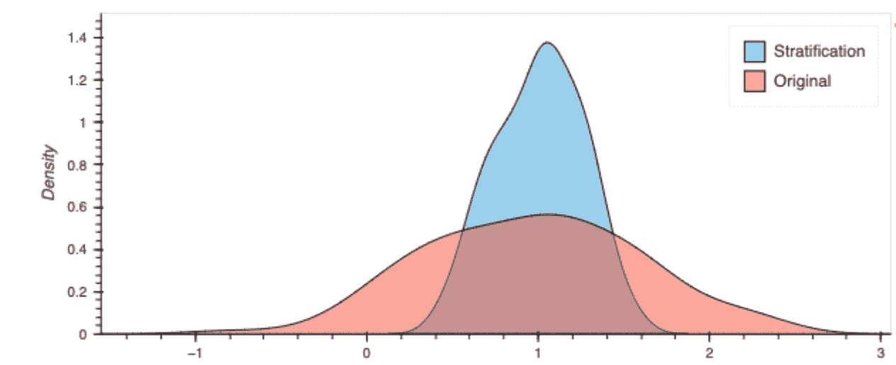

*有无分层的治疗效果*

# **杯状**

CUPED (使用预实验数据的受控实验)由微软的亚历克斯·邓、徐亚、罗恩·科哈维和托比·沃克于 2013 年首次提出，并已被广泛应用于大型科技公司，如 bookings.com 的、、[猫途鹰](https://www.tripadvisor.com/engineering/reducing-a-b-test-measurement-variance-by-30/)等。CUPED 使用预实验数据 X(例如，Y 的预实验值)作为控制协变量:

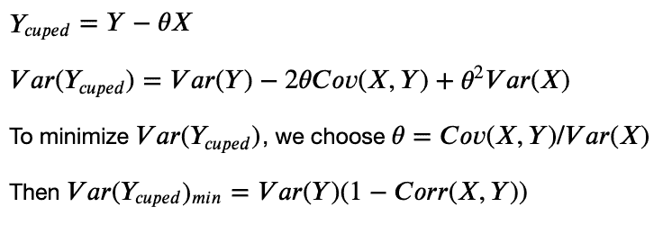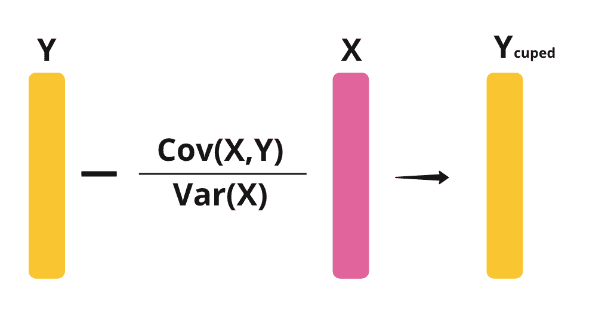

换句话说，Y 的方差减少了(1-Corr(X，Y))。我们需要 X 和 Y 之间的相关性很高，CUPED 才能很好地工作。在原论文中，推荐使用 Y 的预实验值作为 x。

这是一个抽样的例子。我们看到，对照组和治疗组的 Y 的方差都降低了，Y_cuped 和 Y 的方差之比为 0.2789，这与基于上述理论方程的(1-Corr(X，Y))值相同。减少方差会减少这两个分布之间的重叠，从而更容易看到实验效果。

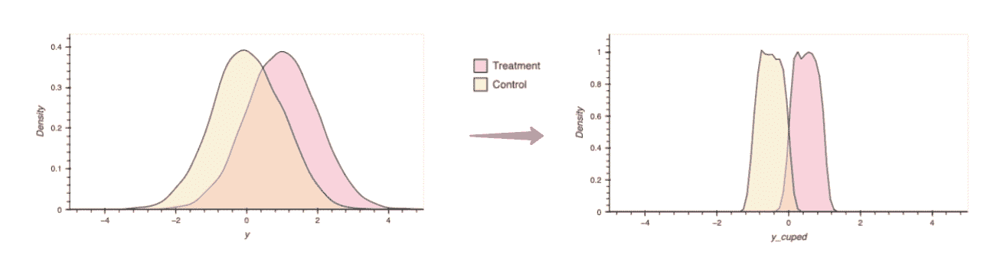

【CUPED 调整前后 Y 的方差

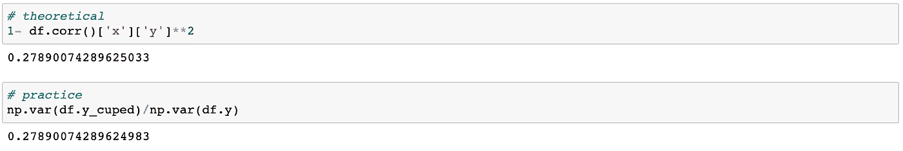

这里我们多次模拟我们的实验，计算对照组和治疗组的均值差，得到治疗效果的分布。请注意，Y_cuped 不是 Y 的无偏估计量。但 Y_cuped 的平均差是 Y 的平均差的无偏估计量。根据下图，很明显，在我们的简单情况下，cuped 降低了我们处理的方差。

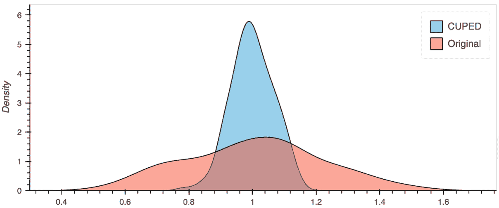

*带和不带吸盘调节的治疗效果*

## ***利弊***

CUPED 非常容易使用和实现。然而，协变量的选择可能是棘手的，尤其是当目标变量的实验前测量不可用时。协变量必须与目标测量相关，但与实验无关。此外，原始论文没有经历有多个协变量的情况。这篇[博文](https://j-sephb-lt-n.github.io/exploring_statistics/cuped_cupac_and_other_variance_reduction_techniques.html#controlvariates)讲述了从一个协变量到多个协变量的代数扩展。另一种解决方案是使用 ML 来构造控制变量，我们将在后面讨论。

# 方差加权估计量

方差加权估计法是由脸书和 Lyft 的 Kevin Liou 和 Sean Taylor 于 2020 年提出的。该方法的主要思想是给予具有较低预实验方差的用户更多的权重。

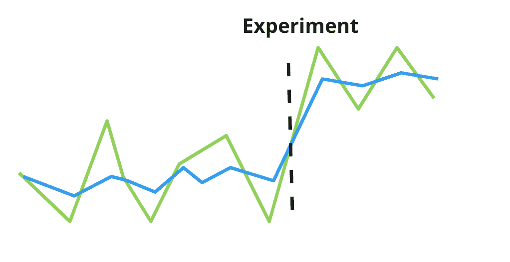

这种方法放松了同方差假设，而是假设每个个体都有自己的度量方差。例如，上图显示了两个人，其中一个(绿线)比另一个(蓝线)具有更高的方差。

在下面的等式中，Y 是感兴趣的度量，δ是治疗效果，Z 是治疗的指示函数。为了最小化治疗效果的方差，我们通过方差的倒数对每个用户进行加权。

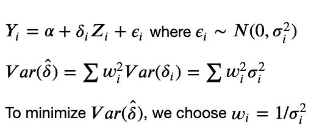

与 CUPED 类似，方差加权估计也使用预实验数据。文中提到了几种估计方差的方法，包括利用预实验时间序列数据的经验方差，建立 ML 模型，以及利用经验 Bayes 估计量。最简单的方法是使用经验方差。

加权诱导偏差。为了减少偏倚，本文提出了一种基于用户实验前方差对用户进行分组的方法，计算每个分组内治疗效果和实验前方差的平均值，然后计算跨层的加权治疗效果。

因此，总的来说，在实践中，我们将估计方差，将方差分成 k 个层，通过方差的倒数对每个层进行加权，并计算加权处理效果。

这里有一个演示这种方法的非常简单的例子。我从四个层次开始，我们知道每个层次的度量方差。然后，我们可以用每一层的方差倒数来衡量处理效果。对于本例，除了分层方法之外，方差加权估计量还提供了方差减少的额外好处。

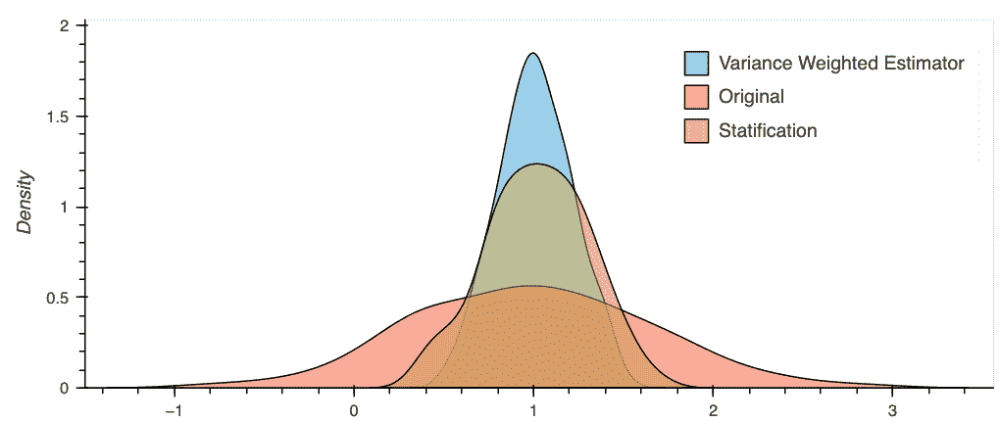

*使用和不使用方差加权估计量的处理效果*

## ***利弊***

*   方差加权估计量将单个预试验方差建模为权重，它可以用作 CUPED 等其他方法的良好扩展。当用户之间存在高度倾斜的差异时，以及当治疗前差异是治疗后差异的良好指标时，它工作得很好。
*   然而，当预处理方差的方差较低或者当实验前和实验后方差不一致时，方差加权估计器可能不起作用。此外，方差加权估计量不是无偏的。管理偏倚对这种方法很重要。

# **基于 ML 的方法**

近年来发展了几种基于最大似然的方差缩减方法。我将简要介绍两种基于 ML 的方法——CUPAC 和 MLRATE。由于原始论文没有描述精确的算法和它们的 ML 模型的细节，我将只涉及我对高级思想的理解，而不展示这些方法的例子。

# CUPAC

[CUPAC](https://doordash.engineering/2020/06/08/improving-experimental-power-through-control-using-predictions-as-covariate-cupac/) (使用预测作为协变量的控制)是由 Doordash 的 Jeff Li，和 Jared Bauman 在 2020 年提出的。它是 CUPED 的延伸。CUPAC 没有选择与治疗无关的实验前协变量 X，而是使用机器学习模型的结果作为其控制变量。机器学习模型的目标是“最大化预测协变量(CUPAC)和目标度量之间的部分相关性”。

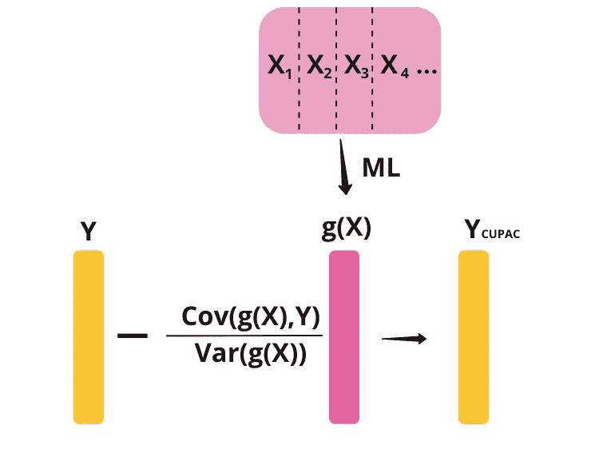

假设我们有实验前指标，X1、X2、X3 和 X4。本质上，这种方法所做的是使用一些机器学习模型来预测 Y 使用 X1，X2，X3 和 X4。然后，我们可以使用预测值作为 CUPED 中的控制协变量。

# **MLRATE**

ml rate(machine learning regression-adjusted treatment effect estimator)是由和 Princeton 的郭等人于 2021 年提出的。

和 CUPAC 类似，MLRATE 也是用一个 ML 模型从 X 预测 Y，我们把预测值叫做 g(X)。MLRATE 不是从 Y 中减去 g(X ),而是在回归模型中包括 g(X)和治疗指标，然后计算回归调整的治疗效果。下图展示了这种回归模型:

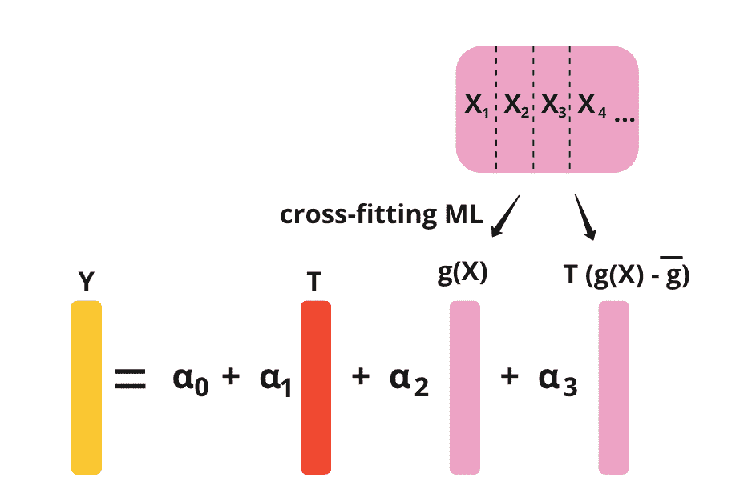

*   首先，我们从协变量的向量或协变量 x 的矩阵开始，然后我们学习并应用交叉拟合监督学习算法。交叉拟合用于避免过度拟合偏差。交叉拟合过程如下:我们将数据分成 k 份。对于每个分裂，我们在不在当前分裂中的样本上训练我们的数据，并获得函数 g。然后，我们使用当前分裂中的 X，并获得当前分裂的 g(X)的预测值。
*   接下来，我们建立一个回归模型，其中我们用回归变量预测实验指标 Y:T—治疗指标，g(X) —交叉拟合 ML 的预测值，以及 T(g(x)-g)。
*   α1 的 OLS 估计量是我们感兴趣的治疗效果。

## **其他基于 ML 的方法**

业内使用的基于 ML 的方法还有其他的。例如，Yandex 的波亚尔科夫等人在 2016 年开发了[增强决策树回归调整](https://www.kdd.org/kdd2016/papers/files/adf0653-poyarkovA.pdf)。

总之，本文总结了一些业界流行的方差缩减方法——后分层法、CUPED 法、方差加权估计法以及基于 ML 的方法 CUPAC 和 MLRATE。在实践中，CUPED 在科技公司中被广泛使用和生产，基于 ML 的方法通常用于合并多个协变量。结合多种方法来实现最佳方差减少也是常见的。希望这篇文章对你有所帮助。谢谢！

**鸣谢**:非常感谢 Anthony Fu 和 Jim Bednar 为本文提供指导和反馈。感谢 Kevin Liou 和 Sean Taylor 澄清了我关于方差加权估计量的问题。

**参考文献**

*   [https://exp-platform . com/Documents/2013-02-CUPED-improvingsensitivity of controlled experiments . pdf](https://exp-platform.com/Documents/2013-02-CUPED-ImprovingSensitivityOfControlledExperiments.pdf)[https://www.kdd.org/kdd2016/papers/files/adp0945-xieA.pdf](https://www.kdd.org/kdd2016/papers/files/adp0945-xieA.pdf)
*   [https://www.kdd.org/kdd2016/papers/files/adp0945-xieA.pdf](https://www.kdd.org/kdd2016/papers/files/adp0945-xieA.pdf)
*   [https://booking . ai/how-booking-com-increases-the-power of-online-experiments-with-cuped-995d 186 fff1d](https://booking.ai/how-booking-com-increases-the-power-of-online-experiments-with-cuped-995d186fff1d)
*   [https://www . tripadvisor . com/engineering/reducing-a-b-test-measurement-variance-by-30/](https://www.tripadvisor.com/engineering/reducing-a-b-test-measurement-variance-by-30/)
*   [https://medium . com/BBC-data-science/increasing-experiment-sensitivity-through-pre-experiment-variance-reduction-166d 7d 00 D8 FD](https://medium.com/bbc-data-science/increasing-experiment-sensitivity-through-pre-experiment-variance-reduction-166d7d00d8fd)
*   [https://door dash . engineering/2020/06/08/improving-experimental-power-through-control-using-predictions-as-co variate-cupac/](https://doordash.engineering/2020/06/08/improving-experimental-power-through-control-using-predictions-as-covariate-cupac/)
*   [https://code ascraft . com/2021/06/02/通过使用控制变量提高实验精度和速度/](https://codeascraft.com/2021/06/02/increasing-experimentation-accuracy-and-speed-by-using-control-variates/)
*   https://dl.acm.org/doi/10.1145/3391403.3399542
*   【https://www.youtube.com/watch?v=kgIwougeN0M 
*   [https://www . KDD . org/KDD 2016/papers/files/ADF 0653-poyarkova . pdf](https://www.kdd.org/kdd2016/papers/files/adf0653-poyarkovA.pdf)
*   [https://arxiv.org/abs/2106.07263](https://arxiv.org/abs/2106.07263)

作者索菲亚·杨 2021 年 9 月 12 日