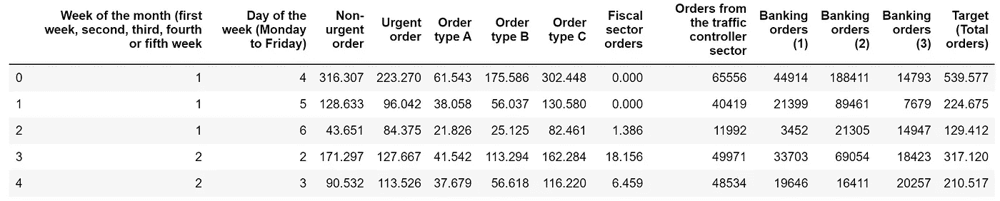
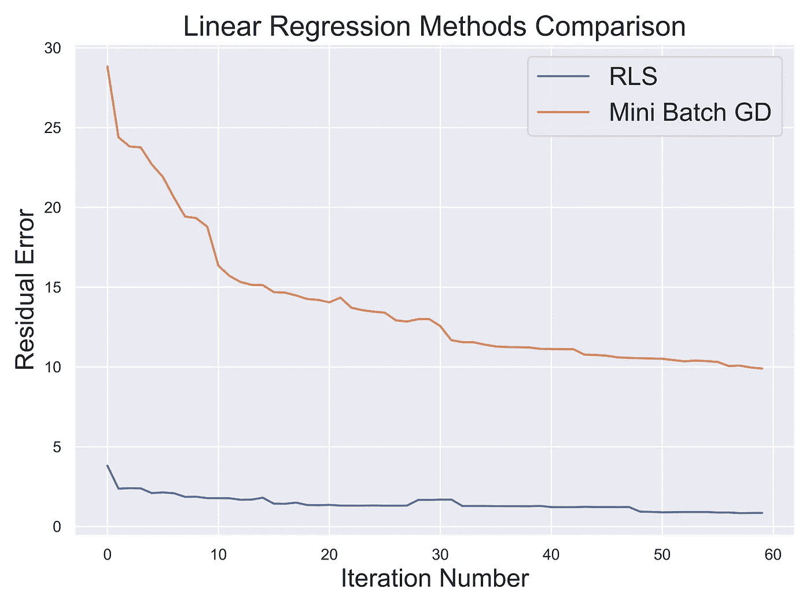
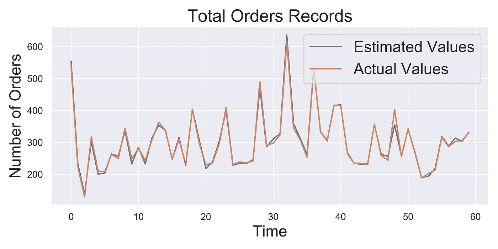

# 在线学习:递归最小二乘法和在线 PCA

> 原文：<https://towardsdatascience.com/online-learning-recursive-least-squares-and-online-pca-c05bd23106c9?source=collection_archive---------11----------------------->

## 关于如何创建能够在处理流数据时训练一个数据点的在线机器学习模型的实用介绍


[O12](https://unsplash.com/@o12?utm_source=medium&utm_medium=referral) 在 [Unsplash](https://unsplash.com?utm_source=medium&utm_medium=referral) 上拍照

# 在线学习

在线学习是机器学习的一个子集，它强调从环境中生成的数据会随着时间而变化。

事实上，传统的机器学习模型被认为是静态的:一旦模型根据一组数据进行训练，它的参数就不再改变。尽管环境及其生成的数据可能会随着时间的推移而改变，因此，我们预先训练的模型不再可靠。

为了解决这些问题，公司通常使用的一种简单解决方案是，一旦性能开始下降，自动重新训练和部署机器学习模型的更新版本。

但是，使用这种方法会导致模型周期性地表现得比预期的标准更差[1]。然后可以使用在线学习来为这个问题提供一个明确的答案。

如果你对用 Python 实现在线学习算法感兴趣， [Creme 库](https://github.com/online-ml/river)是一个很好的起点。

本文中使用的所有代码都是可用的(甚至更多！)在我的 GitHub 个人资料上有[。](https://github.com/pierpaolo28/Artificial-Intelligence-Projects/tree/master/Online%20Learning)

# 递归最小二乘法

## 介绍

递归最小二乘法(RLS)是一种用于研究实时数据的常用技术。因此，RLS 可以被认为是标准最小二乘算法的递归等价物。

在递归最小二乘法中，在每次算法迭代中分析单个新数据点，以便改进我们的模型参数的估计(在这种情况下，目标不是像最小均方误差那样最小化总均方误差)。

与其他回归技术相比，RLS 通常收敛速度更快，但计算成本更高。

关于该算法的两个重要观察结果是:

*   使用一个名为 Lambda ( ***λ*** )的用户定义参数来定义给予过去输入数据的权重(旧输入的预测权重低于新输入)。 ***λ*** 的值越小，过去输入值的重要性越低。
*   为了避免在每个迭代步骤中计算矩阵求逆(这在计算上可能是昂贵的)，我们可以改为应用[矩阵求逆引理](https://en.wikipedia.org/wiki/Woodbury_matrix_identity)。

如果你对这个算法的实现细节感兴趣，数学推导可以在麻省理工学院开放课件[2]的“动态系统与控制讲座”中找到。

## 示范

为了测试这个算法，我们将在本文中使用来自 UCI 机器学习库的
[每日需求预测订单数据集。](https://archive.ics.uci.edu/ml/datasets/Daily+Demand+Forecasting+Orders)

首先，我们需要导入所需的依赖项，并将数据集划分为要素和标签。在本练习中，我们的目标是在给定输入特征的情况下预测订单总数(图 1)。



图 1:每日需求预测订单数据集

现在，我们可以创建自己的递归最小二乘算法实现，并检查我们的残差。

```
Residual Error:  0.851
```

如低残差所示，我们的算法似乎已经成功地收敛到相对可靠的解决方案。这可以通过比较我们在相同任务中使用小批量梯度下降算法的结果来进一步证实(图 2)。



图 2:递归最小二乘法与小批量梯度下降

绘制实际时间序列值与递归最小二乘估计值，我们可以进一步确认这个简单问题模型的可靠性(图 3)。



图 3:总订单估算比较

最后，通过创建一个简单的函数，我们可以将我们的模型的总体残差与一些常见的 Scikit-Learn 模型进行比较，以比较性能。如下面的结果所示，高斯过程回归器似乎比递归最小二乘法表现得更好。

```
SGDRegressor Residual Error:  83.905
DecisionTreeRegressor Residual Error:  84.853
GaussianProcessRegressor Residual Error:  0.0
KNeighborsRegressor Residual Error:  2.296
BayesianRidge Residual Error:  84.853
MLPRegressor Residual Error:  84.661
```

# 在线主成分分析

当处理具有大量特征的数据集时，在线 PCA 当然可以被认为是一种很好的实现技术，以便尝试降低我们问题的维数，同时加快执行速度并将我们的误差限制在用户定义的限度内。在线主成分分析试图将主成分分析的相同基本概念应用于在线环境中，通过每次将一个数据点作为输入来创建其估计值。

该算法的一个主要参数是ε(***)ε***)。ε是我们可以容忍的给定数据(误差)。然后，该算法将返回一个 ***l*** 维度表示(O(***k***×poly(1/***ε***))略高于所需的 ***k*** 维度表示(但仍低于原始的 ***d*** 维度表示)。

使用小的 ***ε*** ，我们迫使我们的算法不能容忍太多的误差，因此这将导致 ***l*** 的高值。使用高 ***ε*** 来代替，我们允许我们的算法容忍高误差，并且允许使用低值用于 ***l*** 。按照 Boutsidis 等人[3]的实现， ***ε*** 可以用 0 到 1/15 之间的任意值来表示。通过这种方式，在线 PCA 允许我们在期望的维度和最大允许误差之间进行权衡。

使用该算法的一些额外优点是:

1.  在线 PCA 可以使我们在更低的维度上进行推理，对输入数据进行降噪，并实现重要的计算节省(特别是在处理属于大数据机制的数据集时)。
2.  使用在线 PCA 的优化版本，可以避免计算整个协方差矩阵(可能相当大)的所有特征值和特征向量，而是只计算我们感兴趣的第一个 ***N 个*** 特征值和特征向量。

如果您对实现在线 PCA 感兴趣， [Boutsidis 等人[3]的出版物](https://www.cs.yale.edu/homes/el327/papers/opca.pdf)是一个很好的起点。

希望你喜欢这篇文章，谢谢你的阅读！

# 联系人

如果你想了解我最新的文章和项目[，请通过媒体](https://pierpaoloippolito28.medium.com/subscribe)关注我，并订阅我的[邮件列表](http://eepurl.com/gwO-Dr?source=post_page---------------------------)。以下是我的一些联系人详细信息:

*   [领英](https://uk.linkedin.com/in/pier-paolo-ippolito-202917146?source=post_page---------------------------)
*   [个人博客](https://pierpaolo28.github.io/blog/?source=post_page---------------------------)
*   [个人网站](https://pierpaolo28.github.io/?source=post_page---------------------------)
*   [中型简介](https://towardsdatascience.com/@pierpaoloippolito28?source=post_page---------------------------)
*   [GitHub](https://github.com/pierpaolo28?source=post_page---------------------------)
*   [卡格尔](https://www.kaggle.com/pierpaolo28?source=post_page---------------------------)

# 文献学

[1]什么是在线机器学习？马克斯·佩格尔斯，四种。访问:[https://medium . com/value-stream-design/online-machine-learning-515556 ff 72 C5](https://medium.com/value-stream-design/online-machine-learning-515556ff72c5)

[2]动力系统和控制讲座。Mohammed Dahleh 等人，麻省理工学院开放课件。访问:[https://OCW . MIT . edu/courses/electrical-engineering-and-computer-science/6-241j-dynamic-systems-and-control-spring-2011/readings/MIT 6 _ 241 js11 _ chap 02 . pdf](https://ocw.mit.edu/courses/electrical-engineering-and-computer-science/6-241j-dynamic-systems-and-control-spring-2011/readings/MIT6_241JS11_chap02.pdf)

[3] Boutsidis，C，Garber D，Karnin ZS 和 Liberty，e .在线主成分分析，第 26 届 ACM-SIAM 离散算法研讨会会议录，SODA-15:887–901，2015。