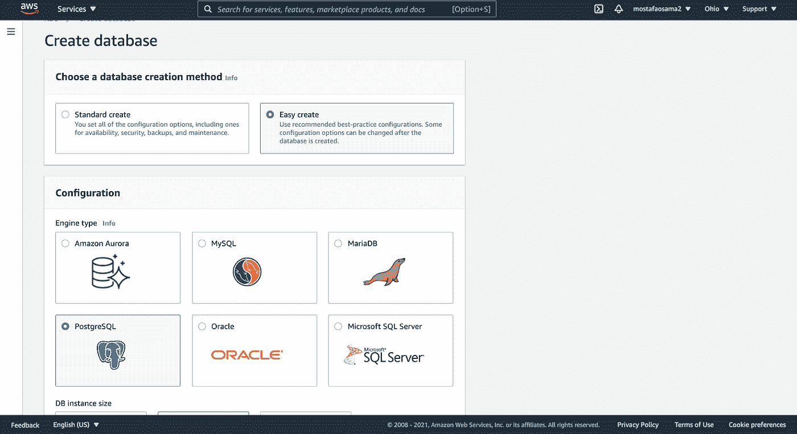
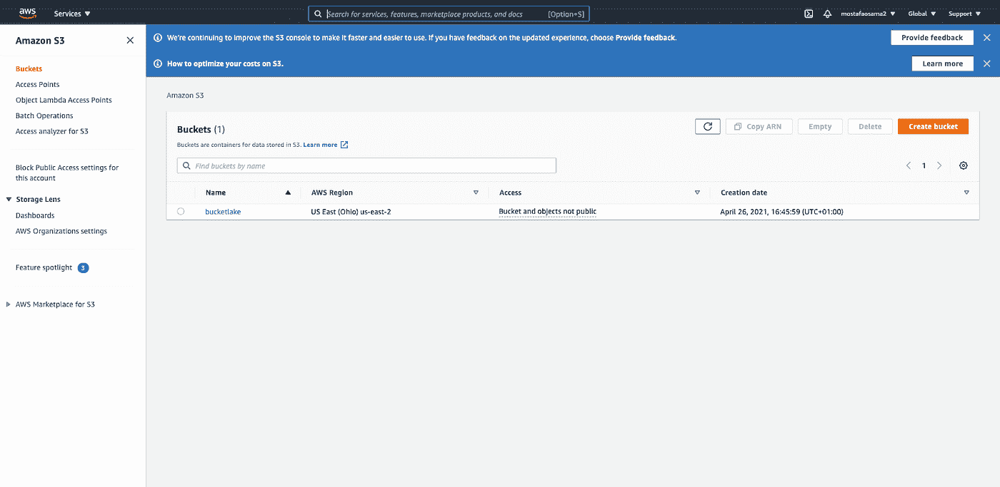
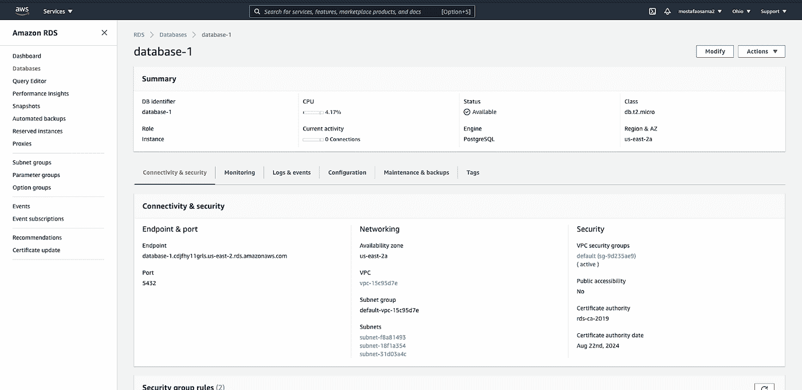

# 使用 LakeFS 和 AWS 进行在线学习

> 原文：<https://towardsdatascience.com/online-learning-with-lakefs-and-aws-926d8ce04a9b?source=collection_archive---------30----------------------->

## 使用版本控制系统和 Amazon Web Services 从头开始构建在线机器学习系统


克里斯·利维拉尼在 [Unsplash](https://unsplash.com?utm_source=medium&utm_medium=referral) 上的照片

## 在线学习简介

大多数教程/文章通常专注于论文评论和实验室中机器学习模型的性能。然而，一个明显被忽视的领域是将模型投入生产并监控其性能，这被称为[在线机器学习](https://medium.com/value-stream-design/online-machine-learning-515556ff72c5)或在线学习，模型不断地从新数据中学习。概念很简单。但是，在实施时会遇到一些挑战，例如:

*   需要将数据结构化地存储在易于使用和访问的存储平台中。
*   不断地标记新数据(如果你的模型被监督的话)。
*   优化新的超参数，比如新数据的数量，之后应该开始新的训练迭代。
*   在“动态”(在线)获取的数据中加入强大的数据过滤技术，更有可能出现大量不规则数据，这与实验室中为机器学习模型准备的数据不同。例如，假设我们正在讨论一个对微观病理切片进行分类的模型。一些载玻片可能比其他载玻片含有更多的灰尘，或者更糟，无法使用。这样的挑战通常会被忽视，直到很晚才被发现。它们可能看起来微不足道，但它们会破坏模型的性能。

在线学习的主要优势在于它可以防止数据变得“陈旧”。有时，数据的性质和分布可能会随着时间的推移而改变。如果你的模型没有持续改进，它的性能会持续下降。监控可以帮助决定这一点:它与在线培训一起进行，因为它将表明模型的性能是否正在下降。它还将帮助您选择重新培训模型的频率。

# 在线学习系统和 LakeFS

一个典型的在线学习系统将由许多步骤组成。例如，假设您有一个机器学习 web 应用程序，它将上传的图像分类为“肿瘤性”和“非肿瘤性”。您的基础架构通常需要执行以下操作:

1.  **保存**每个预测到存储器(如亚马逊 S3)。定义预测的模式可能有点棘手，但是您通常会包括实际的图像、预测、置信度和日期。
2.  **保存**每个培训周期的模型性能指标。
3.  **将**存储设备连接到模型服务器。这个连接管道可能包含一个过滤步骤，以保证数据的质量。
4.  **版本**数据。这意味着您必须将新数据与旧数据一致地合并，然后重新训练。
5.  **日志**实验和监控。

在实际的场景中，您会不时地对模型进行多次训练，很可能会出现性能下降的迭代。发生这种情况有多种原因，例如迭代中使用的数据质量差。在这种情况下，您需要一个工具来帮助您快速撤销这种更改，检查导致性能下降的数据，等等。这里选择的数据版本控制工具是 [LakeFS](https://lakefs.io/) 。

LakeFS 将允许我们增强我们的存储系统，使其类似于一个 [git](https://git-scm.com/book/en/v2/Getting-Started-What-is-Git%3F) 存储库。这意味着我们可以推送新的变更、删除旧的提交、检查版本控制日志等等。此外，这将允许我们创建并行的 CI/CD 管道，这将使实验过程更加自动化和容易。此外，如果这些实验中的任何一个在生产流水线上失败了，我们可以简单地恢复它们。LakeFS 应该与灵活且可伸缩的数据存储机制相结合，比如 S3 对象存储。

LakeFS 的好处之一是它可以很容易地与 AWS S3 对象存储一起使用。事不宜迟，我们开始吧。

# 步骤 1:在 AWS RDS 上创建 PostgreSQL 数据库

有许多方法可以设置一个数据库并在 LakeFS 中使用它，但是在本教程中，我们将在 AWS RDS 上使用一个 [PostgreSQL 数据库](https://www.postgresql.org/about/)。你首先需要的是一个 AWS 账户。

登录后，转到[https://console.aws.amazon.com/rds/](https://console.aws.amazon.com/rds/)并点击“创建数据库”，然后您应该会看到一个如下所示的窗口:



作者截图

您可以将所有选项保留为默认选项，并使用 Easy create 创建数据库。就是这样！你很快就创建了一个数据库。现在，您只需要等待几分钟，它就会被创建。

# 步骤 2:为存储库配置 S3 存储桶

现在我们有了 PostgreSQL 数据库，我们还需要一个 S3 对象存储桶。首先在顶部搜索栏搜索 S3 桶，然后点击第一个“S3”结果。之后，单击橙色的“创建存储桶”按钮，为您的存储桶添加一个名称并创建它。然后，您应该会看到类似这样的内容:



作者截图

之后，单击存储桶，转到“Permissions”选项卡，向下滚动到“Bucket Policy”，然后将此内容粘贴到:

你应该用你的帐号 ID 替换<account_id>(当你点击顶部的用户名时，它是你名字旁边的 12 位数字)。同样，用存储段名称替换<bucket_name>,用正确的角色(管理员)替换<iam_role>。</iam_role></bucket_name></account_id>

# 步骤 3:安装 LakeFS

你需要做的第一件事是安装[docker-compose](https://docs.docker.com/compose/install/)；这将需要运行 LakeFS 的本地实例。接下来要做的是运行这个命令:

```
curl [https://compose.lakefs.io](https://compose.lakefs.io) | docker-compose -f — up
```

要运行 lakeFS，请使用以下命令:

```
docker run — name lakefs -p 8000:8000-e LAKEFS_DATABASE_CONNECTION_STRING=”<postgres-connection-str>”-e LAKEFS_AUTH_ENCRYPT_SECRET_KEY=”<lakefs-secret-key>”-e LAKEFS_BLOCKSTORE_TYPE=”s3"-e LAKEFS_GATEWAYS_S3_DOMAIN_NAME=”s3.local.lakefs.io”-e LAKEFS_BLOCKSTORE_S3_CREDENTIALS_ACCESS_SECRET_KEY=”<s3-secret-key>”-e LAKEFS_BLOCKSTORE_S3_CREDENTIALS_ACCESS_KEY_ID=”<s3-access-key>” -e LAKEFS_BLOCKSTORE_S3_REGION=”<s3-region>” treeverse/lakefs:latest run
```

您需要填写环境变量；您可以在此处找到连接字符串:



作者截图

s3 区域是 bucket 区域，lakeFS 密钥可以是您选择的任何字符串。如果一切正常，您应该能够看到 lakeFS 实例在 **localhost:8000** 上运行

这应该是它；这是您需要的大部分初始设置和配置。接下来的几个步骤将不再是教学形式，而是理论结构。

# 使用 Python 设置存储库和分支

使用 LakeFS 类似于使用 Git。准备好设置后，您需要为数据集创建一个初始分支。我们将使用 python 来完成这项工作。

首先要做的是实例化一个客户端:

然后创建一个存储库和一个分支:

仅此而已。现在您的 s3 存储桶应该连接到您的 LakeFS 存储库了。