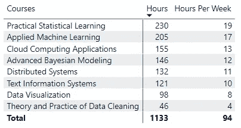
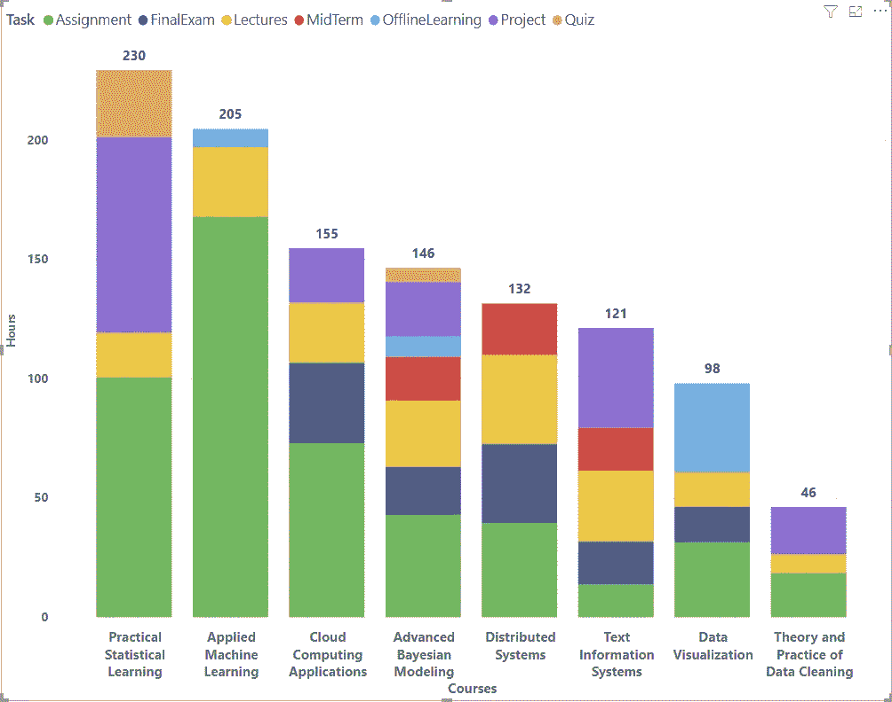
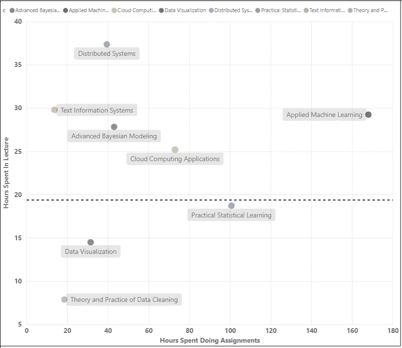
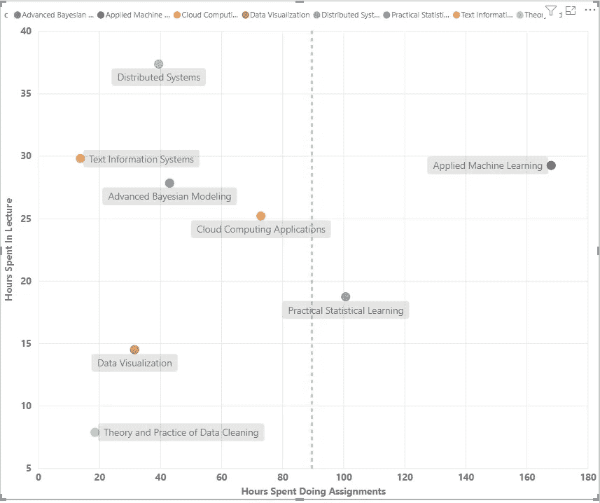
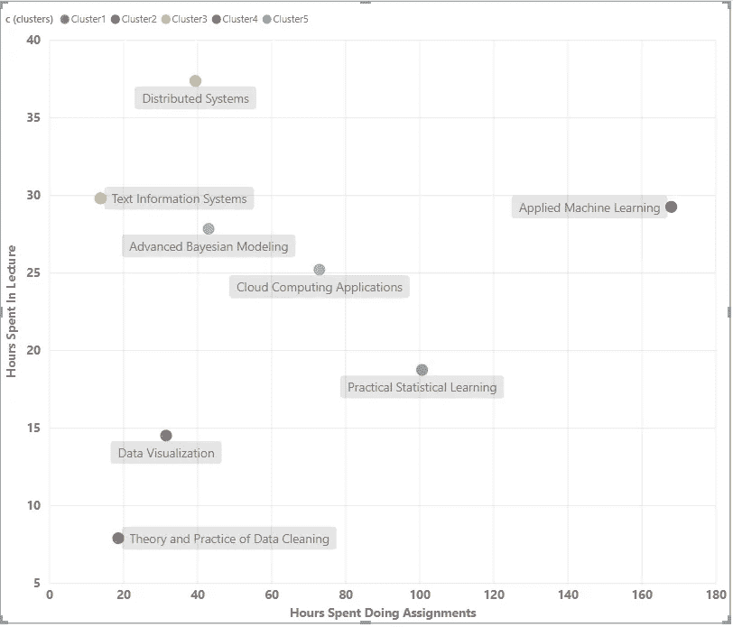
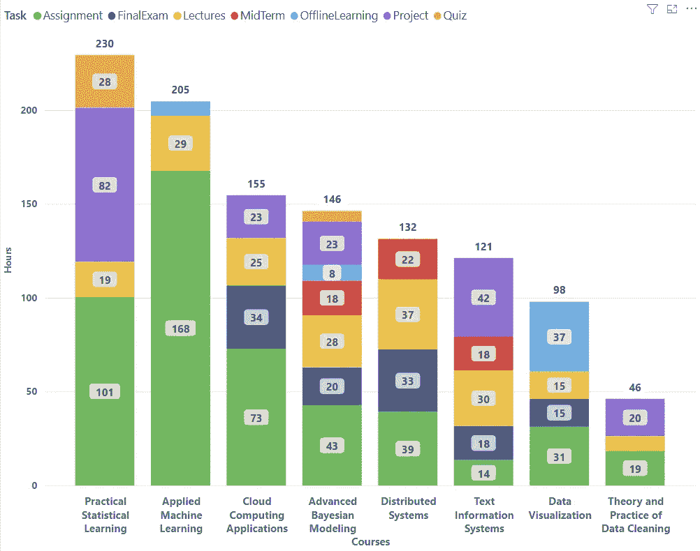

# 数据科学在线硕士——值得一试吗？

> 原文：<https://towardsdatascience.com/online-masters-in-data-science-worth-taking-the-plunge-ec5c2a53048d?source=collection_archive---------22----------------------->

## 整个学位的每个课程和任务需要多长时间

图片由 Unsplash 的 Bruno bu ar 提供

# 背景

简而言之，我参加了伊利诺伊大学 3 年多时间提供的数据科学计算机科学在线硕士课程。我总共需要 8 门课程才能毕业，我每学期选一门课(每年 3 门)。每门课程都有讲座和作业，而有些课程有期末考试、期中考试、项目和测验。

我将给出我完成学位的个人经历。如果你正在考虑攻读数据科学领域的计算机科学在线硕士，并想知道我是如何找到它的，请在评论中随意提问——我很乐意尽我所能回答。

不管怎样，我发现这个项目非常有帮助👍我学到了很多。就你想深入一个主题而言，这真的取决于你对它的理解。️I 提到的唯一警告是，如果你特别想进入深度学习，或者你心里有一个非常具体的技术职位，那么我会建议你参加一个更定制的训练营类型的项目，而不是参加正式的硕士 degree⚠️.我之所以这么建议，是因为这个学位并没有详细介绍神经网络的最新发展，只是涵盖了基础知识，其中大部分你可以在网上的好教程中找到。然而，如果你想知道这些概念背后的基本统计和算法，你将在你的整个职业生涯中使用，那么像这样的程序就是你正在寻找的。

# 数据

用于分析的数据是由我的同学手工收集的。在整个旅程中，他仔细记录了完成每项作业、讲座、考试、期中考试、测验和项目所花的时间。**如此巨大的荣誉**感谢保罗收集了这一切！🙌。他同意我发表结果。

# 结果

**总的来说，完成**课程需要大约 1133 个小时。需要八门课程，在计算每周课时时，我假设了 12 周的学期。

作者图片|小时课程列表

以下是按任务类型细分的相同数据。不是所有的课程都有期末考试、期中考试、项目或测验。然而，所有的课程都有作业和讲座。

作者图片|课程条形图

用第 30 百分位的水平线画出花在做作业上的时间和花在讲课上的时间，我们看到大多数课程的总课时超过 20 小时。*分布式系统*花了将近 40 个小时的演讲时间，而*数据清理*花了不到 10 个小时的演讲时间。这个后面会讨论。

作者图片|作业散点图与讲课时间/讲课百分比

相反，在第 80 百分位垂直线处，我们看到大多数课程的作业总时数少于 90 小时。应用机器学习课程是一个明显的例外📊。那门特定的课程有将近 170 小时的作业。为什么应用机器学习在作业上花费的时间要多得多，我们将在后面讨论。

作者图片|作业散点图与讲课时间/作业百分比

为了好玩，我训练了一个聚类算法，其中聚类的数量不需要像 OPTICS 或 DBSCAN 一样指定**而不是**，并得到了下面的图表。每个色点对应一个特定的簇。应用机器学习(AML)和实用统计学习(PSL)似乎在他们自己的集群中。

作者图片|作业散点图与讲课时间/聚类数图例

# 讨论

首先，完成某些课程所花时间的差异，例如*数据清理*与*实用统计学习* (PSL)与内容的复杂性直接相关。具体来说，*数据清洗*主要涵盖了数据流、数据库设计、正则表达式等已经为分析专业人士所熟知的理论。因此，大多数视频可以以 2 倍的速度观看，这就是为什么花在讲座上的时间相对较少。这并不意味着只有 10 个小时的讲座😌。

PSL 深入研究了具体的聚类、分类和回归模型是如何工作的。这些更复杂的概念需要反复观看讲座多次，以充分理解和掌握主题，从而能够在测验中获得 100%的分数。此外，除了所有其他的作业和测验，在 PSL 还有四个项目。💪

这两门课程都需要 R 或 Python 方面的技能，但是它们覆盖了完全不同的领域。

作者图片|带数据标签的课程条形图

其次，我们看到*应用机器学习*课程需要在作业上投入大量时间。没有期末考试，没有测验，没有项目，只有很多作业。就我个人而言，我喜欢这门课，因为每项作业都像一个迷你项目，你不知道如何及时完成😅。但最后你做到了，而且很棒！

第三，我认为数据可视化和数据清理是“简单”的课程。你可以在全职工作的同时，在同一个学期里选修两到三门其他课程，而不会完全疯掉😤。我没有那样做，但是我的许多其他同学做了。

# 结论

如果你正在考虑攻读计算机科学/数据科学的在线硕士学位，那么我强烈推荐你。与课程中包括法律、隐私和研究设计课程的类似项目相比，这个学位项目技术性很强。我觉得，由于显而易见的原因，与更侧重于社会/定性课程的硕士学位相比，更技术性的学位更适合转化为在线形式。

从花费的时间可以看出，这个学位仍然需要大量的工作😭。令人欣慰的是，并不是所有的课程都要占用你醒着的每一分钟来完成。有“容易”吗😺一和有杀手💀只要你知道你在做什么，你最终会成为一个更好的人。

最后，我还想提一下，你应该考虑在你攻读硕士学位的 1133 个小时里做其他事情的机会成本。与 **MBA** 风格的硕士相比，在线**技术**硕士的好处是他们通常要便宜得多💰。

我希望这些数据点能让你更好地了解完成一个硕士学位需要多长时间。请花些时间消化上面的视觉效果，仅从条形图中就可以获得许多见解。

# 附录/参考文献

[1]保罗·内尔。UIUC 的 MCS-DS 项目的一些数据。(2019)

[2]带有 PBIX 的 GitHub，包括聚合和清理的数据。[https://github . com/matt bitter/Medium _ Matthew bitter _ Grad _ Article](https://github.com/mattbitter/Medium_MatthewBitter_Grad_Article)