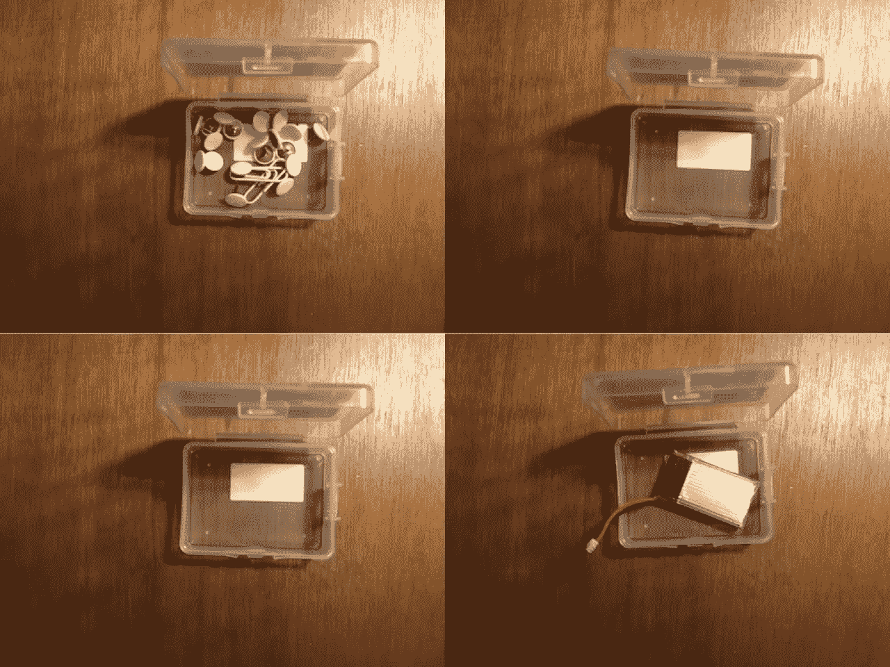
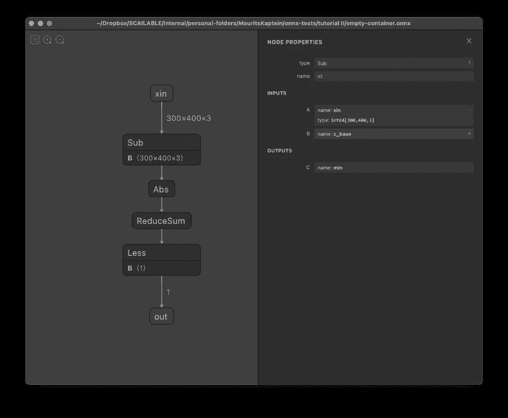
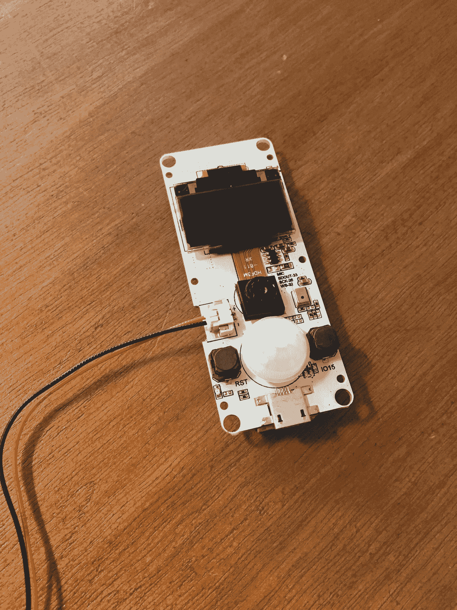

# ONNX 从头开始进行图像处理

> 原文：<https://towardsdatascience.com/onnx-for-image-processing-from-scratch-6694f9b141b0?source=collection_archive---------22----------------------->



使用 ONNX 进行简单的图像处理(并从头开始构建！).图片作者。

## ONNX 越来越多地被用来存储复杂的 DNNs 然而，它的用途远远超出了拟合模型的简单存储。本教程展示了如何用 ONNX 构建一个图像处理管道——随后可以跨设备部署——只需几行 Python 代码。

[*然而，ONNX 可以有更广泛的用途:ONNX 可以轻松地用于手动指定 AI/ML 处理管道的***，包括现实世界部署经常需要的所有预处理和后处理。在本教程中，我们将展示如何使用 Python 中的* `*onnx helper*` *工具从头开始创建 ONNX 图像处理管道***并有效地部署它。***](https://onnx.ai)

**在本教程中我们不再介绍 ONNX 请参见[我们之前关于从零开始创建 ONNX 的帖子](/creating-onnx-from-scratch-4063eab80fcd)以获得总体介绍。在本教程中，我们将展示如何轻松地使用 ONNX 来指定图像处理管道。我们将涵盖以下步骤:**

1.  ****管道“培训”:**我们将解释我们面临的图像识别任务和我们的一般方法。**
2.  ****ONNX 创建:**我们将一步一步地详细介绍如何创建 ONNX 管道来执行所需的图像处理。**
3.  ****在 python 中测试:**我们将演示如何使用 ONNX 运行时在 Python 中测试我们的管道。**
4.  ****使用 WebAssembly 进行部署:**我们将演示如何将我们的图像处理管道转换为 WebAssembly，以便在浏览器、云中或嵌入式设备上进行高效部署。**

**请注意，本教程的主要目的是展示 ONNX 可以用来指定数据处理任务(在本例中是图像处理)的简易性，这些任务通常不被视为 AI/ML，但仍然非常有用。希望这有助于打开 ONNX 的用途，使其远远超出训练好的神经网络的简单存储。**

# **1.管道“培训”**

**很难真正调用模型训练下面的步骤，但是我们从设置问题开始，包括我们将在 ONNX 中实现的分类算法所需的处理。在这个玩具例子中，我们面对的是一个小容器的总共 [14 张图片](https://github.com/scailable/sclbl-tutorials/tree/master/sclbl-onnx-from-scratch-II/images)，这个小容器要么是空的，要么是满的。我们的目标是创建一个 ONNX 管道(并部署它),它在给定一个输入图像的情况下，检测容器是否被填满。这里有一个例子:**

****

**满容器的示例。图片作者。**

**我们的方法很简单:首先计算所有空白图像的平均值作为参考。接下来，对于每个新图像，我们简单地从参考图像中减去新图像，并查看它是否偏离(太多):如果是，它一定不是空图像。**

> **请注意，我们在本教程中实现的图像处理方法非常初级；它对于图像的光照变化不是很鲁棒，对于不同的容器也不能很好地工作。然而，这个例子显示了在 ONNX 中创建处理管道的容易程度。**

**使用 Pillow 和 Numpy，我们的“训练”阶段相对简单:我们简单地打开所有的空容器，计算它们的平均值:**

```
**import numpy as np
from PIL import Image## Setup:
image_folder = “images/”
empty_containers = [2,3,5,8,9,12,13]
full_containers = [1,4,6,7,10,11,14]
all_containers = empty_containers+full_containers# Get number of images, image width, and image height:
n_empty = len(empty_containers)
image_width, image_height=Image.open(image_folder + str(empty_containers[0])+”.JPG”).size# Create a numpy array of ints to store the average (assume RGB images)
av_arr=np.zeros((image_height,image_width,3),np.int64)# Build up average pixel intensities, casting each image as an array of ints
for i in empty_containers:
 im_arr=np.array(Image.open(image_folder + str(empty_containers[0])+”.JPG”),dtype=np.int64)
 av_arr=av_arr+im_arr/n_empty# Round values in array and cast as 8-bit integer
av_arr=np.array(np.round(av_arr),dtype=np.uint8)# Generate and save the average empty container image
out=Image.fromarray(avarr,mode=”RGB”)
out.save(image_folder+”empty-average.JPG”)
out.show()**
```

**`empty-average.JPG`将作为我们的参考。看起来是这样的:**

****

**空容器的平均“参考”图像。图片作者。**

# **2.ONNX 管道创建**

**我们将从头开始使用 ONNX **和 Python 中的`onnx.helper`工具来实现我们的图像处理管道。从概念上讲，步骤很简单:****

1.  **我们从给定的想要分类的图像中减去`empty-average.JPG`。**
2.  **我们计算剩余差值的绝对值。**
3.  **我们将差值中的图像(绝对)颜色值的数组求和为一个数字。**
4.  **我们检查这个数字是否大于某个阈值。**

**因此，这种实现的逻辑很简单:与(平均)空图像相比，空容器的图像应该相对相似，即其绝对差异应该很小。然而，如果容器是满的，则图像是不同的，因此它与参考图像相比的总绝对差应该很大。**

**实现该管道的 python 代码如下:**

```
**# The imports used in this block
from onnx import helper as h
from onnx import TensorProto as tp
from onnx import checker
from onnx import save# 1\. We start by opening the reference image and creating the necessary ONNX constants:# The baseline empty container image (average of the 7 empty images)
reference_image=np.array(Image.open(image_folder+”empty-average.JPG”),dtype=np.int64)# The baseline image as ONNX constant:
c_base = h.make_node(‘Constant’, inputs=[], outputs=[‘c_base’], name=”c_base_node”, 
 value=h.make_tensor(name=”c_base_value”, data_type=tp.INT64, 
 dims=reference_image.shape, 
 vals=reference_image.flatten()))# The threshold value as ONNX constant; here we select an average of 25 points difference (3000000=300*400*25)
image_threshold = numpy.array([3000000]).astype(numpy.int64)
c_cut = h.make_node(‘Constant’, inputs=[], outputs=[‘c_cut’], name=”c_cut_node”, 
 value=h.make_tensor(name=”c1v”, data_type=tp.INT64, 
 dims=image_threshold.shape, 
 vals=image_threshold.flatten()))# 2\. Next, we declare the functional ONNX nodes in order of appearance:# Subtract input xin from baseline
n1 = h.make_node(‘Sub’, inputs=[‘xin’, ‘c_base’], outputs=[‘min’], name=’n1')# Compute absolute values of the remaining difference
n2 = h.make_node(‘Abs’, inputs=[‘min’], outputs=[‘abs’], name=”n2")# Sum all the absolute differences
n3 = h.make_node(‘ReduceSum’, inputs=[‘abs’], outputs=[‘sum’], name=”n3", keepdims=0)# See if the sum is less than image_threshold; if it is the image is empty
n4 = h.make_node(‘Less’, inputs=[‘sum’,’c_cut’], outputs=[‘out’], name=”n4")# 3\. Finally, we create the resulting ONNX graph# Create the graph
g1 = h.make_graph([c_base, c_cut, n1,n2,n3,n4], ‘convert_image’,
 [h.make_tensor_value_info(‘xin’, tp.INT64, target.shape)],
 [h.make_tensor_value_info(‘out’, tp.BOOL, [1])])# Create the model and check
m1 = h.make_model(g1, producer_name=’scailable-demo’)
checker.check_model(m1)# Save the model
save(m1, ‘empty-container.onnx’)**
```

**使用 [Netron](https://netron.app) ，我们可以检查生成的 ONNX 管道:**

****

**onnx 图像处理流水线。图片作者。**

# **3.python 中的测试**

**在详细说明如何在小型 ESP32 设备上使用该管道进行“现场”实际图像处理之前，我们首先想看看它的性能。我们总共有 14 个测试映像，7 个空的，7 个满的。以下 python 代码使用“onnxruntime”来检查每个图像并打印我们的处理管道是否认为它是空的:**

```
**import onnxruntime as rt# Open the model:
sess = rt.InferenceSession(“empty-container.onnx”)# Test all the empty images
print(“Iterating through all images”)
for i in all_containers:

    # Get whether in reality the container is empty
    true_empty = i in empty_containers

    # Check image using the ONNX pipeline
    target=numpy.array(Image.open(image_folder + str(i)+".JPG"),dtype=numpy.int64)    
    out = sess.run(["out"], {"xin": target.astype(numpy.int64)})  
    print("Container {} is empty {}, and it is classified as empty {}.".format(i, true_empty, out[0].flatten()))**
```

**运行代码显示所有示例图像都被正确“分类”。完整工作版本见本[笔记本。](https://github.com/scailable/sclbl-tutorials/blob/master/sclbl-onnx-from-scratch-II/empty-container-onnx.ipynb)**

# **4.使用 WebAssembly 部署**

**到目前为止，我们希望本教程已经展示了使用 ONNX 创建一个基本的图像处理管道是多么简单。因此，ONNX 不仅可以用来存储复杂的 AI/ML 模型，它还是一个非常有用的工具，可以在通用数据管道中表达预处理和后处理。**

**然而，在我们看来，ONNX 不太适合随后部署最终的管道。虽然在云中`onnxruntime`工作得很好，但它相当臃肿(人们需要> 200Mb 来安装运行时本身)。在(I)物联网和/或边缘设备上，简单的图像处理任务(如本教程中描述的任务)很常见，因此您无法部署完整的 ONNX 运行时。**

**这是否意味着 ONNX 对于在嵌入式设备上部署是无用的？不，一点也不！由于 ONNX 图的细节层次，有可能**自动将 ONNX 图转换为更低层次的表示**(例如，转换为 [LLVM IR](https://github.com/scailable/sclbl-tutorials/blob/master/sclbl-create-your-own-wasm/README.md) )。实际上，可以从 ONNX 直接到`c`在极小的设备上嵌入流水线。或者，我们更喜欢的选择是，从`c`编译到 WebAssembly:通过编译到 WebAssembly，我们现在可以使用指定的 ONNX 管道，并在几乎任何设备上毫无困难地运行它；在这里，WebAssembly 运行时将处理芯片组之间的差异(例如，英特尔与 Arm、32 位与 64 位等)。)就是我们在边缘设备上经常面对的。**

**使用 Scailable 提供的工具(你可以在这里注册一个免费账户)，从 ONNX 到 WebAssembly 的转换是开箱即用的。上面的自动转换为我们提供了[一个](http://b5b78d9b-69e9–11eb-858e-9600004e79cc.wasm) `[.wasm](http://b5b78d9b-69e9–11eb-858e-9600004e79cc.wasm)` [二进制](http://b5b78d9b-69e9–11eb-858e-9600004e79cc.wasm)遵守这里[描述的接口标准](https://github.com/scailable/sclbl-tutorials/blob/master/sclbl-create-your-own-wasm/README.md)。随后，很容易将这个二进制文件嵌入到一个简单的`c`项目中:**

```
**// Note: c code this time, not Python:int main(int argc, char *argv[]) {// ...// 1\. Read WASM into runtime.
 sclbl_core_wasm_read(wasm_path);// 2\. Initialize runtime.
 sclbl_core_wasm_init();// 3\. Generate JSON formatted runtime input string.
 char *input_string = sclbl_util_bmp_to_json(bmp_path);// 4\. Run Sclbl inference.
 char *output_string = sclbl_core_exec(input_string);// 5\. Do something with the output string.
 printf("%s\n", output_string);// 6\. Clean up.
 sclbl_core_finalize();}char *sclbl_util_bmp_to_json(char *imgPath) {// ...// read bmp file 
 sclbl_read_bmp(imgPath, &pixels, &width, &height, &bytes_per_pixel);
 enc = sclbl_b64_encode((const unsigned char *) bytes_per_pixel, width * height * bytes_per_pixel * sizeof(float));
 free(bytes_per_pixel);
 // wrap in json
 json = sclbl_raw_input_wrapper(enc);
 free(enc);
 return json;
}**
```

**上面的代码做了一些更改以与集成摄像头交互，允许我们在只有 4Mb 内存的 ESP32 设备上运行上面的 ONNX 管道。**

****

**小型设备上的图像处理。图片作者。**

**相当酷。**

> **注意，上面的代码需要可伸缩的`c`运行时，在注册一个帐户后即可使用。它是一个通用的 WebAssembly 运行时，使`I/O`到可伸缩的二进制文件变得容易，并支持模块化部署。**

# **包裹**

**我们希望表明，使用 ONNX 作为工具来指定数据处理管道是相对容易的。尽管存在许多其他工具(例如 [openCV](https://opencv.org) )，ONNX 的一个优点是它的多功能性，结合它的特殊性，共同允许可以嵌入在微小设备上的复杂预处理、推理和后处理任务的规范(通过转换为 WebAssembly)。**

**如果您在使用 ONNX / WebAssembly 时有任何问题，请告诉我们！**

# **放弃**

***值得注意的是我自己的参与:我是 Jheronimus 数据科学院* [*的数据科学教授，也是*](https://www.jads.nl/)[*Scailable*](https://www.scailable.net/)*的联合创始人之一。因此，毫无疑问，我对 Scailable 有既得利益；我有兴趣让它成长，这样我们就可以最终将人工智能投入生产并兑现它的承诺。这里表达的观点是我自己的。***