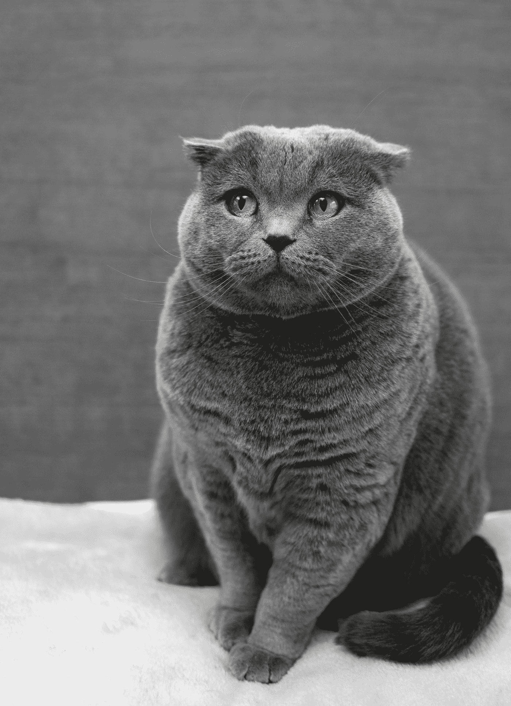

# 开放 AI 剪辑:从自然语言监督中学习视觉概念

> 原文：<https://towardsdatascience.com/open-ai-clip-learning-visual-concepts-from-natural-language-supervision-d02644969278?source=collection_archive---------36----------------------->

## 一种基于变换的神经网络，使用对比语言-图像预训练对图像进行分类

照片由 [Soragrit Wongsa](https://unsplash.com/@invictar1997?utm_source=medium&utm_medium=referral) 在 [Unsplash](https://unsplash.com?utm_source=medium&utm_medium=referral) 上拍摄

> [DALL-E](https://openai.com/blog/dall-e/?fbclid=IwAR0JRfU-xPtg-ncWNjtrta9jJVuHGTxNSFR0XaE_C-1_E_ne07X50n4MpcE) 似乎是本周最受关注的，但我认为 [CLIP](https://l.facebook.com/l.php?u=https%3A%2F%2Fopenai.com%2Fblog%2Fclip%3Ffbclid%3DIwAR158i-zjg5RQ-EHnHw-s-s1u0AIPMD9LjE76m7fSofzAcbIHkL-uJ6jIBs&h=AT0rQvh3Bv5zFSaHmtZ46OM5vwfoO9HXPFBiqrMfbk0S3Q65Eef5Vpw3XiGxpZDSEs4rjQnSO-RZFW_YkbTaBd9AAV2df9cijFxDk64IIal8AHKNHcgRNWMdnOQCqivl5sZPnA&__tn__=-UK-R&c[0]=AT3o3jJTjmF2Xu2rcZeGqPxmLa9pTnfJjaXTQSE9OTUiRrQPr8KOYB3mfdttrQiHi512o3UTQ7kISysJzaSmZBSaUw06EIdqNJ90ztIQbObSGFRJdjcHdDkpCpaE17ACKzvPt5mklIk4bAPnzwqJUD4dxn8CSEx3qeE) 最终可能会更加重要。这个星期我们一直在用它做实验，结果似乎好得令人难以置信；它甚至能够很好地对我相机里的照片中的蘑菇种类进行分类。

由布拉德·德怀尔对脸书的评论

几天前，OpenAI 发布了两个令人印象深刻的模型 CLIP 和 DALL-E。虽然 DALL-E 能够从图像中生成文本，但 CLIP 通过将图像分类转化为文本相似性问题来分类非常广泛的图像。当前图像分类网络的问题是，它们是在固定数量的类别上训练的，CLIP 不是这样工作的，它直接从关于图像的原始文本中学习，因此它不受标签和监督的限制。这非常令人印象深刻，CLIP 可以在没有任何数据集特定训练的情况下以最先进的精度对图像进行分类。

## 夹子的主要卖点

OpenAI 正试图摆脱传统的监督学习方法。例如，ImageNet(最大的图像数据集)只能对属于其接受训练的类别的图像进行分类。不断向数据集添加新的类并长期重新训练网络是没有意义的。

> ImageNet 数据集是该领域最大的成果之一，需要 25，000 多名工作人员来注释 22，000 个对象类别的 1，400 万张图像。相比之下，CLIP 从互联网上已经公开的文本-图像对中学习。先前的工作已经广泛地研究了减少对昂贵的大标记数据集的需求。

来源: [OpenAI](https://openai.com/blog/clip/)

试想一下雇佣 25000 名工人要花多少钱！

CLIP 的主要卖点是零镜头图像分类，这意味着你可以获取一段文本和一幅图像，然后通过网络发送它们，并预测它们相似的可能性。

这意味着您可以进行分类，而无需针对您的自定义用例对数据集进行任何事先培训，这真的令人印象深刻，因为在此之前，几乎所有分类网络都是这样构建的，因为您会有一个自定义数据集，它将代表您想要分类的事物，然后您会有与这些数据集匹配的图像，您必须通过培训程序发送这些图像，最终使您的网络脱离，而 clip 会让您绕过这些图像。

## 快速回顾:对比学习

> 对比学习是一种为 ML 模型制定寻找相似和不相似事物的任务的方法。使用这种方法，可以训练机器学习模型来在相似和不相似的图像之间进行分类。

来源:[分析公司](https://analyticsindiamag.com/contrastive-learning-self-supervised-ml/#:~:text=Contrastive%20learning%20is%20an%20approach,between%20similar%20and%20dissimilar%20images.)

为了理解这种模式的力量，你必须理解什么是对比学习。对比学习已经看到了对自我监督学习技术的兴趣，特别是在计算机视觉方面，像 [Simclr](https://arxiv.org/abs/2002.05709) 和 [Moco](https://arxiv.org/abs/2010.02037) 这样的论文。

由 [Max Baskakov](https://unsplash.com/@snowboardinec?utm_source=medium&utm_medium=referral) 在 [Unsplash](https://unsplash.com?utm_source=medium&utm_medium=referral) 上拍摄的照片

你可以把对比学习看成一个匹配问题。如果你要把一只猫的图片和另一只相似的图片匹配起来，你可以很容易地做到。首先，认出第一只猫，然后找到另一只猫的图像。所以，你可以**对比**相似和不相似的事物。

## 它是怎么做到的？

我认为这个模型优于其他先进模型的主要原因之一是它使用了 NLP 和计算机视觉技术的混合。

1.  **对比预培训**

预训练方法在过去的几年里变得越来越流行，并且彻底改变了 NLP。

该模型从[对比预训练](https://arxiv.org/abs/2010.06351)开始，其中图像文本对与来自一批图像的相似性相匹配。这是使用图像编码器和文本编码器完成的。对比预训练试图学习噪声不变序列表示，这鼓励所学习的表示和原始序列之间的一致性。

他们从 [VirTex](https://arxiv.org/pdf/2006.06666.pdf) 获得了灵感，这是一种使用语义密集字幕来学习视觉表示的预处理方法。这种方法已被证明优于其他监督方法，如经典的高端 ImageNet 网络。

2.**零射击预测(如上所述)**

这很酷，如果你想亲自尝试，我推荐你看看这篇很棒的博文:

 [## 如何尝试 CLIP: OpenAI 的零拍图像分类器

### 本周早些时候，OpenAI 向计算机视觉世界扔了一颗炸弹:两个新的突破性模型暗示…

blog.roboflow.com](https://blog.roboflow.com/how-to-use-openai-clip/?fbclid=IwAR3TFIykuO6p7dswKL5haG1JLgpZRWYWsnGne95zRT4vh82GTQmabQaeauY) 

## CLIP 很棒，也很有革命性，但是…

每个伟大的模型都有其局限性。虽然 CLIP 优于最先进的模型，但它也有一些缺点。

1.  第一个是它在系统任务上表现不佳，比如计算图像中物体的数量
2.  对未包含在其预训练数据集中的图像的概括能力较弱。
3.  对措词和措辞敏感

## **最后的想法和收获**

这篇文章的目的是不要过度剪辑，因为这通常是与许多全新的 ML 模型。然而，看到创新和新想法总是很棒的。我希望你能感觉到 CLIP 的开发者正试图从传统的 ML 技术转向更新颖的技术。我认为向更新颖的方法的第一步总是更困难的一步，我相信我们将来会看到基于 CLIP 的更好的方法。如果你想了解更多关于 CLIP 的技术细节，我建议看看他们的论文[这里](https://cdn.openai.com/papers/Learning_Transferable_Visual_Models_From_Natural_Language_Supervision.pdf)

如果你想定期收到关于人工智能和机器学习的最新论文的评论，请在这里添加你的电子邮件并订阅！

[https://artisanal-motivator-8249.ck.page/5524b8f934](https://artisanal-motivator-8249.ck.page/5524b8f934)