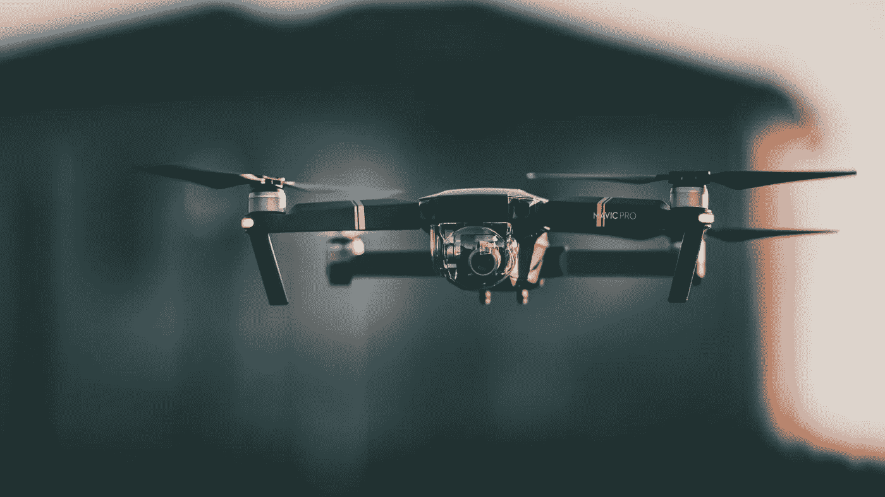
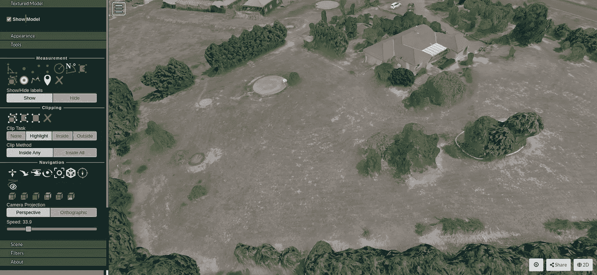
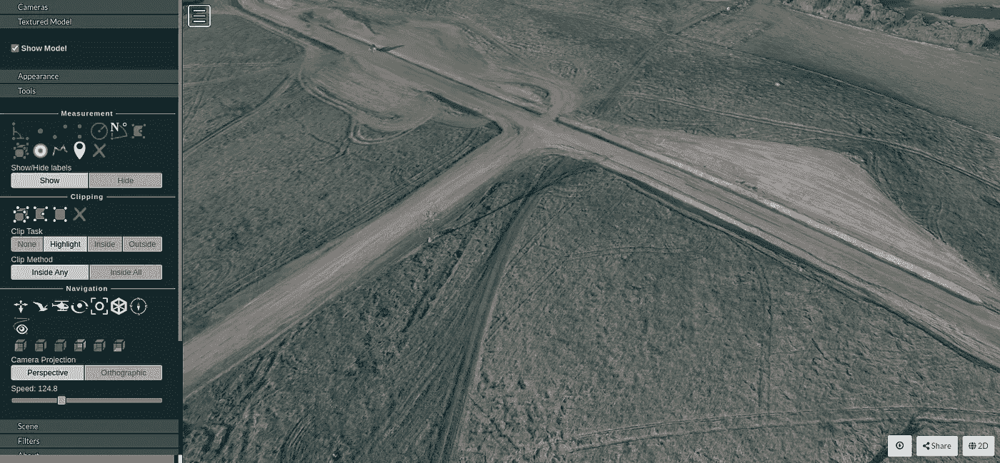
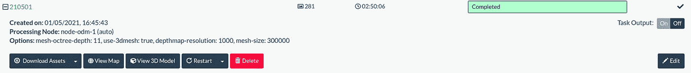

# 开放式无人机地图-所有人都可以使用本地和城市比例地图

> 原文：<https://towardsdatascience.com/open-drone-map-local-and-urban-scale-mapping-available-to-all-2857b61e7803?source=collection_archive---------19----------------------->

## [实践教程](https://towardsdatascience.com/tagged/hands-on-tutorials)

## 包括您在内的每个人现在都可以进行本地和城市范围的采集、处理和制图

由[戴安娜·姆塞努](https://unsplash.com/@dyana?utm_source=unsplash&utm_medium=referral&utm_content=creditCopyText)在 [Unsplash](https://unsplash.com/s/photos/drone?utm_source=unsplash&utm_medium=referral&utm_content=creditCopyText) 上拍摄的照片

*摄影测量*(从二维图像创建三维数据)并不是一项新技术——事实上，根据维基百科，使用照片进行地形测绘是由法国测量员多米尼克·阿拉戈在 1840 年首次提出的[1]。经典的例子包括立体摄影，其利用从稍微不同的视角拍摄的两个图像的视差效应来产生 3D 效果，而更先进的摄影测量的例子使用具有从许多不同角度拍摄的空间元数据的数字图像，使用计算机的能力来处理出正射镶嵌图像和点云。

通过开源社区的力量，有一个应用程序脱颖而出。开放无人机地图(ODM)是一个文档化的应用程序，允许个人和组织以可扩展的方式处理从有效的任何地理标记图像集(想想相机和无人机)收集的原始图像。虽然高质量的激光雷达在 x、y 和 z 方向上要精确得多，但与商用现成无人机市场的低端产品相比，获得激光雷达有效载荷仍然相当昂贵。

开放式无人机地图允许在任何设备上对多组图像进行不同程度的处理，从 PC 一直到虚拟集群、云和服务器，使其具有可扩展性。输出包括正射影像(或正射影像)、数字表面模型(DSM)、数字高程模型(DEM)、点云和 3D 纹理模型，所有这些都具有空间属性，可用于您首选的地理空间信息系统(GIS)！

上面列出的一些数据集的使用案例和应用程序的数量无穷无尽，为城市和地方尺度的空间分析打开了一个令人惊叹的世界。例如，我使用在我的地产上生成的模型来跟踪整个季节的植被生长，创建我的房子的高分辨率地图，计算从我的水箱到浴室的高差，以计算压头，甚至使用图像作为底图来跟踪和属性我的地产上的众多植物物种，以便我可以轻松地在未来的农业活动中参考它们。

作者图片

第一步是获取收集到的图像的良好样本。你既可以自己收集，也可以访问他人收集的样本库。但是，如果使用无人机，请务必了解适用于您所在区域的无人机飞行地点和方式的法律。我使用的是 DJI Mavic Pro，这是一个标准的 RGB 传感器，带有 GPS 定位和 IMU。以下是您可能考虑如何以无人机为例收集影像的一些考虑因素:

*   面积有多大，可能需要多少电池(1 个电池可以一次绘制几英亩的地图)
*   在感兴趣的区域周围是否有可能影响起飞、着陆或移动的垂直障碍物
*   我正在测绘的位置有哪些法律考虑因素，包括空域规则和规定、隐私以及某些飞行模式所需的资格
*   天气条件，包括风速、雨和照明条件(我发现上午 9-11 点和下午 1-3 点是照明和阴影的好时间)
*   我应该在图像中实现多少重叠，以优化输出，同时最大限度地减少收集时间
*   有一些应用程序可以自动收集图像，但我会让您自己探索这些应用程序。

如果你想访问现有的图像库，我推荐你去 ODM 论坛查看[可用的数据集](https://community.opendronemap.org/c/datasets/10)。

## **设置 ODM**

对于 Windows 或 Mac 用户， [ODM 提供了一个简单的安装程序](https://www.opendronemap.org/webodm/download/)方法，只需一次性购买，就可以减少对命令行安装过程的需求，并通过 GUI 使事情变得更简单。很明显，大量的开发工作正在进行，以使这个工具尽可能广泛地为每个人所用，并且为了使它可持续，已经为更容易的安装方法提供了一个小的价格。

我将完成的以下过程使用了在我的游戏笔记本电脑上的 Linux 操作系统上运行的 WebODM 的 dockerized 实例，并且是完全免费的。我选择 Linux 是因为它有利于包管理和依赖性，同时对可用计算资源的开销很低(我们想要最大的处理能力！).

## 安装 WebODM

1.  安装最新版本的 Docker(因 Linux 发行版而异)
2.  从 docker 存储库中取出 ODM 的最新 docker 映像`docker pull opendronemap/odm`
3.  在命令行中导航到 WebODM 目录
4.  `./webodm.sh start`(启动 docker 环境的 bash 命令)— Docker 将开始下载并创建运行 ODM 应用程序所需的映像和容器
5.  完成并运行 Docker 应用程序后，导航至您最喜欢的浏览器并进入`localhost:8000`
6.  我应该注意，在基本配置中，ODM 没有配置证书等。如果您想通过跨服务器访问 ODM 来运行它，我建议您深入研究更全面的安全配置。

你的浏览器应该有一个非常漂亮干净的 GUI。ODM 将事情简单地分为“项目”和“任务”。一个项目中可以有多个任务，也可以有多个项目。

## 处理图像

1.  创建项目
2.  创建一个任务并将您的图像集添加到工作中——避免那些不会为您的工作增加价值的图像，如地平线或天空图像
3.  选择您的处理选项(选择 3D 将创建一些数据集，包括正射镶嵌)
4.  单击提交-作业处理时间将取决于您使用的节点的处理能力和/或您选择的节点数量
5.  当你关闭 Docker 时，不要忘记发出一个 stop 命令`./webodm.sh stop`——Docker 中的 ODM 映像下次还会在那里，并且第二次应该会很快启动。

下面是我运行的一个作业的例子，其中包括来自 DJI Mavic Pro 的 280 张图像。我用了两年的游戏电脑完成这项工作大约需要。处理时间为 2-3 小时。WebODM 甚至有一个内置的“GIS”来查看和进行基本的空间分析。

作者图片

作者图片

这个应用程序还有很多其他的特性可以探索。这些方法包括使用额外的处理节点、使用地面控制点来提高空间精度、调整采集参数等等。beauty is ODM 是一个受到良好支持的开源包，它有一个[的大型知识库](https://www.opendronemap.org/docs/)，供那些想了解更多信息的人使用，包括[社区论坛](https://community.opendronemap.org/)。欢迎来到开放无人机测绘的世界！

## 参考资料:

[1]:En.wikipedia.org。2021.*摄影测量——维基百科*。[在线]见:[维基百科(点击链接)](https://en.wikipedia.org/wiki/Photogrammetry#:~:text=Photogrammetry%20is%20the%20science%20and,radiant%20imagery%20and%20other%20phenomena)，2021 年 5 月 6 日访问。