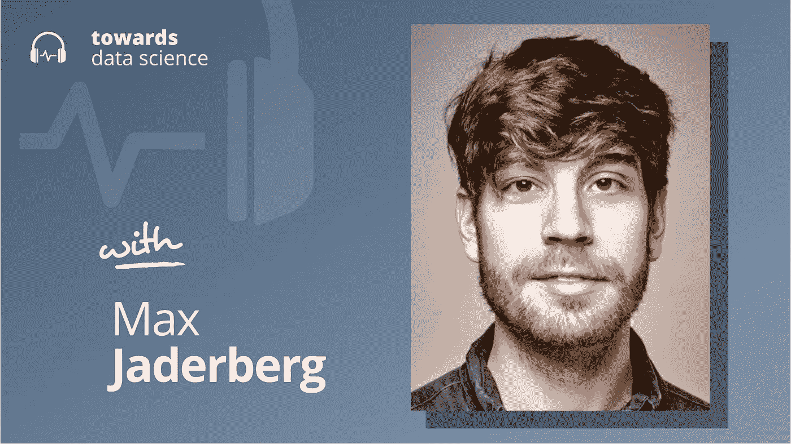

# DeepMind 的开放式学习

> 原文：<https://towardsdatascience.com/open-ended-learning-at-deepmind-da986c05f16f?source=collection_archive---------28----------------------->

## [播客](https://towardsdatascience.com/tagged/tds-podcast)

## 马克斯·贾德伯格关于构建能玩他们从未见过的游戏的代理

[苹果](https://podcasts.apple.com/ca/podcast/towards-data-science/id1470952338?mt=2) | [谷歌](https://www.google.com/podcasts?feed=aHR0cHM6Ly9hbmNob3IuZm0vcy8zNmI0ODQ0L3BvZGNhc3QvcnNz) | [SPOTIFY](https://open.spotify.com/show/63diy2DtpHzQfeNVxAPZgU) | [其他](https://anchor.fm/towardsdatascience)

*编者按:TDS 播客由 Jeremie Harris 主持，他是数据科学导师初创公司 SharpestMinds 的联合创始人。每周，Jeremie 都会与该领域前沿的研究人员和商业领袖聊天，以解开围绕数据科学、机器学习和人工智能的最紧迫问题。*

从表面上看，强化学习范式没有明显的限制:你把一个代理放在一个环境中，奖励它采取良好的行动，直到它掌握一项任务。

而且到去年为止，RL 已经取得了一些惊人的成绩，包括精通围棋，各种雅达利游戏，星际争霸 2 等等。但是人工智能的圣杯不是掌握特定的游戏，而是一般化——让代理人能够在他们之前没有接受过训练的新游戏中表现良好。

然而，快进到今年 7 月，DeepMind 的一个团队发表了一篇名为“[开放式学习导致一般能力代理](https://arxiv.org/abs/2107.12808)”的论文，朝着一般 RL 代理的方向迈出了一大步。和我一起参加本期播客的是这篇论文的合著者之一，马克斯·贾德伯格。马克斯在 2014 年进入谷歌生态系统，当时他们[收购了他的计算机视觉公司](https://www.theguardian.com/technology/2014/oct/23/google-uk-artificial-intelligence-startups-machine-learning-dark-blue-labs-vision-factory)，最近，他成立了 DeepMind 的开放式学习团队，该团队专注于将机器学习进一步推向跨任务概括能力的领域。我和 Max 讨论了开放式学习、通用化的前进道路和人工智能的未来。

以下是我在对话中最喜欢的一些观点:

*   最近 DeepMind 关于开放式学习的论文中报告的最重要的进步之一是代理人玩的游戏的程序生成。通过自动生成大量不同的环境和游戏目标，智能体可以接受各种各样任务的训练，迫使他们开发元学习技术，如探索和试错法。
*   他们制作的游戏包括个人、合作和竞争场景。有趣的是，代理人似乎比合作行为更容易(也更快)学会竞争行为。马克斯认为这是因为竞争伴随着一个更渐进的学习曲线:代理人被训练与其他代理人竞争，这些代理人在过程的每个阶段都经历了与他们大致相同的训练量。随着他们技能的提高，他们在游戏中的对手也在提高，所以他们总是为竞争动力学的“下一课”做好准备。
*   在开放式强化学习的最新进展和缩放语言模型的进步之间有许多有趣的相似之处。在这两种情况下，研究人员感兴趣的是确定可以可靠测量的概括能力的代理。例如，在 OpenAI 的 GPT-3 的情况下，这些代理之一是算法的算术能力:GPT-3 在增加小数字方面做得很好，但在增加大数字方面失败了——一些人认为这表明 GPT-3 还没有“学会理解”加法的概念。强化学习中加法的类比可能只是博弈论:一个强化学习代理人如何以及如何持续地将博弈论的原理应用到它所面临的问题和环境中？
*   也就是说，Max 还观察到，像 GPT-3 和开放式 RL 学习者这样的模型确实显示出对算术和博弈论的不完美掌握，这一事实可能只是反映了他们倾向于学习启发式而不是严格的符号逻辑。这可能是一件好事:试探法比逻辑更健壮，因为它们可以随着应用它们的问题领域变得更复杂而进化。启发式也是人类用来学习事物的方法，这就是为什么我们显示了许多与人工智能模型相同的失败模式:大多数人很难用大数做算术，但我们不认为这表明他们不能(或不理解)数学。也许我们应该以同样的方式思考人工智能。

你可以[点击这里](https://twitter.com/maxjaderberg)在 Twitter 上关注 Max。

## 章节:

*   0:00 介绍
*   1:30 Max 的背景
*   6:40 程序代的差异
*   12:20 定性方面
*   17:40 代理人的错误
*   20:00 测量概括
*   27:10 环境和损失函数
*   32:50 符号逻辑的潜力
*   36:45 两个不同的学习过程
*   42:35 预测研究
*   45:00 总结