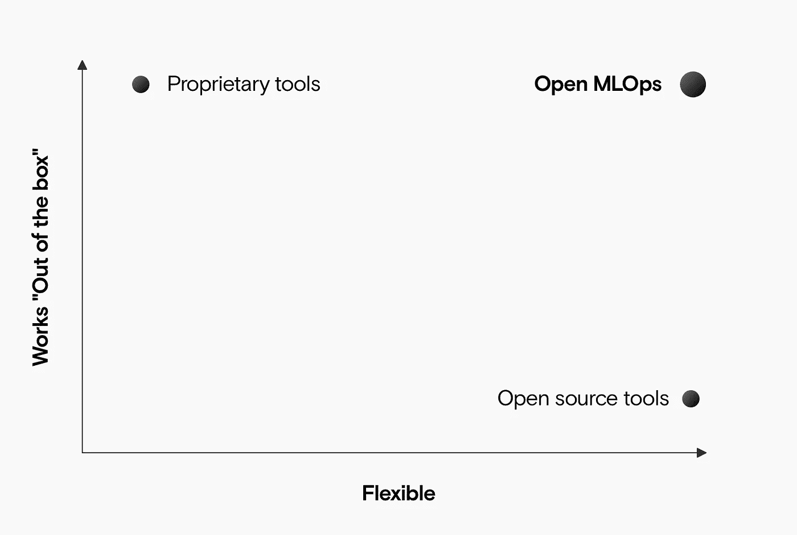
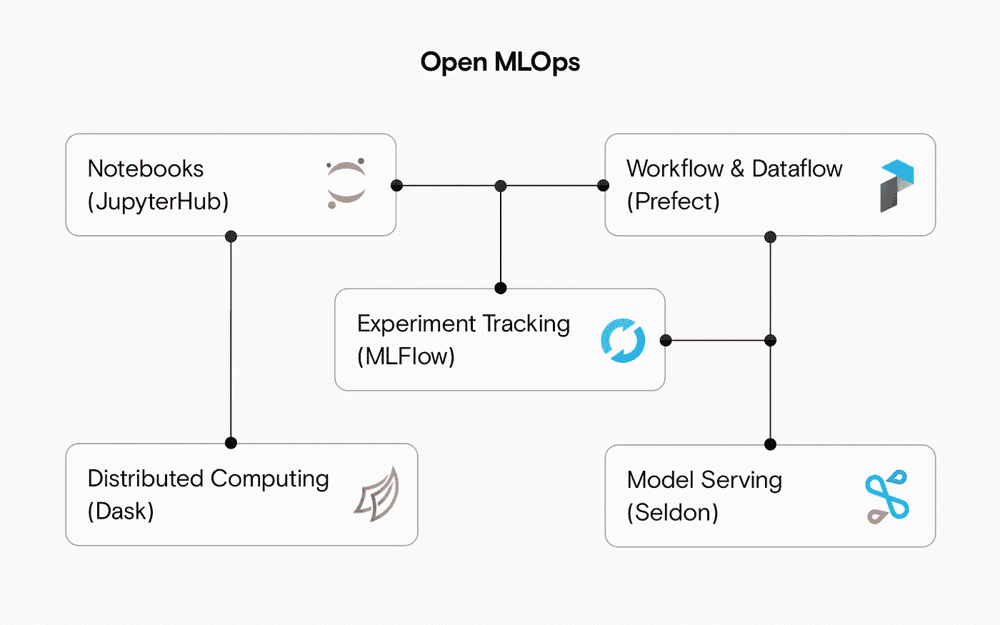

# 开放 MLOps:开源生产机器学习

> 原文：<https://towardsdatascience.com/open-mlops-open-source-production-machine-learning-f4080f02e9f0?source=collection_archive---------19----------------------->

## 我们正在发布 [Open MLOps](https://github.com/datarevenue-berlin/OpenMLOps) 的测试版:一个用于构建机器学习解决方案的开源平台。

来源:作者

所有的机器学习团队都面临着同样的任务:管理一个预处理流水线；训练和测试模型；并将模型部署为 API。

几乎每个团队都构建了自己的内部工具和脚本大杂烩。替代方案是要么购买昂贵且受限的专有平台，要么花几个月的时间学习和配置开源产品。前者“只是工作”但有局限性；后者很难建立，但是很灵活。

# 我们想要“灵活和简单”,所以我们构建了开放式 MLOps

[Open MLOps](https://github.com/datarevenue-berlin/OpenMLOps) 是一套 terraform 脚本和用户指南，帮助您在 Kubernetes 集群中建立一个完整的 MLOps 平台。所有这些都是开源的。

Open MLOps 开箱即用，您可以轻松地根据自己的需要进行调整。来源:作者

# 谁是开放市场？

开放式 MLOps 适用于任何工程团队。我们构建它是为了让它易于设置，并且可以适应几乎任何机器学习用例。您会发现开放式 MLOps 非常有用，

*   **一个机器学习研究团队**:你知道你应该使用 MLOps 的最佳实践。但是您不确定如何开始，并且您缺乏构建自己的框架的工程能力。
*   **一个机器学习初创公司:**你需要快速发布你的 PoC。但是它也必须是可扩展的。你知道 Kubernetes 可以解决你的问题，但你没有太多的专业知识。
*   **个体机器学习实践者:**即使是你自己，你也要努力跟踪你已经运行的实验，并且你在重复的工作上浪费时间和精力。您需要一种更简单、更快速的方法来用 API 包装您的模型、跟踪实验和管理数据管道。
*   **大型企业中的机器学习团队:**预先构建的解决方案对您来说不够灵活。你知道你应该建立自己的，但你不想从零开始。
*   **机器学习学生:**如果你想从学术界跳到工业界，你可以通过建立开放的 MLOps 并遵循我们的指导来试水。

Open MLOps 允许您将一组可配置的工具部署到 Kubernetes 集群中。如果您需要连接自己的身份验证或以特定的方式配置服务，您可以简单地派生存储库并构建现有的 Terraform 脚本。

# 什么是开放式 MLOps？

默认情况下，Open MLOps 设置并连接几个开源机器学习工具。来源:作者

Open MLOps 是 Terraform 脚本和漫游教程的开源存储库，用于在 Kubernetes 集群中设置各种机器学习工具。

默认情况下，这会设置:

*   **提督:**用于调度任务和构建依赖任务的 Dag。您可以使用它来清理数据、培训和部署模型，或者执行其他需要自动化的任务。任务是使用 Python 定义的，您可以使用直观的装饰器轻松地将它们构建到管道中。
*   **JupyterHub** :一个共享的 Jupyter 笔记本环境，供你的团队运行实验、共享代码和进行数据辩论。
*   **MLFlow** :跟踪实验和模型，密切记录结果和运行，这样你就知道什么已经试过了，什么正在工作。
*   Dask :在多个内核或机器上轻松并行处理繁重的计算任务。
*   **Seldon** :将你的模型转换成生产 REST APIs，并大规模服务。

# 我需要什么来开始使用 MLOps？

开始使用 MLOps 最简单的方法是使用 AWS。您所需要的只是访问 AWS 帐户和创建新服务的权限。

您还需要一些使用命令行工具的经验。具体来说，您将在设置过程中使用 Kubectl 和 Terraform，但我们的指南会指导您完成所有工作，因此您不必成为专家。

使用[我们的设置指南](https://github.com/datarevenue-berlin/OpenMLOps/blob/master/tutorials/set-up-open-source-production-mlops-architecture-aws.md)，您可以在几个小时内完成一切运行和配置。再过一个小时，你就已经在[训练你的第一个模特](https://github.com/datarevenue-berlin/OpenMLOps/blob/master/tutorials/basic-usage-of-jupyter-mlflow-and-prefect.md)了。

# 为什么我应该使用开放式 MLOps？

MLOps 是一个新兴但快速增长的领域，旨在帮助机器学习团队快速迭代，可靠地交付结果，并高效地协作。您的团队将在几个方面受益于构成开放 MLOps 的成熟开源工具:

*   **雇佣开发者更容易。开发人员不想要依赖专有软件的角色。他们知道这些可能是没有前途的工作，他们无法学到可转移的技能。**
*   不要多此一举。开发一个能满足您所有需求的内部平台往往很有诱惑力。但是大多数团队发现这比他们预期的要复杂。你可以阅读我们关于为什么[机器学习工程比软件工程](https://datarevenue.com/en-blog/software-development-vs-machine-learning-engineering)更复杂的帖子。即使您有复杂的定制需求，您也可以从 Open MLOps 作为基础层开始，并在此基础上构建您的定制解决方案。
*   **建立可复制的模型。**机器学习团队最大的抱怨是难以跨不同系统或随着时间的推移复制他们的工作。通过在 MLOps 实践中使用广泛采用的框架和工具，您可以确保永远不会留下没有人能够再次构建的大型二进制模型。
*   **高效协作。如果团队中的每个人都使用相同的系统，那么一起工作、分享或把工作交给其他人会更容易。**

# 反馈、问题或功能请求？

如果您尝试过 Open MLOps，并且需要支持或想要分享您的经验，请[联系](https://datarevenue.com/en-contact)。或者，您可以直接在 [Open MLOps repository](https://github.com/datarevenue-berlin/OpenMLOps/) 上随意打开问题或拉请求。