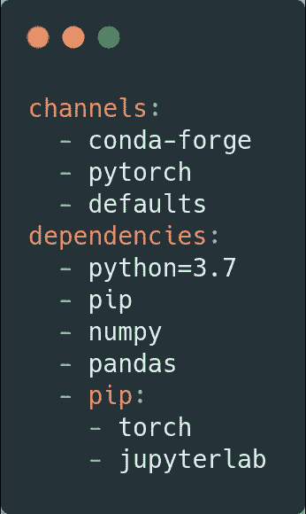
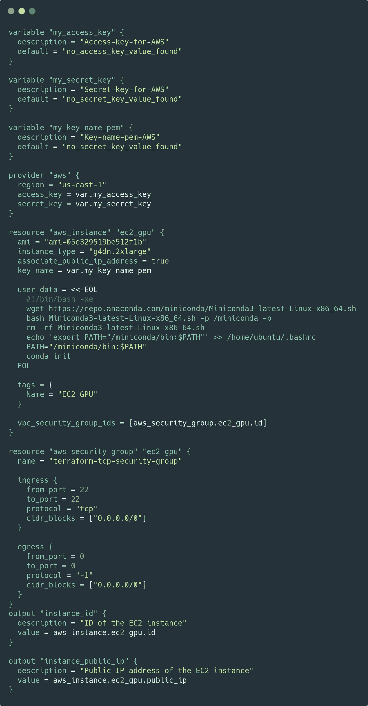
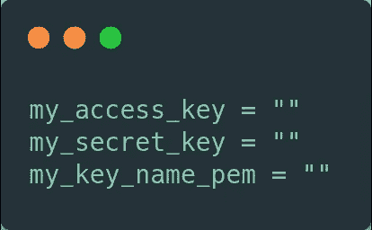
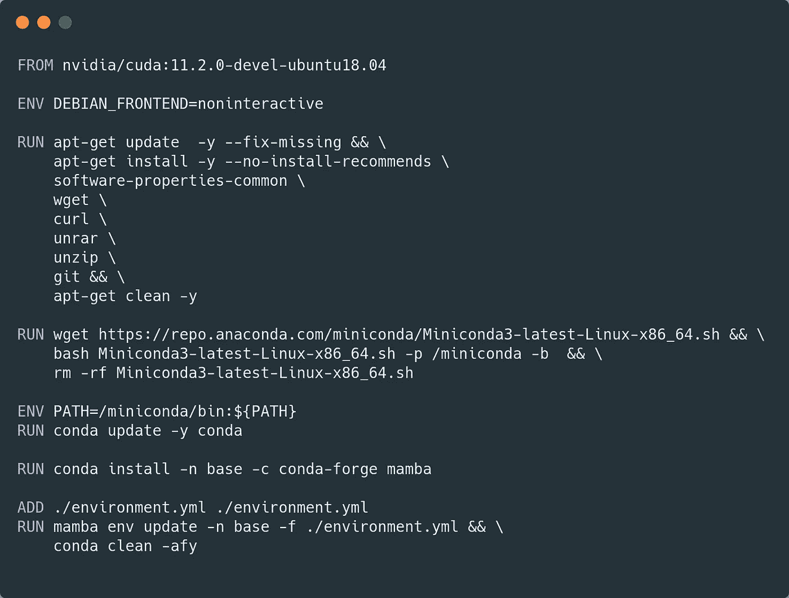
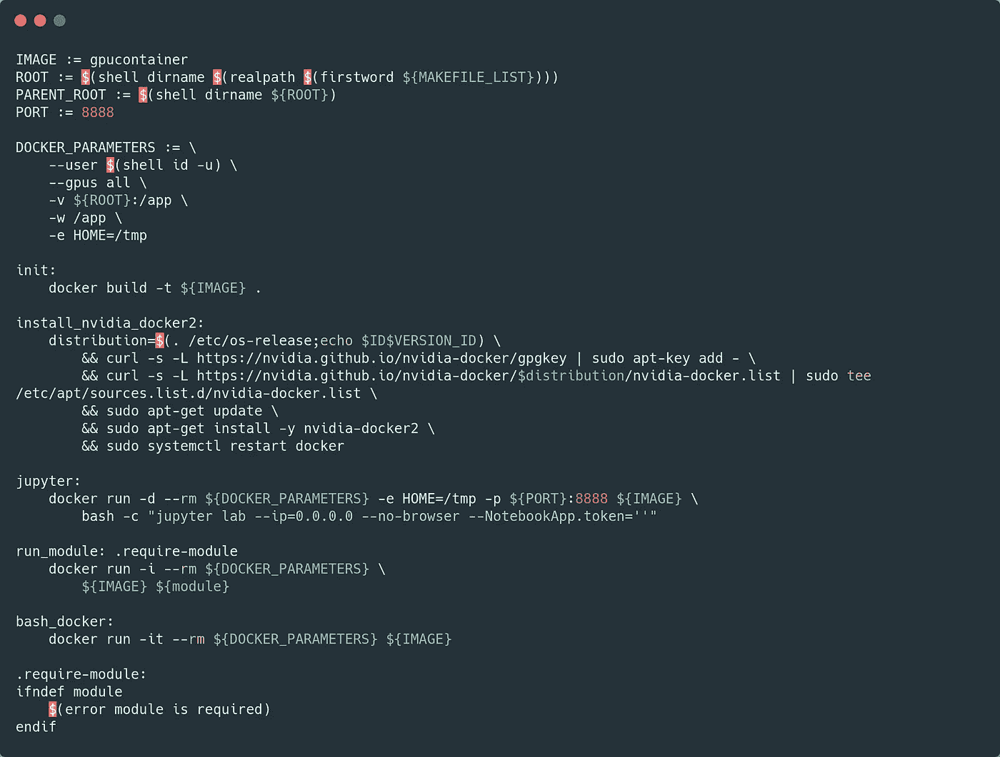
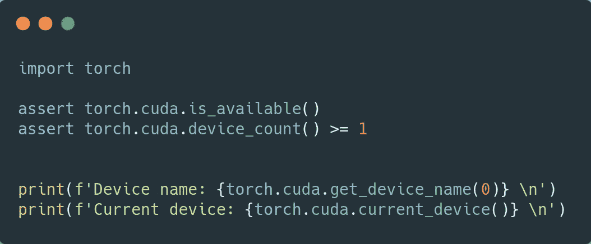
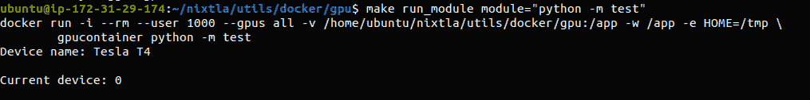
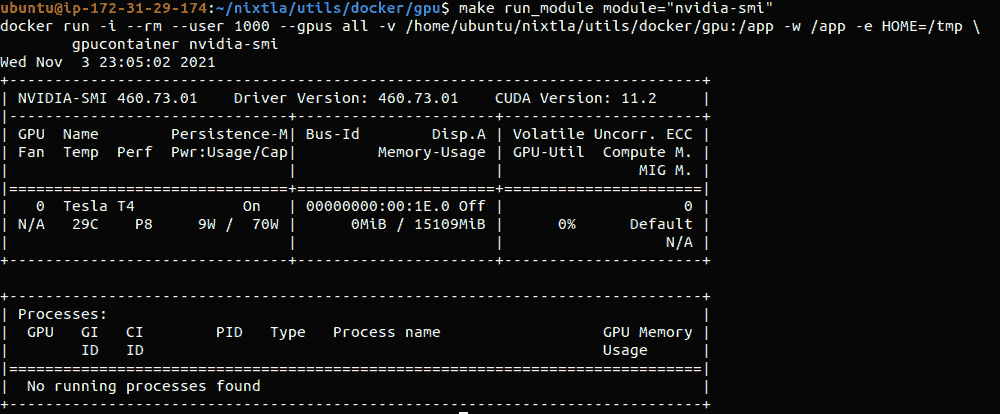

# AWS 深度学习 AMI 的开源替代方案

> 原文：<https://towardsdatascience.com/open-source-alternative-to-the-aws-deep-learning-ami-f8f77318f8a8?source=collection_archive---------22----------------------->

## 一篇描述如何使用 conda、Docker、make 和 terraform 自动设置 GPU 基础架构的文章。

*由* [*尼克斯特拉团队*](https://github.com/Nixtla/) *。* [*费德·加尔萨·拉米雷斯*](https://medium.com/u/2855bd3e0293?source=post_page-----f8f77318f8a8--------------------------------) ，[马克斯·梅根塔尔](https://medium.com/u/76b639655285?source=post_page-----f8f77318f8a8--------------------------------)

> **TLDR；**使用 GPU 运行深度学习模型非常复杂，尤其是在配置基础设施时。预制的 GPU 云基础设施往往特别昂贵。
> 
> 为了帮助人们专注于他们的模型而不是他们的硬件和配置，我们在 Nixtla 开发了一种快速简单的方法来在 AWS 云上使用 gpu，而无需为 AMI 环境付费，并将其开源:[https://github.com/Nixtla/nixtla/tree/main/utils/docker-gpu](https://github.com/Nixtla/nixtla/tree/main/utils/docker-gpu)和[https://github . com/Nixtla/Nixtla/tree/main/utils/terraform-GPU](https://github.com/Nixtla/nixtla/tree/main/utils/terraform-gpu)。

**简介**

深度学习已经广泛应用于许多领域:计算机视觉、自然语言处理、时间序列预测等。由于它所获得的最先进的结果，它在数据科学家和研究人员的日常实践中变得越来越受欢迎。

GPU 加速了模型的训练和推理，因为它们经过优化，可以执行深度学习严重依赖的线性代数计算。然而，对这种专用硬件的需求增加了试验和将这些模型部署到生产中的货币/经济成本。

深度学习实践者面临的一个普遍问题是云上 GPU 基础设施的正确配置。安装硬件管理所需的驱动程序往往很麻烦。如果不能正确解决这个问题，可能会对再现性造成损害，或者不必要地增加这些新模型的成本。在本帖中，我们使用 Docker 为社区提供了一个简单的解决方案。

**解决方案**

1.  **英伟达深度学习 AMI +康达环境+ Terraform**

**a)英伟达深度学习 AMI**

要使用 GPU 加速计算运行您的代码，您需要做两件事:(1)拥有 NVIDIA GPUs，以及(2)它们必要的驱动程序。

如果你选择 EC2 实例 [(P2、P3、P4D 或 G4)](/choosing-the-right-gpu-for-deep-learning-on-aws-d69c157d8c86) ，NVIDIA 提供免费的 [AMI](https://aws.amazon.com/marketplace/pp/prodview-e7zxdqduz4cbs#pdp-reviews) ，预装优化的 GPU 软件，你只需要支付 EC2 计算费用。

您可以通过 AWS 控制台从终端轻松启动 GPU EC2 实例及其相应的驱动程序。为此，您需要:

1.  [AWS CLI 安装](https://docs.aws.amazon.com/cli/latest/userguide/install-cliv2.html)。
2.  EC2 启动权限。
3.  EC2 连接权限:(I)*。pem* 文件从实例启动< YOUR_KEY_NAME >(您可以按照这里[的说明创建一个](https://docs.aws.amazon.com/AWSEC2/latest/UserGuide/ec2-key-pairs.html))。(II)实例的安全组< YOUR_SECURITY_GROUP >。

如果您没有自己的<your_security_group>，您可以使用创建一个:</your_security_group>

```
aws ec2 create-security-group \
        --group-name nvidia-ami \
        --description “security group for nvidia ami”
```

并使用以下内容向其添加入口规则:

```
aws ec2 authorize-security-group-ingress \
        --group-name nvidia-ami \
        --protocol tcp \
        --port 22 \
        --cidr 0.0.0.0/0
```

有了以上内容，启动 GPU ready EC2 实例就像运行以下命令一样简单:

```
aws ec2 run-instances \
        --image-id ami-05e329519be512f1b \
        --count 1 \
        --instance-type g4dn.2xlarge \
        --key-name <YOUR_KEY_NAME> \
        --security-groups nvidia-ami
```

图像 id ( *—图像 id* )标识所需的 NVIDIA AMI。实例数量( *—计数*)和实例类型( *—实例类型*)的值是可选的。

一旦实例被初始化，我们就可以用 ssh 来访问它。AMI 预装了 git，因此我们可以毫不费力地克隆我们项目的 repo。

```
ssh -i path/to/<YOUR_KEY_NAME>.pem ubuntu@<PUBLIC_EC2_IP>
```

**b)康达环境**

我们推荐使用 [*Conda*](https://conda.io/projects/conda/en/latest/user-guide/tasks/manage-environments.html) 来方便处理深度学习依赖( *PyTorch、TensorFlow 等)。*)，特别推荐用 *environment.yml 文件*创建环境。

下图显示了一个示例。本例中使用的深度学习框架是 *PyTorch* ，也包含了 *NumPy* 和 *pandas* 等标准库。这个文件是一个框架，所以可以毫无困难地添加任何附加的依赖项。此外，还包括 *jupyterlab* 。



原始文件可以在这里找到[。](https://github.com/Nixtla/nixtla/blob/main/utils/docker-gpu/environment.yml)

可以看到，要用的 python 版本是 3.7。这个版本可以很容易地根据用户的需要进行调整，其他版本的软件包也是如此。

要使用 conda 环境，您需要先安装 conda，因为 NVIDIA AMI 没有安装它。您可以遵循下一组说明:

```
wget [https://repo.anaconda.com/miniconda/Miniconda3-latest-Linux-x86_64.sh](https://repo.anaconda.com/miniconda/Miniconda3-latest-Linux-x86_64.sh) && \
bash Miniconda3-latest-Linux-x86_64.sh -b -p $HOME/miniconda && \
rm -rf Miniconda3-latest-Linux-x86_64.sh && \
source $HOME/miniconda/bin/activate && \
conda init
```

因此您可以在您的环境中安装，

```
conda env create -n <NAME_OF_YOUR_ENVIROMENT> -f environment.yml
```

为了验证一切都正确安装了，您可以克隆我们的 repo 并运行一个测试，

```
git clone [https://github.com/Nixtla/nixtla.git](https://github.com/Nixtla/nixtla.git)
cd nixtla/utils/docker-gpu
conda env create -n gpu-env -f environment.yml
conda activate gpu-env
python -m test
```

最后一条建议:用户必须小心所使用的深度学习框架的版本，验证它是否与 NVIDIA AMI 驱动程序兼容。

**c)地形**

为了促进上述整个过程的创建，我们开发了一个[地形](https://www.terraform.io/)脚本。Terraform 是一个开源的基础设施，作为代码工具，允许你将所有的手动开发合成一个自动脚本。在这种情况下，我们编写的基础设施代码挂载 NVIDIA AMI(包括创建一个兼容的安全组)并安装 conda。下图显示了 main.tf 文件。



原始文件可以在这里找到[。](https://github.com/Nixtla/nixtla/blob/main/utils/terraform-gpu/main.tf)

此外，凭据需要 terraform.tfvars 文件。该文件的图像如下所示。



原始文件可以在这里找到[。](https://github.com/Nixtla/nixtla/blob/main/utils/terraform-gpu/terraform.tfvars)

要使用 Terraform，您只需按照这些说明[进行安装。随后，您必须运行](https://www.terraform.io/downloads.html)

```
terraform init
terraform apply
```

这将创建所需的基础设施，并在部署的 EC2 上安装 conda。当 Terraform 完成运行时，您将能够看到与实例相关联的公共 IP，因此您只需要使用 ssh 连接来访问它。

```
ssh -i path/to/<YOUR_KEY_NAME>.pem ubuntu@<PUBLIC_EC2_IP>
```

**2) NVIDIA 深度学习 AMI + Conda 环境+ Terraform + Docker + Make**

**a)码头工人**

使用 Docker 来确保项目和实验的可复制性是常见的做法。此外，它允许用户将所有必需的依赖项集中在一个地方，避免在本地安装依赖项，这可能会在以后导致冲突。

我们使用 docker 是因为它允许我们将软件从硬件中分离出来，使计算更加灵活。如果负载非常重，只需更改 EC2 实例并运行容器内的代码就足够了。另一方面，如果负载较轻，我们可以选择较小的实例。

下图显示了我们为图像构建的 Dockerfile，用于访问实例的 GPU。首先，必须选择一个与 EC2 上安装的驱动程序兼容的映像。迄今为止，NVIDIA AMI 使用 CUDA 版本 11.2，因此这是所选的图像。



原始文件可以在这里找到[。](https://github.com/Nixtla/nixtla/blob/main/utils/docker-gpu/Dockerfile)

随后，安装项目可能需要的其他操作系统库。例如，在上面的 docker 文件中，安装了 *wget* 和 *curl* ，这对于下载项目所需的数据可能很有用。

在下一条指令中，安装了 *miniconda* 。正如我们之前所讨论的，Conda 将允许我们处理 python 依赖项，并使用前一节中显示的 *environment.yml* 文件来安装它们。

我们强烈推荐使用 [*mamba*](https://github.com/mamba-org/mamba) 进行版本管理和安装，因为它可以显著减少等待时间。如果用户愿意，她可以很容易地切换到康达。

最后，前面创建的 *environment.yml* 文件被添加到 Docker 映像并安装在基础环境中。没有必要在每次需要容器时都初始化特定的环境。

**b) Makefile**

最后，我们为 Makefile 的使用提供了便利。 [Make](https://www.gnu.org/software/make/) 是控制工作流和可执行文件的强大工具。我们的工作流将允许我们从 Docker 文件快速构建 Docker 映像，并运行 python 和 bash 模块，而无需连续声明必要的参数。



原始文件可以在这里找到[。](https://github.com/Nixtla/nixtla/blob/main/utils/docker-gpu/Makefile)

在本例中，Docker 映像将被称为 *gpucontainer* ，您可以运行 *make init* 来构建它。一旦执行了这条指令，用户就可以使用 *run_module* 指令来使用 GPU 运行她的 python 或 bash 模块。


例如，为了验证一切工作正常，我们创建了 *test.py* 文件，确保 CUDA 可用于 *PyTorch* 并且 GPU 可用。该模块将按如下方式执行:

```
make run_module module="python -m test"
```



原始文件可以在这里找到[。](https://github.com/Nixtla/nixtla/blob/main/utils/docker-gpu/test.py)



其他有价值的指令可能是在 Docker 容器中运行 *nvidia-smi* 来验证一切正常:

```
make run_module module="nividia-smi"
```

或者交互初始化容器，可以用 *make bash_docker* 来完成。最后，提供了一个在 docker 中运行 jupyterlab 并进行交互式实验的指令:

```
make jupyter
```

如果端口 8888(默认)被另一个进程使用，可以使用

```
make jupyter -e PORT=8886
```



**总结**

在这篇文章中，我们展示了一个简单的解决方案，来解决在云上配置 GPU 进行深度学习的问题。有了这个完全开源的工作流程，我们希望该领域的从业者将花费更多的时间来实现模型，而不是像我们一样花太多时间在基础设施上。