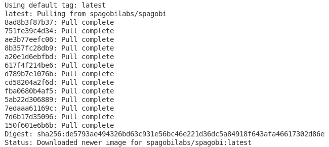
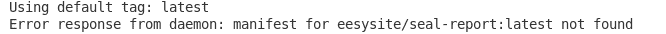
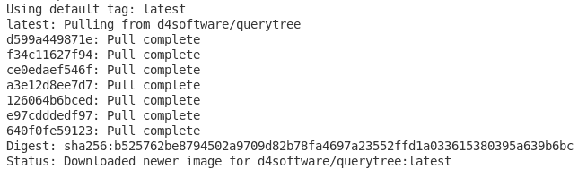
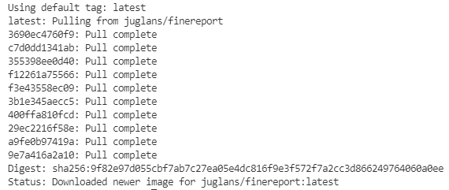
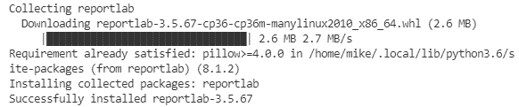

# 值得一看的开源报告工具

> 原文：<https://towardsdatascience.com/open-source-reporting-tools-worth-a-look-a49a91d93f9a?source=collection_archive---------6----------------------->

## 探索微软 SSRS 的替代方案


[斯科特·格雷厄姆](https://unsplash.com/@homajob?utm_source=medium&utm_medium=referral)在 [Unsplash](https://unsplash.com?utm_source=medium&utm_medium=referral) 上拍照

当想到报告服务的世界时，我想知道是否有任何开源的报告工具。开源将允许更多的定制，但通常也是一个有趣的话题。当我最终在网上搜索它时，我发现它不仅仅是一个单一的开源报告工具。相反，有相当多的选择。有一张清单，上面列有最好用的工具。现在，在很大程度上，相当多的报告服务最终在列表上重叠。但有些更独特。我相信每个人都有自己的喜好。

我没有选择所有的选项，而是选择了五个选项来做更多的研究。然而，这并不意味着这五个选项比任何其他选项都好。但这可能是对一些强大的开源工具的有趣探索。

**斯帕戈比**

我们要看的第一个商业智能套件是 SpagoBI。它是一个开源套件，带有各种分析工具。SpagoBI 不仅支持报告，还支持多维分析(OLAP)、图表创建、SPI、交互式驾驶舱、即席报告、位置智能(如 web 地图服务)、免费查询、数据挖掘、网络分析、ETL、协作、办公自动化、主数据管理，甚至可以在后台运行的外部分析流程。针对不同的用户需求，SpagoBI 有不同的主模块。这包括 SpagoBI 服务器、Studio、Meta、SDK 和应用程序。这使得商业用户、开发人员、决策者和管理员能够找到 SpagoBI 的用途。它还支持一系列分析引擎和认证环境。

SpagoBI 是用 Java 编写的，使用 Ext JS 框架，并对研究、使用甚至修改软件以实现更多定制用途是开放的。该套件使用 Mozilla 公共许可证，这意味着组件可以修改和重新分发修改后的副本。

在后来的更新中，2017 年，SpagoBI 进化为 KNOWAGE。这是一个更现代、更成熟的商业智能版本，拥有更高级的分析选项，甚至大数据。KNOWAGE 推进了 SpagoBI 的原始选项，满足了大数据、智能情报、企业报告、位置情报、绩效管理和预测分析的需求。KNOWAGE 有社区版和企业版。

另一个有趣的事情，也是我特别感兴趣的事情，是 SpagoBI 的一个版本可以在 Docker Hub 上找到。随着我尝试更频繁地使用 Docker，你可以期待将来在这里看到更多关于 SpagoBI 使用 Docker 的内容。现在，您可以使用 Docker 通过以下命令来获取 SpagoBI 版本:

```
sudo docker pull spagobilabs/spagobi
```



调出萨戈比码头工人的图像。

要从 KNOWAGE suite 页面下载，因为 SpagoBI 下载会将您带到 KNOWAGE，您首先要创建一个帐户。没有帐户，我发现下载页面只是导致一个 404 页没有找到。我确实开始做账号了，但是我承认我等着验证账号注册的时候有点不耐烦。我更愿意尝试 Docker 版本。但这将是另一天，以便我们可以采取更深的潜水。那将是我们能够充分探索特性而不仅仅是细节的时候。

注意，在我尝试注册一两个小时后，我确实收到了验证邮件。也许我以后会再讨论这个问题，但是我现在更想看看 Docker 版本，所以至少现在我不会尝试安装普通版本。如果你决定安装 KNOWAGE，但意识到注册过程中的验证邮件需要一段时间才能收到，所以你不能马上安装 KNOWAGE。因为我没有重新访问，我不能保证你仍然不会得到 404 页找不到错误，但如果你试过了，请随时让我知道在评论中是否有一个帐户帮助下载工作。

**密封报告**

Seal Report 不是一个典型的数据可视化报告，它更像是一个使用。NET 框架。Seal Report 也是开源的。该框架可用于为任何类型的数据库生成报告，无论该源是基于 SQL 还是基于 NoSQL。Seal Report 专注于快速轻松地安装和构建报告。Seal Report 的所有实体都存储在 Seal Repository 中，Seal Repository 包括数据源、设备和报表。密封报告的主要组件包括服务器管理器、报告设计器、Web 报告服务器、任务调度器和密封报告调度器。总之，这些允许定时报告，如每日报告。

运行 Seal Report 所需的存储库文件夹包括程序集、数据库、设备、日志、报告、安全性、设置、源、表格模板、特殊文件夹、子报告和视图。这些都是用来创建一个简单而全面的报告。

主要功能包括动态 SQL 源、LINQ 查询、原生数据透视表、HTML 5 图表、KPI 和小部件视图、使用 Razor 引擎的全响应 HTML 呈现、Web 报告服务器、报告调度程序、下钻导航和子报告、报告任务和低 TCO(总拥有成本)。

我再次在 Docker Hub 上搜索，看看是否有 Seal 报告。似乎可以在 Docker 上找到密封报告，但是，我发现了问题。这是 Docker 建议使用的命令:

```
sudo docker pull eesysite/seal-report
```

因此，当您在 Docker 中查看 eesy/seal-report 时，没有拉动。当我试着:



尝试提取图像失败。

考虑到没有拉力，我想知道是不是有什么东西设置错了，或者只是不能工作。

要正常下载，您将被定向到 GitHub 代码。从那里，您可以直接下载源代码。然后，您可以在计算机上运行该可执行文件。从那里，当您从工具的根目录打开 Seal.sln 解决方案文件时，可以使用 Visual Studio 进行编译。

在尝试学习如何使用密封报告时，密封报告网站上有教程。它首先教您如何从 SQL Select 语句生成报告。这是用来准备一份报告，在几个快速和简单的步骤。执行后，您可以将报告保存到存储库中。

下一组指令展示了如何创建第一个数据源。它还指导如何创建、执行和存储报告。一旦设置好源和报告，就可以发布了。

有两套发布说明，具体取决于您希望报告放在哪里。第一个是在 Linux (Ubuntu)上。这将适用于我，因为这是我所使用的。另一个在 Azure 上。对于 Azure，也有关于如何审计数据库的说明。

最后一组指令是设置密封报告调度程序。这样，您就不必每次都手动创建报告。相反，您可以设置调度程序在特定时间自动生成报告。

**查询树**

QueryTree 是一个用 C#、ASP.NET 和 JavaScript 编写的开源解决方案。该工具旨在实现即席报告和可视化。在 GitHub 上找到的，可以使用源码运行，也可以使用二进制甚至 Docker 运行。QueryTree 适用于 Microsoft SQL Server、MySQL 或 PostgreSQL 数据库。该工具面向技术和非技术用户。QueryTree 使非技术用户可以轻松地从数据库的表中选择、过滤、分组、聚合和可视化数据。它甚至可以创建交互式图表来可视化数据，而无需编写任何代码。

QueryTree 是一种拖放构建器，它允许非技术用户在不编写任何代码的情况下使用各种可视化选项。还可以计划生成这些报告，以便在 web 或移动设备上查看。拖放式构建器包括一个强大而灵活的界面，允许查询根据用户的选择生成报告。这也意味着可以使用 QueryTree 易于使用的可视化工具来连接、转换或简单地查看数据集。

查看数据时，QueryTree 包括一个排序工具和一个选择工具，可用于组织数据或删除任何可能不一致的信息。还有几个不同的图表选项，因此用户可以选择他们想要查看数据的图表。QueryTree 还允许导出图表，而不是只能保存图表。这样，数据可以用其他工具表示，如 Excel 或 Word。

在计划和生成报告时，QueryTree 还提供了邀请团队成员查看这些计划报告的能力。QueryTree 还允许安全的加密连接来访问数据库，并以只读方式连接，因此数据是安全的。这样，可以与队友共享报告，以获得更好的体验。

对于更复杂的选项，查询树提供了一个高级报告生成器。这包括与简单的报表生成器相同的功能，但是具有更多用于自定义的工具和选项。这些报告更复杂，因此可能会更深入地挖掘数据库。除了标准的拖放选项之外，高级报表生成器还利用简单的向导来全面可视化所需的数据。与我们讨论过的其他产品一样，QueryTree 是开源的，可以免费使用，但也为企业客户提供了可定制的支持计划。对于非企业用户，Github 在 QueryTree 项目上有社区支持。

如前所述，QueryTree 随 Docker 一起提供:

```
sudo docker pull d4software/querytree
```



从 Docker Hub 中提取 QueryTree。

QueryTree 是另一个开源的专门报告工具，我认为使用起来会很有趣，所以稍后我们将尝试在 Docker 中进一步使用它。

**FineReport**

FineReport 是一款开源的 BI 报告和仪表板软件。与其他一些工具不同，FineReport 是一个基于网络的工具。它的设计是模仿 Excel 的，所以对初学者来说很容易操作。FineReport 可以部署在本地，也可以连接到公司数据库。FineReport 几乎支持所有数据库类型。它是用 Java 编写的，个人使用是免费的，但在公司使用 FineReport 时可能会收费。

报告和仪表板的细节旨在实现创新的设计模式、快速的数据集成、酷炫的数据可视化(具有动态甚至 3D 效果)、小数据输入、强大的决策平台以及轻松的部署和集成。FineReport 是用 Java 编写的，这意味着它可以通过独立或嵌入式部署在不同的系统上实现。

FineReport 可用于可视化报告、仪表板、财务报表，开发采购、销售、库存系统等。该工具也有不同的用例。一个原因是业务用户，他们可能需要显示数据的报告，或者 FineReport 可以用于快速和方便的数据输入。下一个用户案例是中层管理者。像这样的主管需要能够生成和显示报告、导出分析(用于 PDF 格式或 Excel 格式的演示)，甚至在某些数据需要及时监控和审查的情况下，还需要强制性的数据关注。这是 FineReport 允许生成预定报告的地方，该报告可以通过电子邮件或其他选择的方式将报告推送给用户。考虑的最后一个用户案例是高级管理层。在这种情况下，经理需要能够查看数据，例如使用仪表板，但他们还必须能够在任何地方可视化数据，例如在移动设备上，他们还必须能够分析数据，例如使用链接或钻取。

FineReport 更像是一个专业的大数据商业智能和分析平台。它专注于分析，因此更加以 It 为中心。虽然业务用户可以使用 FineReport，但完整的功能是为 IT 人员设计的。这也是因为大多数用户在使用报表时都具备基本的 SQL 知识。FineReport 确实有几个不同的版本，面向不同的个人。如前所述，FineReport 以典型的 IT 用户为中心。FineBI 的定位是供更多的商业用户或数据分析师使用。JDY 是一个无代码的 aPaaS(应用程序平台即服务)解决方案，业务用户和 IT 都可以使用它来提高工作效率。然而，JDY 可以由全体员工使用，因为不涉及任何代码。然而，我们现在只关注 FineReport。

和其他版本一样，FineReport 的一个版本可以在 Docker 上找到:



正在提取 FineReport Docker 图像。

现在我们已经做好了准备，也许将来我们会更深入地研究 FineReport。

**报告实验室**

ReportLab 是一个开源引擎，用于创建复杂的 PDF 文档和定制的矢量图。它是标准 Linux 发行版的一部分，嵌入在各种不同的产品中，甚至被选为维基百科的打印/导出功能。ReportLab 可以免费使用，也是用 Python 编写的。

ReportLab 分为三个主要层。第一层是“绘制”PDF 页面的图形画布 API。第二层是图表和小部件库，可用于创建可重用的数据图形。最后一层是页面布局引擎，用于根据不同的元素(如标题、段落、字体、表格和矢量图)构建文档。页面布局引擎是 PLATYPUS(使用脚本的页面布局和排版)。ReportLab 还有一个 PLUS 商业产品，它可以以更高的速度生成 pdf，并且允许使用 ReportLab 的基于 XML 的模板语言 RML。ReportLab PLUS 还包括对开源库的升级，可以加快开发周期。

仅使用标准的 ReportLab 开源引擎，它是一个免费的 PDF 工具包，可以自动化文档制作，快速生成多个 PDF，具有 Diagra 图表工具包，并减少文书工作和打印成本。ReportLab 工具包是免费版本，是一个用于以编程方式创建 PDF 文档的库。该工具包的功能是创建专业的可移植文档，使用 real document layout engine(Platypus)，可流动的对象，如标题或段落，但 ReportLab 工具包还支持嵌入式 Type-1 或 TIF 字体、亚洲、希伯来和阿拉伯字符、任何流行格式的位图图像、矢量图形，它包括可重复使用的原始形状库、可扩展的小部件库、用 Python 编写的分层架构，它还包括简单的演示和更复杂的工具，允许任何数据源、完全可用的源代码、强大的社区支持，并且是平台独立的。

因为它是用 Python 编写的，所以可以使用源代码安装，或者使用 PYPI 中的 pip 安装。虽然可以在 Linux 上使用，但 ReportLab 是跨平台的，可以在 Windows、Mac OSX、Solaris、AIX、FreeBSD 等平台上使用。

与这个列表中的其他开源工具不同，ReportLab 在 Docker 上找不到。但是因为它可以使用 PYPI 中的 Pip 进行安装，所以我们将以这种方式进行安装:

```
sudo pip3 install reportlab
```



正在安装 ReportLab。

尽管在 Docker 上找不到 ReportLab，但你知道我对我的 Python 项目情有独钟。所以。希望将来能看到我更多地使用 ReportLab。这似乎是一个强大的工具包，但我也很高兴它是用 Python 编写的。

**结论**

在本文中，我们回顾了五种不同的用于报告的开源引擎/工具包。这五个版本中，有四个在 Docker 上有版本。正如我在开始时所说的，这并不是对“最好的”开源引擎的分解。相反，这更像是为了满足我自己的好奇心而进行的教育失败。灵感只是想知道是否有任何开源报告工具，所以我惊喜地看到有这么多。

我们了解了 SpagoBI、Seal Report、QueryTree、FineReport 和 ReportLab。其中，只有 ReportLab 没有在 Docker 上找到。然而，ReportLab 也是唯一一个 Python 驱动的工具包，可以通过安装 Pip 获得，所以现在还不要把它排除在外。

在我们的研究中，我们只获得了每个报告工具的一般背景信息。然而，我们还没有机会尝试用它们中的任何一个生成报告。这是我有兴趣做的事情。现在请注意，网上有几个“最好的开源报告工具”,虽然其中很多有重叠，但还有很多我没有在这个概述中列出。这并不意味着这是最好的五个，它们只是我更有兴趣了解的五个。在未来，我计划至少使用一些这样的报告工具，并学习更多关于如何使用它们的知识。有趣的是，在它们都被尝试过之后，以比较的形式重新审视我选择的所有工具。如果您使用任何您认为值得研究的开源报告工具，请随时在评论中提出来，我很有兴趣看看。总的来说，我认为看到这些开源报告服务的相似性和不同性是很有趣的，其中一些确实试图通过高级功能来盈利，而另一些仍然免费供所有用户使用，包括公司使用。

稍后，我们将对列表中的每一项进行更深入的探究，但在此之前，干杯！

***用我的*** [***每周简讯***](https://crafty-leader-2062.ck.page/8f8bcfb181) ***免费阅读我的所有文章，谢谢！***

***想阅读介质上的所有文章？成为中等*** [***成员***](https://miketechgame.medium.com/membership) ***今天！***

查看我最近的文章:

[](https://python.plainenglish.io/middleware-in-fastapi-what-is-it-fa028349489d) [## FastAPI 中的中间件——它是什么？

### 解释其中的奥秘…

python .平原英语. io](https://python.plainenglish.io/middleware-in-fastapi-what-is-it-fa028349489d) [](/introduction-to-postgresql-part-2-c25c346925d) [## Postgresql 简介:第 2 部分

### 让我们开始这个派对吧

towardsdatascience.com](/introduction-to-postgresql-part-2-c25c346925d) [](/introduction-to-postgresql-part-1-6ca9f25b02e1) [## Postgresql 简介:第 1 部分

### 让我们从头开始

towardsdatascience.com](/introduction-to-postgresql-part-1-6ca9f25b02e1) [](/sqlite-vs-tinydb-7d6a6a42cb97) [## SQLite vs TinyDB

towardsdatascience.com](/sqlite-vs-tinydb-7d6a6a42cb97) [](https://python.plainenglish.io/python-virtual-environments-what-you-need-to-know-95487982c586) [## 关于 Python 虚拟环境你需要知道什么

### 如果你没有使用它们，你应该…

python .平原英语. io](https://python.plainenglish.io/python-virtual-environments-what-you-need-to-know-95487982c586) 

参考资料:

[https://www.spagobi.org/](https://www.spagobi.org/communities/license/)

 [## 码头枢纽

### 编辑描述

hub.docker.com](https://hub.docker.com/r/spagobilabs/spagobi) [](https://open-source-guide.com/en/Solutions/Applications/Business-intelligence-suites/Spagobi) [## SpagoBI /开源指南

### 研究版本:4.1 网站:发布者:企业(信息工程)许可:LGPL…

open-source-guide.com](https://open-source-guide.com/en/Solutions/Applications/Business-intelligence-suites/Spagobi) [](https://www.knowage-suite.com/site/#nogo) [## 开源商业分析-知识套件

### 本网站使用第三方分析 cookies，根据您在使用时透露的偏好提供服务…

www.knowage-suite.com](https://www.knowage-suite.com/site/#nogo) [](https://sealreport.org/) [## 密封报告|开始使用

### 现场演示网络报告服务器的现场演示可在 SealReport.org/demo.密封报告论坛上获得…

sealreport.org](https://sealreport.org/)  [## 码头枢纽

### 编辑描述

hub.docker.com](https://hub.docker.com/r/eesysite/seal-report) [](https://github.com/ariacom/Seal-Report) [## aria com/Seal-报告

### Seal Report 提供了一个完整的框架，用于从任何数据库或任何非 SQL 源生成每日报告。产品…

github.com](https://github.com/ariacom/Seal-Report) 

[http://querytreeapp.com/](http://querytreeapp.com/features/)

 [## 码头枢纽

### 编辑描述

hub.docker.com](https://hub.docker.com/r/d4software/querytree) 

https://www.finereport.com/

[](https://community.finereport.com/) [## 欢迎来到 FineReport 社区！

### FineReport 社区概述

community.finereport.com](https://community.finereport.com/)  [## 码头枢纽

### 编辑描述

hub.docker.com](https://hub.docker.com/r/juglans/finereport) [](https://www.reportlab.com/) [## ReportLab -内容到 PDF 解决方案

### 我们构建解决方案，以令人难以置信的速度生成丰富、有吸引力且完全定制的 PDF 文档。这可以让你…

www.reportlab.com](https://www.reportlab.com/)