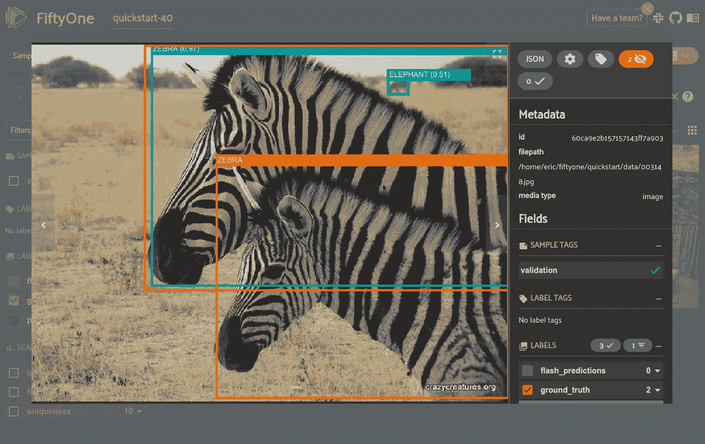
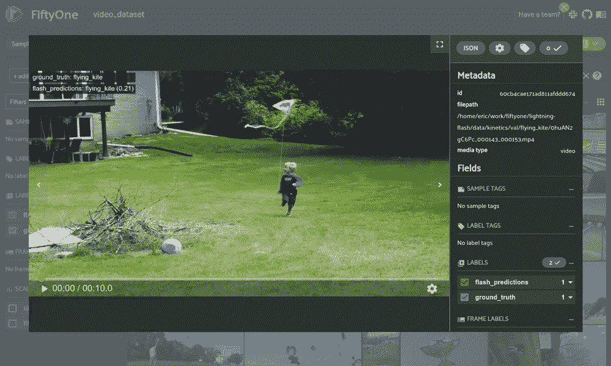
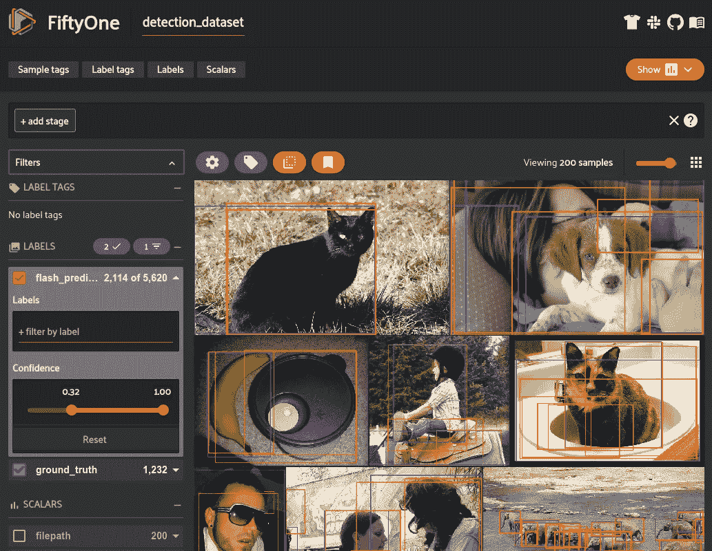
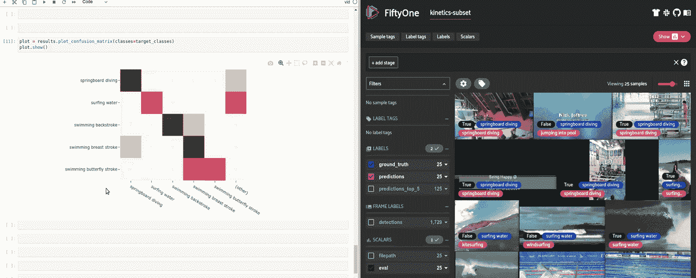
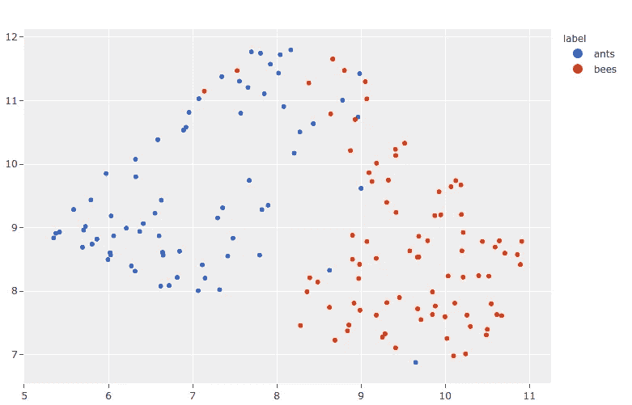

# 使用 PyTorch Lightning Flash 和 FiftyOne 快速构建计算机视觉模型

> 原文：<https://towardsdatascience.com/open-source-tools-for-fast-computer-vision-model-building-b39755aab490?source=collection_archive---------11----------------------->

## 使用开源工具 PyTorch Lightning Flash 和 FiftyOne 增强计算机视觉工作流程的指南

[](https://fiftyone.ai)

可视化 [PyTorch 闪电](https://github.com/PyTorchLightning/lightning-flash)模型预测在[五十一](https://fiftyone.ai)(图片由作者提供)

开源工具在最近几年取得了显著的进步，满足了许多与端到端平台服务相同的需求。从模型架构开发到数据集管理，再到模型培训和部署，它们都非常有用。通过充分挖掘，您可以找到一个能够支持数据和模型生命周期大部分部分的开源工具。**工具之间的紧密集成是实现近乎无缝的工作流程的最佳方式**。这篇文章深入探讨了模型原型和训练框架 [PyTorch Lightning Flash](https://github.com/PyTorchLightning/lightning-flash) 与数据集可视化和模型分析工具 [FiftyOne](https://fiftyone.ai/) 之间的新集成。

[Lightning Flash](https://github.com/PyTorchLightning/lightning-flash) 是一个建立在 [PyTorch Lighting](https://github.com/PyTorchLightning/pytorch-lightning) 之上的新框架，它提供了一系列任务，用于快速原型制作、基线、微调以及用深度学习解决商业和科学问题。尽管无论你有多少深度学习的经验，Flash 都很容易掌握，但你可以用 Lightning 和 PyTorch 修改现有的任务，找到适合你的抽象级别。为了进一步加快速度，Flash 代码是[可扩展的](https://github.com/PyTorchLightning/lightning-flash#scalability)，内置了对任何硬件上的分布式训练和推理的支持。

Flash 使得训练你的第一个模型变得非常容易，但是要继续改进它，你需要知道你的模型表现如何，以及如何改进它。 [FiftyOne](https://fiftyone.ai/) 是由 [Voxel51](https://voxel51.com/) 开发的用于构建高质量数据集和计算机视觉模型的开源工具。它为优化数据集分析管道提供了构建模块，使您能够直接使用数据，包括可视化复杂标注、评估模型、探索感兴趣的场景、识别故障模式、查找注释错误、管理训练数据集等。

借助 Flash + FiftyOne，您可以加载数据集、训练模型并分析以下所有计算机视觉任务的结果:

*   [图像分类](https://voxel51.com/docs/fiftyone/integrations/lightning_flash.html#model-training)
*   [图像物体检测](https://voxel51.com/docs/fiftyone/integrations/lightning_flash.html#model-training)
*   [图像语义分割](https://voxel51.com/docs/fiftyone/integrations/lightning_flash.html#model-training)
*   [视频分类](https://voxel51.com/docs/fiftyone/integrations/lightning_flash.html#model-training)
*   [嵌入可视化](https://voxel51.com/docs/fiftyone/integrations/lightning_flash.html#image-embeddings)

# 概观

[Flash](https://github.com/PyTorchLightning/lightning-flash) 和 [FiftyOne](https://fiftyone.ai/) 之间的紧密集成允许您执行一个端到端的工作流，加载数据集，在其上训练模型，并可视化/分析其预测，所有这些都只需要几个简单的代码块

## 将 51 个数据集加载到闪存中

虽然使用 [FiftyOne](https://fiftyone.ai/) 开发数据集一直很容易，但与 [PyTorch Lightning Flash](https://github.com/PyTorchLightning/lightning-flash) 的集成现在允许您通过将数据集直接加载到 Flash 和训练任务中来使用这些数据集。

## 培训 Flash 任务

[Flash](https://github.com/PyTorchLightning/lightning-flash) 提供了获取任务模型所需的工具，并开始使用尽可能少的代码对数据进行微调，最重要的是，不需要成为该领域的专家。

## **可视化 51 次闪光预测**

由于现代数据集的复杂性和规模，图像和视频数据的可视化始终是一个挑战。[fiftone](https://fiftyone.ai/)旨在为您的数据集和标签(包括注释和模型预测)提供一个用户友好的视图，现在可以通过 [Flash 模型](https://github.com/PyTorchLightning/lightning-flash#tasks)在一行额外的代码中访问该视图。



[Flash 视频分类预测](https://lightning-flash.readthedocs.io/en/latest/reference/video_classification.html)在[第五十一](https://fiftyone.ai/)中可视化(图片由作者提供)

# 示例工作流

## 设置

按照本文中的例子，你需要安装相关的包。首先，你需要安装 [PyTorch 闪电灯](https://lightning-flash.readthedocs.io/en/latest/installation.html)和[51](https://voxel51.com/docs/fiftyone/getting_started/install.html)。

```
pip install fiftyone lightning-flash
```

对于嵌入可视化工作流，您还需要安装降维包， [umap-learn:](https://pypi.org/project/umap-learn/)

```
pip install umap-learn
```

## 一般工作流程

使用这些工具的大多数模型开发工作流遵循相同的一般结构:

1.  [将数据集加载到第五十一个](https://voxel51.com/docs/fiftyone/user_guide/dataset_creation/index.html)
2.  从数据集创建一个 Flash 数据模块
3.  [微调任务](https://github.com/PyTorchLightning/lightning-flash#finetuning)
4.  [根据模型生成预测](https://github.com/PyTorchLightning/lightning-flash#predictions)
5.  将预测添加回数据集并[可视化它们](https://voxel51.com/docs/fiftyone/user_guide/app.html)

## 图像目标检测

本节展示了使用 PyTorch Lightning Flash 和 FiftyOne 之间的这种集成来训练和评估图像对象检测模型的具体示例。



[闪光物体探测预测](https://lightning-flash.readthedocs.io/en/latest/reference/object_detection.html)在[第五十一](https://fiftyone.ai/)中可视化(图片由作者提供)

从这里开始，您现在可以将您的预测返回到您的数据集中，并可以运行评估来[生成混淆矩阵](https://voxel51.com/docs/fiftyone/user_guide/plots.html#confusion-matrices)、 [PR 曲线](https://voxel51.com/docs/fiftyone/user_guide/evaluation.html#map-and-pr-curves)和[指标，如准确性和映射](https://voxel51.com/docs/fiftyone/user_guide/evaluation.html)。特别是，您能够[识别和查看单个真/假阳性/阴性结果](https://voxel51.com/docs/fiftyone/user_guide/using_views.html#evaluation-patches)，从而让您了解您的模型在哪些地方表现良好，在哪些地方表现不佳。基于常见的故障模式改进您的模型是开发更好模型的更可靠的方法。



[第五十一集](https://voxel51.com/docs/fiftyone/user_guide/plots.html)中的互动混淆矩阵(图片由作者提供)

## 嵌入可视化

此工作流的独特之处在于，它采用预先训练的模型，并使用这些模型为数据集中的每个图像生成嵌入向量。然后，您可以[计算这些嵌入在低维空间中的可视化效果](https://voxel51.com/docs/fiftyone/tutorials/image_embeddings.html)以找到数据的聚类。这种功能可以为硬样本挖掘、数据预注释、样本注释推荐等目的带来宝贵的发现。



借助[交互图](https://voxel51.com/docs/fiftyone/user_guide/plots.html#visualizing-embeddings)的概念，您可以点击或圈出这些嵌入的区域，并自动更新您的会话以查看和[标记相应的样本](https://voxel51.com/docs/fiftyone/user_guide/app.html#tags-and-tagging)。

## 附加任务

您可以在此查看其他任务的类似工作流程，如[分类和分段。](https://voxel51.com/docs/fiftyone/integrations/lightning_flash.html#model-training)

# 摘要

多年来，令人印象深刻的发展来自开源社区，尤其是在机器学习领域。虽然单个工具可以很好地解决特定的问题，但是工具之间的紧密集成才能产生强大的工作流。 [PyTorch Lightning Flash](https://github.com/PyTorchLightning/lightning-flash) 和 [FiftyOne](https://fiftyone.ai/) 之间的新集成提供了一种新的简单方法来开发数据集、训练模型和分析结果。

*(本帖由*[*py torch Lightning*](https://pytorch-lightning.medium.com/)*和*[*voxel 51*](https://medium.com/voxel51)*团队合作)*