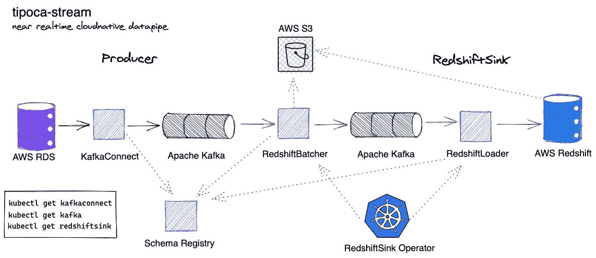
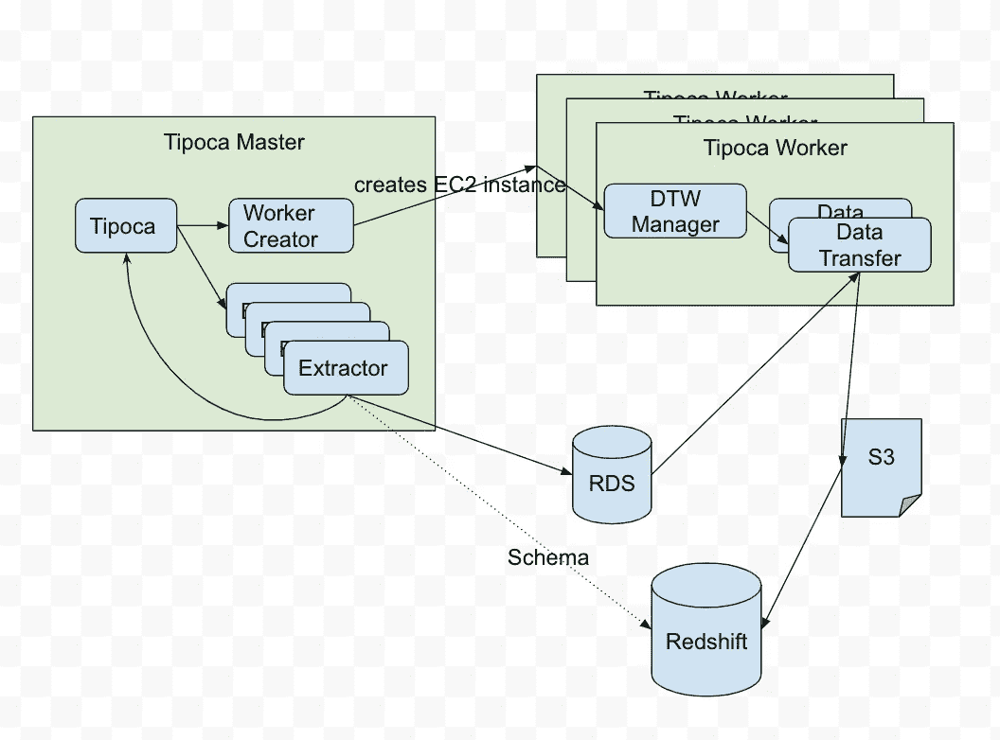
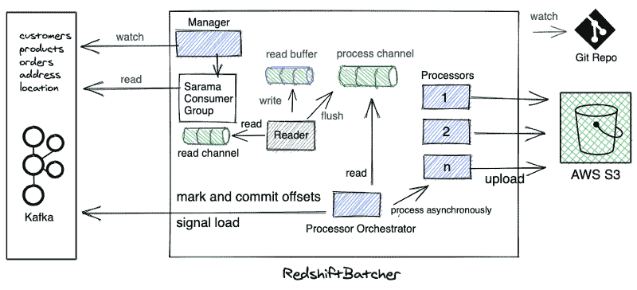
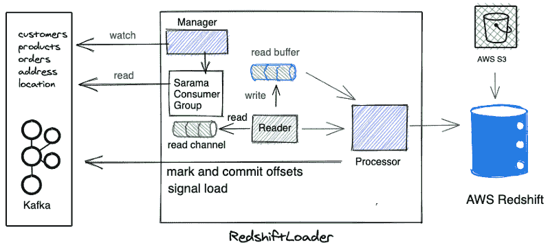
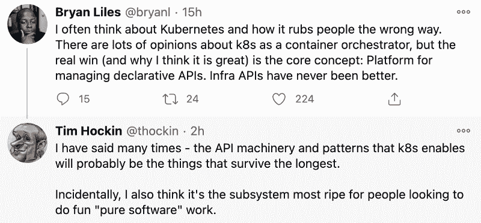
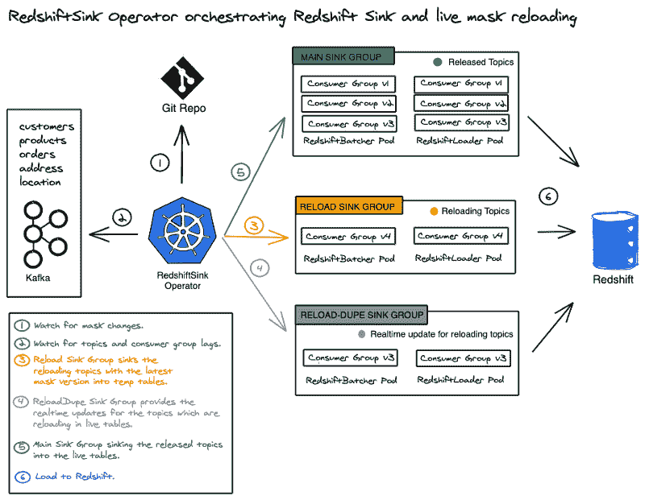
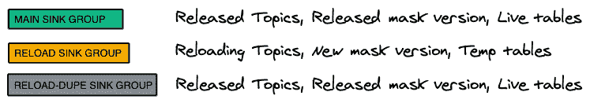
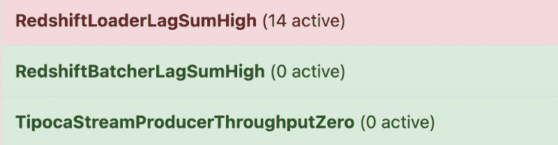
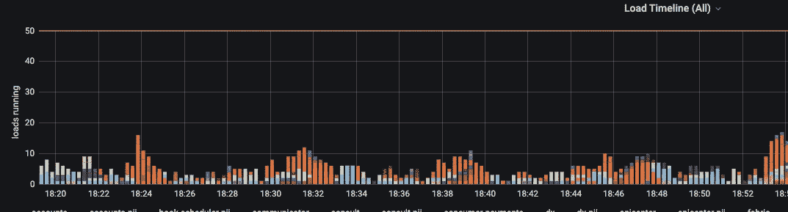
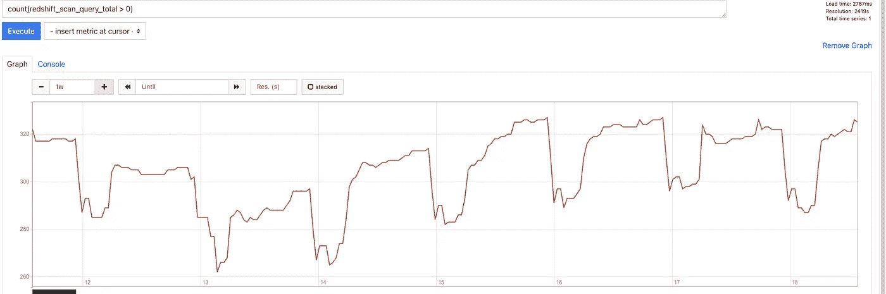

# 开源的 Tipoca 流

> 原文：<https://towardsdatascience.com/open-sourcing-tipoca-stream-f261cdcc3a13?source=collection_archive---------25----------------------->

## 以近乎实时的方式将数据从 Kafka 转换到 Redshift

在 AWS 中使用 Kafka、KafkaConnect 和 RedshiftSink 创建云原生近实时数据管道的故事。CDC + Sink。RedshiftSink 是 Practo 新推出的开源项目。它配备了一个高性能低开销的数据加载器，用于在 Redshift 中加载数据，并提供丰富的[屏蔽支持](https://github.com/practo/tipoca-stream/blob/master/MASKING.md)，以确保您能够以保护隐私的方式在您的组织中创建通用数据访问。



蒂波卡河 2021:作者图片，[来源](https://github.com/practo/tipoca-stream/blob/master/build/arch.png)

直接进入我们在 GitHub 上的[回购](https://github.com/practo/tipoca-stream)开始吧。🏊

# 背景

2015 年，我们编写了内部事务数据复制器 [Tipoca](https://starwars.fandom.com/wiki/Tipoca_City) ，用于 bootstrap Practo 的仓库。它曾经在 PII 屏蔽支持下将数据从我们的事务数据库复制到 Redshift。它每天晚上刷新数据，应用最新的掩码配置进行完整的重新创建。Practo 的每个人第一次能够访问所有数据，并能够在保护客户隐私的同时连接不同系统的数据。

当时，构建分布式系统需要大量的工作。我们构建了一个具有不同流程的系统，跨多个工作人员运行，并通过重试来管理他们的协调。在开源技术和工具的帮助下，构建分布式系统已经变得越来越容易。这是蒂波卡的样子:



2015 年蒂波卡:作者图片

# 超越蒂波卡的动力

1.  实时数据分析。
2.  更快的红移查询。大批量负载占用红移资源。同步数据的需要不同。
3.  数据驱动的产品。
4.  每天重新创建数据是不可扩展的，而且成本高昂。
5.  移除对 RDS 读取副本的分析依赖。

这导致了蒂波卡流的诞生，结束了蒂波卡 5 年的运行。

# 引入蒂波卡流

2020 年 7 月，我们开始讨论迁移到 [CDC](https://en.wikipedia.org/wiki/Change_data_capture) 平台的计划。这个想法是将运行在 RDS 上的事务数据库中的数据以近乎实时的方式传输到 Redshift。我们选择卡夫卡主要有两个原因——第一，卡夫卡是开放的；第二，它周围有很好的数据生态系统。


蒂波卡流 2021:作者图片，[来源](https://github.com/practo/tipoca-stream/blob/master/build/arch.png)

第一部分(CDC)是开源的。我们使用 [Debezium](http://debezium.io) 将 RDS 流写入 Kafka。 [Strimzi](https://strimzi.io) 有开源的 **KafkaConnect** 和 **Kafka** 作为 **Kubernetes CRDs。**

```
kubectl get kafka
kubectl get kafkaconnect
kubectl get kafkaconnector
```

在卡夫卡中，我们使用 AVRO 以紧凑的二进制格式存储数据。AVRO 很快，使用 AVRO，您可以在模式注册中心定义和存储数据模式。[这是我们使用的模式注册中心的接口](https://github.com/practo/tipoca-stream/blob/22ba8370550891e8b64c667785136e51b603fb38/redshiftsink/pkg/schemaregistry/schemaregistry.go#L12-L19)。

RedshiftSink 解决了第二部分。它将数据从卡夫卡主题下沉到红移。它有丰富的[屏蔽](https://github.com/practo/tipoca-stream/blob/master/MASKING.md)支持，并支持所有模式迁移。

眼睛多了软件更好！我们对开源红移链接感到兴奋。它可作为 Kubernetes 红移链运营商。🎉

```
kubectl get redshiftsink
```

你**可以直接跳转到 GitHub 上的** [repo 来自己尝试一下。请继续阅读，理解下面实现的核心概念。](https://github.com/practo/tipoca-stream)

# 核心组件

# **红移追踪器**

RedshiftBatcher 从 Kafka 读取数据，对其进行屏蔽，然后以微批处理的形式上传到 S3。然后，它向红移加载器发送信号，将这些批次加载到红移。

**为什么要在流媒体平台上批量？**

Redshift 擅长使用 [COPY](https://docs.aws.amazon.com/redshift/latest/dg/r_COPY.html) 命令快速摄取数百万条记录。每个文件副本都有开销，因此需要在文件数量和每个文件中的记录数量之间取得平衡。这就是为什么我们要小批量复制。您可以使用 maxSizePerBatch 和 maxWaitSeconds 来控制这些。

```
spec:
  kafkaTopicRegexes: "db.inventory.*"
  batcher:
    sinkGroup:
      reload:
        maxReloadingUnits: 2
        maxSizePerBatch: 10Mi
        maxWaitSeconds: 30
```



图片作者，[来源](https://github.com/practo/tipoca-stream/blob/master/build/arch-batcher.png)

每一个话题都是一张桌子，都有自己的卡夫卡消费群体。批处理程序中的每个主题都会发生以下情况:

*   管理器例程创建并优雅地关闭使用者组。
*   萨拉马消费者团体关注卡夫卡主题，并用新信息填充阅读频道。
*   读取器将收到的消息写入读取缓冲区。
*   当达到批处理大小或时间过去时，读取器将批处理刷新到进程通道。缓冲通道用于分离消息的接收和处理。
*   Orchestrator 例程使多个批处理并发进行。当处理完成时，它向 Kafka 发送这些批次的加载信号。
*   提交给 Kafka，将偏移标记为已处理。

**配料员的职责:**

*   **转换:**将批处理中的每个 Debezium 消息转换为 Redshift 可加载格式。我们分叉并改变了开源的[红移](https://github.com/practo/tipoca-stream/tree/master/redshiftsink/pkg/redshift)库，将所有与红移的通信作为这个库的一部分。我们用两个附加字段注释每个消息:operation 和 kafka-offset。在加载到 Redshift 之前，RedshiftLoader 使用这些字段执行合并操作。
*   **面膜:**面膜一直是我们最重要的需求。默认情况下，从 RDS 到红移的数据被完全屏蔽，除非开发人员指定不屏蔽它。未屏蔽的配置作为文件保存在 GitHub 中。按照 GitHub Pull 的要求，开发人员和分析师指定不要屏蔽什么。一旦安全工程师审查并批准了更改，RedshiftSink 操作人员就会负责将这些掩码更改应用到红移。第一次接收中的 RedshiftBatcher CPU 要求也很高，因为它必须进行屏蔽处理。这里有[改进](https://github.com/practo/tipoca-stream/issues/173)的空间。以下是屏蔽功能，详情请查看[和](https://github.com/practo/tipoca-stream/blob/master/MASKING.md)。
*   **上传批处理到 S3** :一旦转换完成，我们在 S3 上传批处理。批量写入是一个幂等操作，因此批量的重新处理不成问题。但是我们会优雅地关闭，重新处理的机会非常少。很少见，因为 Kafka 的提交是异步的，以保持批处理的速度。
*   **信号:**对于主题 db.inventory.customers，批处理器读取来自该主题的消息，处理数据并上传到 S3。然后，它在主题 loader-db.inventory.customers 中添加一个作业，由 RedshiftLoader 读取该作业以在 Redshift 中加载批处理。下面是作业模式:

```
var JobAvroSchema string = `{
    "type": "record",
    "name": "redshiftloader",
    "fields": [
        {"name": "upstreamTopic", "type": "string"},
        {"name": "startOffset", "type": "long"},
        {"name": "endOffset", "type": "long"},
        {"name": "csvDialect", "type": "string"},
        {"name": "s3Path", "type": "string"},
        {"name": "schemaId", "type": "int"},
        {"name": "maskSchema", "type": "string"},
        {"name": "skipMerge", "type": "string", "default": ""}
    ]
}`
```

# 红移装载机

RedshiftLoader 将已处理的批处理从 S3 加载到红移。

RedshiftLoader 监视批处理程序编写的主题。由于红移连接有限，因此使用尽可能少的加载程序执行加载非常重要。在单个加载器 pod 中，我们在所有加载器例程之间共享红移连接。

```
spec:
  loader:
    redshiftGroup: non_pii
    redshiftSchema: inventory
    sinkGroup:
      all:
        maxSizePerBatch: 1Gi
```



图片作者，[来源](https://github.com/practo/tipoca-stream/blob/master/build/arch-loader.png)

你通过`maxSizePerBatch`指定加载多少！

加载程序希望批中的每个消息都具有相同的模式。如果批处理程序为消息找到了新的模式，它将负责刷新现有的批处理。

Debezium 和 RedshiftBatcher 都将模式存储在模式注册表中。当需要获取模式相关信息时，批处理程序和加载程序都会与模式注册中心进行对话。

**装载机的职责**

*   **模式迁移:**开发团队随着他们的代码发布不断地改变 RDS 模式。我们需要使红移模式与 RDS 中发生的模式变化保持同步。因此，我们编写了一个模式迁移器。通过读取批处理中的第一条消息，加载程序判断是否需要执行模式迁移。它通过从作业负载中提取 schema-id 来实现这一点。然后，它从模式注册表中获取模式信息，并使用该信息构建一个输入红移表。然后将输入红移表与红移中的实际表进行比较，并决定模式迁移策略。Redshift 并不支持所有的 SQL 迁移命令，例如，它们只支持很少的 ALTER 命令。第一个策略是尝试就地迁移，如果第一个策略不可行，我们重新创建完整的表并替换它。第二个策略对于大牌桌来说非常耗时。我们计划将大模式迁移从 RedshiftLoader 中移除，并让操作者执行大模式操作。
*   **合并加载:**如前所述，复制是向红移添加数据的最有效方式。但是单独复制只能做插入。因此，我们需要使用阶段表的合并技术来执行红移中的更新。YELP 红移连接器[文章](https://engineeringblog.yelp.com/2016/10/redshift-connector.html)和 [AWS 文档](https://docs.aws.amazon.com/redshift/latest/dg/merge-examples.html)对使用这种技术有很好的解释。虽然 YELP 的文章很有帮助。

# **红移链操作符**

Kubernetes 操作员帮助将编排和操作交由操作员完成。谢谢 Kubernetes！

```
kubectl get deploy redshiftsink-operator
```



图像[来源](https://twitter.com/kelseyhightower/status/1298343780307755008?s=20)

我们使用 Kubernetes [声明式 API](https://github.com/kubernetes/community/blob/master/contributors/design-proposals/architecture/resource-management.md#the-kubernetes-resource-model-krm)解决了以下问题:

1.  真人面具重装。
2.  用户得到一个简单干净的 API。

该操作符帮助我们管理表的第一时间槽，并在更新掩码配置时帮助我们在 Redshift 中重新加载表。

操作员帮助我们解决上述用例，但不是强制性的。您可以安装批处理程序和加载程序，并以任何可能的方式运行它们。Kubernetes 不是强制的！

# 实时蒙版重装

掩码更改需要用新的掩码配置重新创建表。



图片作者，[来源](https://github.com/practo/tipoca-stream/blob/master/build/arch-operator.png)

下面我们用一个例子来了解一下真人蒙版重装。在本例中，我们正在接收与 regex: db.inventory.*匹配的主题

```
apiVersion: tipoca.k8s.practo.dev/v1
kind: RedshiftSink
metadata:
  name: inventory
spec:
  kafkaTopicRegexes: "^db.inventory*"
  batcher:
    mask: true
    maskFile: ["](https://github.com/practo/tipoca-stream/blob/master/redshiftsink/pkg/transformer/masker/database.yaml)[database.yaml](https://github.com/practo/tipoca-stream/blob/master/pkg/transformer/masker/database.yaml)"
  loader:
    redshiftSchema: "datawarehouse"
    redshiftGroup:  "nonpii"
```

Batcher 屏蔽了它从 Kafka 读取的所有数据。用户在 GitHub 中指定不要屏蔽什么(非 PII)，在本例中是 [db.yaml](https://github.com/practo/tipoca-stream/blob/master/redshiftsink/pkg/transformer/masker/database.yaml) 。为了简单起见，让我们假设 db.yaml 的掩码版本在每次更改时都以 v1、v2、v3…递增。

**什么是 SinkGroup？**

该运算符通过创建 SinkGroup 来执行 sink 到红移。SinkGroup 是一组 RedshiftBatcher 和 RedshiftLoader 吊舱。

构成接收器组的三个参数是 1)由该组处理的主题，2)使用的掩码版本，以及 3)目标红移表。例如，customers 是主题 db.inventory.customers 的目标表，customers_ts_reload 是临时表。



图片作者，[来源](https://github.com/practo/tipoca-stream/blob/master/build/sinkgroup.png)

```
I0218 10:24:21.226806 status.go:229] rsk/inventory allTopics:   126
I0218 10:24:21.226827 status.go:230] rsk/inventory diffTopics:  6
I0218 10:24:21.226832 status.go:231] rsk/inventory released:    120
I0218 10:24:21.226837 status.go:232] rsk/inventory reloading:   6
I0218 10:24:21.226838 status.go:233] rsk/inventory reload-dupe: 6
I0218 10:24:21.226848 status.go:234] rsk/inventory realtime:    0
```

在第一次创建 RedshiftSink 资源时，操作符将所有主题分配给 Reload SinkGroup，后者开始将掩码版本为 **v1** 的数据加载到红移临时表中。

与此同时，操作员持续监控正在重新加载的主题的消费者群滞后。当 lag 满足规范中指定的发布条件时，它将重载主题标记为实时。

当操作员发现主题已经到达实时时，它重新配置所有的 SinkGroups 以停止接收实时主题并尝试释放它们。

**什么是发布？**

Release 是 Redshift 中的操作符在激活实时表时执行的一组操作。

1.  用实时临时表替换当前的实时表。
2.  对指定的红移组运行模式授权。
3.  将发布的主题移动到主 SinkGroup。

**当一个新列需要在表格中取消屏蔽时会发生什么？**

这需要使用新的掩码配置重新创建该表。

如上所述，所有事情都发生在第一次接收时，唯一的区别是:我们用旧的掩码配置提供对当前活动表的更新，直到用新的掩码配置完成表的完全重新加载。是用`ReloadDupeSink`组完成的。我们这样做是因为重新加载一个大表需要时间，在此期间，我们仍然希望当前活动的表得到实时更新。一旦表被释放，操作员就通知用户松弛状态的释放。


slack bot 通知用户发布:作者图片

**什么是部署单位？**

```
batcher:
  sinkGroup:
    reload:
      maxReloadingUnit: 20
      deploymentUnit:
        podTemplate:
          resources:
            requests:
              cpu: 3
              memory: 3Gi
            limits:
              cpu: 3
              memory: 3Gi
```

批处理单元需要更多的 CPU 来快速处理大表。要以每秒 80k 条消息的速度处理消息，需要将近 3 个 CPU 内核。在第一个水槽完成后，表已经达到实时，所需的资源非常少，对我们来说是 500 万。这就是我们有`sinkGroup`规格的原因。使用它，您可以为所有三个 sinkGroups 指定不同的 pod 资源。

```
maxReloadingUnit 20
```

reload sinkGroup 为每个主题运行一个单元(pod)。但是 main 和 reloadDupe sinkGroups 将所有主题作为一个单元(pod)一起运行。假设一个数据库有 1000 个主题，我们不会一起重新加载所有的主题，但是我们会首先处理最大 maxReloadingUnit 个具有最短延迟的主题。

# 挑战

Redshift 是一个强大的分析工具，但是要很好地使用它，很多事情都需要正确处理才能达到最佳性能。

*   设置正确的排序和 DIST 键。
*   清空表以保持排序，并回收未使用的磁盘块。
*   最佳利用节点片实现高效拷贝。决定文件的大小和文件的数量，以便进行有效的复制。
*   在复制期间最小化 s3 对文件的查找。
*   使用正确的压缩。

在我们将大约 50%的数据库转移到实时数据库之后，表延迟开始超过阈值。

🤖:您有一个传呼机值班警报！📟 🔥



普罗米修斯对提波卡流的警告:作者图片

所以我们开始测量。我们添加了加载持续时间、加载频率(时间线)、加载速度等指标。[这些](https://github.com/practo/tipoca-stream/blob/master/REDSHIFTSINK.md#metrics-1)可作为普罗米修斯指标。

致力于压缩、节点片利用率、保持 s3 查找率较低，我们已经解决了许多负载瓶颈。我们现在**以>2mb/秒**的速度加载，从大约 100 kb/秒开始跳跃，并设置了正确的默认值，让每个人都从中受益。

AWS 继续在每个版本中改进红移。像自动分拣键，自动 DIST 键，自动真空释放是伟大的！但我们期待更多:)



加载时间轴:按作者排序的图像

[**最大的挑战是保持**](https://stackoverflow.com/questions/67278497/stream-many-tables-in-realtime-to-redshift-bottleneck-parallel-concurrent-load)**1000 个表的滞后红移<10 分钟，同时发生许多并发负载。我们有 1000 多个红移表，但我们一天使用的不超过 400 个。这就是我们现在在需要时为未使用的表调节负载的原因。这个特性确保了正在使用的**表总是接近实时**并且保持红移负担较小。这非常有用。**

**期待[红移 AQUA](https://www.youtube.com/watch?v=EOwg8NwZKkI) 在孟买发布。**

****

**count(redshift _ scan _ query _ total)> 0，给出正在使用的表的总数！:作者图片**

****节流是如何工作的？****

**按照[此](https://github.com/practo/tipoca-stream/blob/master/REDSHIFTSINK.md#enable-redshiftsink-exporter-optional-recommended)启用节流。它是这样工作的:**

*   ****首先，确定正在使用的表:**我们导出红移 STL_SCAN 为普罗米修斯度量`redhshift_scan_query_total` **。如果扫描查询总数大于零，我们认为表正在使用中。扫描查询表对最近 X 天的视图的查询，以确定该表是否在使用中。****
*   ****然后，根据表的用法节流:**接下来，我们在红移中只允许 10 个并发加载。如果表在使用中，我们从不节流，总是加载它。否则，如果需要的话，我们会将表负载限制到最大 1 小时。如果表在这 1 小时的限制窗口内被访问，我们就直接让它实时访问。**

**现在，我们已经成功地将大部分数据库转移到实时数据库，一切都很顺利！**

****

**从我们的仓库滞后仪表板:作者图片**

**通过开源这个项目，我们希望回馈社会。期待向大家学习，并与大家合作，继续做得更好。**