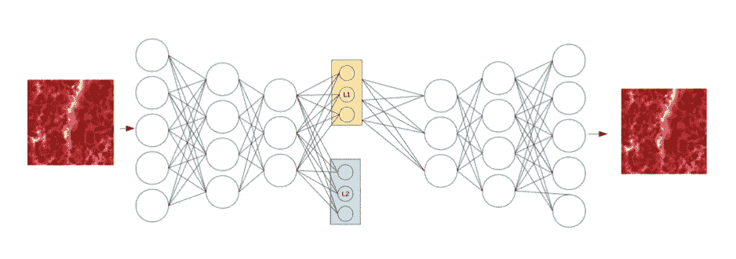

# OpenAI CURL:强化学习遇上无监督学习

> 原文：<https://towardsdatascience.com/openai-curl-reinforcement-learning-meets-unsupervised-learning-b038897daa30?source=collection_archive---------52----------------------->

## 通过对比无监督表示促进强化学习。

[Unsplash](https://unsplash.com?utm_source=medium&utm_medium=referral) 上 [AltumCode](https://unsplash.com/@altumcode?utm_source=medium&utm_medium=referral) 拍摄的照片

> [CURL](https://arxiv.org/pdf/2004.04136.pdf) 在 DeepMind Control Suite 和 Atari Games 中的复杂任务上，无论是基于模型还是无模型，都优于之前基于像素的方法，在 100K 环境和交互步骤基准测试中分别表现出 1.9 倍和 1.2 倍的性能提升。CURL 是第一个在 DMControl 和 Atari 中的大量基于像素的连续和离散控制任务中，通过对无模型 RL 代理使用对比自我监督学习目标，显示出显著数据效率增益的模型。

由阿拉温德·斯里尼瓦斯、迈克尔·拉斯金和皮特·阿贝耳在[卷曲](https://arxiv.org/pdf/2004.04136.pdf) [1]

加州大学伯克利分校的研究人员在他们最新的论文 [CURL](https://arxiv.org/abs/2004.04136) 中，在强化学习的样本效率方面取得了令人印象深刻的进步。对比损失用于从高维数据中学习表示。[2]

我一直是无监督学习及其推动其他类型机器学习潜力的粉丝(这是基于我的[论文](/unsupervised-pathology-whole-slide-image-slides-segmentation-34cd7a50ba6c))。此外，我将展示使用无监督学习和多任务学习的力量。

对比学习是关于区分彼此的例子，而不是将猫图像的表示推向一个零类标签向量。损失促使表示与同一猫图像的裁剪相似，并且尽可能与数据集中的其他图像不相似。

一开始我对对比学习有点怀疑，但现在看到它被用在许多伟大的论文中，如这篇文章、 [CLIP](/open-ai-clip-learning-visual-concepts-from-natural-language-supervision-d02644969278) 、 [MoCo](https://arxiv.org/abs/1911.05722) 、 [SimCLR](https://arxiv.org/abs/2002.05709) 以及许多其他论文，我开始意识到它的真正潜力。

## CURL 想解决什么问题？

强化学习正受到模拟世界中存在的数据量的限制。即使 GPU 加速器和数据存储设施有了巨大的改进，输入数据处理仍可能是强化学习的瓶颈。

来源: [SnappyGoat](https://snappygoat.com/free-public-domain-images-sphere_construction_architecture_668463/6_wWoHoNrUvmK1xcNpkNIvw1XFzBJgQPVYDc_IvmYff18A.html#,0,0.f2be3b1a6ad20ea6b7a3d1c2b47867fe6564b408) (CC 许可)。处理高维空间可能相当复杂。

CURL 试图提高在极高维空间中操作的强化学习技术的相同效率。这使得强化学习方法能够模拟更真实的世界。此外，CURL 被设计得足够通用，使得它可以被插入到任何基于从高维图像学习表示的 RL 算法中

## CURL 是如何工作的？

> 我们的工作属于第一类模型，它使用辅助任务来提高样本效率。我们的假设很简单:如果一个智能体从高维度的观察中学习到一个有用的语义表示，建立在这些表示之上的控制算法应该具有更高的数据效率

由阿拉温德·斯里尼瓦斯、迈克尔·拉斯金和皮特·阿比尔在[科尔](https://arxiv.org/pdf/2004.04136.pdf) [1]

辅助任务是与主要学习目标同时学习的附加任务，并且产生更一致的学习信号。

照片由[瓦希德·赫内](https://unsplash.com/@wahidkhene?utm_source=medium&utm_medium=referral)在 [Unsplash](https://unsplash.com?utm_source=medium&utm_medium=referral) 上拍摄

流水线从产生一批转换的“重放缓冲器”开始。重播缓冲区的一个很好的例子是用于训练 RL 算法玩游戏的视频。对于每个转换，应用数据扩充算法来产生“关键字”和“查询”。直观上，你可以把它想成一个字典查找问题(这是对比学习的基础)。

之后，通过两个独立的编码器对密钥和查询进行编码。两个编码器将它们的结果提供给无监督算法，而只有关键编码器将它们提供给强化学习算法。多么不寻常的机器学习管道啊！

如果你不熟悉这项技术(并行训练两种不同的方法)，这叫做多任务学习。CURL 使用多任务学习来进一步构建损失函数，并学习从图像帧的高维堆栈到低维表示的映射

图片由作者提供。一个多任务学习系统的例子

设计多任务学习系统并不简单(这来自经验)。通常，当你设计这些多任务学习系统时，你必须考虑到不同的梯度会将重量拉向所有这些不同的方向。幅度可能真的不同，您可能需要用一些额外的超参数来缩放它们。

但是 CURL 的一个有趣的特点是，作者没有提到必须做大量不同的高参数搜索或梯度加权来使这个系统工作

此外，CURL 通过添加利用对比学习的新损失函数来修改 RL 算法。这个损失函数使用了查询和关键字的概念。

为了指定这个新的损失函数，必须有[1]:

> 1.鉴别目标(把它想象成用于对比样本的锚)
> 
> 2.生成查询键观察的转换
> 
> 3.将观察值转换成查询和关键字的嵌入过程
> 
> 4.内积被用作对比损失中查询-关键字对之间的相似性度量。

由 Aravind Srinivas、Michael Laskin 和 Pieter Abbeel 在 [CURL](https://arxiv.org/pdf/2004.04136.pdf) 拍摄。[1]

## **最后的想法:**

> CURL 是大多数(6 个中的 5 个)DMControl 环境中最先进的基于图像的 RL 算法，我们根据现有的基于像素的基线对其进行了采样效率基准测试。在 DMControl100k 上，CURL 的中值性能比领先的基于模型的方法 Dreamer (Hafner 等人，2019 年)高 1.9 倍，数据效率高 4.5 倍。

由阿拉温德·斯里尼瓦斯、迈克尔·拉斯金和皮特·阿贝耳在[卷曲](https://arxiv.org/pdf/2004.04136.pdf)拍摄。[1]

我确信 CURL 有一些局限性，但是看到独特的方法被一起使用(比如对比学习和多任务学习)来达到一个新的艺术水平总是很棒的。

我希望解释清楚，不要太专业。如果你对更多细节感兴趣，我建议在这里查看原始论文[或在这里查看代码](https://arxiv.org/pdf/2004.04136.pdf)。此外，感谢亨利·艾实验室为我写这篇文章提供了很好的解释。

如果你想定期收到关于人工智能和机器学习的最新论文的评论，请在这里添加你的电子邮件并订阅！

[https://artisanal-motivator-8249.ck.page/5524b8f934](https://artisanal-motivator-8249.ck.page/5524b8f934)

**参考文献:**

[1] CURL:用于强化学习的对比无监督表示。阿拉文·斯里尼瓦斯、迈克尔·拉斯金和彼得·阿贝耳。2020.

[2] CURL:用于强化学习的对比无监督表示。[亨利·艾实验室](https://www.youtube.com/channel/UCHB9VepY6kYvZjj0Bgxnpbw)