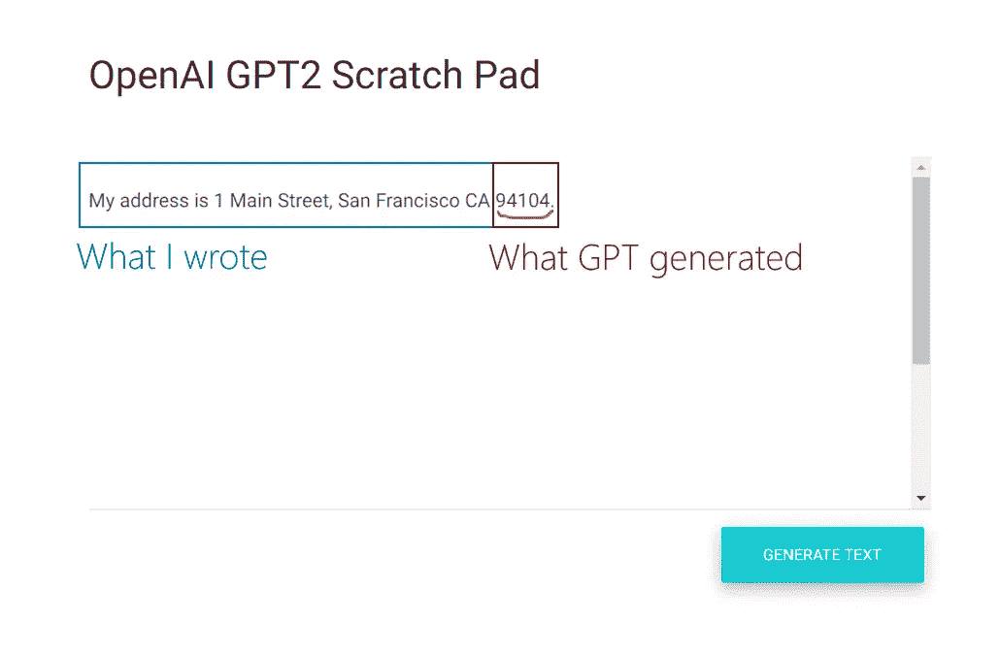
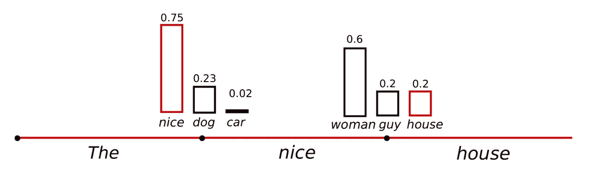
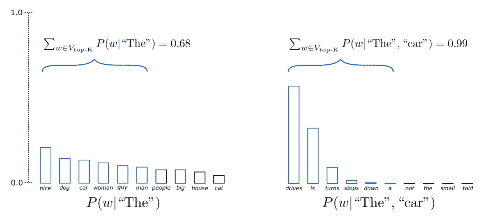
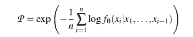

# 开放 GPT 泄露你的数据

> 原文：<https://towardsdatascience.com/openai-gpt-leaking-your-data-2dfb9e22c1b2?source=collection_archive---------25----------------------->

汤姆·索多吉在 [Unsplash](https://unsplash.com?utm_source=medium&utm_medium=referral) 上的照片

## 我们如何从 GPT-2 中提取数据？

**第一部分:了解泄露 GPT-2 训练数据的方法**

在这一系列围绕 GPT 的语言模型中，我们将重点阐述[从大型语言模型中提取训练数据](https://arxiv.org/abs/2012.07805)

## **论文目标**

作者想证明他们可以从诸如 GPT-2 这样的语言模型中提取逐字数据。更有趣的是，他们解释说，他们可以从模型本身中逐字提取在训练数据中只出现过几次的内容。当然，如果你拥有一家公司，并且你正在使用客户的数据来训练一个语言模型，这可能是非常危险的。

> 用他们自己的话说，“该论文证明(…)，对手可以通过查询语言模型来执行训练*数据提取攻击*以恢复单个训练样本。”

谁愿意冒泄露私人信息的风险？

这听起来确实非常可怕。让我们来理解作者是如何攻击 GPT-2 并表面“记忆”数据的。为此，我们将遵循原始文件的流程，并注释掉任何感兴趣的元素。

首先，让我们定义什么是语言模型。

## **什么是语言模型？**

浅层定义在于将语言模型视为能够推断给定一系列标记的下一个单词的条件概率分布的模型。例如，如果输入的一系列记号是“ ***这只猫正在吃一只*** ”，那么 *LM* 的目标是正确推断词汇表中所有可能单词的概率分布。我们想让 *LM* 做的是给像“ ***骨*** ”、“ ***猫*** ”等词分配一个大的可能性。任何狗能吃的东西。同样，它应该给像“ ***汽车*** ”、“ ***月亮*** ”这样与狗能吃什么没有关系的词分配一个低可能性。

既然我们理解了什么是语言模型，我们可以继续阅读这篇介绍了许多有趣概念的文章。在此之前，我们需要强调作者的目标。作者声称他们可以提取数据，并对他们可以提取的数据类型做了一些具体说明。为了理解这一点，我们需要说服自己，提取一些非常普通的东西，如“*巴拉克·奥巴马是美国总统*”，并不是很有趣。相反，我们的目标是在训练数据中不常见的实体，秘密实体。这就是有趣的事情开始的地方！

> 用他们自己的话说，“我们的攻击是可能的，即使上面的每个序列都包含在训练数据的**一个文件**中”。

## **什么是语言模型记忆？**

在阅读这篇论文之前，我不知道如何定义一个模型如何“记忆”一些东西，以及记忆具体指的是什么。从某种程度上来说，从人类的角度来看，记忆只是一种对过去已经看到的元素进行推断的能力，并且在推断的时候，就在现在。换句话说，如果你把你的脑力仅仅当作一本字典，那么你纯粹是在调用你的记忆，因为你不是在看每一句话的模式。

传统上，在 ML 中，我们的目标模型能够在与训练数据“相似”的数据上进行推断，但不能“完全”作为训练数据。因此，对一个模型的记忆可以被看作是负面的。

现在，根据作者的说法，在语言建模中有许多方法来定义记忆。作为一个例子，他们展示了从 GPT-2 的邮政编码推断，这显然是记忆是一些抽象的形式。他们进一步形式化了对'**记忆**的定义，以便将其限制在被认为是“非预期”的情况下，例如客户数据。如果像我一样，下图似乎不能描述“记忆”的情况，让我为你澄清一下。从本质上来说，我们可以把“记忆”看作是缺乏基于训练期间所学的现有模式的推理。该模型在旧金山有很多地址的可能性很小，因此它不是基于学习的模式进行推理，而是基于某种形式的“记忆”。

GPT-2 推断一个有效的邮政编码给定一个地址在三藩市。[自己试试吧！](https://github.com/NaxAlpha/gpt-2xy)

意识到难以定义记忆对一个 ML 模型意味着什么，作者介绍了一些关键概念。第一个是关于 k-Eidetic 记忆法。

> **定义 2(k-本质记忆):**一个字符串 s 被一个 LM fθ记忆(对于 k ≥ 1)如果 s 可从 fθ提取且 s 出现在训练数据 x 中至多 k 个例子中:|{x ∈ X : s ⊆ x}| ≤ k

这一点非常重要，因为我们之前解释过，我们对普通的句子不感兴趣。换句话说，当 *k* 很大时，比 k 很小时危害小。实际上，直觉上，人们不应该期望在训练数据的许多示例中出现客户地址。另外，值得一提的是，对于任何一个 *k，*记忆较长的字符串 *s* 应该比较短的更有害。

> **注**:您可以将 k 值较低的 k-Eidetic 视为异常，对于这种异常，模型将很难找到与其他数据观察结果相结合的模式。换句话说，那些 k 低的 k 本质的例子，很可能是输入空间中的孤立点。

## 👀正式的攻击目标是什么？

既然我们已经介绍了记忆的关键概念，我们可以正式介绍作者攻击的目标。对手的目标是从模型中提取记忆的训练数据。人们可以通过特定提取的字符串的私密性来衡量攻击的强度。这与上面定义中的 *k* 的值相关联。根据我们之前的评论，“更强的攻击总共提取更多的示例和具有更低的 *k 值的示例”。*

这里，理解作者想要不加区别地提取训练数据而不特别关注数据的任何子集是很重要的。

作者本质上对找出任何能被 LM 记住的东西感兴趣。为此，他们把重点放在了 GPT-2 上。

# 🦊作者选择了什么方法来泄露 GPT 2 号的数据？

作者采用了两步走的方法:

1.  他们通过 top-n 采样由 GPT-2 生成文本。
2.  他们预测哪些输出包含记忆的文本。

首先，让我们关注步骤 1，该步骤包括应用 top-n 采样。

首先，当 GPT-2 生成新的标记时，我们记得它在给定输入字符串的情况下，对词汇表中可能的下一个标记使用概率分布。这个概念可能会令人困惑，这里我们可以利用来自 huggingface 的 Patrick von Platen 的精彩解释，他为我们提供了自动回归语言生成的清晰示例。

实际上，取样只是众多方法中的一种。下面显示了一个例子，其中在得到作为输入的令牌“*”之后，通过迭代采样，自回归生成的输出是“***【The nice house***”。*

**

*GPT-2 可以根据相关概率生成{“尼斯”、“狗”、“汽车”}中给定“该”的任何单词。一旦我们基于它们的概率从先前的集合中取样，我们就得到“好的”。现在，我们有了“好的”作为输入。GPT-2 然后确定在这个简化的集合中可能的记号的可能性(“女人”、“男人”、“房子”)。然后我们可以随机抽取一个令牌，得到“房子”。来自帕特里克的[篇](https://huggingface.co/blog/how-to-generate)。*

*自然，当基于标记的概率分布对词汇表进行随机采样时，会出现问题。例如，可能最终生成不期望的标记，尤其是在概率分布具有“接近”概率的相当“接近”的候选的设置中。解决这个问题的一个想法是过滤掉低可能性预测的标记。这就是[范等人提出的 top-n 抽样(通常称为 Top-K 抽样)所采取的方向。铝(2018)](https://arxiv.org/pdf/1805.04833.pdf) 。*

**

*上述策略在采样阶段只保留蓝色令牌，过滤掉黑色令牌。我们看到，它成功地在第二个采样步骤中排除了相当奇怪的候选对象(“not”、“the”、“small”、“told”)。摘自帕特里克的[篇](https://huggingface.co/blog/how-to-generate)。*

*现在我们更好地理解了 Top-n 采样指的是什么，让我们回到作者的策略。对于每次试验，他们通过 top-n 采样生成 256 个令牌。论文中给出的图表反映了设置为 200，000 的一些试验。换句话说，他们**通过 top-n 采样从 GPT-2 生成 200，000 个字符串**。*

> *“我们希望通过根据模型分配的可能性进行采样，我们将对模型认为“非常可能”的序列进行采样，并且可能的序列对应于记忆的文本。具体来说，我们使用 top-n 策略对每次试验的 256 个令牌进行精确采样。”*

*从那些 **20 万个**样本中，他们只关注那些困惑度较高的。人们可以把一个序列的迷惑性看作是“LM*预测该序列中的记号有多好”的度量。换句话说，就像作者解释的那样，对于那些复杂度较低的序列，该模型对该序列并不感到非常“惊讶”,并且平均而言已经为序列中的每个后续标记分配了高概率。**

**

*序列 x1，…，xn 的迷惑性*

*现在，为什么他们认为“极有可能”的序列对应于记忆的文本？*

*嗯，正如我们在上面看到的，困惑与每个标记被预测的可能性有关，给定过去的标记。对于那些低复杂度的过滤序列，该模型已经找到了具有高可能性的下一个记号。因此，在这种情况下，模型对预测非常有信心，这当然意味着它在训练期间已经看到了非常相似的一系列标记(过去的标记+新的标记)。*

*作者随后解释说，如果你只是对最有可能的序列进行采样和过滤，这实际上并不起作用，因为你最终会获得 k 值很大的 k-eidetic 内容。例如，他们最终会获得数百份 Vaughn Live 的记忆用户指南副本。类似地，他们最终获得了麻省理工学院公共许可证的完整文本，这是 github 上的一个流行文本文件。*

> *“(…)在我们生成的 200，000 个样本中，有数百个是记忆的沃恩 Live 用户指南的副本。”*

**

*沃恩直播，一个流媒体网站。GPT-2 的攻击用上述方法拉它的用户指南。*

*第二个问题是，这种攻击得到的内容“被分配了高可能性(低困惑度)，但那是**没有记住的**”。那些都是误报。正如作者解释的那样，大多数误报包含“重复的”字符串。*

*值得知道的是，即使重复串出现在同一系列的记号中的这种例子是极不可能的，并且因此在训练数据中未被充分表示，“大的 LMs 经常错误地将高可能性分配给这种重复序列”。*(假设 LM 从两个第一重复序列中识别出模式，则第三重复序列可能尤其如此)**

> *注意:作者可以访问训练数据。因此，给定一个预测为正面的或记忆的示例，作者可以检查它是否确实在训练数据中。*

## *✶Conclusion*

*总之，作者可以找到一种提取记忆数据的方法。然而，这第一种方法得到了**大众记忆的例子**。到目前为止，这些例子不会伤害任何公司。*

*然而，作者提出了一种提取**相关记忆数据**的改进过程，该过程稍微复杂一些。我们将在下一篇关于“GPT 2 号泄露数据”的文章中讨论这个问题。*

*[*masta fa Foufa*](https://www.linkedin.com/in/mastafa-foufa-666a1a109/)*在 LinkedIn 上。**