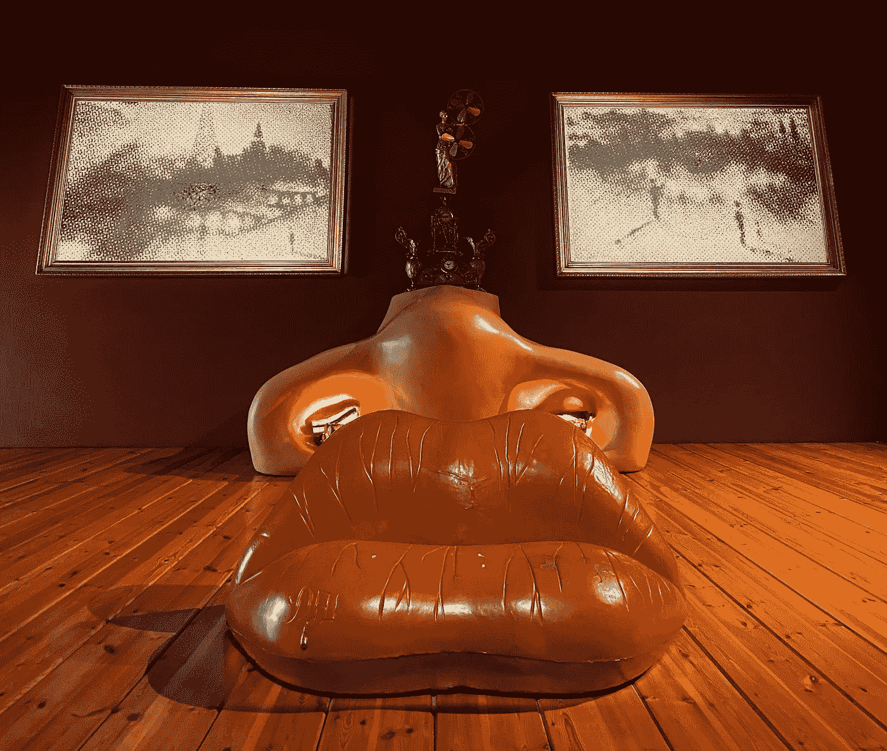
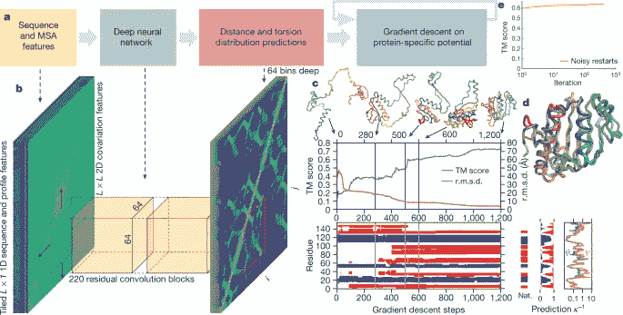
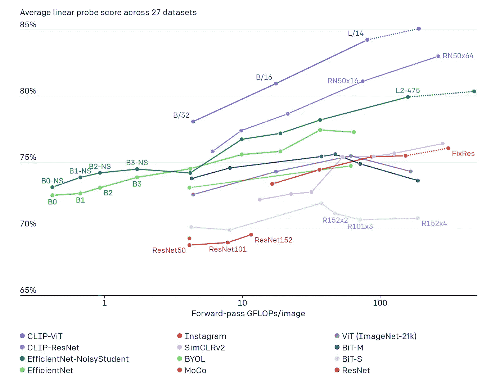
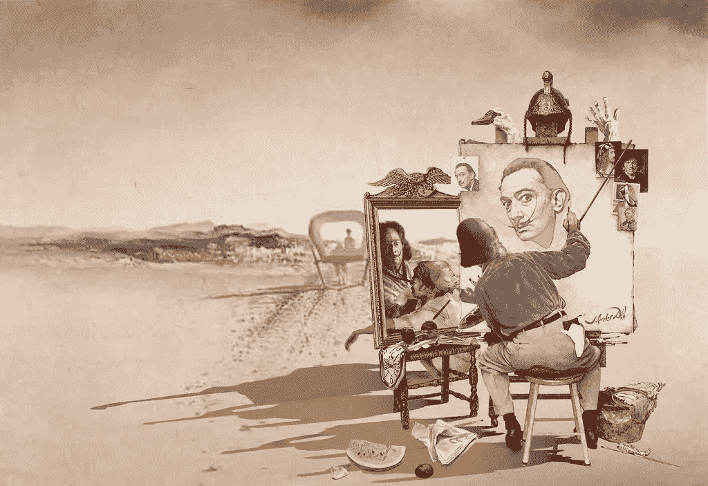

# OpenAI 的 DALL-E 和 CLIP 101:简介

> 原文：<https://towardsdatascience.com/openais-dall-e-and-clip-101-a-brief-introduction-3a4367280d4e?source=collection_archive---------16----------------------->

## 在 GPT-3 之后，OpenAI 带着两个结合了文本和图像的模型回归。DALL-E 会是 2021 在 AI 领域的主角吗？

大卫·佩雷拉在菲格雷斯的大理博物馆拍摄的照片。

当社区仍在讨论 2020 年人工智能重大公告之一时， [GPT-3](https://arxiv.org/abs/2005.14165) (其论文于 2021 年 7 月 22 日发表)才刚刚开始，我们已经有了来自 OpenAI 的两个令人印象深刻的新神经网络: [CLIP](https://openai.com/blog/clip/) 和 [DALL-E](https://openai.com/blog/dall-e/) 。

CLIP 和 DALL-E 都是多模态神经网络，它们的创造者声称它们是[“向更深入理解世界的系统迈出的一步”。](https://openai.com/blog/tags/multimodal/)

## 多模态神经网络:它们是什么？

我们作为人类的体验是多模态的，这意味着我们从周围的世界以不同的形式(声音、图像、气味、纹理等)接收输入。)我们结合使用不同的感官(触觉、视觉、听觉、嗅觉和味觉)来产生学习和保留信息。

那么我们如何定义什么是模态，什么时候问题是多模态的呢？让我在这里引用一个很好的定义，可以在一篇著名的多模态机器学习论文中找到，名为“[多模态机器学习:调查和分类](https://arxiv.org/pdf/1705.09406.pdf)”:

> **模态**是指某件事情发生或经历的方式，当一个研究问题包含多个这样的模态时，它被描述为**多模态**。

在深度学习中，只用一种数据格式(单模态)训练模型是非常常见的。作为这方面的一个例子，DeepMind 的 AlphaFold 2 通过将氨基酸作为给定一维序列的一部分时如何与其他氨基酸相互作用的信息转换为相关性矩阵来解决蛋白质的折叠问题，这可以用图像来表示。同样，AlphaFold 的输出是另一幅图像，这次代表的是蛋白质内氨基酸之间的距离，这些距离与蛋白质的 3D 结构密切相关。因此，DeepMind 将蛋白质折叠问题转化为图像到图像的机器学习问题。

预测蛋白质折叠的 AlphaFold 解决方案综述。图片来源:自然。来源:https://www.nature.com/articles/s41586-019-1923-7

最后，我们如何定义机器学习中的多模态？我非常喜欢下面视频中的介绍和定义:

*“当两个或更多不同种类的输入被相同的机器学习模型处理时，只有当这些输入不能被算法明确地映射到彼此时，多模态(在机器学习中)才会发生”。来源:*【https://www.youtube.com/channel/UCobqgqE4i5Kf7wrxRxhToQA】T4

所以现在我们知道了什么是多模态神经网络，让我们来探索 OpenAI 的新多模态神经网络被训练来做什么。

## DALL-E:从用自然语言表达的字幕中创建图像

因此，OpenAI 的两个新神经网络中的第一个，DALL-E(灵感来自著名的超现实主义艺术家萨瓦尔多·达利)是 GPT-3 的 120 亿参数版本，经过训练可以从文本描述输入中生成图像。它使用相同的变压器架构。在这种情况下，[正如它的创建者在他们的介绍性博客帖子中所说的](https://openai.com/blog/dall-e/)，“它接收文本和图像作为包含多达 1280 个标记的单个数据流，并使用最大似然法进行训练，以一个接一个地生成所有的标记”。

OpenAI 的 DALL-E 网站中的一些可用演示示例非常惊人(您可以更改一些文本输入参数，以查看输出是如何受到影响的)。请看下面的一个例子，其中您可以更改所有带下划线的参数:

OpenAI WALL-E 演示，来源:[https://openai.com/blog/dall-e/](https://openai.com/blog/dall-e/)

在他们的博客中，OpenAI 列出了他们新神经网络的一些功能:

*   控制属性(例如，更改输出中图像的颜色、形状和重复次数)
*   绘制多个对象(这需要算法来计算相对位置、堆叠等)
*   透视和三维
*   上下文细节推理
*   可视化内部和外部能力(OpenAI 的博客显示了一个核桃的横截面作为例子)。
*   处理能力
*   组合不相关的元素(描述真实和虚构的概念)
*   零距离视觉推理(作者承认他们没有预料到)
*   地理知识
*   时间知识

## 警告

从技术角度来看，这种新模式仍然存在许多疑问。正如 Gary Marcus 博士所指出的，我们正在观看一个非常强大的预览，但正如 GPT-3 所发生的那样，在撰写本文时，我们无法获得论文或真正开放的演示环境来深入分析该解决方案。

从社会影响的角度来看，除了 WALL-E 可能对一些职业和过程产生的明显影响(例如，与股票摄影相关的影响)，OpenAI 在他们的博客中提到[，他们“计划分析 DALL E 这样的模型如何与社会问题相关联[…]，模型输出中偏见的可能性，以及这项技术隐含的长期道德挑战。俗话说，一幅图像胜过千言万语，我们应该非常认真地对待像这样的工具如何影响未来的错误信息传播，以及其他问题，如如何识别这种算法的训练数据的价值，就像下面的推文所示。](https://openai.com/blog/dall-e/)

 [## OpenAI 的 DALL-E 可以为你要求的任何东西创建可信的图像

### OpenAI 最新的奇怪而迷人的创造是 DALL-E，通过草率的总结，它可能被称为“GPT 3 号…

techcrunch.com](https://techcrunch.com/2021/01/05/openais-dall-e-creates-plausible-images-of-literally-anything-you-ask-it-to/?guccounter=1&guce_referrer=aHR0cHM6Ly93d3cuZ29vZ2xlLmNvbS8&guce_referrer_sig=AQAAANp4CqFZPdCYy-ESEnshoBM-X5vWZNTlTjeCxFen-LhhQwtRgE_LLFfeDpKp4Cmds4e54XIyHyIEKZrp8uNTGsS66daYFMTHg9AiDuhhD-Hu2LsTnXNd-b8z4sJaEZtJUCr6_B-cGpzlfwFqYe4_FB7PKf2IokWoXP6GSwzrlVT-) 

## 夹子

OpenAI 的第二个新的多模态神经网络被称为 CLIP(对比语言图像预训练)。正如 OpenAI 提到的，当前的计算机视觉方法提出了两个挑战:

*   创建数据集是劳动密集型的，成本很高
*   标准视觉计算模型需要付出巨大努力来适应新任务

为了解决这些挑战，CLIP 不是通过使用带标签的图像数据集，而是通过从互联网上获取的图像及其描述(标题)来训练的。通过使用与 GPT-3 零射击方法类似的能力，可以指示 CLIP 通过使用自然语言来执行分类基准。对于 OpenAI 来说，[是关键](https://openai.com/blog/clip/)，正如他们在介绍性博客帖子中提到的(见下面的引用):

> “通过不直接针对基准进行优化，我们表明它变得更具代表性:我们的系统将这一“鲁棒性差距”缩小了高达 75%，同时在不使用任何原始 1.28 米标签示例的情况下，在 [ImageNet](http://image-net.org/) zero-shot 上匹配原始 ResNet50 [7](https://openai.com/blog/clip/#rf7) 的性能。”

OpenAI 已经用 CLIP 表明，引入一个简单的预训练任务就足以使模型在一组广泛的数据集上表现得非常好。该预训练包括从一组 32，768 个随机采样的文本片段中预测哪个字幕与给定的样本图像相关联。为了做到这一点，OpenAI 已经通过与互联网上的图像配对的文本使用了监督学习。

为了展示 CLIP 是如何概括的，OpenAI 采用了一种零触发的方法，分享了下面的图表。正如他们在他们的介绍性博客文章中提到的，“在我们测试的 26 个不同传输数据集的 20 个数据集上，最好的 CLIP 模型优于最好的公开可用的 ImageNet 模型，嘈杂的学生效率网-L2， [23](https://openai.com/blog/clip/#rf23) ”

来源:https://openai.com/blog/clip/

## 结论

2021 年始于 OpenAI 在人工智能领域的重大公告。由于 2020 年是 GPT 三号之年，那么今年会是达赖之年吗？考虑到这种特殊模式的潜在影响，我不认为 OpenAI 会在短时间内推出公共访问，但编译开发者创建的不同应用程序会很有趣，就像 GPT-3 发生的那样。

另一方面，即使 GPT-3 不知道它在说什么，或者 DALL-E 不知道它在画什么，这两个模型仍然显示了深度学习在过去几年中的进展。想到 [AlexNet](https://en.wikipedia.org/wiki/AlexNet) 只有 8 岁，或者[DALL-E 对仅 5 年前由神经网络创建的图像有多大的改善](https://ai.googleblog.com/2015/06/inceptionism-going-deeper-into-neural.html)，真是令人惊讶。

创造性工作的未来含义仍有待揭示，人们可能会争论 DALL-E 的一些创作是否可以称为艺术，因为我们和模型本身都不知道正在发生什么。但是让我们诚实一会儿:我们能说我们知道达利在想什么吗？

由 [tempslink1](https://www.flickr.com/photos/155678918@N08) 标注 [CC0 1.0](https://creativecommons.org/licenses/cc0/1.0/?ref=ccsearch&atype=rich)

*如果你喜欢阅读这篇文章，请* [*考虑成为会员*](https://dpereirapaz.medium.com/membership) *在支持我和媒体上的其他作者的同时，获得上的所有故事。*