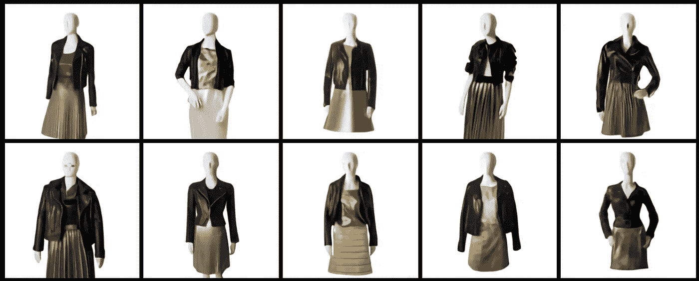
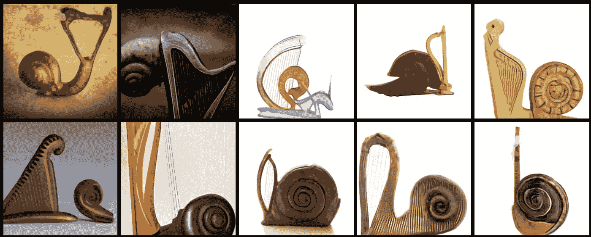

# OpenAI 的新模型 DALL E 让我们离通用 AI 更近了一步

> 原文：<https://towardsdatascience.com/openais-new-model-dall-e-brings-us-one-step-closer-to-general-ai-4abfe9cf9cfc?source=collection_archive---------51----------------------->

## 人工智能的最新发展

## DALL E 建立在革命性的 GPT-3 模型之上，可以从纯粹的文本描述中生成令人惊叹的图像

图一。刘玉英在 [Unsplash](https://unsplash.com?utm_source=medium&utm_medium=referral) 上的照片

你可能在新年假期错过了人工智能世界的一些最新发展，但 OpenAI 在 2021 年 1 月 5 日发布了另一个革命性的模型:DALL E。DALL E 以西班牙超现实主义艺术家[萨瓦尔多·达利](https://en.wikipedia.org/wiki/Salvador_Dal%C3%AD)和皮克斯的科幻机器人 [WALL E](https://www.pixar.com/feature-films/walle) 命名，作为一名艺术家，DALL E 具有创造力，作为一个机器人，它非常健壮。

> "[艺术家萨瓦尔多·达利和皮克斯的《瓦力 e》的结合体](https://openai.com/blog/dall-e/)"

根据博文中的图像，DALL E 似乎对空间、时间和逻辑等概念有很好的理解。

这篇文章将快速概述 DALL E 是什么，它能做什么，它是如何工作的，以及它为什么重要。但是，首先，简单介绍一下开放人工智能。

> 让我们开始吧！

# 什么是开放 AI？

OpenAI 是一个非营利的人工智能研究和部署实验室，位于旧金山。它由埃隆·马斯克(Elon Musk)、萨姆·奥特曼(Sam Altman)和其他人在 2015 年创立，他们承诺投入 10 亿美元开发可持续和安全的人工智能系统。OpenAI 实验室成立背后的主要动机是担心来自人工通用智能的存在风险。即使埃隆·马斯克从 OpenAI 董事会辞职，他仍然是该实验室的捐赠者。非盈利母公司 OpenAI Inc .也拥有盈利的 OpenAI LP 公司。2019 年，微软向盈利子公司 OpenAI LP 投资 10 亿美元。

开放人工智能是近年来最轰动的语言模型之一——预训练生成式变形金刚 3 (GPT-3)背后的实验室。该模型因其激动人心的应用而广受欢迎:

> DALL E 也是在 GPT-3 的基础上建造的。所以，让我们看看 DALL E 是什么。

# 什么是 DALL E？

开放人工智能研究人员在 GPT-3 的 120 亿参数版本(有几个 GPT-3 版本)的基础上建立了 DALL E。这个基于转换器的神经网络被训练成使用图像-文本对的大型数据集从文本描述生成图像。DALL E 具有令人印象深刻的功能，如创建拟人化(*即类似人类的*)动物和对象、文本渲染、转换现有图像以及将对象和概念组合在单个图像中。它还可以补全图像中缺失的部分。

## DALL E 的功能

更详细地说，DALL E 可以做到以下几点:

**达勒能:**

*   更改对象的属性和对象在图像中出现的次数:

图二。文字提示:桌子上放着一堆玻璃杯(作者截图)

*   同时绘制多个对象并控制它们的空间关系:

图 3。文字提示:红色小方块坐在绿色大方块上(作者截图)

*   控制场景的视点和渲染场景的 3D 样式:

图 4。文字提示:一只坐在田野里的水豚的特写镜头(作者截图)

*   可视化对象的内部和外部结构:

图 5。文字提示:一个核桃的横切面图(作者截图)

*   推断上下文细节:

图 6。文字提示:写有“openai”字样的店面。写有“openai”字样的店面。写有“openai”字样的店面。开一家店面。(作者截图)

*   根据给出的描述创作时尚和室内设计作品:

图 7。文字提示:身着黑色皮夹克和金色百褶裙的女性人体模特(作者截图)

*   组合不相关的概念并创建真实的对象:

图 8。文字提示:竖琴做的蜗牛。有竖琴纹理的蜗牛。(作者截图)

*   基于给定描述的动物插图和拟人化蔬菜:

图 9。文字提示:一个穿着芭蕾舞裙遛狗的小萝卜的插图(作者截图)

*   可以进行零射击视觉推理(即，用于模型未被训练的任务):

图 10。文字提示:上面一模一样的猫，下面是草图(作者截图)

*   关于地理事实、地标和社区的理由:

图 11。文字提示:中国美食照片(作者截图)

*   根据时间信息进行推理，并利用其时间知识:

图 12。文字提示:来自……s 的手机照片(作者截图)

如你所见，这些结果令人兴奋。给我留下特别深刻印象的是“竖琴做的蜗牛”和“穿着芭蕾舞裙遛狗的小萝卜”。然而，我们应该对结果保持怀疑态度。这里有一些关于 DALL E 模型的怀疑的想法。

# 对达尔的怀疑

总的来说，我不得不说 DALL E 所能做的非常令人印象深刻。对于你们可能和我一样思考的模型，我有几点想提出来。

图 13。艾米丽·莫特在 [Unsplash](https://unsplash.com?utm_source=medium&utm_medium=referral) 上的照片

## 没有全纸？

我们关于 DALL E 能力的全部知识都是基于 OpenAI 发布的一篇博客文章。虽然结果令人印象深刻，但关于该方法的全文尚未发表。因此，我希望在完全确信 DALL E 能够做到博客帖子所声称的事情之前，看到这篇论文。

## 摘樱桃？

可能误导读者的一点是，结果可能是精心挑选的。即使博客文章提到结果不是精心挑选的，文本提示也可能是精心挑选的。我相信全文中的基准分析可以解决这个问题。

## 通往普通智力的路还很长？

博文中分享的输出似乎很有前景，你可能会认为该模型几乎达到了类似人类的智能。然而，基于之前被认为是革命性的模型的失败承诺，我认为欺骗这些模型犯基本错误并不困难。但是，我们可以测试这个假设的唯一方法是使用这个模型。

# 最终注释

在这篇文章中，我们快速概述了 OpenAI 的新革命性模型 DALL E，似乎 DALL E 仅通过使用文本提示就可以实现几个图像生成和分类任务。虽然市场上有几种解决方案，但 OpenAI 似乎更进一步，提高了技术水平。然而，由于我们既不能访问模型，也不能访问论文，所以仍然有一些未解决的问题需要回答。一旦论文发表或者提供了对模型的访问，我们就可以测试并对这个令人兴奋的模型有一个更好的想法。

# 订阅邮件列表获取完整代码

如果你想获得我在 Google Colab 上的其他教程文章的代码，并尽早获得我的最新内容，可以考虑[订阅:✉️的邮件列表](http://eepurl.com/hd6Xfv)

> [*现在订阅*](http://eepurl.com/hd6Xfv)

如果你对深度学习感兴趣，也可以看看我的人工智能内容指南:

 [## 我的人工智能内容指南

### 帮助您轻松浏览我的内容的指南。

oyalcin.medium.com](https://oyalcin.medium.com/a-guide-to-my-content-on-artificial-intelligence-c70c9b4a3b17) 

最后，如果你想阅读 OpenAI 发表的原始博文，请参见下文:

 [## DALL E:从文本中创建图像

### DALL E 是 GPT-3 的一个 120 亿参数版本，经过训练，可以使用以下数据集从文本描述中生成图像

openai.com](https://openai.com/blog/dall-e/)