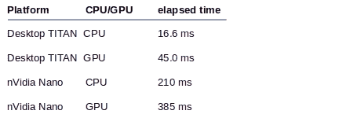

# openCV GPU 的使用令人失望…

> 原文：<https://towardsdatascience.com/opencv-gpu-usage-disappoints-bc331329932d?source=collection_archive---------25----------------------->

## 将 GPU 与您的 openCV 代码结合使用，获得性能提升…不！


有好几次，我被在 GPU 上使用关键 openCV 调用的诱惑所吸引。最近一次是 matchTemplate 呼叫，在此之前是与视觉里程计相关的呼叫。啊，失望！

现在的情况是，我有 31 个可能的图像(或模板)来匹配来自传感器的图像。我想找出哪一个最适合——大图像上的任何地方。对 31 幅图像中的每一幅使用 openCV 调用 matchTemplate，我得到了最佳匹配的分数——最高分就是赢家。我计划在 nVidia 单板计算机上运行这个——无论是 nano、Xavier 还是任何适合成本和性能的计算机。

首先，正在使用的代码的基础知识(无聊的部分省略…)

```
// Initialize the GPU TemplateMatching object// - running in 8 bit modecv::Ptr<cv::cuda::TemplateMatching> cvCuda;cvCuda = cv::cuda::createTemplateMatching(CV_8U, cv::TM_CCORR);// , Size(0, 0));// Initialize the big image - in GPU landcv::cuda::GpuMat img_Gpu;img_Gpu.upload(inputImg);// Initialize the templates for matching - in GPU landfor (int i=0; i<kTemplateAngles; i++)  { cv::cuda::GpuMat tmplGMA_GPU; tmplGMA_GPU.upload(newGMA); vTmplGMA_Gpu.push_back( tmplGMA_GPU );}// Initialize the results matrix in GPU landint result_cols =  monoImg.cols - baseGMAImg.cols + 1;int result_rows = monoImg.rows - baseGMAImg.rows + 1;cv::Mat result( result_rows, result_cols, CV_32FC1 );cv::cuda::GpuMat result_Gpu( result_rows, result_cols, CV_32FC1 );// start timer - and do more than one loop to take multiple seconds// loop through our 31 templatesfor (int i=0; i<kTemplateAngles; i++)  { cvCuda->match( img_Gpu, vTmplGMA_Gpu[i], result_Gpu ); cv::cuda::minMaxLoc( result_Gpu, &minVal, &maxVal, &minLoc, &maxLoc );}// end timer
```

好吧，让我们直接看结果:



在桌面上，GPU 几乎慢了 3 倍！在 Nano 上— *只比*慢了将近 2 倍。

这似乎是网络上常见的抱怨。概述的主要问题似乎是:

*   (上下文的)初始化可能需要 10 秒钟。我已经做了多次定时循环——post 初始化。第二次稍微快一点，比如说快 15%，但是之后时间就稳定了(如上表所示)。)
*   将数据移动到 GPU 内存需要时间。当然，这就是为什么我试图提前做这些。
*   或许其他人，可以在底部随意评论。还有…
*   与 CUDA 启动/结束的开销相比，GPU 的实际执行时间相对较短——在快速 GPU 上运行的任何潜在收益都将丢失。

最后，我认为是核心问题。也就是说， ***我在 GPU 上做得还不够，无法补偿来回调用*** 所产生的所有开销。(*现在如果 matchTemplate 上有一个 openCV 包装器就好了——比方说迭代 N 个模板…)*

顺便说一下，使用 GPU 仍然有意义，即使它比 CPU 花费更多的时间。在我做这项调查的第一个案例中，我们受到 CPU 的限制。将任何东西卸载到 GPU 将释放 CPU 来执行其他任务——只要我们不花费太多时间！

总之，也许我错过了一些东西，但我两次都希望在 openCV 调用中使用 GPU 来提高速度。