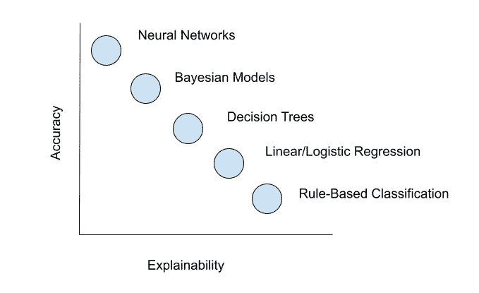
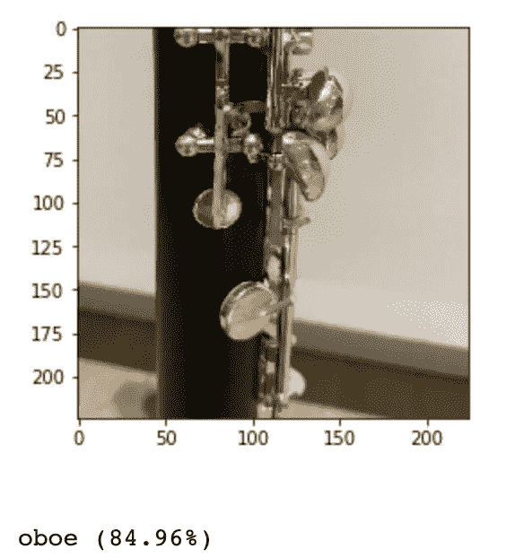
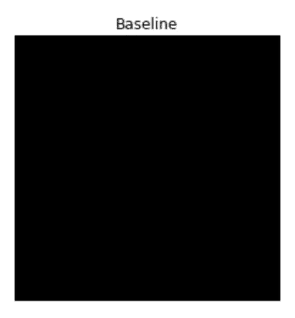
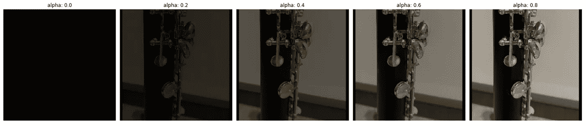
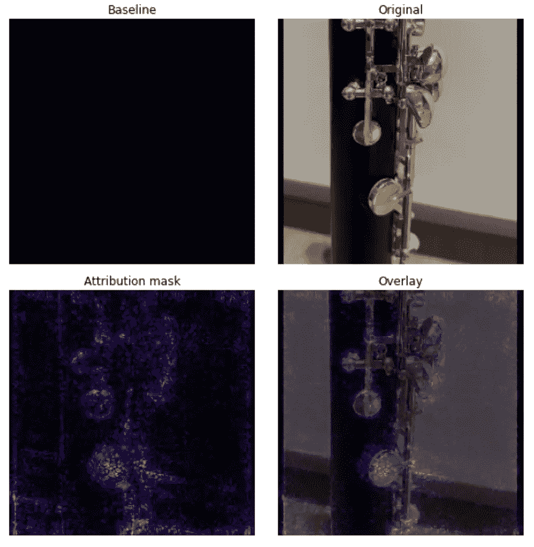
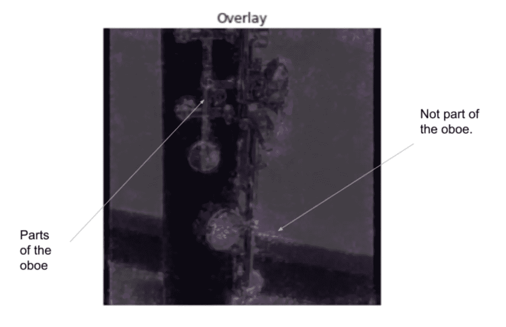

# 打开黑匣子:对可解释人工智能的一种解释

> 原文：<https://towardsdatascience.com/opening-the-black-box-an-explanation-of-explainable-ai-7024d8b1f6b3?source=collection_archive---------18----------------------->

## 我们能解释我们的模型做出的预测吗？让我们分析为什么我们的模型预测一个图像是某个类的一部分

数码师在 [Pixabay](https://pixabay.com/illustrations/why-question-blackboard-school-4129050/) 拍摄的照片

想象一下，你去了一家医院，感觉身体不适，需要进行医疗检查。有人可能会认为结果是可信的，但有一个问题。人类不是解释结果并形成诊断的人。这项工作交给了人工智能模型。

你不想知道这个决定背后的理由吗？我们应该盲目地跟随模型的预测吗？

很高兴知道有一个领域致力于训练模型来解释他们的决定。它被称为**可解释的人工智能(XAI)。**

# 什么是可解释的人工智能？

这是一个黑盒子:

由 Anon 在 [Pixabay](https://pixabay.com/illustrations/cube-block-black-box-3d-geometric-250082/) 上拍摄的照片

*好吧……然后呢？*

事实证明，随着新的深度学习创新的出现，我们越来越难以理解一个模型是如何做出决定的，因为使用了反向传播和梯度下降。这个系统被称为**黑盒**，因为考虑到训练中使用的大量参数，工程师或数据科学家不容易解释模型采用的计算。

这就是可解释人工智能的用武之地。它是一套流程和技术，为黑盒模型的决策提供见解。这允许您:

*   **通过加深对决策过程的理解，调整模型的超参数**
*   告知客户和利益相关者**为什么做出特定预测**，提供更多透明度。

通过让机器学习模型变得可解释，我们的目标是回答以下问题:

*   **为什么**模型做了某个决定？
*   **影响一个模特成败的特征**是什么？
*   模型必须有多大的可信度才能让你相信它？

我相信你已经看到了 XAI 的例子。例如，以 **youtube 广告**为例:

陈述显示广告的原因——图片由作者提供

# 局限性:性能与可解释性

像线性回归和决策树这样的模型是固有可解释的。它们接受更少的参数，并通过直观的数学和统计公式具有一定程度的透明度。例如，我们可以通过映射相应残差的误差来评估线性回归算法选择某个函数的决策。

然而，这些模型的**精度**比深度神经网络的**小**，深度神经网络从大量参数中导出复杂函数。这些数学算法和技术，如梯度下降和反向传播，增加了它们的复杂性。例如，OpenAI 的 GPT-3 需要 1750 亿个参数。虽然它有可能生成真实的人类文本，但很难对所做的决定做出解释。

检验准确性和可解释性之间的关系——作者图片

如上所示，准确性和可解释性之间的**权衡**是显而易见的。因此，必须努力开发算法，以确保在更复杂的模型中有更高程度的可解释性。

# 深潜:集成渐变

如果我们想要辨别解释我们模型的方法，我们需要理解正在被分析的数据的类型。在本帖中，我们将讨论如何解释图像数据，尽管一种改进的技术也可以应用于结构化数据。

目前，实现可解释人工智能的主要技术是**集成梯度**。随意在 Tensorflow 教程[这里](https://www.tensorflow.org/tutorials/interpretability/integrated_gradients)了解更多。我将介绍如何通过使用带有 ImageNet 权重的 VGG19 模型来实现它，以预测我的双簧管的图像。你可以在我的 Github 库[这里](https://github.com/shayaf84/ExplainableAI)找到完整代码。

模型输入和顶部预测-作者提供的图片

*   **第一步:**我们需要**定义一个基线图像**，在其上放置一系列图像。它可以是全黑、全白或随机图像。重要的是，基线将通过模型生成中性预测。

基线图像—作者提供的图像

如上所示，基线图像被实现为像素值为 0 的 224 x 224 x 3 图像。

*   **第二步:**从这里我们可以在基线上绘制一系列**图像**，称为插值。然而，像素的强度将按比例α线性增加。

作者图片

上面的部分为我们的图像插值构造了参数。它通过将图像转换为张量并调整其大小来预处理图像。此外，我们定义了 alpha 值，它由 50 个均匀分布的值组成(插值的增量)。

作者图片

这里我们分两步定义插值函数。我们:

*   计算我们的图像和基线的像素值之间的差异
*   构建一个包含基线和插值图像的新张量(像素差乘以 alpha 变化率)。

太好了！现在让我们调用这个函数并可视化我们的插值。

图像插值(由于 alpha 增量较大，每隔 10 个间隔跳过一次)—按作者分类的图像

*   **步骤 3:针对每个插值图像的单个像素，计算模型预测的梯度**。由于这些梯度，影响模型结果的像素将具有更大的属性，反之亦然。

计算渐变—按作者排列的图像

*   **第四步:累积插值图像的每个梯度**，使用黎曼梯形等技术来估计曲线下的面积。

作者计算黎曼梯形图像

*   **第五步:在所有插值图像上缩放最终的特征重要性值**，并显示最终的特征重要性。

作者图片

以下是该模型特征重要性的可视化:

作者图片

太好了！我们已经成功绘制了对模型决策贡献最大的像素。如果你观察属性遮罩，很明显**较亮的像素具有最高的属性**。因此，它很可能包含在叠加中。

## 这意味着什么呢？

让我们花一些时间来分析为什么我们的模型预测这个图像是双簧管。

作者图片

如您所见，很明显，该模型是根据按键的形状和结构做出预测的。这很好，因为它证明了模型能够**掌握仪器内的关键特征**。然而，在某些情况下，模型使用了不属于双簧管的图像区域来进行预测。他们中的一些人最终有一个高的特征属性，如标签。这是有问题的，因为它表明模型正在为错误的原因做出**正确的决定。**

在这种情况下，模型确定墙的一部分是双簧管的一部分。这很可能是因为它的形状像双簧管，因此模型认为它是乐器的一部分。

# 将受到 XAI 影响的行业

XAI 的影响将在医疗保健和金融等行业显现。

## 卫生保健

由 Hush Naidoo Jaide 在 [Unsplash](https://unsplash.com/photos/yo01Z-9HQAw) 上拍摄的照片

在医疗保健行业，很多情况下所做的决策会产生重大影响。这在疾病诊断中尤其明显，假阳性和假阴性会对患者产生巨大影响。因此，XAI 可用于否定决策的**成本过高**的情况，如活检。

据数字健康和医疗设备专家 Erik Birkender 称，

> “医生接受的训练主要是识别异常值，或者不需要标准治疗的奇怪病例。如果一个人工智能算法没有用适当的数据进行适当的训练，我们就无法理解它是如何做出选择的，我们就无法确定它是否会识别出那些异常值，或者以其他方式正确诊断患者。”

对一个模型的决定缺乏理解是阻止医生理解它是否被正确训练的原因。这让人想起我们看到的例子，模型因为一个错误的原因做出了一个正确的决定。

## 金融

Austin Distel 在 [Unsplash](https://unsplash.com/photos/DfjJMVhwH_8) 上拍摄的照片

因为金融市场越来越复杂，并涉及大量数据的分析，人工智能模型被开发用于**评估公司**和**预测未来资产价格**。

这是因为人类很难以高效的速度无误地处理所有数据。然而，这种方法仍然涉及到一个黑盒，其中用户不能理解为什么一个模型预测了某个预测。

由于我们的经济系统会受到影响它的决策的影响，因此了解驱动宏观经济预测的关键特征是很重要的。这就保证了钱不是盲目投入的，预测是被历史趋势和当前社会因素所证明的。

有了可解释的人工智能，我们能够理解驱动模型做出预测的特征。当要以最小的误差做出决策时，这是最基本的，这不仅有助于我们应对高风险的情况，还有助于我们改进模型。随着开发可解释算法的进展，我们可以开始查看深度学习的黑盒内部。

感谢阅读这篇文章！随时在 [Linkedin](https://ca.linkedin.com/in/shaya-farahmand-168307220) 上加我，订阅我每月的[简讯](https://shayafmd.substack.com/)。

# 文献学

[1] [可解释的人工智能](https://www.ibm.com/watson/explainable-ai)，IBM

[2] [医疗保健领域的可解释人工智能(XAI)如何帮助建立用户信任——即使是在生死攸关的决策过程中](https://www.capestart.com/resources/blog/how-explainable-ai-for-health-care-helps-build-user-trust/)

[3] [积分渐变](https://www.tensorflow.org/tutorials/interpretability/integrated_gradients) (2021)，Tensorflow

[4]o . Yal on，[可解释人工智能是人类生存需要的 5 个重要原因](http://5 Significant Reasons Why Explainable AI is an Existential Need for Humanity) (2020)，走向数据科学

[5] R. Schmelzer，[理解可解释的 AI](https://www.forbes.com/sites/cognitiveworld/2019/07/23/understanding-explainable-ai/?sh=e1e2f67c9ef5) (2019)，福布斯

[6]钱学森，[可解释人工智能在金融中的意义&资产管理](http://The Significance of Explainable AI in Finance & Asset Management) (2020)，反叛研究