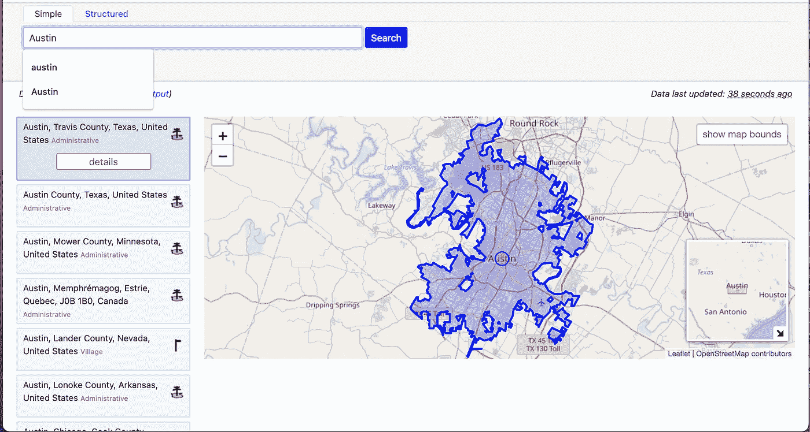

# OpenStreetMap:从浏览器查询到 Python+R 操作

> 原文：<https://towardsdatascience.com/openstreetmap-from-browser-querying-to-python-r-manipulation-c8e4504ad709?source=collection_archive---------10----------------------->

## 数据科学家简明指南

OpenStreetMap (OSM)有多个用户，例如，网站应用程序开发人员可以将 OSM 地图集成到他们的在线工具和服务中，数据科学家在很大程度上使用 OSM 数据来创建空间分析和构建模型。本指南面向希望快速开始使用 OSM 数据的数据科学家；为此，它提供了三项基本技能:

1.  直接在网络浏览器中查询 OSM 数据，
2.  使用 python 通过 API 请求 OSM 数据，以及
3.  用 r 探索请求结果。

# OSM 数据基础

OpenStreetMap 是一套开源工具，存储并允许访问通过众包标记的地理空间数据。该工具集包括:

**数据库和 API** 访问 OpenStreetMap 数据库有几个选项。本演练主要关注[天桥 API](https://wiki.openstreetmap.org/wiki/Overpass_API) ，它提供只读 API 访问。

**查询语言**要在天桥 API 中查询数据，必须熟悉[天桥 QL](https://wiki.openstreetmap.org/wiki/Overpass_API/Overpass_QL) 。这是一种专门为 OpenStreetMap 数据模型创建的查询语言。

**交互式访问** [立交桥涡轮](https://wiki.openstreetmap.org/wiki/Overpass_turbo)是一个基于网络的界面，允许使用立交桥 QL 探索 OpenStreetMap 数据库。查询结果显示在交互式地图上。

# 用天桥 turbo 查询 OSM 数据

OpensStreetMap 数据模型由[节点](https://wiki.openstreetmap.org/wiki/Node)和[路径](https://wiki.openstreetmap.org/wiki/Way)组成。

*   一个 **OSM 节点**代表空间中的一个点，需要两个标签，它的*纬度*和*经度*。
*   一条 **OSM 路**代表线路(道路、河流),它们是节点的有序列表。一个 [**区域**](https://wiki.openstreetmap.org/wiki/Area) 是一条“封闭”的路，应该用`isarea=true`标记。

另一个 OSM 的数据模型[元素](https://wiki.openstreetmap.org/wiki/Elements)是一个[关系](https://wiki.openstreetmap.org/wiki/Relation)。

*   **OSM 关系**用于分配国家、县、命名多边形(地标)和路线的边界。

让我们从打开`[https://overpass-turbo.eu/?lat=30.30&lon=-97.75&zoom=11](https://overpass-turbo.eu/?lat=30.30&lon=-97.75&zoom=11)`开始熟悉 OSM 元素，这是德克萨斯州奥斯汀市中心的立交桥视图。


在左侧，主视图包含一个文本框，其中输入了跨 QL 查询。在右边，结果显示在地图上。

## 查询 1

下面的代码返回奥斯汀地区的餐馆。这个区域是一个由两点定义的盒子:西南角`(30.20, -97.85)`和东北角`(30.40, -97.65)`。

```
node[amenity=restaurant]
  (30.20, -97.85, 30.40, -97.65); 
out;
```

这些是在地图上查询的结果。


输出是 xml 格式的，每个节点的标签代表一家餐馆。

```
<node id="358532482" lat="30.3221769" lon="-97.6932173">
    <tag k="amenity" v="restaurant"/>
    <tag k="created_by" v="Potlatch 0.10f"/>
    <tag k="name" v="La Palapa"/>
  </node>
  <node id="358669465" lat="30.3231224" lon="-97.7037688">
    <tag k="amenity" v="restaurant"/>
    <tag k="created_by" v="Potlatch 0.10f"/>
    <tag k="name" v="China Star Buffet"/>
  </node>
  <node id="358693667" lat="30.3253747" lon="-97.7048159">
    <tag k="amenity" v="restaurant"/>
    <tag k="created_by" v="Potlatch 0.10f"/>
    <tag k="name" v="Pappadeaux"/>
  </node>
  <node id="359344991" lat="30.3269188" lon="-97.7048810">
    <tag k="amenity" v="restaurant"/>
    <tag k="created_by" v="Potlatch 0.10f"/>
    <tag k="name" v="Pappasitos"/>
```

通过 QL，语句将它们的结果写入集合，然后这些集合可以作为后续语句的输入。

## 查询 2

```
[out:json];
    (
      node[amenity=restaurant]({{bbox}});
      node[amenity=school]({{bbox}});
    );
    out;
```

该查询返回两种类型的便利设施的位置，即餐馆和学校。该声明包含:

*   分号`;`分隔并结束语句的每一部分。
*   一个联合块，由一对括号内的语句组成`().`
*   `[out:<format>]` 一对方括号`[]`和一个`out`语句，它们决定输出的格式(在本例中，是 json 格式)。
*   完成搜索的边界框。`({{bbox}})`表示将结果过滤到当前地图视图。

到目前为止，示例中的查询将结果过滤到由坐标或当前地图视图定义的有界框中。在一个城市或一个县内请求结果是一个常见的用例。为此，需要管理边界区域的`id`。例如，德克萨斯州奥斯汀市的 OSM 关系的`id`是`113314`。

[nomist im](https://wiki.openstreetmap.org/wiki/Nominatim)是允许按名称搜索 OpenStreetMap 数据的工具，可在`[https://nominatim.openstreetmap.org/ui/search.html](https://nominatim.openstreetmap.org/ui/search.html)`访问。下一张图片是搜索‘奥斯汀’后的 nomim 截图。搜索结果是 OpenStreetMap 数据库中的元素，其标签与搜索关键字相关。



## 查询 3

下一个查询在德克萨斯州的奥斯汀市执行搜索。请注意，区域 id 由数字 3600000000 和 OSM 关系 id 之和确定(在本例中为 3600113314 = 3600000000 + 113314)。如果感兴趣的区域是 OSM 路，则将数字 2400000000 添加到其 OSM id [ [1](https://janakiev.com/blog/openstreetmap-with-python-and-overpass-api/) ]中。

```
area(3600113314);
node[amenity=restaurant](area);
out;
```

# 使用 Python 直接发出请求

通过在`[http://overpass-api.de/api/interpreter?data=](http://overpass-api.de/api/interpreter?data=`)`之后添加一个天桥 QL 查询，可以向天桥 API 发出请求。以下 Python 代码将返回与上一节中的*查询 3* 示例相同的结果。

```
# %pythonimport requests
import jsonoverpass_url = "[http://overpass-api.de/api/interpreter](http://overpass-api.de/api/interpreter)"
overpass_query = "[out:json];area(3600113314);node[amenity=restaurant](area);out;"response = requests.get(overpass_url, params={'data': overpass_query})
response = response.json()
```

API 请求返回一个 json，它是列表和字典的组合。`elements`项包含所有提取节点的列表。这是前五个条目:

```
>>> response[‘elements’][1:5][{'type': 'node', 'id': 358669465, 'lat': 30.3231224, 'lon': -97.7037688, 'tags': {'amenity': 'restaurant', 'created_by': 'Potlatch 0.10f', 'name': 'China Star Buffet'}}, {'type': 'node', 'id': 358693667, 'lat': 30.3253747, 'lon': -97.7048159, 'tags': {'amenity': 'restaurant', 'created_by': 'Potlatch 0.10f', 'name': 'Pappadeaux'}}, {'type': 'node', 'id': 359344991, 'lat': 30.3269188, 'lon': -97.704881, 'tags': {'amenity': 'restaurant', 'created_by': 'Potlatch 0.10f', 'name': 'Pappasitos'}}, {'type': 'node', 'id': 359354860, 'lat': 30.3288301, 'lon': -97.7049325, 'tags': {'amenity': 'restaurant', 'created_by': 'Potlatch 0.10f', 'name': 'Japon Sushi'}}]
```

定义节点的(元)值是`type`、`node`、`id`、`lat`和`lon`。元素是一个嵌套的字典。如何使用`pd.json_normalize`展平嵌套字典的示例如下所示[ [2](/how-to-parse-json-data-with-python-pandas-f84fbd0b10) ]。在这种情况下，选择了`amenity`、`name`和`cuisine`标签。

```
# %pythonimport pandas as pd
import numpy as nprestaurants = (
  pd.json_normalize(
    response,
    record_path = 'elements'
    ) 
)[['type', 'id', 'lat', 'lon', 'tags.amenity', 'tags.name', 'tags.cuisine']]# since NaNs are not defined for characters in R (only for numeric)
# we need to replace NaNs for temporary 'NA' strings in python and
# then convert them to actual NAs in Rrestaurants = restaurants.replace(np.nan, "NA")
```

产生的`restaurants`数据帧可以很容易地导出到 r。

# 用 R 探索 OSM 数据

R 中的“传单”库可用于探索我们之前用 Python 获得的数据帧。除了通过“传单”实现 OSM 元素的空间可视化之外，“sf”库还提供了处理 GIS 数据的功能。

在移动到 R 之前，Travis 县(奥斯汀市)的人口普查区块组将使用 Python 从 [Tiger/Line ftp](https://www2.census.gov/geo/tiger/) 中提取。在这种情况下，下载的 shapefile 存储在本地文件夹`/tmp`中。

```
# %pythonimport wget
from zipfile import ZipFileimport os
cwd = os.getcwd()# census block groups
url = '[https://www2.census.gov/geo/tiger/TIGER2020PL/STATE/48_TEXAS/48453/tl_2020_48453_bg20.zip'](https://www2.census.gov/geo/tiger/TIGER2020PL/STATE/48_TEXAS/48453/tl_2020_48453_bg20.zip')
wget.download(url, '/tmp')
file_name = '/tmp/tl_2020_48453_bg20.zip'
ZipFile(file_name, 'r').extractall('./tmp')
```

使用 R 中加载的`restaurants`数据框和手边的人口普查区块组形状文件，可以获得一个两层地图:

*   包含以蓝点表示的餐馆的图层。
*   带有表示人口普查区块组(cbg)的多边形的图层。

```
# %rlibrary(leaflet)
library(sf)cbg_sf = st_read("/tmp/tl_2020_48453_bg20.shp")
cbg_sp <- as(cbg_sf, "Spatial")leaflet() %>% 
  addProviderTiles(providers$OpenStreetMap) %>% 
  addPolygons(data = cbg_sp, color = "black", weight = 0.5, 
              ) %>% 
  addCircles(data = restaurants, 
             ~lon, ~lat, popup = ~tags.name)
```


为了完成本指南，下一个代码块包含计算每个 cbg [ [3](https://mattherman.info/blog/point-in-poly/) ]中餐馆数量的命令。

```
# %rlibrary(tidyverse)restaurants_sf = st_as_sf(restaurants, coords = c("lon","lat"), crs = "NAD83")st_join(restaurants_sf, cbg_sf, join = st_within) %>% 
  as.data.frame() %>% 
  select(GEOID20) %>% 
  group_by(GEOID20) %>% 
  summarise(n = n()) %>% 
  arrange(desc(n))
```

然后，cbg 餐厅计数可用作监督模型的协变量，或用于估计空间分布。

关于如何在 R 中使用地理空间数据的其他学习材料可在其他地方找到:

*   [地理空间概念的数据木工介绍](https://datacarpentry.org/organization-geospatial/)
*   [地球实验室:地球分析课程](https://www.earthdatascience.org/courses/earth-analytics/spatial-data-r/intro-vector-data-r/)
*   [sf(简单功能)打包文章](https://r-spatial.github.io/sf/articles/sf1.html)，或者也可以运行`methods(class = “sf”)`快速访问所有 sf 方法。

虽然在 Python 和 R 中存在带有 OSM 数据提取内置函数的包(如 [OSMnx](https://osmnx.readthedocs.io/en/stable/) 或 [osmdata](https://cran.csiro.au/web/packages/osmdata/vignettes/osmdata.html#2_The_overpass_API) )，但本指南提供了这些函数背后的基本概念。了解 OSM 数据、python API 请求和 R 空间操作的基础知识，最终使数据科学家能够根据手头应用问题的需求轻松调整他们的工作流程(并且可以使用 OSM 数据的应用问题是无限的！).

[1] Nikolai Janakiev，[使用 Python 和立交桥 API 从 OpenStreetMap 加载数据](https://janakiev.com/blog/openstreetmap-with-python-and-overpass-api/) (2018)，个人博客

[2] Ankit Goel，[如何用 Python 熊猫解析 JSON 数据？](/how-to-parse-json-data-with-python-pandas-f84fbd0b1025) (2020)，走向数据科学

[3]马特·赫尔曼，[带 sf 的多边形中的点](https://mattherman.info/blog/point-in-poly/) (2018)，个人博客