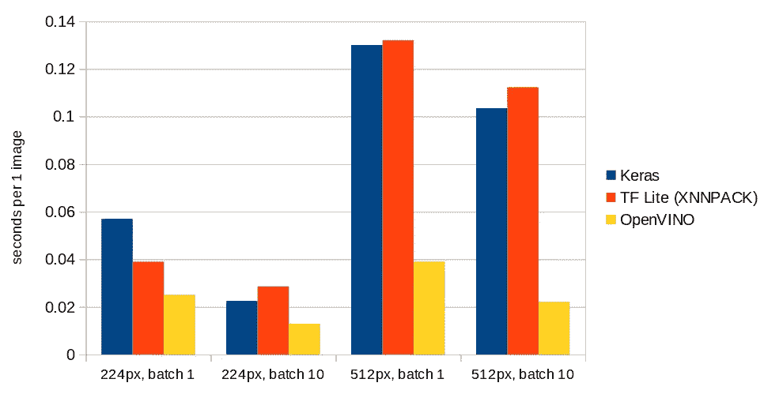

# OpenVINO:开始使用 Docker 针对英特尔 CPU 优化您的 TensorFlow 2 模型

> 原文：<https://towardsdatascience.com/openvino-start-optimizing-your-tensorflow-2-models-for-intel-cpus-with-docker-ce59f5e1ce64?source=collection_archive---------23----------------------->

## 不要浪费你的资源，充分利用你拥有的计算能力。


杰克·吉文斯在 Unsplash[拍摄的照片](https://unsplash.com?utm_source=medium&utm_medium=referral)

我们都是在 GPU(或者 TPUs)上训练的。但是预测需要它们吗？不总是。尤其是如果你花一些时间来优化你的模型。如果你运行的是 Intel CPUs，OpenVINO 可以给你很大的帮助。

你可以在[官方主页](https://docs.openvinotoolkit.org/latest/index.html)上找到大量的文档，那里有 [GitHub 页面](https://github.com/openvinotoolkit/openvino)，在 [Coursera](https://www.coursera.org/learn/intel-openvino) 上的一些课程和许多其他资源。但是如何在不需要学习所有材料的情况下尽快开始呢？在下面的段落中可以找到一种可能的方法。

> 本文原载于[希米拉博客](https://www.ximilar.com/openvino-start-optimizing-your-tensorflow-2-models-for-intel-cpus-with-docker/)。

# 无需安装，使用 Docker

OpenVINO 有几个依赖项需要安装在你的电脑上。此外，要安装其中的一些，您需要拥有 root/admin 权限。这可能是不可取的。使用 Docker 代表更干净的方式。尤其是在[**Docker Hub**](https://hub.docker.com/r/openvino/ubuntu18_dev)上有一张为你准备的**图片。**

如果你对 Docker 不熟悉，它可能看起来像是一个复杂的软件，但是我们强烈建议你尝试一下并学习基础知识。这并不难，值得努力。Docker 是当今软件开发世界的重要组成部分。你可以在这里找到安装说明。

## 运行 Docker 映像

容器是无状态的。这意味着下次启动容器时，所做的所有更改都将消失。(是的，这是一个特点。)如果您想要持久化一些文件，只需在您的文件系统上准备一个目录，我们将把它作为一个共享卷绑定到一个正在运行的容器。(转到`/home/openvino`目录)。

我们将在**交互模式** ( `-it`)下运行我们的容器，以便您可以轻松地在其中执行命令，当您关闭命令提示符(`--rm`)后，它将被终止。使用下面的命令，镜像将被**下载**(拉取)，如果还没有完成的话，它将作为一个容器运行。

```
docker run -it --rm -v __YOUR_DIRECTORY__:/home/openvino openvino/ubuntu18_dev:latest
```

为了能够使用所有的工具，需要初始化 OpenVINO 环境。出于某种原因，这不是自动完成的。(至少对于一个普通用户来说不是，如果你以 root 身份启动 docker，`-u 0`，安装脚本就运行了。)

```
source /opt/intel/openvino/bin/setupvars.sh
```

然后打印出确认信息。

```
[setupvars.sh] OpenVINO environment initialized
```

## TensorFlow 2 依赖性

默认情况下，TensorFlow 2 不存在于容器中。我们可以非常容易地基于安装了 TensorFlow 2 的原始图像创建我们自己的图像。这是生产中最好的方法。说到这里，我们将向您展示另一种方法，即使用原始容器并将缺少的包安装到共享目录(卷)中的**虚拟环境中。这样，我们就可以随心所欲地创造许多这样的环境。或者轻易地改变这种环境。此外，我们仍然可以尝试旧的 TensorFlow 1 模型。在初始开发阶段，我们更喜欢这种方法。**

下面的代码只需要执行一次，在你第一次启动你的容器之后。

```
mkdir ~/env
python3 -m venv ~/env/tensorflow2 --system-site-packages
source ~/env/tensorflow2/bin/activate
pip3 install --upgrade pip
pip3 install -r /opt/intel/openvino/deployment_tools/model_optimizer/requirements_tf2.txt
```

当您关闭容器并再次打开时，这是您需要重复的唯一部分。

```
source ~/env/tensorflow2/bin/activate
```

# 转换 TensorFlow SavedModel

假设您在 [SavedFormat](https://www.tensorflow.org/tutorials/keras/save_and_load#savedmodel_format) 中有一个经过训练的模型。出于本教程的考虑，我们可以采用预训练的 MobileNet。执行`python3`并运行以下几行来下载并保存模型。

转换是一个命令的事情。然而，我们需要使用一些重要的参数，这些参数将在下面描述。完整列表可在[文档](https://docs.openvinotoolkit.org/latest/openvino_docs_MO_DG_prepare_model_convert_model_Converting_Model_General.html)中找到。退出 python 解释器并在 bash 中运行以下命令。

```
/opt/intel/openvino/deployment_tools/model_optimizer/mo_tf.py — saved_model_dir ~/models/tf2 — output_dir ~/models/converted — batch 1 — reverse_input_channels — mean_values [127.5,127.5,127.5] — scale_values [127.5,127.5,127.5]
```

*   `--batch 1`将批量设置为 1。OpenVINO 不能使用未定义的[输入尺寸](https://docs.openvinotoolkit.org/latest/openvino_docs_MO_DG_prepare_model_convert_model_Converting_Model_General.html#when_to_specify_input_shapes)。在这种情况下，MobileNetV2 的输入形状为(-1，224，224，3)。
*   `--reverse_input_channels`告诉推理引擎将图像从[的 BGR 格式](https://docs.openvinotoolkit.org/latest/openvino_docs_MO_DG_prepare_model_convert_model_Converting_Model_General.html#when_to_reverse_input_channels)转换为 MobileNetV2 使用的 RGB 格式。
*   `--mean_values [127.5,127.5,127.5] --scale_values [127.5,127.5,127.5]`最后执行必要的预处理，使图像值介于-1 和 1 之间。在 TensorFlow 中，我们会调用[预处理 _ 输入](https://www.tensorflow.org/api_docs/python/tf/keras/applications/mobilenet_v2/preprocess_input)。

请注意，如果您使用预训练模型，可以使用不同的**预处理和通道顺序**。如果你试图使用一个输入经过错误预处理的神经网络，你当然会得到错误的结果。

您不需要在转换后的模型中包含预处理。**另一个选项是在将图像传递给转换后的模型之前，对代码**中的每个图像进行预处理。然而，我们使用一些 OpenVINO 推理工具，它期望正确的输入。

在这一点上，我们还需要提到，您可能会从 TensorFlow 中的 SavedModel 和 converted OpenVINO 模型中获得略有不同的值。但是从我在分类模型上的经验来看，这种差别就像你用不同的方法把你的图像缩小到一个合适的输入尺寸一样。

# 对转换后的模型运行推理

首先，我们将得到一张属于 1000 个 ImageNet 类之一的测试图片。我们选择了斑马，班级指数 340。(对于 TensorFlow，Google 将类别索引[保存在这里](https://storage.googleapis.com/download.tensorflow.org/data/imagenet_class_index.json)。)


弗里达·布莱德森在 [Unsplash](https://unsplash.com?utm_source=medium&utm_medium=referral) 上拍摄的照片

让我们把它下载到我们的主目录，我们在 Ximilar 服务器上保存了图像的小版本，所以你可以从那里得到它。

```
curl -o ~/zebra.jpg -s https://images.ximilar.com/tutorials/openvino/zebra.jpg
```

您可以使用一个脚本来测试预测，而无需编写任何代码。

```
python3 /opt/intel/openvino/deployment_tools/inference_engine/samples/python/classification_sample_async/classification_sample_async.py -i ~/zebra.jpg -m ~/models/converted/saved_model.xml -d CPU
```

我们在最后得到一些信息行和前 10 名的结果。由于数字非常清楚，我们将只显示前三个。

```
classid probability
------- -----------
  340    0.9556126
  396    0.0032325
  721    0.0008250
```

酷，我们的模特对图片上的东西真的很确定！

## 在 Python 中使用 OpenVINO 推理

很简单，对吧？但是你可能需要**在你自己的 Python 代码**中运行推理。你可以看看剧本里面的[。这非常简单，但是为了完整起见，我们将在这里复制一些代码。我们还将添加一段代码，用于在原始模型上运行推理，以便您可以轻松地进行比较。如果你愿意，运行`python3`我们就可以开始了。](https://github.com/openvinotoolkit/openvino/blob/master/inference-engine/ie_bridges/python/sample/classification_sample_async/classification_sample_async.py)

我们需要一个来自 OpenVINO 推理引擎的基本导入。此外，OpenCV 和 NumPy 是打开和预处理图像所必需的。如果你愿意，TensorFlow 当然也可以用在这里。但是因为运行推理根本不需要它，所以我们不会使用它。

至于预处理，它的一部分已经存在于转换后的模型中(缩放、改变均值、反转输入通道的宽度和高度)，但这还不是全部。我们需要确保图像有一个适当的大小( **224 像素**两边)和尺寸是正确的——**批次，通道，宽度，高度。**

现在，我们可以尝试一个简单的 OpenVINO 预测。我们将使用一个同步请求。

我们的结果`prediction_openvino`是一个普通的 NumPy 数组，形状为(批量维度，类的数量)= (1，1000)。要像以前一样打印前 3 个值，我们可以使用下面几行。

我们得到了和以前完全一样的结果。我们的代码有效！

## 将结果与原始张量流模型进行比较

现在，让我们用张量流模型做同样的事情。不要忘记先预处理图像。准备好的函数[预处理 _ 输入](https://www.tensorflow.org/api_docs/python/tf/keras/applications/mobilenet_v2/preprocess_input)可用于此。

结果几乎一样，差别小得可以忽略不计。与我们之前得到的概率 *0.9556126* 相比，这次预测的最高结果概率 *0.95860416* 。其他预测的顺序可能略有不同，因为这些值非常小。

顺便说一下，有一个内置函数 [decode_predictions](https://www.tensorflow.org/api_docs/python/tf/keras/applications/mobilenet_v2/decode_predictions) ，它不仅会给你排名靠前的结果，还会给你类名和代码，而不仅仅是 id。三大张量流预测。

结果如下:

```
[[('n02391049', 'zebra', 0.95860416), ('n02643566', 'lionfish', 0.0032956717), ('n01968897', 'chambered_nautilus', 0.0008273276)]]
```

# 标杆管理

我们应该提到的是，还有一个用于评测 OpenVINO 模型的[工具。它提供同步(面向延迟)和异步(面向吞吐量)测量模式。不幸的是，它不适用于其他模型(如 TensorFlow ),不能用于直接比较。](https://docs.openvinotoolkit.org/latest/openvino_inference_engine_tools_benchmark_tool_README.html)

# 奥本维诺如何帮助西米拉尔

代码足够了，在文章的最后我们会添加一些数字。在 Ximilar 中，我们经常使用分辨率为 224 或 512 像素的识别模型。每批 1 个或 10 个。我们尽可能多地使用 TensorFlow Lite 格式，因为它加载速度非常快。(此处见比较[。)因为有了**快速加载**，所以不需要一直把模型放在缓存里。为了让运行 TF Lite 模型更快，我们用](/tensorflow-performance-loading-models-fb2d0dc340a3) [XNNPACK](https://github.com/google/XNNPACK) 增强了性能。

以下是 MobileNet V2 公司的结果图表。对于批次，我们显示了**预测时间，单位为秒/单个图像**。对我们的生产工人进行了测试。



# 摘要

在本文中，我们简要介绍了 OpenVINO 的一些基本功能。当然，还有更多的尝试。我们希望这篇文章已经激发了你自己去尝试，并可能通过更高级的资源继续探索所有的可能性。