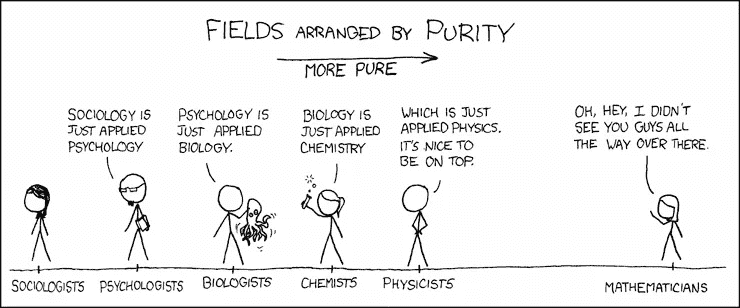

# 操作化:制定度量标准的艺术和科学

> 原文：<https://towardsdatascience.com/operationalization-the-art-and-science-of-making-metrics-31770d94998f?source=collection_archive---------2----------------------->

## 所有数据专业人员的基本心理学

是时候解决一个对所有数据专业人士都至关重要的心理学话题了:

你如何衡量**用户幸福度**？

让我来猜猜你在想什么。*调查反馈？缺乏抱怨？退货数量？点击倾向？*

正确答案是…

图片:[来源](https://i.pinimg.com/originals/d2/ff/d9/d2ffd969011854afa9ddd3b4345cd05f.jpg)

*你没有。如果你认为你的幸福调查可以解决哲学家们争论了几千年的一个未决问题，再想想吧，邓宁教授。*

**成功**怎么样？你如何衡量它？*你没有。*

如何衡量**愤怒**？你没有。(看到图案了吗？是的，我故意让你生气。引导愤怒去思考我所描述的名词之间的相似之处。)

你如何衡量信用度？你没有。

你如何衡量**爱**？你没有。

你如何衡量营销活动的好坏？*你没有！*

# 什么是幸福？

这些东西有什么共同点？它们很模糊。

当你听到幸福这个词时，你的脑海中会浮现出一些东西。无论你在想什么，都可能和你旁边的人想到的不一样。也许在其他日子和其他心情下，你也可能不认同自己。

想从神经科学的角度争论吗？*“等等，我们可以看看他们的大脑，看看他们是否快乐……”*去过那里，做过那个。在我读研[统计学](http://bit.ly/quaesita_statistics)之前，我是神经科学的博士生，专业领域是[神经经济学](http://bit.ly/quaesita_di)(对，有这么个东西)，研究人脑中的效用和价值信号。换句话说，我的论文题目就是这个。

证明你的作者有头脑。图片:[来源](https://twitter.com/quaesita)。

我非常幸运地成为了一个设备极其完善的实验室的一员:

*   **fMRI** 扫描仪。 *f* 使其成为*功能性*磁共振成像，这意味着大脑图像不是静态的，而是血氧变化的地图——滞后几秒钟——用于在实验中定位大脑活动。
*   **脑电图**钻机。这是脑电图的简称，一种使用电极网络来记录头皮上的电活动的技术，补充了 fMRI 的 *where？*用一个*当什么？*通过给你更精确的时间数据——在毫秒级别——关于大脑对各种刺激的反应。
*   **眼球跟踪器**。将漂亮的相机与 niftier 软件相结合的专用套件，用于绘制研究参与者选择的凝视方向，使研究人员能够绘制视觉注意力。
*   **TMS** 钻机**。**经颅磁刺激使用强大的电磁铁*诱发*大脑中的电活动*导致*行为。是的，精神控制是真实的(它甚至被 FDA 批准作为抑郁症的治疗方法)，但不要担心:除非你一动不动地坐着，否则很难偷偷靠近你，因为你身边有一台冰箱大小的机器，它不会工作。

尽管有如此多的工具，我还是无法测量用户的快乐程度。幸运的是，在我开始之前我就知道了。就像地球上的其他神经科学家一样。

为什么会这样？在神经科学/心理学研究生院的第一周，他们确保向我们灌输一个重要的概念。必要时用棍子。你也该学学了:你好，*操作化。*

某个我说不出的地方。图片:[来源](https://pxhere.com/en/photo/1382472)。

# 制作度量标准的艺术和科学

甚至*操作化*这个词对不同的人也有不同的含义。当我说这个词时，我的意思是:

> **操作化**是为严格调查模糊概念创造可测量的代理。

我的意思和[维基百科](https://en.wikipedia.org/wiki/Operationalization)的意思是一样的:*“在研究设计中，* ***可操作化*** *是定义一个不可直接测量的现象的测量的过程，尽管它的存在由其他现象指示。它是定义一个模糊概念的* ***过程，以使理论概念清晰可辨或可测*** *，并从经验观察的角度去理解它。”*

操作化是心理学可以自称为一门科学的原因。没有它，你将一事无成。你如何衡量一个你甚至无法定义的东西？

你不知道。

# 人类表达的沼泽

一些名词是根据它们被测量的方式来定义的。固定的含义是温度、质量、卡路里数、距离、星期几等等魅力的一部分。当谈到测量事物时，心理学家会说物理学家很容易。坦率地说，在人类语言的沼泽中艰难跋涉，拖出一门从头到尾都在叫嚣的科学，是一项令人疲惫不堪的工作。

图片: [xkcd](https://xkcd.com/435/) 。

问题在于，人类的很多交流都是有意设计的不精确。最精确的形式是数学(一种非常小心地说非常少的语言)，不管你有多喜欢数学，我希望你会同意它对于我们大多数的日常聊天来说太慢了。如果我们打开歧义度盘，让听者随心所欲地解释我们的话，会更快地让事情被理解。

> 人类语言可能如此不精确，以至于其舍入误差具有下一级舍入误差。

每当我们抽象地说话时，我们说得太少(一些预期的意思在飞行中消失了)和太多(用外推解释的分叉道路)。具有讽刺意味的是，*这些单词*进入你的大脑和离开我的大脑的意思并不完全相同。

因为我不知道你过滤我的话的湿件设置，我能让自己变得几乎可以理解，这简直是奇迹。然而，我相当有信心，你们大多数人会“得到”它。人类是神奇的动物。

# 四舍五入现实

虽然它能帮助我们在单位时间内传达更多的信息，但诗歌让信息的传递变得不那么可靠。这不一定都是坏事，尤其是如果你想给你的观众留一点创新的空间。

不幸的是，虽然解释的空间通常是歌词和营销活动的一个特征，但就数学证明和科学研究而言，这是一个错误。当目标是传达一个精确的食谱，你的观众可以遵循而不会搞砸——比如你的同事可以借鉴的科学发现——诗歌是适得其反的。这就是为什么没有可操作性心理学就不是一门科学……这也是为什么[草率定义的商业指标](http://bit.ly/mfml_024)通常会让你比一开始没有尝试测量它们时更糟糕。

> 当我们给现实贴上标签时，我们就完成了它。

给解释留有余地的最糟糕的地方之一是机器学习。人类习惯于与其他人交换模糊的废话，所以我们习惯了观众代表我们寻找意义的宽容方式，即使我们不知道我们想说什么。机器不会这么做。[他们完全按照吩咐去做。](http://bit.ly/quaesita_genie)如果你告诉他们优化准确性，他们就会照做。他们不会说，*“嘿，老板，我想你说的准确性实际上是说* [*精度*](https://en.wikipedia.org/wiki/Precision_and_recall)*……”*

语言更加模糊。图片:[来源](https://pixabay.com/photos/chicks-chick-chicken-bird-baby-1444525/)。

此外，我们在[数据](http://bit.ly/quaesita_hist)中创建的类别来自同一个模糊的地方，并且[我们给现实](http://bit.ly/quaesita_tiger)贴上的标签揭示了很多关于我们的[偏见](http://bit.ly/quaesita_aibias)。不幸的是，如果我们不小心，机器学习系统会收集这些信息并[放大它们](http://bit.ly/quaesita_ethics)。为了避免一些可怕的——也是非常常见的——ML/AI/data 陷阱，培养说出自己的意思并理解自己实际说了什么的技能至关重要。

> 重要的是，你要培养说出自己的意思和理解自己实际说了什么的技能。

# 心理学剧本中的一页

心理学有一个多世纪的时间来应对测量你没有正确定义的东西的危险，所以我们学到了一两个商业领袖和数据科学家应该借鉴的金块。如果你想让我写下我们操作化的一些技巧，转发是最能打动我的方式。

心理学能给你的最好的度量建议是:

> 在命名之前，先定义您的指标。

从本质上讲，可操作化就是彻底改变你的标准思维:不要爱上一个词，为了追求它而追求它，而是深入思考你想要测量的真实世界的数量。即使你受到了一个诗意表达的启发，想想为什么这个词会引起你的兴趣。“快乐”的哪些方面似乎与你的业务问题相关？为什么？这和现实世界中的行为有什么关系？这种行为看起来像什么？它看起来像一个愉快地挂在你网站上的微笑用户吗？也许你认为是这样的。

现在忘掉原来的单词。而不是快乐，称之为 X .然后做数学家们做的事情，例如:*“让 X =用户在你的网站上花费时间的倾向。”*

仔细想想这个量。它真的是你想要衡量和做决定的基础吗？也许你决定它是。

非常好。*现在*你能说出它的名字。你命名它的原因是为了节省写作和谈话的时间。也许你会叫它*【X】*也许你会叫它*【幸福】*或者*【blorktibork】*甚至*[*X A-12*](https://www.bbc.com/news/world-us-canada-52557291)*”**

*重要的部分来了。你真的可以给它起任何你喜欢的名字，只要它不冒犯(礼仪或常识)和你(以及你的观众！)记住这个名字是一个占位符，代表一些非常具体的东西:*用户在你的网站上花费时间的倾向。即使你这样命名，它也不是柏拉图的“幸福”。**

**

*图片:[来源](https://www.smbc-comics.com/comic/definition)。*

*如果你记得名字仅仅是一个占位符，你就不太可能做一些愚蠢的事情，比如:*

1.  ***与科技兄弟(所有性别)争论这个指标是否真的在衡量幸福。它不是。这种争论就像如果你已经把你的变量叫做 X，是否允许我把我的变量叫做 X 一样荒谬，只要我们都把我们的意思写在我们的页面顶部，我们就很好，兄弟。***
2.  *误解“快乐”的增加意味着你的网站正在发展。也许用户找不到他们要找的东西，他们花更多的时间在页面上，同时沮丧地嚎叫。如果你记得你实际测量的是什么，并且它的名字只是一个简写，你会更安全。*
3.  *假设别人关于“幸福”的研究适用于你自己的情况。很可能他们定义了不同的度量标准。有时在一次心理交流会上注意一下，你可能会听到这样的一个序列:*“很高兴见到你！你在做什么？”“记忆。”“太棒了，我也是。哪种？”"人类视觉空间工作记忆的发展，你呢？"*请注意，“记忆”可能意味着任何东西，而 VSWM 是一个定义明确的技术概念(在某个时候，有人想研究它并说，“让 VSWM = _____”)。如果其他科学家不在 VSWM 工作，他们不会认为他们新朋友的研究适用于他们自己的工作。*

*小心使用语言，用基于操作化的思维评估我们的模糊性，不仅有助于[统计推断](http://bit.ly/quaesita_statistics)，也有助于[数据收集](http://bit.ly/quaesita_provenance)和[实用机器学习](http://bit.ly/quaesita_12steps)。*

*如果你喜欢这篇文章，别忘了分享它！*

# *感谢阅读！人工智能课程怎么样？*

*如果你在这里玩得开心，并且你正在寻找一个为初学者和专家设计的有趣的应用人工智能课程，这里有一个我为你制作的娱乐课程:*

*在这里欣赏整个课程播放列表:[bit.ly/machinefriend](http://bit.ly/machinefriend)*

# *喜欢作者？与凯西·科兹尔科夫联系*

*让我们做朋友吧！你可以在 [Twitter](https://twitter.com/quaesita) 、 [YouTube](https://www.youtube.com/channel/UCbOX--VOebPe-MMRkatFRxw) 、 [Substack](http://decision.substack.com) 和 [LinkedIn](https://www.linkedin.com/in/kozyrkov/) 上找到我。有兴趣让我在你的活动上发言吗？用[这个表格](http://bit.ly/makecassietalk)联系。*

# *接下来*

*在后续文章中，我将给出创建指标的 7 个技巧。如果这个话题引起了你的兴趣，你的转发是我最喜欢的力量，让我沿着你喜欢的方向继续写作。*

*与此同时，本文中的大部分链接会带你去我的其他思考。不能选择？尝试以下方法之一:*

*<http://bit.ly/quaesita_inkblot>  <http://bit.ly/quaesita_fad>  </statistics-for-people-in-a-hurry-a9613c0ed0b> *