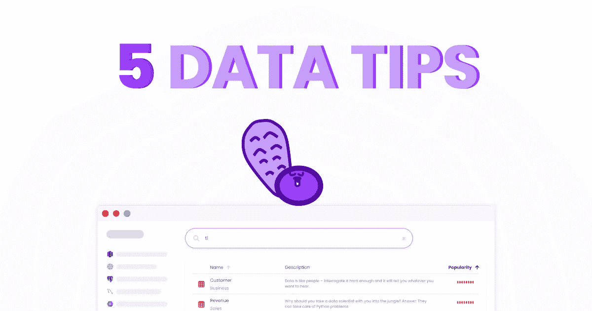

# 每个数据分析师都应该知道的 5 件事

> 原文：<https://towardsdatascience.com/opinion-4baef884f0da?source=collection_archive---------36----------------------->

## 意见

## 为什么它不是 Python，也不是 SQL

每个数据分析师都应该知道的 5 件事

# #1 如果你的分析没有任何偏见，那么再看看

## 问题定义

偏见是支持或反对一种观点的倾向。大多数时候，这是完全无意识的，它主要发生在我们的结果和我们期望的完全一样的时候。我们都是人，如果我们对某件事有期望，在挖掘了一些数据后，我们的第一个结果与我们的期望一致，那么我们倾向于就此打住。当我们的结果不符合我们的预期时，我们可以继续挖掘，直到达到预期。

## 如何避免这种情况？

想想什么会让你的分析结果出错。我认为这种偏见有两个主要原因。

**你分析的范围**

尝试改变日期范围焦点，或者甚至使用的数据可能会得到不同的结果。典型的挑战是应对季节性和混合效应。注意群体效应

**你的分析方法**

这一个与统计 101 调情，现在你已经有了正确的时间和数据点的范围，仔细考虑你如何聚集他们得到结果。离群值是要考虑的，聚合指标也是。总是检查平均值和中值。

# #2 大多数初稿可以在 Excel 中完成

这个标题有点挑衅。是的，python 功能强大，允许您保存和重复数据处理。但这是有代价的。首先，这需要时间，尤其是如果你不是 python 高手的话。其次，与非技术用户的协作更加困难。如果你需要不懂代码的人和你一起开发你的数据应用，那么 python 会让他们慢下来。

作为一名数据玩家，你会想用 Python 做项目，只是为了加速。但要谨慎选择。如果你有一个超级紧张的时间表，excel 做的工作，然后去 excel。您可以稍后迁移到 python，因为一次学习一件事情总是更容易。用一种你不熟悉的语言来做一个全新的数据应用是很难的。首先用你熟悉的工具做分析，然后把它移植到新的语言上。

# #3 给自己一个保存查询历史的工具

有没有遇到过与 3 个月前类似的数据请求？每年发生太多次，希望你有一个过去 365 天运行的所有查询的历史记录…

退房[蓖麻 这样做](http://www.castordoc.com)

# #4 不要修正数据，修正创建数据的过程

先说一个现实生活中的例子。

我之前工作的一家公司的一个数据管道因为一个不唯一的问题而不断中断:一个表字段应该是主字段，但是有重复的字段。该字段是 client_id，通常一个客户应该在一个且仅在一个国家。

因此，每当我们遇到这个问题时，我们必须找到与几个国家有关联的客户并解决它。我们还要提醒销售团队“一国规则”。

我们是否应该针对这一具体问题建立一个专门的警报系统？我们是否应该在顶部添加一个变形层？我们应该取消“唯一”检查吗？这些都不是。当销售人员在数据源(也就是 Salesforce 中)创建数据时，我们必须(还没有)简单地执行该规则。

尽可能找到数据问题的根本原因，让人们明白好的数据需要针对它优化的流程。流程的确首先是为了改进业务而制定的，但是为了获得良好的数据，它们必须考虑到数据依赖性。

# #5 尽可能广泛地分享你的分析

太多的数据玩家等自己的数据 app 完善了才分享。现在就分享吧(如果你愿意，可以在开头加上“WIP”免责声明)。不要花超过几天的时间对你的工作进行同行评审。它会给你视角。

# 结论

是的，硬技能(Python、SQL、R…)是开始你的分析的关键，但就个人而言，我更看重软技能(良好的沟通、看到全局的能力、直截了当、黑客)。

很高兴在评论中进行建设性的讨论