# 最优控制，序言

> 原文：<https://towardsdatascience.com/optimal-control-a-preamble-6c0bc2b12ed6?source=collection_archive---------14----------------------->

## [思想和理论](https://towardsdatascience.com/tagged/thoughts-and-theory)

## 如果你知道我在想什么

约翰·福勒在 [Unsplash](https://unsplash.com?utm_source=medium&utm_medium=referral) 上的照片

自然、人工智能、经济学家理论、经典力学、我们的大脑以及几乎所有东西有什么共同点？他们试图优化。

你甚至都没有去想，但是你的大脑却在不断的尝试优化。每一个动作都经过优化，消耗尽可能少的能量。每种动物都在努力优化自己的存活率。经济学家试图优化利润，整个自然界也试图优化利润。

这个简单的事实对我的学生时代是一个启示。那时我正在研究泡泡几何学这个有趣的课题。现在考虑这个简单的实验。假设你用金属线做了一个简单的立方体(只做了边缘)，然后把它投入到液体肥皂的溶液中(就是孩子们用来做泡泡的那种)。你期望从中得到什么？答案相当令人惊讶，你可以在下面看到:

来源:Youtube，泡沫的科学(全科学纪录片)| Spark

这个谜题的答案其实很简单。这背后的物理现象称为表面张力，它源于一些分子更喜欢在一起，而不是与另一组分子接触，这里是水和空气。水分子会将自己排列成一种形状，使与空气接触的总表面最小化，从而形成这种非常奇特的形状。这也是为什么气泡是球形的原因，因为没有约束(线)，封装给定体积的最小表面实际上是球体的表面。但看起来确实没那么酷。

这个简单的实验对我来说确实不可思议。看起来大自然实际上是在解复杂的方程，试图优化自己的能源消耗。考虑到气泡是一个几何解算器，我们几乎可以用气泡来进行科学计算(几乎..).这里的重要结果是，大自然正在试图解决一个优化问题:**在给定一组约束的情况下减少一个量**。这里减少了水状液体展开的表面，以包围我们吹入气泡的空气(约束)。

# 通用公式

现在让我们试着把“最优化”的概念转换成一个数学公式。

在数学中，最普遍的是，最优化的概念与寻找一个函数的最小值有关。给定一个函数“f ”,它取 n 个实数的向量作为输入，并将它映射到一个实数，该问题可以表述如下:求 x*使得

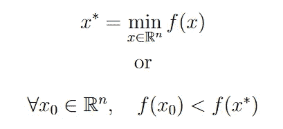

这两个公式是等价的。注意，输入域可以被限制到一个更小的域，即实数集。

很简单嘿。这可能隐藏了非常高的复杂度，取决于“f”的性质，不管它是不是一个“好”的函数。求解这个方程实际上是很多算法在做的事情。不管怎样，你经常不得不找到一个函数的最小值。以深度学习领域的神经网络为例。在算法的每一步，我们所做的只是试图找出某个成本函数的最小值。

正如人们经常做的那样，我们可以尝试将问题重新表述为一个更好的形式，等价但实际上更容易处理。特别地，我们可以找到两个必要条件，使得给定的 x 是方程的解:

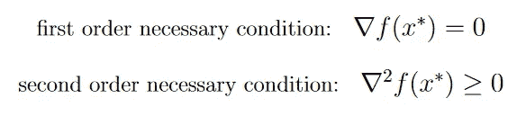

注意，由于具有 n 个输入向量的函数的梯度是大小为 n 的向量，并且大小为 n 的向量的梯度是大小为(n×n)的矩阵，所以二阶条件需要一些解释。优越或相等条件并不意味着每一项都需要优越或等于 0。而是意味着矩阵需要半正定。还要注意，函数的二阶梯度叫做 Hessian 梯度。所以在这种情况下我们会说 f 的 Hessian 需要是半正定的。

如何简单解释这两个条件？第一个条件类似于高中时众所周知的结果:如果一个点的导数等于 0，则该点只能是函数的最小值。我们给出的是一样的，除了我们把它扩展到多变量的情况，这样就得到梯度。
高中期间省略的一点是，那个点是最小值还有一个必要条件。在这一点上的二阶导数应该大于或等于 0。类似地，黑森条件将 2D 的结果转置到多维情形。
如果这两个条件都得到满足，那么我们可以说这个点是一个**驻点。**(但我们还不知道这是否是最低价格)。

但是我们可以走得更远。如果“f”的 Hessian 是正定的，那么这两个条件是充分的(在 2D，如果二阶导数是严格正的，我们也将有这个充分条件)，我们可以肯定地知道一个点是否是最小值:

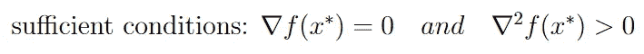

一切都很好，我们确实以一种更容易理解的方式来表达这个等式。这意味着如果 f 足够好，我们可以解析地解决它。如果不是，我们需要使用数值方法来尝试反复猜测结果。但是找出这些条件使我们能够验证这些方法提供的结果。例如，我们可以通过查看“f”在该点的 Hessian 来猜测返回的解是否是一个驻点，而不是一个实际的最小值。

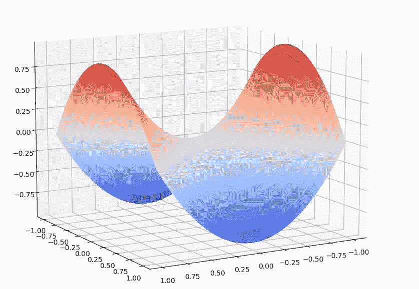

作者图片

上面描绘了一个马鞍形状。在拐点，也叫鞍点，只有导数为零，但 Hessian 不是严格半正定的。

我们也可以简单地谈谈求解这类方程的常用数值方法。正如神经网络一样，我们可以使用**梯度下降**方法或使用牛顿法找到最小值。另一种方法是使用所谓的**进化策略**，我在之前的文章中进一步详细研究了[。然而，这些方法仅在无约束的情况下有效。](/evolution-strategies-for-reinforcement-learning-d46a14dfceee)

# 受限情况:

一切都很好，但是当我们试图执行优化时，我们经常会面临一些约束。尤其是当我们试图优化的东西是真实的、机械的、物理的实体时。一个经济学家必须考虑到资源是有限的，一个控制工程师必须考虑到其机械系统不能超过一组速度和加速度，否则就会看到系统崩溃。因此，约束是最优化理论的重要组成部分。
我们可以将约束类型分为两种:

*   平等约束
*   不等式约束

使用这些约束，优化问题的公式现在可以表述为:找到 x*使得

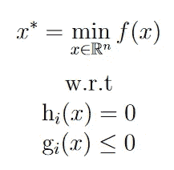

其中 hi(x)表示第 I 个等式约束，gi(x)表示第 I 个不等式约束。

让我们举一个简单的例子:

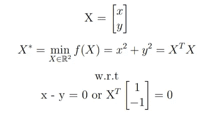

这里最小化的函数是一个凸抛物面形状(其中方程是二次函数)，我们的约束是一条直线(方程 x = y，蓝点)。如果要最小化的函数的维数为 N，那么约束总是至多为 N-1 维，所以如果要优化的函数位于三维，那么约束位于二维空间。

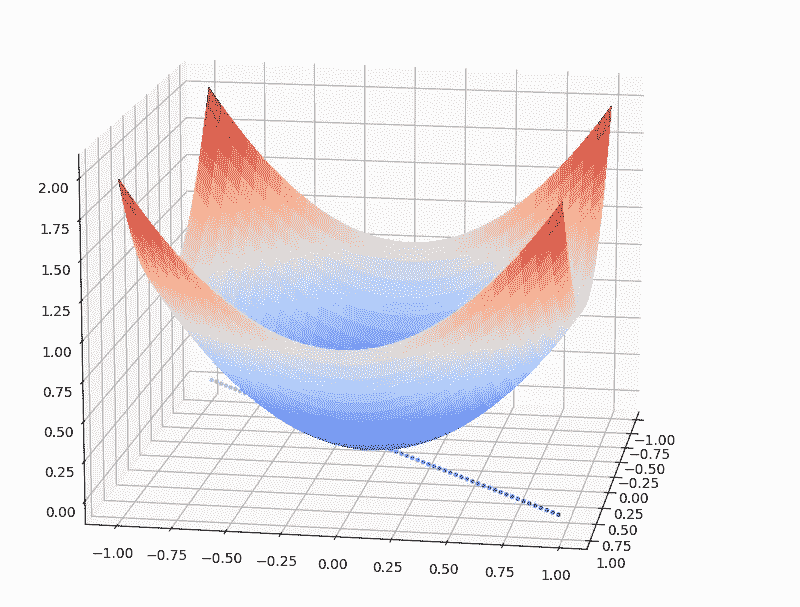

作者图片

问题的解，最小点，当然需要属于抛物面。但是线性约束带来了新的要求。让我们想象一下，对于坐标为(x，y，z)的抛物面的每一个点，我们在同一个 z 层上画直线 x = y。对于考虑约束的点，它必须在那条线上。如果我们对想要优化的曲面上的每个点都这样做，那么我们最终所做的就是将约束的**投影到我们的曲面上。投影的结果称为问题的容许点集(橙色点):**

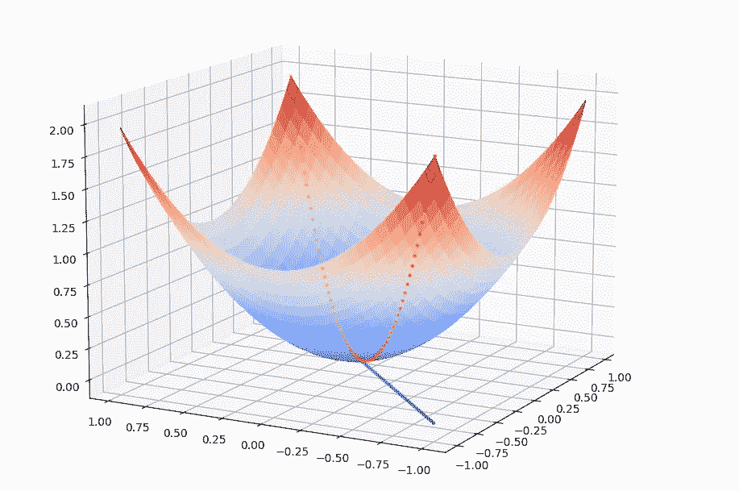

作者图片

如图所示，投影正好是一条抛物线。这意味着问题简化为寻找这条抛物线的极小点，而不是初始曲面。在大多数情况下，向优化问题添加约束会减少实体的整体维度，从而最小化(但仍会增加整体复杂性)。

现在，如果我们考虑不等式约束呢？让我们考虑我们的直线 x = y 的方程，把它转化成一个不等式约束 x ≥y。

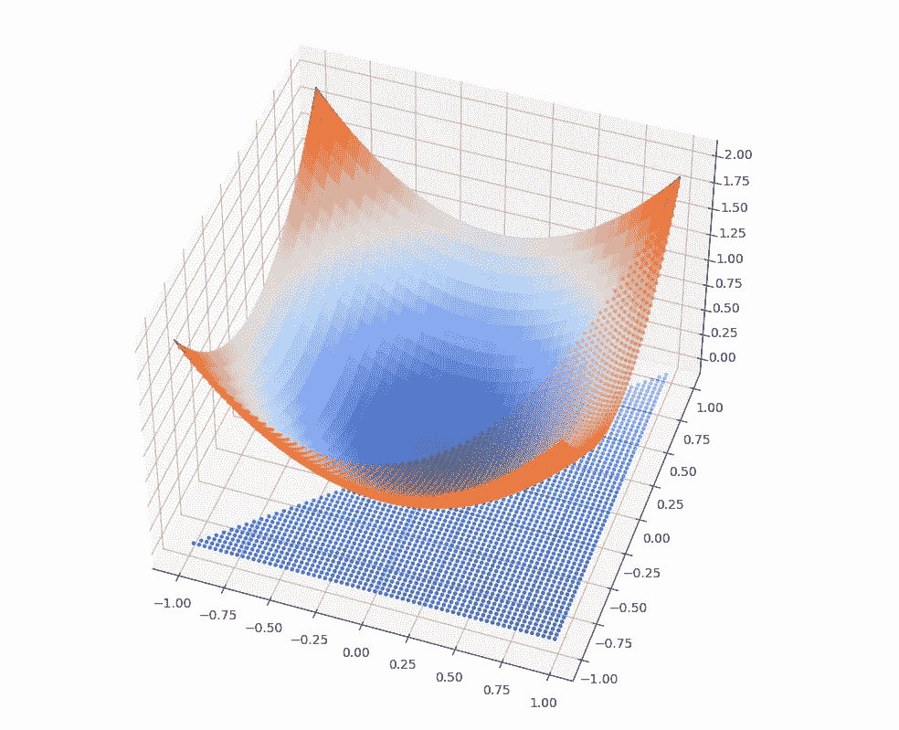

作者图片

蓝点对应的是(x，y)平面中满足不等式约束 x ≥ y 的面积。橙色点是属于抛物面的点，它们也满足不等式约束 x ≥ y。

可以看出，约束仍然存在于较低的维度中(x，y 平面)。然而，由于不平等，我们最终得到的是一个区域而不是一条线。同样，为了减少优化问题，我们需要**将它投影到我们的曲面上，以最小化可接受的点集。
投影的概念很容易理解，但在维度上就不那么容易理解了。投影的概念仍然是最优化领域的一个重要方面。**

这就是几何可视化。在实践中，要找到带有等式约束的函数的最小值，一般工具是使用**拉格朗日乘数**，它允许通过引入新的耦合变量，以更易处理的方式将问题公式化。

对于不等式约束，我们使用相同的程序，并且可以使用 **KKT 条件找到问题的等价表述。**

# 路径优化

许多现实生活中的优化问题不能用上述形式系统化。

就拿谷歌地图来说，这个工具可以为你提供最快的公共交通路线。确实是一个优化问题。谷歌试图找到一条路线，使你从起点到目的地的总运输时间最短。大致的情况是，谷歌会浏览所有可能的路径，选择最快的路径。现在，上一节中描述的公式适用于找到给定函数的最佳点，尽管这里我们试图从函数(路径)的集合中找到最佳函数(这里的函数相当于路径)。看起来我们应该把函数作为变化的参数，并找到最佳的函数。显然，我们需要一个更好的公式。

解决这类问题的第一次尝试来自于著名的最速降线问题:为可以从两个给定点滑落的珠子寻找最短的轨迹。

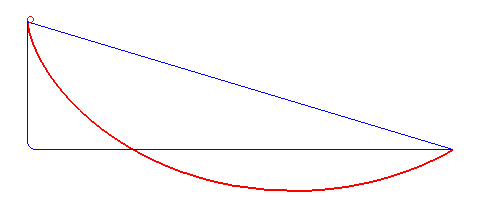

腕尺年代问题，来源:维基百科

直觉上，我们可以说，如果我们可以将每个轨迹分解成小段，并找出珠子在这些小段上移动的时间成本，那么如果我们将它们相加，我们就可以找到每个轨迹的总时间。用数学公式表示:

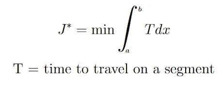

其中 a 和 b 分别是问题的起点和终点，J 代表我们路径的总成本，这里是珠子的总移动时间，J*是最优成本。
那么这意味着什么呢？与我们在一个变量(或变量向量)上找到最小值的先前公式相反，我们在这里找到一组路径上的最小值，这可以在最速降线示例中看到。但是，每条路径都可以与一个值相关联，即它的成本。我们有一个从**泛函**到实数的映射。
这里，最优路径是导致最优总成本 J*的路径。

现在这个提法看起来有点太简单了。让我们尝试重新制定。我们可以看到，珠子形成的时间取决于多种因素。首先，我们正在考虑的片段的长度。如果我们用一个函数 y 来定义曲线，使得曲线的每一点都可以用它的坐标(y(x)，x)来描述，那么珠子在一段上滚动所需的时间 T 至少取决于 x 和 y(x)。既然我们知道重力也起作用，我们可以想象珠子的速度与线段的倾斜度直接相关，倾斜度越大，速度越快。因此，时间 T 也取决于倾斜度，换句话说，y’(x)。总而言之，函数 T 取决于 **x，y 和 y’**。我们现在有了公式:

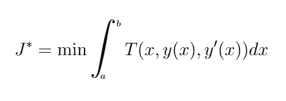

变分法中的一般公式

以类似的方式，最佳路径 y*是导致最佳总成本 J*的路径。现在，这实际上是一个数学分析领域的通用公式，叫做“**变分法**”，你猜怎么着，这个领域主要是因为最速降线问题而开始的。

如果把一个函数的变量看成另一个函数的导数让你感到困扰，就把它看成一个正常的变量。就我们所知，我们让它作为导数的唯一原因是，解决这一系列问题的常用工具，**欧拉-拉格朗日方程**充分利用了这一事实。

这个名字一开始听起来有点高深莫测。尽管背后的逻辑相当简单，但我们需要更精确地观察欧拉-拉格朗日方程试图达到的目的。它遵循与寻找函数最小值相同的原则:我们对属于要优化的函数的一个点进行采样，如果附近的点实际上都在我们考虑的点之上，我们就四处查看(通过查看梯度)。如果是这样，我们处于局部最小值。嗯，路径也是一样。我们取一条路径，以多种方式扭曲它一点点(通过取积分的梯度)，然后看看创建的路径是否都导致更高的成本。因此，我们正在寻找路径上的小变化…变分法。

在全球范围内，我们可以使用相同的公式来表示大量的问题，这些问题的特征是在一条路径上累积的局部成本，以形成总成本。显然，所有的导航问题都可以适应，但不是唯一的。经济学家对这类问题也特别感兴趣，因为“成本”这个术语本身就暗示了…

# 从路径优化到拉格朗日力学

现在来点魔法。

你听说过拉格朗日力学吗？概念挺有意思的。拉格朗日力学不像牛顿力学那样在参考系中建立运动方程，而是试图通过能量推理摆脱任何参考系。拉格朗日力学中臭名昭著的 F = m*a 的类比变成了:

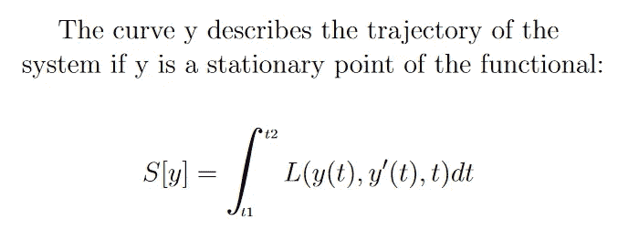

这确实有点罗嗦，但最后，我们可以看到，在经典力学的原始情况下，拉格朗日函数 L 可以被认为是运动的**成本。**与我们之前的路径优化公式相比，变量有所变化，但总体来说还是一样的。我们不是在一段距离上积分，而是在一段时间上积分，这是等价的(我们可以对最速降线问题这样做)。
回想一下第一部分，函数的驻点是函数的梯度为零的点。我们需要在公式上更精确一点，因为泛函依赖于 *y* 和 *t* 。这里的梯度是相对于 y 的，因为我们在看路径之间的差异。

因此，如果我们认为泛函 S 代表给定系统移动的总成本，那么找到 S 的驻点意味着在大多数情况下，我们试图找到 S 的最小值！换句话说，当一个时间间隔内运动的总成本最小时，就找到了系统的轨迹。这里不是我们试图优化一些值，这是一个系统的运动规律。这意味着，我们有了另一个证据，证明自然正试图最小化它的能量消耗，这已经被约瑟夫·路易斯·拉格朗日非常优雅地放进了方程式中。

我们可以看到变分法的公式和拉格朗日力学公式之间的密切关系。这不是巧合，拉格朗日是这个数学领域的主要贡献者之一，求解这个方程组的方程甚至拥有这个名字。在某种意义上，我们可以说拉格朗日力学是用变分法来表述运动定律(如果这有意义的话？).

然而拉格朗日并没有就此止步。也许你已经在这篇文章的某个地方看到了他的名字。事实上，当我们想要找到一个带有约束的函数的最小值时，拉格朗日乘数就出现了。
拉格朗日之所以没有止步于此，是因为我们刚刚提出的提法只适用于少数情况。如果我们挖得更深一点，我们会发现，由于拉格朗日中的项与系统的能量有关，上面的拉格朗日公式只能包含保守力(因为保守力的势能只取决于系统的状态，而不取决于过去的状态)。问题是，自然界的大多数力量都不是保守的。如果我们以钟摆为例:

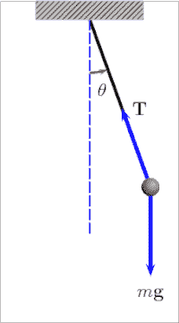

来源:维基百科

我们有两个力在起作用:重力，和杆的张力，重力是保守力，没问题，但杆的张力不是。这意味着，目前我们不能用拉格朗日公式求解运动方程。除非我们说张力 T 是摆位置的一个约束。
以同样的方式，我们可以使用拉格朗日乘子来解决带约束的最小化问题。事实上，如果没有它们，这个公式在解决现实世界的问题时是相当无效的，拉格朗日在他的条约“分析力学”中用公式表达了运动方程，从而推动了乘数的概念。问题的一般表述变成:
如果 y 是泛函的驻点，曲线 y 描述系统的轨迹:

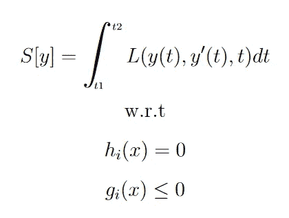

换句话说，该公式可以被认为是寻找系统的轨迹，使得该系统相对于约束最小化其能量消耗。

# 控制理论

终于，我们到了。让我们看看如何将我们在上面看到的所有结果转置到控制领域。

一、所谓的控制论是什么？

我们举个简单的例子。如果你从加农炮上发射一枚炸弹，因为你知道运动定律(也许你是拉格朗日力学的专家)，你能够预测这枚炸弹会落在哪里。
现在，如果有一阵风，你的炸弹可能会偏离其初始轨道，炸弹可能会落在不希望的目标上。这个故事的寓意？不要相信物理学家，相信工程师。

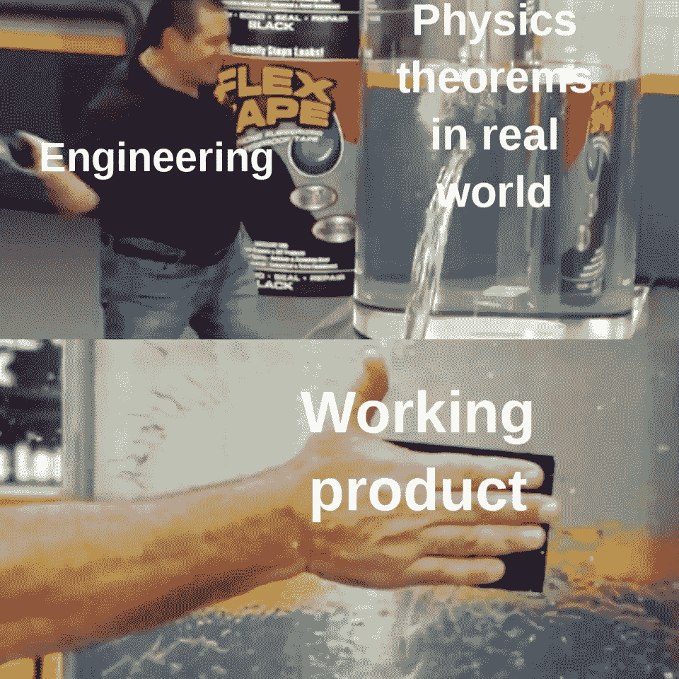

来源:Youtube，弹性胶带广告

工程师是做什么的？“为什么不在炸弹上加几个螺旋桨”？其中一个说。“像这样，我们就可以实时调整炸弹的轨迹，迫使它按照期望的路径运行！”。“太好了”，另一位工程师说，“但是我们如何决定给螺旋桨多大的推力？”(在我的想象中)这就是控制理论领域出现的原因。

控制理论的思想是:
—以一个动态系统为例，它有自己的时间演化规律
—添加一个单元，使你能够改变系统的状态
系统因此有一个输入值(我们提供给单元的东西)和一个输出值(系统的新状态)。
—采取纠正措施，通过向系统输入输入值，将系统驱动至所需状态。负责向系统提供足够的输入值以便达到所需状态的部分称为**控制器**。

控制理论最感兴趣的是如何定义这个控制器。给定要达到的期望状态，如何向系统提供输入值，使得可以尽可能快地达到该状态，具有最大的精度，并且确保鲁棒性，确保系统保持一定水平的稳定性并且不会退化。

在这种情况下，导弹是一个根据运动规律不断进化的系统。螺旋桨是能够采取纠正措施的装置。系统的输入值是螺旋桨的推力，输出值是导弹的位置和速度。类似地，空调是一种允许我们根据热力学定律对室内温度采取纠正措施的装置。整个(房间+空调)系统的输入是提供给空调的电压，输出是新的房间温度。
当我们进入房间并打开设备时，我们希望尽快达到所需的温度，但我们也不希望房间无缘无故地变成冰箱(坚固性)。

偏爱控制理论的可视化工具是框图。它使我们能够看到我们试图添加到系统原始动态的整体输入。例如:

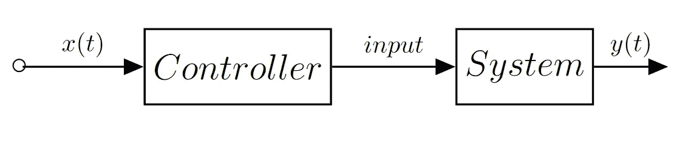

开环框图

这是一个**开环的例子。**值 x(t)在这里对应于系统的期望状态。我们首先应用我们的控制器动作，然后将这个值输入我们的系统。在这种情况下，控制器的动作不依赖于新的系统输出。再看空调的例子，就相当于我们把空调的电压固定下来，让它输出一股恒温的气流。如果你决定打开窗户，控制器不会适应。您可能无法达到所需的温度。

工程师们于是创造了**闭环的概念。**基本上，它不是着眼于期望的状态，而是着眼于系统的当前状态和期望状态之间的差异。这样，控制器对潜在的扰动(打开窗户)变得更加鲁棒。

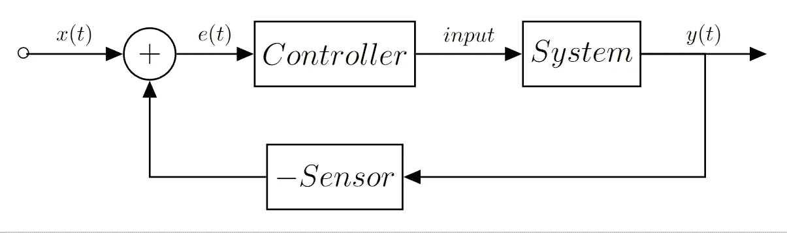

闭环框图

从上图中可以看出，反馈给控制器的不再是期望状态 x，而是系统输出和期望状态之间的误差**e。此外，我们注意到传感器的存在。在大多数情况下，控制器不知道系统的输出，需要对其进行测量。一台空调需要一个传感器来确定新的室温，一枚导弹需要一个跟踪工具来确定其在空间的定位。**

# 最优控制

在介绍了控制理论之后，我们可以把注意力集中在它的一个分支——最优控制上。

正如我们所见，控制集中在多个方面。稳定性、精确度和速度。在最优控制中，我们定义了一个可以在每个时间步计算的成本，它反映了我们想要最小化的数量。它可以是时间，或精度，或两者同时，或者我们也可以有其他的量来优化(燃料消耗，等等..).

首先，让我们考虑我们想要优化的量是时间。给定一个初始系统状态，即要达到的期望状态，这里的目标是找到系统的输入序列，使系统在尽可能短的时间内达到期望状态。换句话说，如果我们找到了最优控制，就不可能有另一系列的控制来使系统在更短的时间内达到期望的状态。让我们以一辆汽车为例，通过选择我们踩下油门踏板的力度，可以控制它沿直线行驶...最优控制问题可以表述为，从 A 点出发，停在 B 点，驾驶员应该如何踩油门以最快的速度停在 B 点。或者用控制术语来说，这个问题等价于说“找到从 A 到 B 的时间最优的控制序列 u(t)(油门踏板的角度)”(导致汽车 x(t)的一个运动)。

鉴于我们在最优性方面的经验，我们几乎想把它变成一个数学公式。大概是这样的:

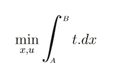

现在，如果你还在跟踪，你可能会想，我们怎么找到 u(t)和 x(t ),它甚至不在积分中…这就是动力学发生作用的地方。最优控制中考虑的所有系统都是动态系统，这意味着它们遵循形式为 **x'(t) = f(x(t))的时间演化定律。**
如果拿空调来说，温度受热力学定律支配，而导弹受运动定律支配，就像我们认为的汽车一样。难道你不认为这些应该被考虑进去，才能知道我们多快能到达 B 点？没必要把事情搞复杂，我们就把它作为最小化问题的约束条件加入吧:

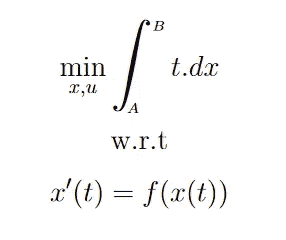

但是，方程中没有控制 u？让我们想一想……空调遵循热力学定律，但我们加入了冷空气，打乱了热力学定律。导弹有一个很好的自由落体轨迹，但是通过启动推进器，我们确实改变了它的轨迹。有没有可能，动力学方程也需要考虑控制因素？

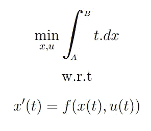

现在看起来好多了。让我们试着走向一个普遍的情况。这里我们只想优化问题的总时间。如果，我们也要考虑总用气量呢？气体消耗与我们应用于油门踏板的控制直接相关，因此它应该出现在成本中。但是，如果你正从阿拉斯加开车到加利福尼亚，并且饱受寒冷之苦，那该怎么办呢？那么你最好赶快离开阿拉斯加(而你在加利福尼亚周围会没事)。看起来这里的成本取决于汽车的位置 x(t)。

一个最优控制问题应该表述如下:
找出每个 t 的控制序列 u(t ),使得我们最小化数量:

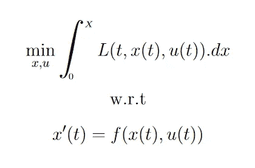

最优控制问题的一般表述

注意代表成本的函数是用大写的 L. L 写成的像…拉格朗日？事实上，控制理论家决定将其命名为拉格朗日，因为这个最优控制公式是从变分法中推导出来的。不同的是，拉格朗日函数不依赖于(t，x，x ')，而是依赖于(t，x，u)。但是正如我们看到的，动力学方程可以把 u 和 x '联系起来，所以这实际上是一样的。

太好了，看起来这个方程可以在变分法的框架下用欧拉-拉格朗日方程来求解。等一下……约束是非完整的？(不能将约束表示为轨迹上的限制)？欧拉-拉格朗日方程不能用？所以你是在告诉我，我们在变分法上所做的所有这些形式主义都是徒劳的？(不！)

有希望的是，一些有才华的人能够利用变分法的策略为这个最优控制公式得出一些结果。例如，拉格朗日乘数仍将用于推导，以考虑其他完整约束。由此得出的定理被称为**庞特里亚金最大值原理**。

然而，最优控制的领域并不局限于庞特里亚金及其定理。由于实现后一个定理的计算量非常大，所以出现了其他方法，每种方法都能够找到特定情况下的最优控制。其中一个叫做**动态编程**，这是一个分支，后来导致了强化学习和深度强化学习。也有不同的情况需要考虑，如区分有限视野和无限视野问题(无论我们是否有时间限制)，连续或离散化表示。有些解如庞特里亚金原理是解析的，有些是数值的。

正如我们所看到的，最优控制领域有很多方法来解决初始问题，找到优化给定成本的最佳控制。然而，所有这些方法都是从我们上面提出的相同公式开始的。关于这一主题的文献通常非常深奥，没有为所使用的问题表述提供任何背景。这篇文章正是为了提供一些介绍性的背景知识，我希望它能帮助你进一步深入最优控制领域。

为了更进一步:

*   布拉格 CTU 的最优和鲁棒控制。https://moodle.fel.cvut.cz/course/view.php?id=2120 所有的讲座都可以在 Youtube 上看到(频道“aa4cc”)。
*   唐纳德·e·柯克的《最佳控制理论导论》。
*   最佳控制原理，麻省理工学院
    [开放课件 https://OCW . MIT . edu/courses/aeronautics-and-astronautics/16-323-principles-of-Optimal-Control-spring-2008/讲稿/](https://ocw.mit.edu/courses/aeronautics-and-astronautics/16-323-principles-of-optimal-control-spring-2008/lecture-notes/)