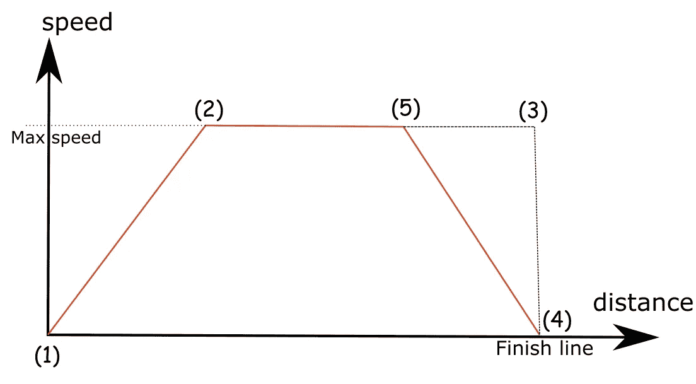
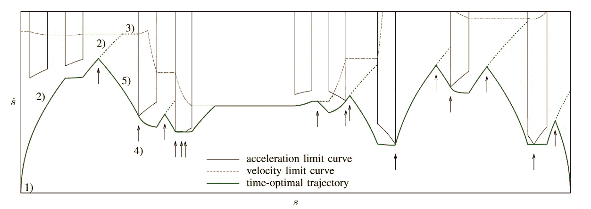
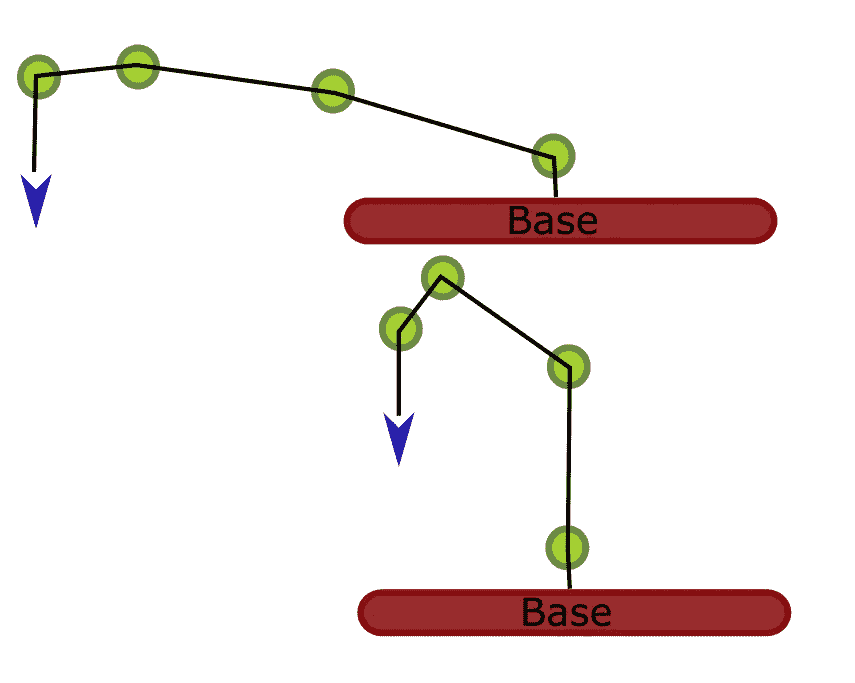
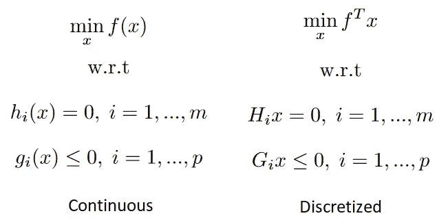
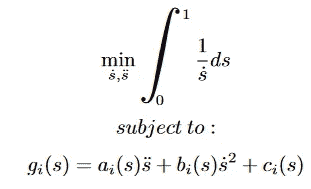
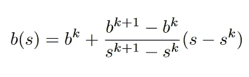
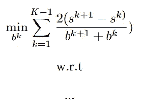
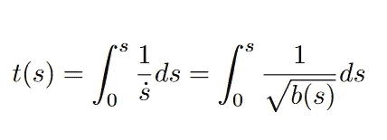
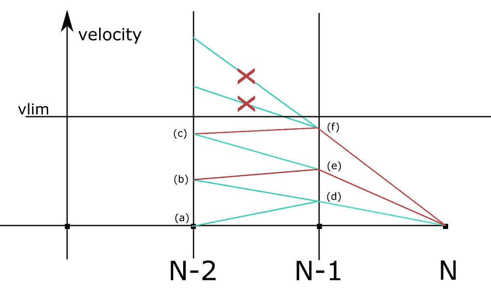
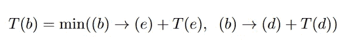

# 机器人的最佳控制:第二部分

> 原文：<https://towardsdatascience.com/optimal-control-for-robotics-part-2-e9f9acb4027b?source=collection_archive---------13----------------------->

## 通过算法让机器人最优移动。

Pavel Danilyuk 在 [Pexels](https://www.pexels.com/fr-fr/photo/homme-gens-femme-jeune-fille-8438969/) 上的照片

我们在[上一篇文章](/optimal-control-for-robotics-part-1-4cc4ee5fb14d)中证明了工业机械臂的路径参数化问题是一个最优控制问题。

从那里我们简单介绍了庞特里亚金最大值原理以及它如何用于我们的问题:
给定一条描述从起点到终点的机器人配置序列的路径，到达终点的最快方法是选择控制(每个关节的加速度和速度)，以便我们不断达到控制极限，在最大加速度和减速度的阶段之间交替，Bang-Bang 控制。
我们还表明，通过将约束投射到路径上，这个问题可以变成两个维度，一个是路径参数 s，一个是控制ṡ。

在这篇文章中，我们将提出三种方法，以庞特里亚金定理为出发点，尝试解决这个路径参数化问题。

## TOTG

时间最优轨迹生成。

庞特里亚金告诉我们，我们需要交替最大加速和最大减速阶段，如果我们已经达到了最大速度，只要我们能保持在那里。确定每种情况下的控制很容易，但确定开关点也很重要:

如果我们再来看看德拉斯特的情况，我们知道我们需要尽可能多地踩下油门踏板，然后在精确的时刻踩下刹车踏板，停在终点线上。
这里的关键部分是准确知道在两个踏板之间切换的位置。

TOTG ,[ 1]中提出的算法提供了一种严格的分析，以便在约束仅限制关节速度和关节加速度的非常特殊的情况下找到所有的加速度开关点。一旦我们为路径上的一个点建立了成为开关点的所有条件，我们就可以遍历路径，并精确定位所有的开关点。

TOTG 通过数值积分进行，这基本上意味着分两步重复进行，向前传递和向后传递。
在向前传球中，我们使用最大加速度，并试图尽快达到最大速度，并尽可能地保持在那里，直到我们找到一个切换点。TOTG 告诉我们，在那里，我们需要实际上在最大速度极限曲线上继续(即使产生的轨迹不会使用这一部分)，并找到下一个速度极限不连续形式的切换点。从那里，我们只需反向运行算法(反转时间)并使用最大减速度而不是最大加速度来连接两个开关点。
然后重复，直到最后找到的切换点实际上是轨迹的终点(零速度)。

让我们试着看看我们的赛车会是什么样子。相对于距离绘制速度足以定义所有需要的控制(速度和加速度):

作者图片

1–2:使用最大加速度，达到最大速度曲线。2–3:停留在最大速度曲线上，直到找到一个切换点:在这种情况下，速度限制不连续，在终点线，速度限制下降到零(汽车应该停止)。4:从切换点开始，做“倒传”。使用最大减速度，我们能够找到与我们正在经历的轨迹的交叉点(5)。

现在让我们看看真正的机器人是什么样子的:

相平面轨迹，来自[1]

这里，每个垂直箭头代表一个开关点。我们可以注意到与我们的简单示例不同的两点:

*   加速度和速度约束不是线性的。这是因为我们将约束从关节空间投影到路径上，在关节空间约束是线性的。TOTG 实现确实找到了投射到路径上的这些约束的解析表达式。
*   我们有两种类型的速度约束:速度极限曲线和加速度极限曲线。即使后者被称为“加速度极限”，它也是对速度的一种限制，但由于加速度的限制。假设我们到达了速度极限曲线。我们将尽可能长时间地坚持下去。但也许当我们“骑着它”时，我们实际上加速得太快了。加速度曲线的作用是建立一个速度极限，这样就不会超过最大加速度。正如你在图上看到的，这些加速度极限曲线大多发生在速度曲线有突变的时候。

我们现在可以更好地理解 TOTG 算法。从加速切换到减速的需要主要来自加速极限。如果我们没有很强的加速度极限，我们会沿着最大速度极限曲线前进，直到轨迹的终点。当速度极限曲线与加速度极限曲线相交时，检测到需要这种开关。从那里我们需要反向运行算法来连接轨迹，同时考虑所有的约束。

因此，TOTG 是一种相当可靠的算法，因为约束和开关点可以解析地表达。然而，这只有在将我们自己限制在关节速度和加速度约束时才有可能。不过，限制关节加速度的效用有限。虽然关节速度对应于一个直接的物理限制(转子的旋转)，但关节加速度没有物理等价。对电机来说，重要的是施加的扭矩。但这是另一个层面的复杂性，因为电机施加的以特定速度和加速度移动的扭矩取决于特定配置的机器人的惯性。
如果机器人完全伸展，向下施力会困难得多(用手臂试试):

完全伸展配置与收缩配置。图片作者。

假设我们在机器人的顶端安装了一个很重的负载。如果我们的目标是不损坏机器人，那么不管机器人配置如何，限制加速度是不够的。

为了获得完整的解决方案，路径参数化算法因此需要考虑扭矩约束(以及更全面的任何类型的约束)。在这种更普遍的情况下，解析地找到所有可能的加速度转换点(并确保我们找到时间最优的轨迹)变得太难了。

## TOPP 公司

当我们谈到最优控制问题时，我们直到现在才想到两个结果，欧拉-拉格朗日算法(导致变分法理论)和庞特里亚金最大值原理。在这两种情况下，目标是将问题公式化为更易处理的东西。这些方法可以称为间接方法。

将方法命名为间接方法需要直接方法的存在。直接方法是指使用已经存在的算法来解决优化问题，但不一定是最优控制问题，只要它们被放入正确的公式中。特别地，当问题是凸的(要优化的函数以及约束是凸的)时，存在大量的算法来提供最优解的估计。
根据要优化的函数的确切性质和约束条件，可以使用不同的算法。在所有函数都是线性或二次函数的特殊情况下，可以更有效地找到最优解。
凸问题的一般表述是:

f，h，g 都是凸函数

在离散化公式中，向量 x 的大小是离散点数的 N 倍。

我们在以前的文章中一直坚持最优控制问题是如何找到一个最优函数(控制)，而不仅仅是找到一个给定函数的最小值。那么凸优化算法是如何帮助我们的呢？
这个问题的解决方案类似于任何电子表格软件执行线性或二次回归的方式:我们选择一个模型。优化就是找到模型的参数，让我们找到控制问题的最优解。在最优控制问题中，这种特殊的方法有一个名字:直接转录。

可以使用一个额外的技巧:我们可以离散化路径，然后为路径的每一段选择不同的模型，而不是为整个轨迹上的控制选择模型(否则最优解可能会有太大的误差)。通过某种近似，可以认为，如果对于离散化轨迹的所有点都遵守约束，那么外推轨迹也将遵守约束。

现在让我们来谈谈在论文[2]中提出的 TOPP-CO，它代表通过凸优化的时间最优路径参数化。这种方法使用前面显示的技术:我们从如下描述的路径参数化问题开始(如果这还没有引起注意，请再次检查第 1 部分):

需要做一些工作来将这个公式转换成凸优化问题。该出版物的作者[2]选择为ṡ**提供一个模型。路径参数 s 表示我们在路径上的几何位置，想象一个进程的加载条。假设我们知道控件，s 的一个值将对应于某个时间戳，反之亦然。然后，很自然地尝试将 **ṡ** 表示为 s 的函数，这里称为 b(s)。将路径离散化后，作者选择模型为(在离散段 k 到 k+1 上):**

然后选择函数 b(s)在 s 中是线性的，带有一些参数。选择最优 b(s)(最优控制)将等价于求解最优参数 b^k.。建立模型允许重新表述原始问题，并仅用参数 s 的函数来表达它。经过一些整合后，作者表明该问题可以以如下形式提出(为了简洁起见，省略了约束):

虽然很清楚要优化的函数是凸的，但作者表明约束可以以满足二阶锥约束公式(凸优化问题的子类)的形式存在。通过将其转换成矩阵符号，我们能够利用现有的工具来解决这个凸优化问题，并找到 b(s)的表达式。作者解释说，我们可以通过以下方式积分来找回时间参数化(相当于找到问题的控制):

这是 TOPP 公司使用的技术。我们在这里没有明确描述的是约束的公式以及它们如何投影到路径上。这种凸优化公式的优点是，任何约束都可以包含在过程中，只要它是凸的，并且只要我们可以找到如何将这种约束投影到路径上(将约束表示为 s 的函数)。特别是，扭矩约束可以添加到公式中。凸优化的另一个优点是可以使用其他目标，或者与各自的权重混合在一起。特别是，作者描述了如何将热能和扭矩变化率作为目标函数。

## 动态规划

解决最优控制问题的另一个广泛使用的工具是动态规划。

如果你不知道什么是动态规划，我们可以简单地说:( 1)它在于将问题离散化,( 2)它利用了贝尔曼最优化原理。换句话说，我们想利用这样一个事实，即轨迹的最优控制在轨迹的每一点都是最优的。如果我们随机抽样轨迹的一部分，它也将是最优的。这就是马尔可夫决策过程。这么说的后果是，我们可以一部分一部分地看待这个问题。

那么在路径参数化的情况下，动态编程是什么样子的呢？我们可以用一种简单的方式来表示它:

动态规划决策过程。作者图片

动态编程的关键方面是离散化状态空间，以及控制。在我们的例子中，我们的状态空间可以减少到一维(路径参数 s)。控制可以简化为确定每个点的速度(**【ṡ】**)**)。然后我们有一个二维网格，网格中的每个点都有一对(s,ṡ).**

**现在动态编程倒着跑。我们从 N-1 状态开始。我们查看所有容许的速度，并根据 N(为 0)处的速度计算加速度，并检查它是否在容许的加速度范围内。基于 N-1 到 N 段之间使用的速度，我们可以得到通过该段所花费的时间。到达网格中该点所需的时间成为与该点相关的成本。关于动态规划算法有趣的部分来自第 N-2 点。在这一步，我们试图将状态 N-2 的所有容许速度与状态 N-1 的每个容许速度联系起来。
贝尔曼的最优性原理指出，网格中某一点的成本是该点的成本+它所能到达的任何一点的最小成本。
如果我们以(b)点为例，其相关成本将为**

****

**其中(b)-(e)和(b)-(d)是使用 b、e 和 d 处各自的速度从 N-2 到 N-1 的时间。
我们不需要记住所有从网格点(b)开始的潜在轨迹。我们只需要记住最优的那个。回滚到点 1，我们自然会找到最优轨迹。**

**值得注意的是，文献[3]只考虑了关节速度和关节加速度约束，然而，任何类型的约束都可以计算出来，以“消除”网格中的某些点。我们也只展示了一个纯时间最优的情况，虽然成本函数可以适应其他目标，如前所述的 TOPP 公司**

**那么动态规划方法的效率如何呢？如果我们用 N 个点离散化路径参数，用 M 个点离散化它的导数范围，总共，我们必须执行 N*M*M 次迭代，这听起来是可以接受的。
动态编程经常是“维数灾难”的主题，当控件具有高维度时就会发生这种情况。在我们的例子中，将控件减少到一维使得动态编程成为一个可行的选择。**

## **使用哪种方法来解决真正的机器人路径规划问题？**

**我们现在经历了三种方法:**

*   **一种间接方法，TOTG**
*   **一个直接的方法，TOPP 公司**
*   **一种动态规划方法**

**首先，我们看到所有三种算法都是基于空间的离散化，甚至是动态编程方法的控制的离散化。我们还可以注意到，所有的方法都利用了问题可以在两个维度上简化的优点，将约束投射到路径上。但是它们在某些方面有所不同。
在考虑使用哪种算法时，有三个重要参数:**

**1-灵活性(约束和客观成本)**

**2-计算时间**

**3-可靠性**

**TOPP-CO 和动态方法的主要优点是，只要我们能把它们投射到路径上，就有可能集成任何约束，以及使用多个目标成本的可能性。**

**动态方法是三种方法中最慢的，特别是当我们需要非常精细地离散路径和控制以避免以不稳定的轨迹结束时。不过，很靠谱。我们会在 100%的时间里以最优轨迹结束。**

**凸优化方法更快，但有一个主要问题，它不会始终返回最优轨迹:要么凸优化器根本无法找到解决方案，要么找到局部最优解。**

**间接方法，TOTG 是迄今为止所有方法中最快的，并且由于所有情况都是通过分析研究的，所以它也是非常可靠的(有一些轻微的失败机会，但是没有局部最优)。它的主要缺点是缺乏灵活性，但在实践中(对于工业应用来说),除了时间最优之外，我们不太可能想要别的东西。至于约束，特别是关于扭矩约束的使用，当机器人携带重的有效载荷时，它们通常是最需要的:没有任何有效载荷并且在关节速度范围内，扭矩约束不会被违反。如果有效载荷很重，高速运行的主要问题甚至可能不是扭矩饱和，而是看到物品掉落的风险。所以总而言之，只有在高速携带重型有效载荷时，才需要扭矩约束，而今天的机器人应用程序很少真正做到这一点。即使应用程序确实需要它，使用一个能够承载更重负载的更大的机器人可能也比试图为一个新的参数化算法改变代码库更容易。**

**最后但同样重要的是，TOTG 科学出版物附带了该算法的一个相当成熟的开源实现。考虑到提供机器人解决方案的公司的规模(通常相当小)，这一方面实际上非常重要。拥有一个经过验证的开源运动规划算法通常是业界采用 TOTG 的唯一原因。**

****

**发那科机器人的重载荷示例:[https://www.youtube.com/watch?v=69RtLBImXiU](https://www.youtube.com/watch?v=69RtLBImXiU)**

**所以，默认情况下，大多数机械臂轨迹都是用 TOTG 参数化的。然而，这还不是理想的解决方案。随着后勤部门机械臂的民主化，更重的有效载荷需要高速移动。因此，仍在努力改进运动规划管道，以将灵活性-快速性-可靠性集合到一个算法中。**

**来源:**

**每种方法都基于一个或多个科学出版物:**

**[1]:加速度和速度受限的路径跟踪的时间最优轨迹生成:Tobias Kunz 和 Mike Stilman。**

**[2]:机器人的实际时间最优轨迹规划:凸优化方法:Diederik Verscheure，Bram Demeulenaere，Jan Swevers，Joris De Schutter 和 Moritz Diehl。**

**[3]使用动态规划生成机器人操作器的最佳轨迹:S. Singh，M.C. Leu。**