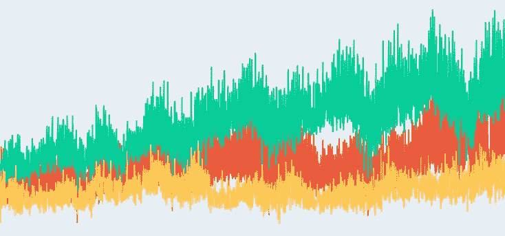
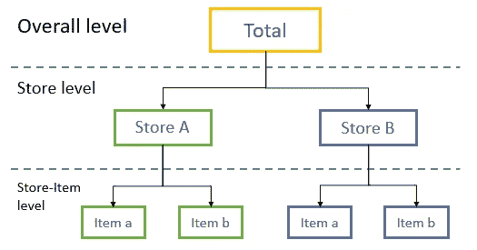
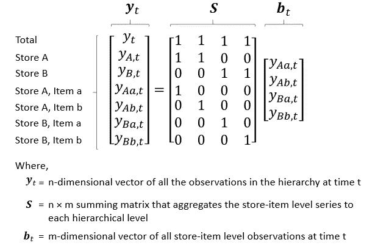
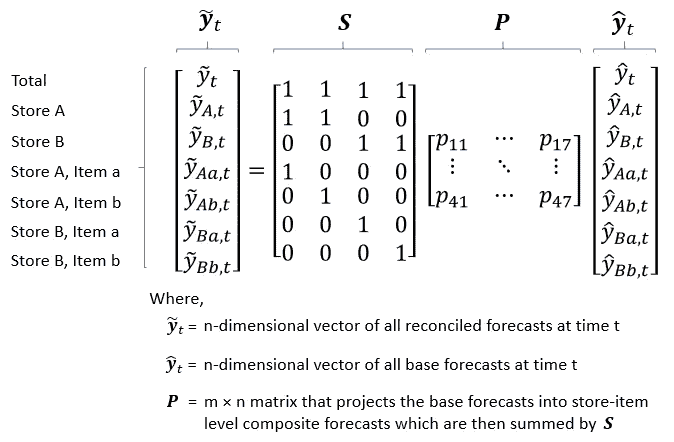
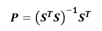
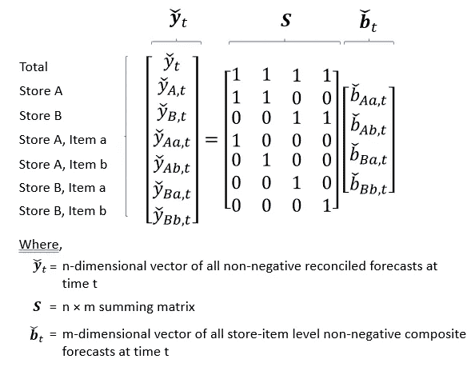
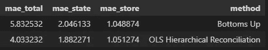

# 分层时间序列的最优预测协调

> 原文：<https://towardsdatascience.com/optimal-forecast-reconciliation-for-hierarchical-time-series-ea892ca105a9?source=collection_archive---------5----------------------->

## 分层预测的研究表明，我们可以做得比简单地累加成分更好

*(感谢* [*艾米莉·卡萨*](https://medium.com/u/96ce796615cc?source=post_page-----ea892ca105a9--------------------------------) *的反馈，这篇文章现在更新了关于非负面预测调和的内容。)*

作者图片

假设你需要预测一个零售连锁店在商品、商店和整体层面的销售额，你会怎么做？最有可能的情况是，您将预测每件商品的销售额，并将预测汇总到不同的总额中，对吗？

Rob J. Hyndman 教授以其在预测和时间序列方面的工作而闻名，他和他的团队在一篇论文[中指出，一个更好的方法可能是独立预测所有级别的所有时间序列，然后用回归模型对这些预测进行最佳协调。他的见解是，不同的聚合级别可能揭示要建模的数据的重要特征，因此在分层时间序列结构内进行协调的预测可能更优。](https://robjhyndman.com/papers/MinT.pdf)

[M5 赛](https://www.sciencedirect.com/science/article/pii/S0169207021001187)亚军也采用了类似的调整方法。在他们的解决方案中，LightGBM 模型是为产品商店级别构建的，而深度学习算法(N-BEATS)用于预测更高的聚合级别。然后根据 N-BEATS 生成的预测调整 LightGBM 模型。在我看来，这种方法的优点是团队能够使用适合手头任务的不同算法。对于表现出间歇性的产品商店级数据，LightGBM 可能更适合，而 N-BEATS 可能更能够提取较高聚合级别的趋势和季节性模式。

在本文中，我们将首先简要介绍预测协调的背景，然后深入研究一个改编自 M5 竞赛数据集的简化案例。

# 预测调节

以一家零售连锁店为例，下图显示了该连锁店时间序列的层次结构。

零售连锁店的图解层次结构|作者图片

层次结构的顶部是*总计*，接下来是*商店*和*商店项目*。

如前所述，虽然在将预测汇总到更高的级别之前，我们肯定可以在*商店项目*级别进行预测，但更好的做法可能是预测所有级别并调整这些预测，以便将较低级别的预测汇总到更高的级别。那么，我们如何调和这些预测呢？

Hyndman 教授的建议是将调和视为一个回归问题。

给定实际销售观察值，我们可以用下面的等式 1 来表示它们:

等式 1 |作者图片

假设我们要分别预测每个级别(文献将此类预测称为基本预测)，那么我们可以为协调问题编写以下等式 2:

等式 2 |作者图片

你们中的一些人可能意识到这个方程看起来非常类似于普通最小二乘法(OLS)提出的方程，事实上，最简单的方法是用 OLS 方法求解:

等式 3 |作者图片

还有其他方法来解决这个方程，你可以参考 Hyndman 教授的在线教材来了解细节。

在我们的零售销售环境中，我们可能还要求调节后的预测为非负数。

要确保非负的已调节预测，确保商店-物料层复合预测为非负就足够了，如以下等式 4 所示:

等式 4 |作者图片

正如由 [SL Wickramasuriya 等人在本文中所详述的。艾尔。(2019)](https://www.monash.edu/business/ebs/research/publications/ebs/wp15-2019.pdf) ，方程 4 可以构造为非负最小二乘问题(方程 5)。

等式 5 |作者图片

在下一节中，我们将提供一个关于预测调节的案例研究，以及一个用于求解 OLS 调节预测和非负调节预测的示例代码。

# 案例研究—🏪零售销售预测

虽然这个理论听起来不错，但它在实践中表现如何？

我们用来自 M5 竞赛的一个非常简化的[数据集做了一个实验，它包含了分级零售数据。这些数据涵盖了美国三个州的商店，包括商品和商店级别的详细信息。](https://github.com/Mcompetitions/M5-methods)

实验设置是这样的，我们将使用 LightGBM 算法在所有级别预测一个项目未来 7 天的单位销售。比较了两种方法:

1.  自下而上的方法(即，在*商店项目*级别进行预测，然后将它们加到每个总数中)；和
2.  预测调节方法(即，在用 OLS 方法调节预测之前，在每个级别独立进行预测)。

虽然实验可能不是非常广泛和彻底，但作为一个简单的案例研究说明应该足够了。

下面，我们比较每一级(*存储*、*状态*和*总计*)的两种方法的平均绝对误差(MAE)。

自下而上与预测协调方法的 MAE 比较|图片由作者提供

正如您所看到的，预测调节方法(标有“OLS 分级调节”)通常具有更准确的预测(MAE 更低)，但得出预测调节方法更好的结论将过于简单。我们使用的数据集毕竟简化了很多，商店和州级 MAE 的差异可能也没有统计学意义。

更有趣的是，尽管我们对商店级别的两种方法的预测具有相似的 MAE 性能，但自下而上的方法在更高的级别会导致更差的性能。这突出了一个反直觉的事实，即在底层更准确并不意味着更高层的汇总预测也将更准确。

它还表明了我们在开始时的观点，即不同的聚合级别可能揭示要建模的数据的重要特征，因此在协调它们之前，最好在每个级别进行预测。

为了执行预测协调，我们利用了 [*scikit-hts*](https://pypi.org/project/scikit-hts/) 软件包。用于调节预测的独立代码片段示例如下所示(带有用于非负调节预测的代码)。完整的案例研究代码，您可以在这里查看[。](https://colab.research.google.com/drive/1v_glauK3k4_-gy4XRPgxehRu6bjjAMtM?usp=sharing)

由于有许多时间序列表现出层次结构，我们希望这篇文章将是一个有用的参考这些时间序列的预测。

如果您喜欢这篇文章，您可能也会对这个关于“[使用深度学习进行端到端时间序列预测](https://www.manning.com/liveprojectseries/end-to-end-time-series-forecasting-with-deep-learning)”的 3 项目系列感兴趣。作为本系列的作者，我提供了如何交付用于时间序列预测的端到端机器学习应用程序的分步指南。

感谢阅读😄另外，如果您有任何问题或建议，请随时发表评论。

# 参考

 [## 11.3 预测协调|预测:原理与实践(第三版)

### 警告:这一章的其余部分是更高级的，并且假设你知道一些基本的矩阵代数。回想一下…

otexts.com](https://otexts.com/fpp3/reconciliation.html)  [## GitHub-carlomazzaferro/sci kit-HTS:使用熟悉的 API 进行分层时间序列预测

### 具有熟悉的 API 的分层时间序列。这是因为没有找到任何好的 HTS 实现…

github.com](https://github.com/carlomazzaferro/scikit-hts)