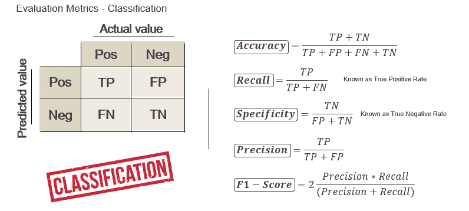
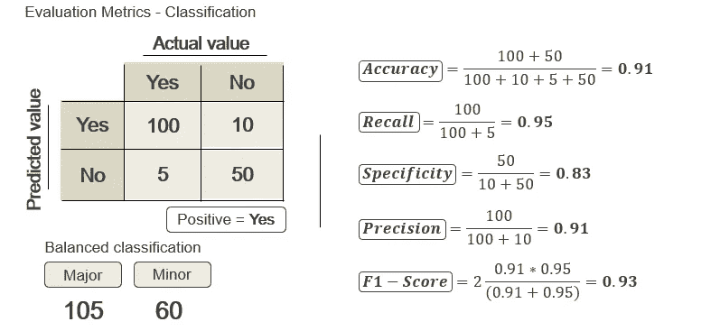
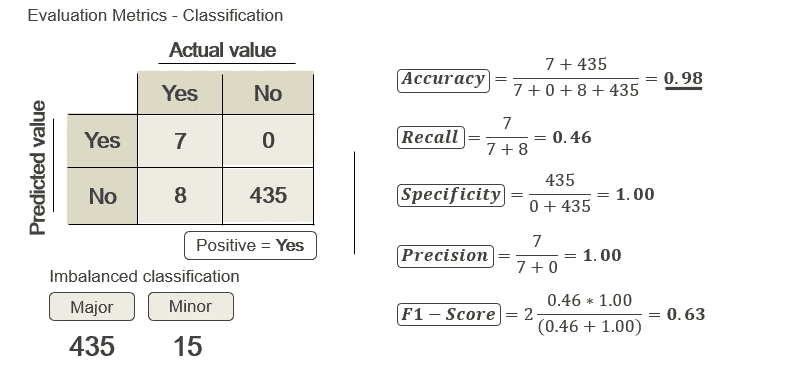
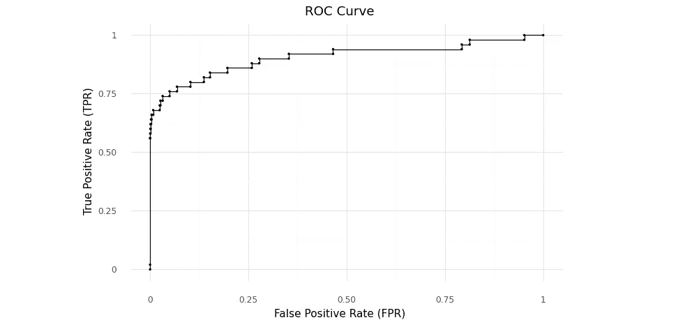
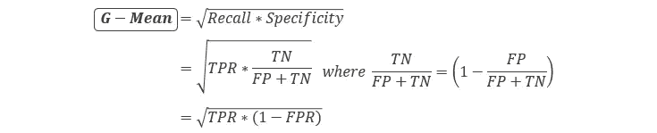
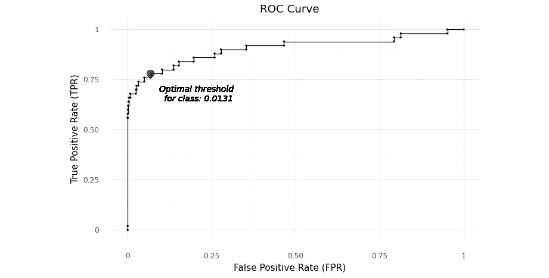
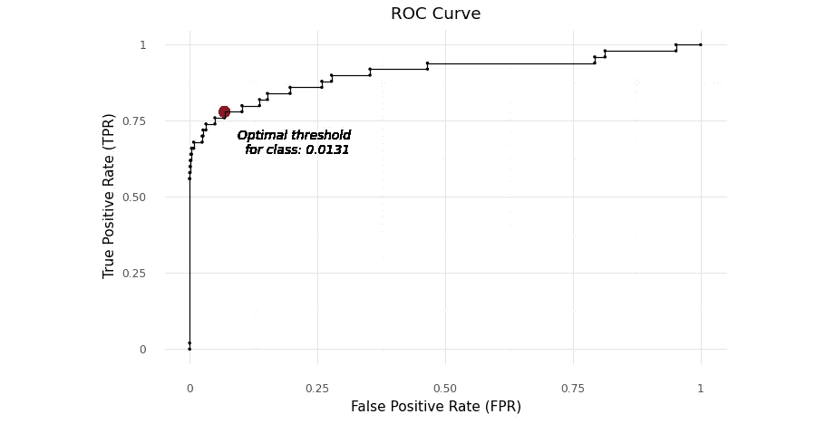
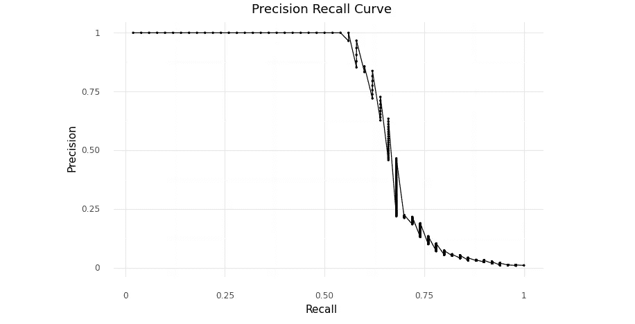
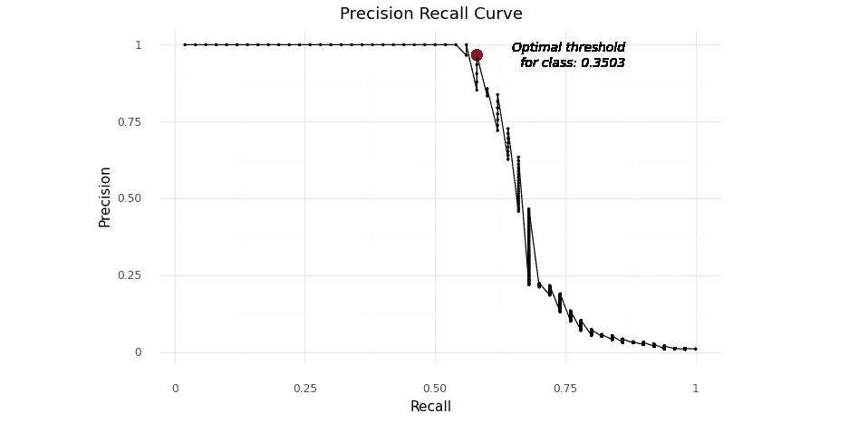
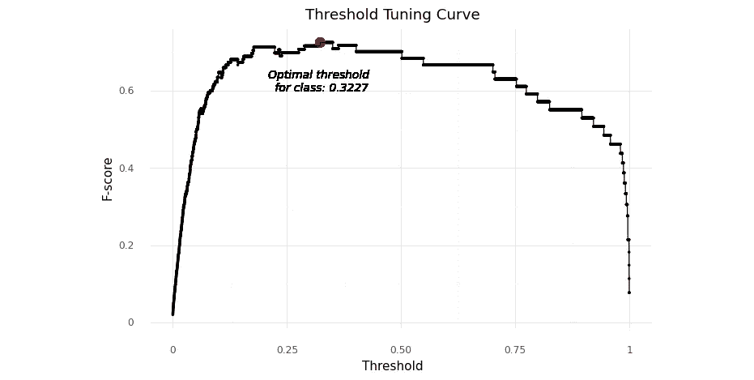

# 不平衡分类的最佳阈值

> 原文：<https://towardsdatascience.com/optimal-threshold-for-imbalanced-classification-5884e870c293?source=collection_archive---------0----------------------->

照片由 [Aaron Burden](https://unsplash.com/@aaronburden?utm_source=medium&utm_medium=referral) 在 [Unsplash](https://unsplash.com?utm_source=medium&utm_medium=referral)

## [动手教程](https://towardsdatascience.com/tagged/hands-on-tutorials)

## 如何利用 ROC 曲线和精确召回曲线选择最佳阈值

## 不平衡分类

分类是一种监督学习技术，用于对分类结果进行预测分析，它可能是二进制类或多类。目前，有很多关于使用几种算法进行分类的研究和案例，从基础到高级，如逻辑回归、判别分析、朴素贝叶斯、决策树、随机森林、支持向量机、神经网络等。它们已经得到了很好的发展，并成功地应用于许多应用领域。然而，数据集的不平衡类分布有一个问题，因为开发的大多数监督学习技术是针对平衡类分布的。

不平衡的类别分布通常发生在我们研究一种罕见的现象时，如医疗诊断、风险管理、骗局检测等等。

## 混淆矩阵概述

在深入讨论不平衡分类和如何处理这种情况之前，如果我们有一个关于混淆矩阵的良好基础就好了。混淆矩阵(也称为*误差矩阵*)包含关于由分类算法完成的实际和预测分类的信息。这种算法的性能通常使用矩阵中的数据来评估。下表显示了两类分类器的混淆矩阵。

混淆矩阵及其元素(图片由作者提供)

使用两类分类器的分类将具有如下四种可能的结果。

*   **真阳性**或 **TP**
*   **假阳性**或 **FP** (俗称*I 型错误*)
*   **真阴性**或 **TN**
*   **假阴性**或 **FN** (俗称*二类错误*)

> 点击 阅读更多关于*I 型错误*和*II 型错误* [**的信息**](https://en.wikipedia.org/wiki/Type_I_and_type_II_errors#:~:text=In%20statistical%20hypothesis%20testing%2C%20a,false%20negative%22%20finding%20or%20conclusion)

此外，为了在分类情况下评估我们的机器学习模型或算法，有一些评估指标可以探索，但如果我们遇到不平衡的类，这是很棘手的。

*   **精度**
*   **召回**或**灵敏度**
*   **特异性**
*   **精度**
*   **F1-得分**

对于不平衡分类，我们必须选择正确的评价指标，并保证它们是有效的和无偏的。这意味着这些评估指标的值必须代表数据的实际情况。例如，在不平衡分类中，由于类别的不同分布，准确性实际上会有偏差。看一下下面的研究案例来理解上面的陈述。

**平衡分类**
假设我们是一家科技公司的数据科学家，要求开发一个机器学习模型来预测我们的客户是否会流失。我们有 165 个客户，其中 105 个客户被归类为非流失客户，其余的被归类为流失客户。该模型产生如下给定的结果。

平衡分类的混淆矩阵(图片由作者提供)

作为一个平衡的分类，准确性可能是评估的无偏度量。它正确地表示了平衡类分布上的模型性能。在这种情况下，准确性与召回率、特异性、精确度等高度相关。根据混淆矩阵，更容易得出结论，我们的研究已经产生了一个最佳算法或模型。

**不平衡分类**
类似于上一个案例，但是我们修改了客户数量以构建不平衡分类。现在，总共有 450 个客户，其中 15 个客户被归类为流失客户，其余的 435 个客户没有流失。该模型产生如下给定的结果。

不平衡分类的混淆矩阵(图片由作者提供)

从上面混淆矩阵中的准确度来看，由于不平衡的阶级分布，结论可能具有误导性。当算法产生 0.98 的精度时会发生什么？这种情况下精度会有偏差。也不能代表车型性能。准确率够高但是召回率很差。此外，特异性和精确度等于 1.0，因为模型或算法不产生*假阳性*。这是不平衡分类的后果之一。然而，F1 分数将是模型性能的真实表示，因为它在计算中考虑了召回率和精确度。

> **注:**把数据分为正面和负面，仍然没有一个硬性的政策

除了上面提到的一些评估指标之外，还有两个重要的指标需要理解，如下所示。

假阳性率和假阴性率公式(图片由作者提供)

*   **假阳性率**
*   **假阴性率**

## 分类的默认阈值

为了比较评价指标的使用和确定不平衡分类的概率阈值，提出了真实数据模拟。该模拟生成了 10，000 个样本，其中包含两个变量，即因变量和自变量，主要类别和次要类别之间的比例约为 99:1。属于不平衡分类，毫无疑问。

为了处理不平衡类，阈值移动被提出作为处理不平衡类的替代方法。从理论上讲，生成综合观测值或对某个数据进行重新采样有其自身的风险，就像创建一个实际上不会出现在数据中的新观测值，减少数据本身的有价值信息或创建大量信息。

生成模拟数据

## 寻找最佳阈值的 ROC 曲线

*X* 轴或自变量是预测测试的*假阳性率*。 *Y* 轴或因变量是预测测试的*真阳性率*。完美的结果应该是点(0，1)表示 0%假阳性和 100%真阳性。

计算 ROC 曲线

ROC 曲线(作者图片)

## **G 均值**

几何平均或称为 G-平均是敏感性(称为回忆)和特异性的几何平均。因此，它将成为不平衡分类的无偏评价指标之一。

几何平均公式(图片由作者提供)

计算几何平均数

利用 G-mean 作为无偏的评价指标和阈值移动的主要焦点，产生了 0.0131 的二分类最优阈值。理论上，当其概率低于 0.0131 时，观察值将被归类为次要类别，反之亦然。

G 均值最高的 ROC 曲线(图片由作者提供)

## 尤登 J 统计量

要讨论的指标之一是尤登的 J 统计。优化 Youden 的 J 统计将确定分类的最佳阈值。

计算尤登 J 统计量

Youden 的 J 指数给出了与使用 G-均值相同的阈值结果。它在 0.0131 中产生二元分类的最佳阈值。

约登 J 值最高的 ROC 曲线(图片由作者提供)

## 寻找最佳阈值的精确-召回曲线

精度-召回曲线是表示精度和召回之间关系的图形。

计算精确度和召回率

精确召回曲线(图片由作者提供)

有几个评估指标可以用作计算的主要焦点。它们是 G 均值、F1 得分等。只要它们是用于不平衡分类的无偏度量，就可以应用于计算中。

计算 F1 分数

使用精确回忆曲线和 F1 分数，它产生 0.3503 的阈值，用于确定给定的观察值是属于主要类别还是次要类别。由于方法不同，它与以前使用 ROC 曲线的技术有太大的不同。

F1 分数最高的精确召回曲线(图片由作者提供)

## 其他方法—阈值调节

阈值调整是为不平衡分类确定最佳阈值的常用技术。阈值序列是根据研究者的需要生成的，而先前的技术使用 ROC 和 Precision & Recall 来创建这些阈值的序列。优点是根据需要定制阈值序列，但是它将具有较高的计算成本。

利用生成的阈值序列进行阈值调节

语法`**np.arrange(0.0, 1.0, 0.0001)**`意味着阈值有 10，000 个候选。使用循环机制，它试图找出受试者的最佳阈值，以最大化 F1 分数作为无偏度量。最后，停止循环机制并打印出最佳阈值 0.3227。

F1 分数最高的阈值调整曲线(图片由作者提供)

非常感谢 [**杰森·布朗利**](https://machinelearningmastery.com/) 给了我学习的动力，让我在统计学和机器学习实现方面更加努力，尤其是在阈值移动技术方面，他的文章清晰而恰当。谢谢！

不平衡分类的最佳阈值

## 结论

机器学习算法主要在平衡分类上工作良好，因为它们的算法假设使用目标变量的平衡分布。此外，精度不再与不平衡的情况相关，它是有偏见的。所以，主要的焦点必须转移到那些无偏的指标上，比如 G 均值、F1 分数等等。使用 ROC 曲线、精确召回曲线、阈值调整曲线的阈值移动可以是处理不平衡分布的备选解决方案，因为重采样技术看起来对业务逻辑没有意义。但是，选项是开放的，实施必须考虑业务需求。

## 参考

[1] J .布朗利。<https://machinelearningmastery.com/threshold-moving-for-imbalanced-classification/>*(2020)不平衡分类的阈值移动。【https://machinelearningmastery.com/】T4。*