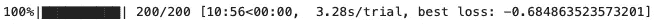
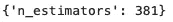
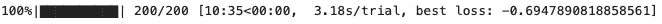
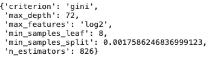

# 远视教程:优化您的超参数调谐

> 原文：<https://towardsdatascience.com/optimise-your-hyperparameter-tuning-with-hyperopt-861573239eb5?source=collection_archive---------8----------------------->

## 使用 Hyperopt 的贝叶斯超参数调整的简单解释和实现


约书亚·阿拉贡在 [Unsplash](https://unsplash.com?utm_source=medium&utm_medium=referral) 上拍摄的照片

# 介绍

[**超参数调整**](https://en.wikipedia.org/wiki/Hyperparameter_optimization) 是数据科学和机器学习工作流的一个重要组成部分，因为它可以挤压模型所能提供的最佳性能。因此，您选择执行超参数调整的方法非常重要。**网格搜索**是穷尽式的，而**随机搜索**是完全随机的，因此可能会错过最重要的值。但是，通过**hyperpt**包有一个更好的方法！

**Hyperopt** 是一个开源的超参数调整库，它使用**贝叶斯**方法来寻找超参数的最佳值。我不打算深入这个贝叶斯方法如何工作的理论细节，主要是因为它需要另一整篇文章来充分解释！然而，感兴趣的读者可以在这里查看文档<http://hyperopt.github.io/hyperopt/>****，如果你感兴趣的话，还有几篇关于这个主题的研究论文。****

****在本文中，我们将把一个 **RandomForestClassifier** 模型拟合到 Kaggle 提供的 [**水质**](https://www.kaggle.com/adityakadiwal/water-potability) (CC0 域)数据集。然后，我们将使用**hyperpt 调整模型的超参数。******

## ****符合简单模型****

****首先，我们读入数据，并为我们的训练集拟合一个简单的 **RandomForestClassifier** 模型:****

```
**# read in packages
import matplotlib.pyplot as plt
import pandas as pd
import numpy as np
from sklearn.model_selection import train_test_split
from sklearn.ensemble import RandomForestClassifier
from sklearn.metrics import accuracy_score# read in the data and info
data = pd.read_csv('../input/water-potability/water_potability.csv')# remove missing values
data = data.dropna()# split to train and test
X = data.drop(['Potability'], axis = 1)
y = data['Potability']
x_train, x_test, y_train, y_test = train_test_split(X, y, test_size = 0.2, random_state=200)# build the model
model = RandomForestClassifier(n_estimators=300, max_features='sqrt', random_state=42)
model.fit(x_train, y_train)
y_pred = model.predict(x_test)# print out the score accuracy
print("Accuracy:", accuracy_score(y_test, y_pred))**
```

****运行上面的代码会产生 67.24% 的精确度。这是可以的，但我们可以通过超参数调整来改善这一点！****

## ****设置 Hyperopt****

****要使用 Hyperopt，我们需要为我们的模型指定四个关键要素:****

1.  ******目标函数|** 这将返回我们希望在计算过程中最小化的值。在我们的例子中，它是“accuracy_score”函数。****
2.  ******搜索空间|** 这定义了给定超参数的取值范围。这可以是整数、浮点数或字符串，我们将在本文后面看到。****
3.  ******调优算法|** 在 Hyperopt 中，有两种主要的超参数搜索算法:随机搜索和 Parzen 估计器树(贝叶斯)。在本例中，我们将使用后者，因为它已知会产生最佳结果。****
4.  ******评估|** 这是指训练模型的不同超参数实例的数量。建议这是搜索空间中定义的超参数数量的 10-30 倍，以优化性能和计算时间。****

****在下一节中，我们将展示一个示例，说明如何为我们上面创建的简单随机森林模型实现上述步骤。****

## ****具有一个超参数的远视****

****在本例中，我们将只调整一个超参数，即**‘n _ estimators’******

****在 Hyperopt 中首次阅读:****

```
**# read in hyperopt values
from hyperopt import fmin, hp, tpe, Trials, space_eval, STATUS_OK**
```

****现在我们定义我们的目标函数。这将只是“n_estimators”的一个函数，它将返回从**“accuracy _ score”**函数推断出的**减去精度**。我们取负值精度的原因是因为 **Hyperopt 的目标是最小化目标**，因此我们的精度需要为负，我们可以在最后使其为正。****

```
**# define the function we want to minimise
def objective(n_estimators):
    model = RandomForestClassifier(n_estimators=n_estimators,
                                   max_features='sqrt',
                                   random_state=42) model.fit(x_train, y_train)
    y_pred = model.predict(x_test)
    accuracy = accuracy_score(y_test, y_pred)
    return {'loss': -accuracy, 'status': STATUS_OK}**
```

****定义‘n _ estimators’的搜索空间:****

```
**# define the values to search over for n_estimators
search_space = hp.randint('n_estimators', 200, 1000)**
```

****这里， **'hp.randint'** 在给定的范围内给' n_estimators '分配一个随机整数，在这种情况下是 200 到 1000。****

****指定算法:****

```
**# set the hyperparam tuning algorithm
algorithm=tpe.suggest**
```

****这意味着 Hyperopt 将使用“**Parzen 估计器树”(tpe)** ，这是一种贝叶斯方法。****

****最后，我们使用**‘fmin’**函数将它结合起来。‘**fn’**功能目标是最小化分配给它的功能，这是上面定义的目标。另外，**‘max _ evals’**指的是我们要测试的不同超参数的数量，这里我任意设置为 200。****

```
**best_params = fmin(
  fn=objective,
  space=search_space,
  algo=algorithm,
  max_evals=200)**
```

****生成的代码块的输出如下所示:****

********

****图片作者。****

****我们看到我们的准确率提高到了 68.5% ！然后我们可以调用**‘best _ params’**来找到产生该模型的‘n _ estimators’的相应值:****

```
**print(best_params)**
```

****输出是:****

********

****图片作者。****

## ****调整多个超参数****

****使用与上面相同的想法，我们可以将**多个参数**作为字典传递到目标函数中。下面的代码块显示了这一点的实现:****

```
**# redefine the function usng a wider range of hyperparameters
def objective(search_space):
    model = RandomForestClassifier(**search_space, random_state=42)
    model.fit(x_train, y_train)
    y_pred = model.predict(x_test)
    accuracy = accuracy_score(y_test, y_pred)
    return {'loss': -accuracy, 'status': STATUS_OK}# new search space
search_space={'n_estimators':hp.randint('n_estimators',200,1000),

              'max_depth': hp.randint('max_depth',10,200),           

            'min_samples_split':hp.uniform('min_samples_split',0,1),                'min_samples_leaf':hp.randint('min_samples_leaf',1,10),

               'criterion':hp.choice('criterion'['gini','entropy']),

           'max_features':hp.choice('max_features',['sqrt', 'log2']) }# implement Hyperopt
best_params = fmin(
  fn=objective,
  space=search_space,
  algo=algorithm,
  max_evals=200)**
```

*******注意|***** * search _ space 意味着我们在这个字典中读入键值对作为 RandomForestClassifier 类内部的参数。*****

****在这个搜索空间中，除了**‘HP . randint’**之外，我们还使用了**‘HP . uniform’**和’**HP . choice .’**前者选择指定范围内的任意浮点数，后者从指定字符串中选择一个值。****

****该计算的输出是:****

********

****图片作者。****

****精确度提高到了 69.5%！****

****然后我们可以调用**‘space _ evals’**函数来输出我们模型的最佳超参数。****

```
**space_eval(search_space, best_params)**
```

****输出是:****

********

****图片作者。****

*******注意*** *|如果你不使用‘space _ eval’而只是打印字典，它只会给你分类特征的索引，而不是它们的实际名称。*****

****我们走吧！我们刚刚使用 Hyperopt 调整了我们的模型，一点也不困难！****

****希望你喜欢这篇关于如何简单实现 Hyperopt 的文章！****

> ****另一个简洁的特性是，Hyperopt 允许您使用**分布式计算**，我将在另一篇文章中介绍这个特性。这意味着，如果您有**个多核**或者在**外部计算集群**上运行模型，您可以**运行多个具有不同超参数**的模型**。这种方法极大地优化了你的计算时间，这在对非常大的数据集进行训练时非常有用。******

**如果您想查看撰写本文时使用的完整代码，可以在下面找到:**

**<https://github.com/egorhowell/Medium-Articles/blob/main/Data%20Science%20Basics/Hyperparameter_Tuning_With_Hyperopt.ipynb>  

我还创建了一个更新版本(2022 年 9 月)，您可以在这里找到:

<https://github.com/egorhowell/Medium-Articles/blob/main/Data%20Science%20Basics/Hyperparameter_Tuning_With_Hyperopt_V2.ipynb>  

# 和我联系！

*   要在媒体上阅读无限的故事，请务必在这里注册！T37*💜*
*   [*在我发布注册邮件通知时获取更新！*](/subscribe/@egorhowell) 😀
*   [*LinkedIn*](https://www.linkedin.com/in/egor-howell-092a721b3/)*👔*
*   *[*碎碎念*](https://twitter.com/EgorHowell) 🖊*
*   *[*github*](https://github.com/egorhowell)*🖥**
*   **<https://www.kaggle.com/egorphysics>**🏅****

> ***(所有表情符号都是由 [OpenMoji](https://openmoji.org/) 设计的——开源的表情符号和图标项目。执照: [CC BY-SA 4.0](https://creativecommons.org/licenses/by-sa/4.0/#)*****