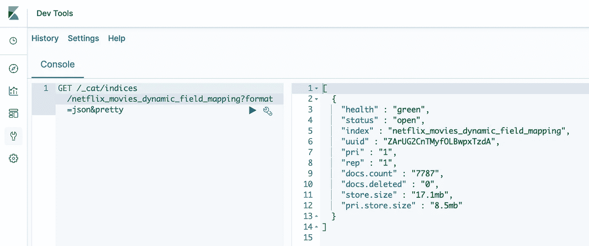

# 优化弹性搜索中的磁盘使用

> 原文：<https://towardsdatascience.com/optimising-disk-usage-in-elasticsearch-d7b4238808f7?source=collection_archive---------8----------------------->

## [理解大数据](https://towardsdatascience.com/tagged/making-sense-of-big-data)

## 在处理大量连续的数据流时，这里有三个策略可以减少弹性搜索索引的存储空间


由[彼得罗·郑](https://unsplash.com/@pietrozj?utm_source=medium&utm_medium=referral)在 [Unsplash](https://unsplash.com?utm_source=medium&utm_medium=referral) 上拍摄的照片

近年来，lasticsearch (ES)获得了广泛的关注，因为它提供了一个强大的、可扩展的引擎，可以低延迟地存储和分析大量数据。如果您是处理大量(且快速增长的)数据的数据工程师或数据科学家，您会知道存储优化是构建高质量解决方案的关键组成部分。在本文中，我将讨论使用 es 时优化磁盘使用的三种策略。这篇博文的复制代码可以在 [GitHub](https://github.com/ngoet/es_demo) 上找到。

# 弹性研究快速入门

在我们开始探索 Elasticsearch (ES)存储优化之前，让我们回顾一些 ES 基础知识。

如果你问，比如说，四个开发人员来描述 ES 是什么，你可能会得到同样多不同的答案。这并不奇怪:ES 可以用作存储引擎，用于应用机器学习来实时建模数据，以及分析事件和日志，等等。此外，ES 可以处理不同的数据类型(结构化和非结构化)，而它的分布式特性使它可以处理大量数据。因此，ES 有理由成为各行各业越来越多公司的首选解决方案，包括 Airbnb、优步、沃尔玛、思科和易贝。

要理解 ES 的力量，我们需要理解它的基本原理。Elasticsearch 是一个基于 Lucene 的分布式搜索和分析引擎。当您设置和部署一个 Elasticsearch 集群时，您可以[添加不同的节点(服务器)](https://www.elastic.co/guide/en/elasticsearch/reference/current/scalability.html)。您的数据和针对 es 索引中的数据运行的查询都分布在这些节点上，所有这些都是自动完成的，以提供可伸缩性和高可用性。

ES 中的数据组织在“**指数**”中。弹性搜索指数是数据的逻辑分组，遵循一个模式，但该术语也涵盖了通过碎片对数据的实际*物理*组织。每个索引由一个[“一个或多个物理碎片的逻辑分组”](https://www.elastic.co/guide/en/elasticsearch/reference/current/scalability.html)组成。反过来，每个碎片都是一个独立的索引。

存储在 ES 索引中的数据是名为“ [**documents**](https://www.elastic.co/guide/en/elasticsearch/reference/7.12/documents-indices.html) ”的 JSON 对象。这些文档由**字段**(键-值对)组成，并在“**碎片**”之间划分，这些碎片分布在各个节点上。每个文档都属于一个“主碎片”和一个或多个“副本碎片”(假设您已经为索引配置了副本碎片)。因此，Elasticsearch 通过由节点和碎片组成的设计来实现冗余，其中包括主碎片和副本。

在接下来的内容中，我将集中讨论优化 es 中数据存储的三个策略:I)设计好你的索引；ii)优化您的索引映射 iii)使用热-暖-冷架构。我们将使用我在之前关于 Elasticsearch 的博客文章中设置的索引。这是 Kaggle 上可用的[网飞秀的元数据数据集。我们将逐步优化这个索引。](https://www.kaggle.com/shivamb/netflix-shows)

*如果你想了解更多关于提供一个 ES 集群和设置索引的信息，请阅读我在* [*上的帖子用 Python 创建和管理弹性搜索索引*](/creating-and-managing-elasticsearch-indices-with-python-f676ff1c8113) *。*

[](/creating-and-managing-elasticsearch-indices-with-python-f676ff1c8113) [## 使用 Python 创建和管理弹性搜索索引

### 从 CSV 文件创建 ES 索引以及使用 Python Elasticsearch 管理数据的实践指南…

towardsdatascience.com](/creating-and-managing-elasticsearch-indices-with-python-f676ff1c8113) 

在我们开始之前，请注意这篇博文中使用的数据仅包含 7787 个“静态”条目，无论如何也不能被归类为“大数据”。然而，本文中讨论的原则可以概括为大数据和流。

# 策略 1:删减数据并定义自己的映射

首先，冒着说出显而易见的事实的风险:你必须设计好你的弹性搜索指数。这首先要决定什么可以纳入你的指数，更重要的是，什么不可以。比如你需要把你所有的数据都存储在 Elasticsearch 里吗？或者，您是否只需要将 Elasticsearch 作为一个低延迟的存储，用于存储应用程序需要访问的数据子集，而其他数据可以存储在其他地方？如果后一个问题的答案是肯定的，那么您就可以很容易地识别出一些“立竿见影”的效果，并删除多余的数据。

一旦决定了 Elasticsearch 中需要哪些数据，请确保很好地定义了映射。Elasticsearch 能够使用[动态字段映射](https://www.elastic.co/guide/en/elasticsearch/reference/current/dynamic-field-mapping.html)推断您的数据映射。这意味着每当 ES 在文档中检测到一个新的字段时，它会动态地将字段类型添加到映射中。但这并不意味着它以一种最适合数据存储或您所想的目的的方式来实现。

[动态字段映射](https://www.elastic.co/guide/en/elasticsearch/reference/current/dynamic-field-mapping.html)(当`[dynamic](https://www.elastic.co/guide/en/elasticsearch/reference/current/dynamic.html)`参数设置为`true`时)将例如[索引字符串字段为](https://www.elastic.co/guide/en/elasticsearch/reference/current/tune-for-disk-usage.html) `[text](https://www.elastic.co/guide/en/elasticsearch/reference/current/tune-for-disk-usage.html)` [和](https://www.elastic.co/guide/en/elasticsearch/reference/current/tune-for-disk-usage.html) `[keyword](https://www.elastic.co/guide/en/elasticsearch/reference/current/tune-for-disk-usage.html)`。你通常只需要这两个中的一个。`text`字段类型在索引时被分解成单个术语，并允许部分匹配。相反，索引时不分析`keyword`类型(或者说:“标记化”)，只允许精确匹配(在我们的`netflix_movies`示例中，我们可以对`type`字段使用`keyword`字段类型，它取两个值之一——“电影”或“电视节目”)。

为了建立一个基线来比较我们的优化策略，我们将首先使用[动态字段映射](https://www.elastic.co/guide/en/elasticsearch/reference/current/dynamic-field-mapping.html)将网飞电影数据写入一个新的 es 索引，而无需定义我们自己的映射。ES 为我们的`netflix_movies`数据推断出以下映射:

```
{
 "netflix_movies_dynamic_field_mapping": {
  "mappings": {
   "properties": {
    "cast": {
     "type": "text",
     "fields": {
      "keyword": {
       "type": "keyword",
       "ignore_above": 256
      }
     }
    },
    "country": {
     "type": "text",
     "fields": {
      "keyword": {
       "type": "keyword",
       "ignore_above": 256
      }
     }
    },
    "date_added": {
     "type": "text",
     "fields": {
      "keyword": {
       "type": "keyword",
       "ignore_above": 256
      }
     }
    },
    "description": {
     "type": "text",
     "fields": {
      "keyword": {
       "type": "keyword",
       "ignore_above": 256
      }
     }
    },
    "director": {
     "type": "text",
     "fields": {
      "keyword": {
       "type": "keyword",
       "ignore_above": 256
      }
     }
    },
    "duration": {
     "type": "text",
     "fields": {
      "keyword": {
       "type": "keyword",
       "ignore_above": 256
      }
     }
    },
    "listed_in": {
     "type": "text",
     "fields": {
      "keyword": {
       "type": "keyword",
       "ignore_above": 256
      }
     }
    },
    "rating": {
     "type": "text",
     "fields": {
      "keyword": {
       "type": "keyword",
       "ignore_above": 256
      }
     }
    },
    "release_year": {
     "type": "long"
    },
    "show_id": {
     "type": "text",
     "fields": {
      "keyword": {
       "type": "keyword",
       "ignore_above": 256
      }
     }
    },
    "title": {
     "type": "text",
     "fields": {
      "keyword": {
       "type": "keyword",
       "ignore_above": 256
      }
     }
    },
    "type": {
     "type": "text",
     "fields": {
      "keyword": {
       "type": "keyword",
       "ignore_above": 256
      }
     }
    }
   }
  }
 }
}
```

请注意，我们的目标是减少索引的磁盘使用量，即`store.size`参数。此参数表示集群上索引的主碎片和复制碎片的存储大小。您可以使用 Kibana 控制台中的[CAT indexes API](https://www.google.co.uk/search?q=CAT+indices+API&client=safari&source=hp&ei=QPlpYIDFMevYgwfLkr7gDQ&iflsig=AINFCbYAAAAAYGoHUNoVnfkkKa3B3-yI2Ja62TmRbazs&oq=CAT+indices+API&gs_lcp=Cgdnd3Mtd2l6EAMyAggAMgYIABAWEB46AgguOggILhDHARCjAjoFCC4QkwI6CAguEMcBEK8BOgUIABDJAzoECAAQCjoICAAQFhAKEB5Q7gZY1Blg1htoAXAAeACAAVmIAYUIkgECMTaYAQCgAQGqAQdnd3Mtd2l6&sclient=gws-wiz&ved=0ahUKEwiA5bS8kOXvAhVr7OAKHUuJD9wQ4dUDCAo&uact=5)来检查您的索引的存储大小。使用动态字段映射，我们得到 17.1 MB 的基线存储大小(参见下面的屏幕截图)。



使用 ES 的动态字段映射存储大小(图片由作者提供)

通过显式定义映射，我们能比我们的基线 17.1 MB 做得更好吗？让我们从我之前的博客文章中的简单(未经优化的)映射开始。除了`release_year`(我们将它定义为一个整数)之外，我们将所有字段都设为`text`类型:

`netflix_movies`的索引存储大小为 9.3 MB，与我们的基线映射相比减少了 7.8 MB(减少了近 46 个百分点。).


使用[卡特彼勒索引 API](https://www.google.co.uk/search?q=CAT+indices+API&client=safari&source=hp&ei=QPlpYIDFMevYgwfLkr7gDQ&iflsig=AINFCbYAAAAAYGoHUNoVnfkkKa3B3-yI2Ja62TmRbazs&oq=CAT+indices+API&gs_lcp=Cgdnd3Mtd2l6EAMyAggAMgYIABAWEB46AgguOggILhDHARCjAjoFCC4QkwI6CAguEMcBEK8BOgUIABDJAzoECAAQCjoICAAQFhAKEB5Q7gZY1Blg1htoAXAAeACAAVmIAYUIkgECMTaYAQCgAQGqAQdnd3Mtd2l6&sclient=gws-wiz&ved=0ahUKEwiA5bS8kOXvAhVr7OAKHUuJD9wQ4dUDCAo&uact=5) 在 [Kibana 控制台](https://www.elastic.co/guide/en/kibana/7.12/console-kibana.html)上检查 ES 集群上的索引(图片由作者提供)

# 策略 2:基于映射的优化

减少索引存储大小的第二个策略是优化映射。在定义映射时，有几种选择可以减少存储大小。这里的权衡是在搜索能力和限制索引大小之间:通常，你对存储优化得越多，查询数据的灵活性就越小。

## 选择正确的字段类型

首先，为您的字段选择正确的数据类型。在我们的`netflix_movies`示例中，我们可以将`type`、`country`和`rating`字段转换成关键字字段类型，因为这些字段只能采用一些预定义的值，我们可以预期不必使用部分匹配。

还要确保[检查你的变量是否适合“更小”的数据类型](https://www.elastic.co/guide/en/elasticsearch/reference/current/tune-for-disk-usage.html)。例如，我们可以通过使用`short`而不是`integer`字段类型来进一步减小`release_year`的大小。`short`字段类型是一个 [16 位整数](https://www.elastic.co/guide/en/elasticsearch/reference/current/number.html)。我们改进后的索引如下所示:

与我们的基准 17.1 MB 相比，这一优化的索引使我们的数据减少到了 8.7mb(减少了 49.1%)。与我们未优化的映射(9.3 MB)相比，这表示磁盘使用量减少了 6.5%。然而，如果您正在处理真正大量的数据，即使这些小的百分比也可以代表显著的节省。

## 不要索引你不需要过滤的内容

其次，您可以[对不需要在](https://www.elastic.co/guide/en/elasticsearch/reference/current/tune-for-disk-usage.html)上过滤的字段禁用索引。索引是为了快速检索而组织的数据。在 ES 中，`text`字段例如[存储在倒排索引](https://www.elastic.co/guide/en/elasticsearch/reference/current/documents-indices.html#documents-indices)中(即:文档—术语→术语—文档)，而数字字段类型例如存储在 BKD 树中。

在我们的`netflix_movies`示例中，从索引中排除的潜在候选对象是`duration`和`description`。前者在连续剧和电影之间的定义并不一致(前者以季为单位，后者以分钟为单位)。如果我想过滤持续时间，我可能会进一步处理这些数据并创建一个新字段。`description`反过来可能对部分匹配有用，但是让我们假设(为了说明的目的)我们只对通过元数据识别电影感兴趣，然后阅读它们的描述。

为了关闭特定字段的索引，我们将`index`选项设置为`False`:

使用这个新映射写入我们的`netflix_movies`数据会产生一个总大小为 7.5 MB 的索引(与我们之前的迭代相比减少了 3.0%)。

## 如果不需要相关性分数，就不要规范化文本字段

第三，如果你不需要相关性分数，你可以去掉`text`字段的标准化因子。[归一化因子存储在索引中，用于评分](https://www.elastic.co/guide/en/elasticsearch/reference/current/norms.html)，即给用户定义的查询与文档的相关性附加一个数值的过程。这些标准化因子占用了大量的磁盘空间(即[每个字段每个文档一个字节，包括不包含所述字段](https://www.elastic.co/guide/en/elasticsearch/reference/current/norms.html)的文档)。

让我们假设我们对相关性分数不感兴趣，并且我们可以放弃所有文本字段的标准化因子。我们更新后的映射如下所示(注意添加了`“norms”: False`):

移除所有文本字段的标准化因子后，我们的大小降至 7.3 MB(与之前的优化步骤相比，又减少了 1.2%)。

总之，对于我们的不同优化选项，我们看到了以下索引存储大小和`netflix_movies`数据的磁盘使用量减少:

# 策略 3:使用热-暖-冷架构

优化磁盘使用的第三个策略(或者更确切地说:减少磁盘使用的*成本*)是使用热-暖-冷架构，使用[索引生命周期管理(ILM)](https://www.elastic.co/guide/en/elasticsearch/reference/current/index-lifecycle-management.html) 和[自动索引翻转](https://www.elastic.co/guide/en/elasticsearch/reference/current/getting-started-index-lifecycle-management.html)。

Elastic (ELK)堆栈(即:Elasticsearch、Kibana、Beats 和 Logstash) [的创建者在 2020 年 11 月宣布为他们的 Elasticsearch 服务提供更好的低成本冷层支持](https://www.elastic.co/blog/introducing-elasticsearch-searchable-snapshots)。[官方 ES 服务](https://www.elastic.co/elasticsearch/service)现在支持可以驻留在对象存储中的冷层，包括 [AWS 的简单云存储(S3)](https://aws.amazon.com/free/?all-free-tier.sort-by=item.additionalFields.SortRank&all-free-tier.sort-order=asc&awsf.Free%20Tier%20Categories=categories%23storage&trk=ps_a134p000006paz5AAA&trkCampaign=acq_paid_search_brand&sc_channel=PS&sc_campaign=acquisition_ND&sc_publisher=Google&sc_category=Storage&sc_country=ND&sc_geo=EMEA&sc_outcome=acq&sc_detail=aws%20s3&sc_content=S3_e&sc_matchtype=e&sc_segment=494837903412&sc_medium=ACQ-P%7CPS-GO%7CBrand%7CDesktop%7CSU%7CStorage%7CS3%7CND%7CEN%7CText%7Cxx%7CNon-EU&s_kwcid=AL!4422!3!494837903412!e!!g!!aws%20s3&ef_id=EAIaIQobChMI0YHTgOPy7wIVk-N3Ch2JOwnnEAAYASAAEgJd-_D_BwE:G:s&s_kwcid=AL!4422!3!494837903412!e!!g!!aws%20s3) 、[谷歌云存储](https://www.elastic.co/guide/en/elasticsearch/plugins/7.12/repository-gcs.html)、 [Azure Blob 存储](https://www.elastic.co/guide/en/elasticsearch/plugins/7.12/repository-azure.html)、 [Hadoop 分布式文件存储(HDFS)](https://www.elastic.co/guide/en/elasticsearch/plugins/7.12/repository-hdfs.html) 以及[共享文件系统](https://www.elastic.co/guide/en/elasticsearch/reference/current/snapshots-register-repository.html#snapshots-filesystem-repository)如 NFS。与暖层相比，[冷存储可以将您的集群存储减少 50%](https://www.elastic.co/blog/introducing-elasticsearch-searchable-snapshots)。

冷层功能是 Elastic 项目生命周期管理的一部分，您可以为数据转换规则定义自己的标准。这意味着你可以在 S3 上以“[可搜索快照](https://www.elastic.co/guide/en/elasticsearch/reference/current/searchable-snapshots.html)”的形式更便宜地存储你的旧数据，同时保持查询能力。搜索性能应该与搜索常规索引相当。

将热-暖-冷架构与 ES 结合使用涉及[配置生命周期策略来定义索引的热、暖、冷阶段](https://www.elastic.co/guide/en/elasticsearch/reference/current/getting-started-index-lifecycle-management.html)。例如，您可以将索引配置为在设定的天数后，或者在索引达到某个大小限制后，从热状态翻转到暖状态。您可以重复这种模式进行从暖到冷的翻转。

可以通过 Kibana 控制台配置生命周期策略。或者，您可以使用[创建或更新策略](https://www.elastic.co/guide/en/elasticsearch/reference/current/ilm-put-lifecycle.html) API。下面的例子定义了一个策略，如果数据超过 30 天，或者索引的大小超过 20 GB，那么[翻转索引](https://www.elastic.co/guide/en/elasticsearch/reference/7.12/indices-rollover-index.html)，并开始写入新的索引。随后，该策略会在 60 天后将当前索引(已转存的索引)移到暖阶段，并在 75 天后移到冷阶段。

```
PUT _ilm/policy/netflix_movies_lp
{
  "policy": {
    "phases": {
      "hot": {
        "actions": {
          "rollover": {
            "max_size": "20gb",
            "max_age": "30d"
          }
        }
      },
      "warm": {
        "min_age": "60d"
      },
      "cold": {
        "min_age": "75d",
        "actions": {
          "searchable_snapshot": {
            "snapshot_repository": "my-repository"
          }
        }
      },
      "delete": {
        "min_age": "90d",
        "actions": {
          "delete": {}
        }
      }
    }
  }
}
```

第二步，我们可以将上述策略与进入`netflix_movies`索引的任何文档相关联:

```
PUT _index_template/netflix_movies_template
{
  "index_patterns": ["netflix_movies"],                   
  "data_stream": { },
  "template": {
    "settings": {
      "number_of_shards": 1,
      "number_of_replicas": 1,
      "index.lifecycle.name": "netflix_movies_lp"     
    }
  }
}
```

随后，任何被推送到索引的文档都将受到`netflix_movies_lp`生命周期策略的约束，并逐步从热存储转移到温存储，再转移到冷存储。

关于 ILM 和热-暖-冷架构的最后一个补充说明:Elastic 已经宣布支持[冻结层](https://www.elastic.co/guide/en/elasticsearch/reference/current/data-tiers.html#frozen-tier)，这也将由可搜索快照驱动。冻结层*中的数据不可更改*并用于很少访问的文档(有关 Elasticsearch 数据层的更多信息，请点击[此处](https://www.elastic.co/guide/en/elasticsearch/reference/current/data-tiers.html#frozen-tier))。然而，在撰写本文时，这项功能还处于试验阶段，还不能用于 Elasticsearch 服务。

还有很多其他的策略来优化 es 中的存储，我在这篇文章中没有讨论，比如[应用最好的压缩编解码器，使用更大的碎片，以及减少碎片的数量(使用 shrink API)](https://www.elastic.co/guide/en/elasticsearch/reference/current/tune-for-disk-usage.html) 。如果你想了解更多关于这些选项的信息，请点击下面的链接。

感谢阅读！您遇到过哪些值得推荐的其他 ES 存储优化策略？请在评论中留下你的建议！

[](https://medium.com/@ndgoet/membership) [## 用我的推荐链接加入媒体。

### 作为一个媒体会员，你的会员费的一部分会给你阅读的作家，你可以完全接触到每一个故事…

medium.com](https://medium.com/@ndgoet/membership) 

**如果你喜欢这篇文章，这里还有一些你可能喜欢的文章:**

[](/four-things-you-need-to-master-to-get-started-with-elasticsearch-c51bed6ae99d) [## 开始使用 Elasticsearch 需要掌握的四件事

### 弹性研究概念和原则的简明概述

towardsdatascience.com](/four-things-you-need-to-master-to-get-started-with-elasticsearch-c51bed6ae99d) [](/creating-and-managing-elasticsearch-indices-with-python-f676ff1c8113) [## 使用 Python 创建和管理弹性搜索索引

### 从 CSV 文件创建 ES 索引以及使用 Python Elasticsearch 管理数据的实践指南…

towardsdatascience.com](/creating-and-managing-elasticsearch-indices-with-python-f676ff1c8113) [](/how-to-build-a-relational-database-from-csv-files-using-python-and-heroku-20ea89a55c63) [## 如何使用 Python 和 Heroku 从 CSV 文件构建关系数据库

### 通过三个简单的步骤免费构建您自己的 PostgreSQL 数据库

towardsdatascience.com](/how-to-build-a-relational-database-from-csv-files-using-python-and-heroku-20ea89a55c63) [](/getting-started-with-elasticsearch-query-dsl-c862c9d6cf7f) [## Elasticsearch 查询 DSL 入门

### 使用 Python Elasticsearch 客户端，用特定领域语言编写 Elasticsearch 查询的实践指南

towardsdatascience.com](/getting-started-with-elasticsearch-query-dsl-c862c9d6cf7f) 

*如果你想了解这篇文章中描述的 es 的一些方面和特性的细节，这里有一些我认为有用的资源的概述，按主题组织(这篇文章中使用的所有资源都有全文链接)。*

## 弹性研究的一般原则

*   [ES 的一般介绍](https://www.elastic.co/guide/en/elasticsearch/reference/current/elasticsearch-intro.html)
*   [在节点、分片和索引上](https://www.elastic.co/guide/en/elasticsearch/reference/current/scalability.html)
*   [关于动态字段映射](https://www.elastic.co/guide/en/elasticsearch/reference/current/dynamic-field-mapping.html)

## 弹性搜索中的磁盘和存储优化

*   [elastic search 的磁盘和数据存储优化策略概述，带有基准](https://coralogix.com/log-analytics-blog/elasticsearch-disk-and-data-storage-optimizations-with-benchmarks/)
*   [优化磁盘使用](https://www.elastic.co/guide/en/elasticsearch/reference/current/tune-for-disk-usage.html)

## 关于分层、索引生命周期管理以及 Elasticsearch 的冷层和可搜索快照

*   [关于 ILM 自动翻车](https://www.elastic.co/guide/en/elasticsearch/reference/current/getting-started-index-lifecycle-management.html)
*   [在 Elastic 的 Elasticsearch 服务的不同可用 Elasticsearch 层上](https://www.elastic.co/guide/en/elasticsearch/reference/master/data-tiers.html)
*   [弹性搜索服务的“冷层”和可搜索快照](https://www.elastic.co/guide/en/elasticsearch/reference/7.x/searchable-snapshots.html)
*   [关于弹性搜索服务的数据生命周期管理和数据层](https://www.elastic.co/blog/elasticsearch-data-lifecycle-management-with-data-tiers)

***免责声明****:“elastic search”和“Kibana”是 Elasticsearch BV 在美国和其他国家注册的商标。本文中对任何第三方服务和/或商标的描述和/或使用不应被视为对其各自权利持有人的认可。*

*请仔细阅读* [*本免责声明*](https://medium.com/@ndgoet/disclaimer-5ad928afc841) *中的任何内容后再依托* [*我关于 Medium.com 的文章*](/@ndgoet) *。*