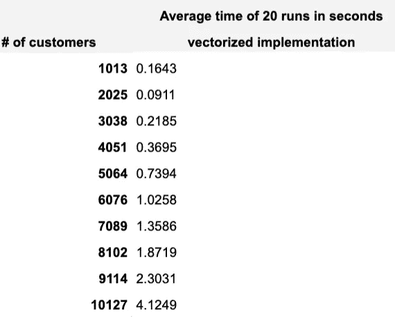

# 使用 Python 优化成对欧几里德距离计算

> 原文：<https://towardsdatascience.com/optimising-pairwise-euclidean-distance-calculations-using-python-fc020112c984?source=collection_archive---------9----------------------->

## *探索计算距离的方法，希望找到大数据集的高性能解决方案*


由[马修·施瓦茨](https://unsplash.com/@cadop?utm_source=medium&utm_medium=referral)在 [Unsplash](https://unsplash.com?utm_source=medium&utm_medium=referral) 上拍摄的照片

欧几里德距离是最常用的度量之一，是许多机器学习算法的基础。然而，当一个人面对包含多个特征的非常大的数据集时，简单的距离计算成为令人头痛和记忆错误的来源。

尽管意识到像 SciPy 这样的包提供了健壮的解决方案，我还是忍不住探索了计算距离的其他方法，希望找到大型数据集的高性能方法。

## 那么，什么是欧几里德距离呢？

我们从公式的快速提示开始，这很简单。给定两个向量 **x** 和 **y** ，我们取它们元素的平方差之和的平方根。


## 那么，为什么我们会出现内存错误呢？

这个问题在处理非常大的数据集时经常出现…现在，假设我们有 1k 个向量，我们需要计算它们的成对距离。这将导致输出矩阵有 1m 个条目，这意味着对于更大的数据量，您很可能会耗尽内存。

对于所有的计算，Python 使用本地内存，并且它不会立即归还分配的内存。这意味着你受到电脑规格的限制。在云服务中工作有助于相应地扩展内存，但是在大多数情况下，你仍然需要并行计算。

尽管内存限制不会消失，但拥有优化的脚本是可取的。

继续计算…

## 数据集:信用卡客户

为了测试计算距离的不同方法的性能，我需要相当大的数据集。数据集可以在 Kaggle 上获得，也可以通过下面的链接下载。

<https://www.kaggle.com/sakshigoyal7/credit-card-customers>  

在这种情况下，数据集中的一些特征不是很有用，所以我们将使用精简集。

```
import pandas as pd
cc_customers = pd.read_csv('BankChurners.csv')
cc_customers = cc_customers[['CLIENTNUM', 'Attrition_Flag', 'Customer_Age', 'Gender','Dependent_count', 'Education_Level', 'Marital_Status','Income_Category', 'Card_Category', 'Months_on_book','Total_Relationship_Count','Months_Inactive_12_mon','Contacts_Count_12_mon', 'Credit_Limit', 'Total_Revolving_Bal', 'Total_Trans_Amt','Total_Trans_Ct']]
```

我们有混合类型的数据集，用人口统计和信用卡相关属性来表示个人客户的信息。


客户信用卡数据中的一些特征

在使用数据作为输入之前，我们需要确保将分类变量转换为数值。

```
cat_col = ['Attrition_Flag', 'Gender', 'Education_Level', 'Marital_Status', 'Income_Category', 'Card_Category']
for col in cat_col:
    cc_customers[col]=cc_customers[col].astype('category').cat.codes
```

当处理大型数据集时，特征转换是相当重要的考虑方面，它可以帮助减少矩阵所使用的内存量(不仅如此)。让我们来看看转换发生前后数据框的内存分解。


转换变量前后的内存使用情况比较。

一旦我们将分类变量转换为数字变量，我们可以看到内存的使用大大减少了。

现在我们已经完成了基本的变换，我们可以回到我们的目标，即计算成对的欧几里德距离，在我看来，计算的速度除外。我们有 10127 个独立客户，这将导致矩阵 10127x10127 维。

## 主脚本

为了理解代码如何与更大的数据集一起伸缩，引入了 for 循环，在每次迭代中，我们考虑来自原始数据的更大的随机样本。我们从 10%的数据开始，每一步我们的样本增加 10%，当涉及到代码的性能时间时，我们取 20 次运行的平均值。

下面的代码用于每一种方法，唯一的区别是距离函数。

```
import numpy as np
import time
from tqdm import tqdm_notebook as tqdminput_data = cc_customers.drop('CLIENTNUM', axis=1) # drop the customer ID
iter_times = []
for l,z in zip(range(0, 20), tqdm(range(0, 20))):
    times = []
    for r in np.arange(0.1, 1.1, 0.1):
        data_reduced = input_data.sample(frac=r, random_state=1)
        tic = time.perf_counter()
        ###INSERT DISTANCE CALCULATIONS###
        toc = time.perf_counter()
        times.append(toc-tic)
    iter_times.append(times)

tot_time = [sum(i)/20 for i in zip(*iter_times)]
data_size = [len(input_data.sample(frac=r, random_state=1)) for r in np.arange(0.1, 1.1, 0.1)]for i, j in zip(tot_time, data_size):
    print(f"# of customers {j}: {i:0.4f} seconds")
```

## 方法 1: Python 包(SciPy 和 Sklearn)

使用 python 包可能是一个微不足道的选择，但是因为它们通常提供相当快的速度，所以它可以作为一个很好的基线。

```
from scipy.spatial.distance import cdist
from sklearn.metrics.pairwise import euclidean_distances
scipy_cdist = cdist(data_reduced, data_reduced, metric='euclidean')
sklearn_dist = euclidean_distances(data_reduced, data_reduced)
```

非常有趣的是，Sklearn euclidean_distances 的性能优于 SciPy cdist，随着数据集越来越大，时间上的差异变得越来越明显。


cdist 与欧几里得距离

实现上的差异可能是 Sklearn 包性能更好的原因，因为它使用矢量化技巧来计算距离，这样效率更高。同时，在查看了 cdist 实现的源代码之后，SciPy 使用了双循环。

## 方法 2:单 for 循环

优化和 for 循环通常不是最好的朋友！然而，当涉及到成对距离时……可能很难避免，除非走向量化路线(实现将在本文后面介绍)。

```
# Without pre-allocating memory
dist = []
for i in range(len(data_reduced)):
    dist.append(((data_reduced- data_reduced[i])**2).sum(axis=1)**0.5)

# pre-allocating memory
D = np.empty((len(data_reduced),len(data_reduced)))
for i in range(len(data_reduced)):
    D[i, :] = ((data_reduced-data_reduced[i])**2).sum(axis=1)**0.5
return D
```

我们比较了两种方法，在计算距离之前有和没有预分配内存。


毫不奇怪，预分配内存有助于提高性能，尽管所用的时间仍然超过了 Sklearn 的实现。

尽管在某些情况下性能较慢，但使用这种方法仍然是首选，因为它能够处理更大的数据集，而不会耗尽内存。

## 方法 3:矢量化实现

在网上阅读了一些关于这个主题的研究论文后，我不得不说，我对这种方法的性能充满了希望。除了看到 Sklearn euclidean_distances 的性能之外，这些希望也变得更大了…

```
import numpy as np
x = np.sum(data_reduced**2, axis=1)[:, np.newaxis]
y = np.sum(data_reduced**2,    axis=1)
xy = np.dot(data_reduced, data_reduced.T)
dist = np.sqrt(x + y - 2*xy)
```

对于较小的数据样本，这种方法在时间上非常接近 cdist 实现，但是它的伸缩性不是很好。对于最大的数据样本，时间几乎与不预先分配存储器的循环方法相同。不出所料，它并没有超过欧几里德距离。



**总结**

在测试了多种计算成对欧氏距离的方法后，我们发现 Sklearn euclidean_distances 的性能最好。因为它使用了矢量化实现，我们也尝试使用 NumPy 命令来实现，但在减少计算时间方面没有太大的成功。

尽管我们再次表明，在大多数情况下，Python 模块提供了最优的解决方案，但有时仍然需要根据任务的性质选择不同的选项。