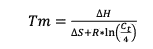
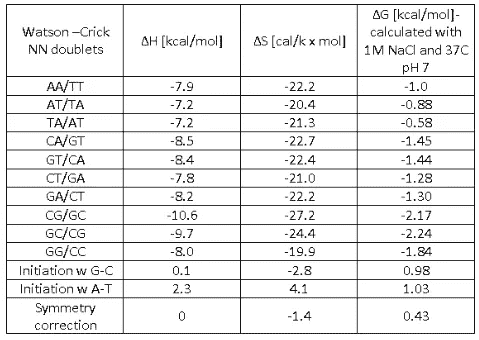
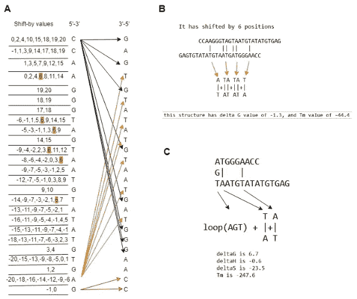
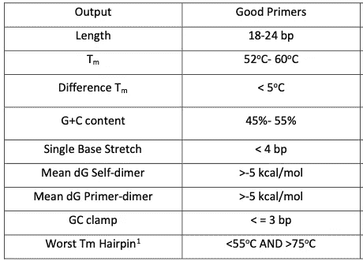
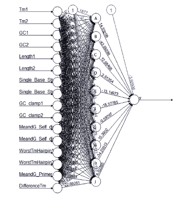
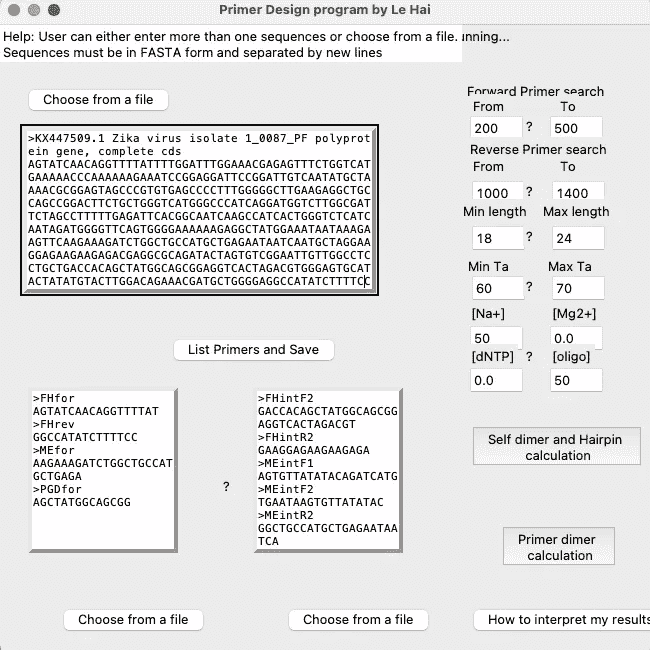
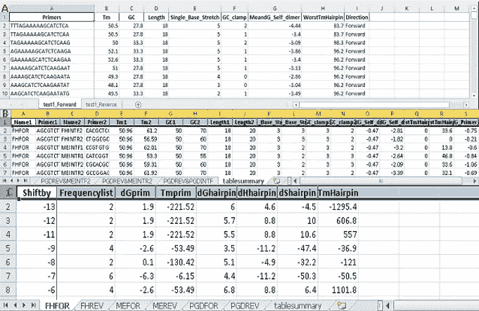
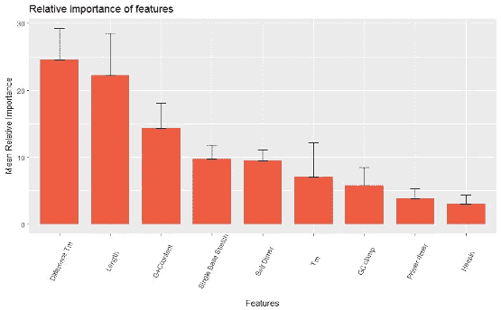

# 基于神经网络的引物推荐系统优化 PCR 方案

> 原文：<https://towardsdatascience.com/optimising-pcr-with-automated-primer-selection-using-neural-network-f6b15d209808?source=collection_archive---------27----------------------->

## 用一个简单的神经网络自动化一个常规的湿实验室任务

四年前，当我在一个病理实验室实习时，我的工作主要是对 DNA 样本进行测序。虽然这是一个相当容易掌握的技术，但对于一个二年级本科生来说，它给了我一个在湿实验室研究的过山车体验。然而，除了常规的移液、离心和混合溶液，我注意到可以系统地自动化和优化方案的初始步骤，即引物选择步骤。

# 简而言之，测序

DNA 是由 4 个核酸碱基组成的双链结构:腺嘌呤(A)、胞嘧啶(C)、鸟嘌呤(G)和胸腺嘧啶(T)；使得一条链上的碱基通常以互补(即排他)的方式与另一条链上的另一个碱基结合(即 A 将与 T 结合，而 C 将与 G 结合)。当突变出现时，这种排他性被打破，并可能导致氨基酸序列的变化，并影响随后的蛋白质翻译过程。我们可以通过*测序*(也称为*基因分型)的过程来询问基因组成。*

为了进行 DNA 测序，我们需要首先通过一种称为聚合酶链式反应(PCR)的技术来扩增感兴趣的区域，通过改变温度，双链结构被分离并退火。正是通过这种“热-再-冷-再”的循环，通过聚合酶促进了 DNA 复制，并重复进行，直到获得足够数量的 DNA 片段。

与 PCR 相似，测序也依赖于聚合酶温度的升高和降低。两者之间的主要区别在于它们对核酸碱基的使用。在 PCR 溶液中，所用的核酸碱基仅由脱氧核苷三磷酸(dNTP)组成，而在测序溶液中，所用的核酸碱基由 dNTP 和双 dNTP (ddNTP)组成。ddNTP 和 dNTP 之间的唯一区别是，d dNTP 不允许在复制过程中进一步添加碱基，而 dNTP 允许。你可以想象在测序过程之后，你会得到多个不同大小的 DNA 片段，有些只有 10 个碱基，而有些有 20 或 30 个碱基。此外，如果你在 ddNTP 上放上某种信号，这样当它们放在灯下时会发出颜色，你就能知道第 10、20 或 30 位的核苷酸是什么。这样做足够多次，你可以得到感兴趣基因的完整核酸组成。

## 引物选择

引物是几个碱基对的短 DNA 片段。引物通常具有与想要启动 DNA 复制过程的 DNA 片段互补的碱基，没有它，聚合酶就不能与 DNA 链结合。

根据经验，可以根据引物的长度和解链温度(Tm)来选择引物。然而，用手这样做不允许人们容易地观察二级结构稳定性和引物发夹的可能出现(当引物不与感兴趣的区域结合，而是与自身结合时，这些情况)。因此，人们可以求助于公开可用的软件，例如由 [Thermofischer](https://www.thermofisher.com/uk/en/home/brands/thermo-scientific/molecular-biology/molecular-biology-learning-center/molecular-biology-resource-library/thermo-scientific-web-tools/multiple-primer-analyzer.html) 开发的软件。然而，正如学术界经常出现的情况，一个软件并不包含所有的功能，不同的软件可以给出不同的结果。因此，这个项目的目的是合并这些软件，并有可能创建一个自动化的引子推荐系统。

# 方法和游戏计划

## 熔化温度计算

快速搜索显示，对核苷酸杂交热力学的研究相当广泛，不同的小组给出了不同的计算 Tm 的方法。一些公式相当基础，只需要每个核苷酸的碱基数量，而其他公式，如等式 1 中的公式，则更高级，需要核苷酸配对焓和熵的实验值。但是，要弄清楚如何将不同的值插入一个公式并不完全是火箭科学，通过足够的文献回顾，您可以得到表 1。

等式 1。由 SantaLucia 等人(1996 年)提供

表 1。37℃下 1 M NaCl 中统一的寡核苷酸 dH 和 dS 参数

## (英)可视化(= visualization)

许多现有软件缺少的特征之一是引物和 DNA 区域之间杂交的可视化。我们可以将它硬编码到程序中的一种方法是给一条链上的每一个核苷酸分配一个“移位”值，该值对应于另一条链上其互补碱基的位置。

图二。计算稳定性和可视化二级结构的算法的可视化表示

在图 2A 中，对于引物 5’-ccaaggtagtaatgtatattgag-3’中的每个核苷酸，计算机代码指定一个*移位*值，其对应于其反向序列(或者在引物二聚体的情况下，另一个引物的反向序列)中 3’-5’方向的互补碱基的位置。例如，5’-3’方向上的最后一个碱基 G 具有-1 和 0 的*移位*值，因为从 3’-5’方向上的那个位置开始计数，有两个互补的碱基，一个在相同的位置(0)，另一个在前一个位置(-1)。在图 2B 中，通过在所有核苷酸上提取相同的*移位*值，可以随后可视化二级结构中发生的所有杂交事件。例如，通过将 5’-3’引物的 6 个位置定位在其反向序列的右侧，可以构建具有 6 个键的自身二聚体结构。在图 2C 中，使用相同的*移位*值，也可以描绘出发夹结构，其中在最里面的两个键之间形成的环的大小必须总是大于或等于三个核苷酸。此外，任何二级结构的热力学值都计算为每个键形成所需能量的总和。

在 python 中，移位值列表可以用几行列表理解代码进行硬编码:

从那时起，我们可以画出盒子和棍子来可视化杂交事件:

## **引物选择推荐系统:**

另一个快速文献综述为我们提供了以下引物选择标准:

表二。好底漆的标准

虽然我们可以将标准硬编码到我们的程序中，并让它输出我们选择的引物是否满足所有标准，但我们可以更进一步，创建一个推荐系统，扫描给定感兴趣基因中所有可能的引物，并根据它们的适用性对它们进行排序。

为此，我们可以首先建立一个引物数据库，然后训练一个模型，将一个模型分为好的或坏的，或者给它们分配一个适合性得分。在这种情况下，我选择了分类模型。在这里，我生成了一组 78 206 个不同长度的引物对，长度在 8 到 41 个碱基之间。它们是由计算机从三种不同的基因中随机产生的。从该数据集中，12 600 个随机组合被标记为“好”或“坏”。“不良”引物被定义为在表 2 的 9 个特征之一中具有异常值的引物。为了实现所有参考点的完全均匀分布,“不良”引物组由 9 个统一的特征类别组成，每个类别有 700 对。

## 模特培训

标记数据集分为训练集(70%)、交叉验证集(20%)和测试集(10%)。在这里，我利用 R *神经网络*包来优化 ANN 模型的计算和可视化，并采用了带权重回溯的弹性反向传播(rprop+)方法，其中学习速率根据偏导数的符号在 0.5(-)和 1.2(+)之间变化。

图 3。训练好的人工神经网络模型

# 我的第一个 GUI

我注意到现有软件的一个问题是它们的功能脱节，在显示结果时缺乏透明度。利用 Python 中的 *tkinter* 库，我创建了一个具有以下特征的界面:1)可定制的输入，2)实时结果可视化和计算，以及 3)有组织的输出。

图 4。帮助界面

图 5。结果的实时可视化

图 6。有组织的输出和透明的结果

## 相对重要性

一旦在训练过程之后将权重分配给 9 个特征中的每一个。我们可以看到哪些特征最能决定引物选择的适宜性。

图 7。基于人工神经网络模型的权重排序

正如所怀疑的，Tm 和长度的差异起着最重要的作用，其次是 GC 含量和其他二级结构。最后，我们可以将这样的权重硬编码到我们的程序中，并可以将每个引物标记为好或坏。

# 结论

这是一个有趣的练习，在这里我学会了如何从头开始创建一个 GUI，并实现一个简单的 ML 模型到日常的湿实验室工作中。实际上，这不太可能造成很大的差异，因为在大多数情况下，即使是一个稍微差一点的引物也可能在 PCR 实验中发挥相当好的作用。然而，二级结构杂交确实会发生，这仅在使用超过 50 bp 的非常长的引物时才会成为问题，且当这种情况发生时，在 PCR 溶液中有其它优化的化学成分来解决该问题。然而，如果你想试试这个 GUI，你可以在下面找到它。

<https://github.com/lehai-ml/primer-design>  

# 参考

1.  小 Santa Lucia Allawi，H.T .，Seneviratne，p . a .(1996 年)。预测 DNA 双链稳定性的改进的最近邻参数。*生化* **35，**3555–3562。