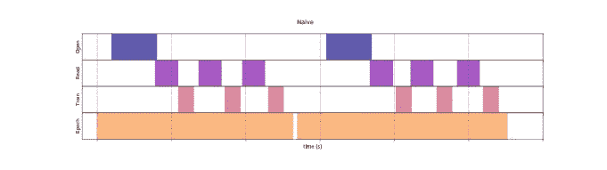
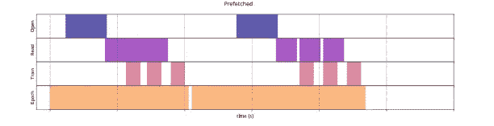
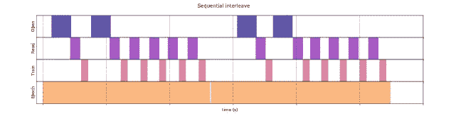
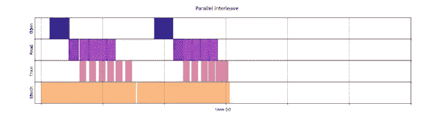
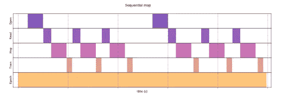
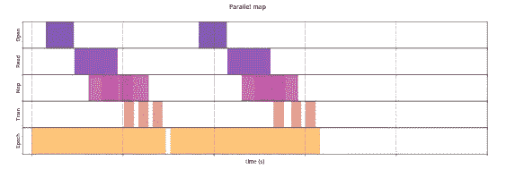
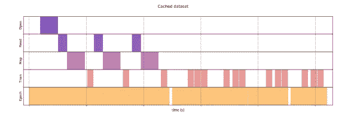
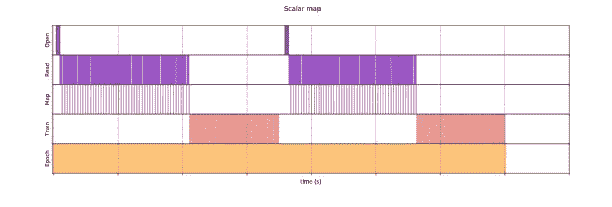
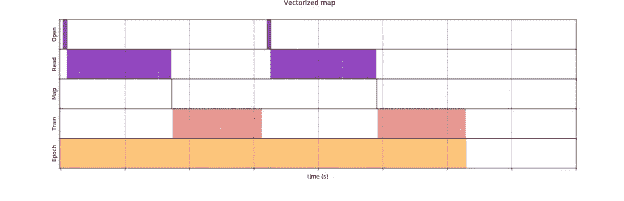
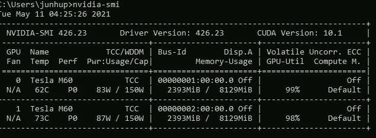

# 使用 tf.data 优化输入管道性能(第 1 部分)

> 原文：<https://towardsdatascience.com/optimising-your-input-pipeline-performance-with-tf-data-part-1-32e52a30cac4?source=collection_archive---------6----------------------->

## 提高您的输入管道效率和 GPU 利用率

Tensorflow 徽标。来源:[https://www.tensorflow.org/](https://www.tensorflow.org/)

# tf.data 的概念

> API 使您能够从简单的、可重用的部分构建复杂的输入管道。`tf.data`也使处理大量数据成为可能，从不同的数据格式中读取，并执行复杂的转换

要知道 GPU 和 TPU 可以显著减少训练一个模型所需的时间，这并不是什么大事情。然而，作为一名深度学习开发者，最糟糕的事情之一是看到你的 GPU 能力没有得到充分利用，CPU 上的瓶颈——特别是如果你在不同的云平台上为这些服务支付大量资金。

因此，确保我们的输入管道实现最佳性能和效率至关重要。`tf.data` API 直接处理这个问题——这也是我如此喜欢它的原因。

在这篇第 1 部分文章中，我将解释关于`tf.data`如何实现最佳行为的不同概念，在第 2 部分，我将比较`tf.data`和 Keras `ImageDataGenerator`读取输入数据的性能。

`tf.data`有几种方法可以降低计算开销，这些方法很容易在您的管道中实现:

*   预取
*   并行数据提取
*   并行数据转换
*   贮藏
*   矢量化映射

# 天真的方法

在我们开始这些概念之前，我们必须首先理解当一个模型被训练时，朴素方法是如何工作的。

天真的方法。来源:[https://www.tensorflow.org/guide/data_performance](https://www.tensorflow.org/guide/data_performance)

此图显示训练步骤包括打开文件、从文件中获取数据条目，然后使用数据进行训练。我们可以在这里看到明显的低效率，因为当我们的模型正在训练时，输入管道是空闲的，而当输入管道正在获取数据时，我们的模型是空闲的。

`tf.data`通过使用`prefetching`解决了这个问题。

# 预取

预取解决了天真方法的低效率，因为它旨在重叠训练步骤的预处理和模型执行。换句话说，当模型执行训练步骤 n 时，输入管道将读取步骤 n+1 的数据。

> `tf.data` API 提供了`tf.data.Dataset.prefetch`转换。它可用于将数据产生的时间与数据消耗的时间分离开来。特别是，转换使用后台线程和内部缓冲区在请求元素之前从输入数据集中预取元素。

预取。来源:https://www.tensorflow.org/guide/data_performance

有一种观点认为预取转换需要预取的元素数量。然而，我们可以简单地利用 tensorflow 提供的`tf.data.AUTOTUNE`，它提示`tf.data` runtime 在运行时动态地调整值。

# 并行数据提取

在读取数据时将原始字节加载到内存中会产生计算开销，因为可能需要对读取的数据进行反序列化和解密。无论数据是存储在本地还是远程，都存在这种开销。

> 为了处理这种开销，`tf.data`提供了`tf.data.Dataset.interleave`转换来并行数据加载步骤，交错其他数据集的内容。

类似地，这种交错转换支持`tf.data.AUTOTUNE`，它将在`tf.data`运行时再次委托并行级别的决策。

顺序交错。来源:https://www.tensorflow.org/guide/data_performance

并行交错。来源:https://www.tensorflow.org/guide/data_performance

# 并行数据转换

在大多数情况下，在将数据集传递给模型进行训练之前，您必须对数据集进行一些预处理。`tf.data` API 通过提供`tf.data.Dataset.map`转换来解决这一问题，该转换将用户定义的函数应用于输入数据集的每个元素。

> 由于输入元素相互独立，预处理可以在多个 CPU 内核上并行进行。

要利用多个 CPU 内核，您必须传入`num_parallel_calls`参数来指定您想要的并行级别。类似地，map 转换也支持`tf.data.AUTOTUNE`，它将在`tf.data`运行时再次委托并行级别的决策。

天真的映射。来源:[https://www.tensorflow.org/guide/data_performance](https://www.tensorflow.org/guide/data_performance)

平行映射。来源:[https://www.tensorflow.org/guide/data_performance](https://www.tensorflow.org/guide/data_performance)

# 贮藏

`tf.data`还拥有`tf.data.Dataset.cache`转换的缓存能力。您可以在内存或本地存储中缓存数据集。经验法则是在内存中缓存小数据集，在本地存储中缓存大数据集。这样就避免了像文件打开和数据读取这样的操作在每个时期被执行——下一个时期将重用由`cache`转换缓存的数据。

需要注意的一点是，您应该在预处理之后(尤其是当这些预处理函数计算量很大时)和增强之前进行缓存，因为您不希望存储任何来自增强的随机性。

缓存。来源:https://www.tensorflow.org/guide/data_performance

# 矢量化映射

当使用前面“并行化数据转换”中提到的`tf.data.Dataset.map`转换时，会有一些与调度和执行用户定义函数相关的开销。向量化这个用户定义的函数——让它一次对一批输入进行操作——并在`map`转换之前应用`batch`转换有助于改善这种开销。

批处理前映射。来源:https://www.tensorflow.org/guide/data_performance

批处理后映射。来源:https://www.tensorflow.org/guide/data_performance

从图中可以看出，开销只出现一次，从而提高了整体时间性能。因此，与对每个样本调用`map`转换相比，对一批样本调用`map`转换具有更好的性能。

# 最后

`tf.data`tensor flow 充分考虑了输入管道的性能，采用多种方式优化效率。

总之，您可以使用`prefetch`转换来重叠管道(生产者)和模型(消费者)所做的工作，使用`interleave`转换来并行化数据读取，使用`map`转换来并行化数据转换，使用`cache`转换来在内存或本地存储中缓存数据，并且使用`batch` 转换来矢量化您的`map`转换。

正如开始时提到的，最糟糕的事情之一是看到你的 GPU 能力没有被充分利用，CPU 上的瓶颈。有了`tf.data`，你很可能会对你的 GPU 利用率感到满意！

GPU 利用率。来源:来自本地机器的截图

在第 2 部分中，我将演示如何将`tf.data`用于您的输入管道，并测量`tf.data`和 Keras `ImageDataGenerator`之间的性能

 [## 使用 tf.data 优化输入管道性能(第 2 部分)

towardsdatascience.com](/optimising-your-input-pipeline-performance-with-tf-data-part-2-9ee406451f93) 

# 资源

1.  [https://www.tensorflow.org/guide/data_performance](https://www.tensorflow.org/guide/data_performance)