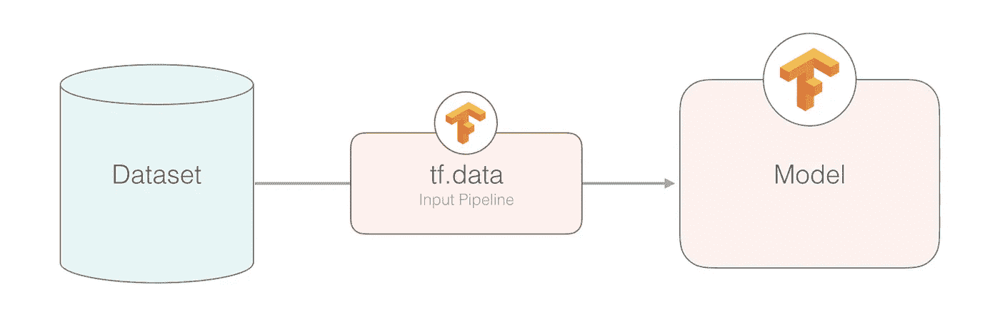
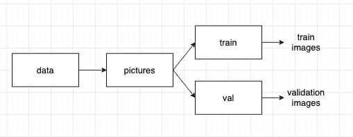
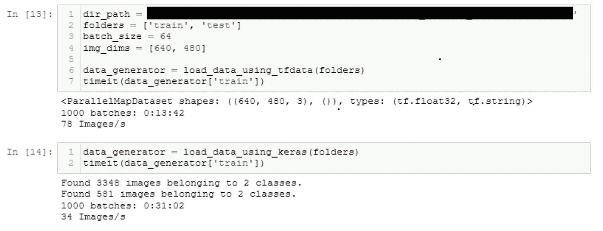

# 使用 tf.data 优化输入管道性能(第 2 部分)

> 原文：<https://towardsdatascience.com/optimising-your-input-pipeline-performance-with-tf-data-part-2-9ee406451f93?source=collection_archive---------16----------------------->

## 提高您的输入管道效率和 GPU 利用率

来源:ka ggle[https://www . ka ggle . com/jalammar/intro-to-data-input-pipelines-with-TF-data](https://www.kaggle.com/jalammar/intro-to-data-input-pipelines-with-tf-data)

在第 1 部分中，我重点介绍了 aim 中的不同概念`tf.data`，以优化您的输入管道性能。我们希望确保输入管道上不存在瓶颈，以便充分利用我们的 GPU 使用。

现在，在第 2 部分中，我将展示一个在输入管道中使用`tf.data`和 keras `ImageDataGenerator`的实际例子，测量两者之间的性能。

 [## 使用 tf.data 优化输入管道性能(第 1 部分)

### tf.data API 使您能够从简单的、可重用的部分构建复杂的输入管道。

towardsdatascience.com](/optimising-your-input-pipeline-performance-with-tf-data-part-1-32e52a30cac4) 

**使用 Keras** `**ImageDataGenerator**` **:**

使用 Keras ImageDataGenerator 加载数据

**利用** `**tf.data**` **:**

使用 tf.data 加载数据

**测量** `**tf.data**` **和** `**ImageDataGenerator**` **:** 的时间性能

测量时间性能

请注意，在这两个示例中，输入数据是从本地机器而不是远程云存储中读取的，并且没有做任何预处理工作。目录结构应该如下所示:

`dir_path`应该是 pictures 文件夹的路径，而`folders`是由 pictures 文件夹中的文件夹名组成的数组——在我的例子中，它是我的 train 和 validation 文件夹。

目录结构。来源:来自本地机器的截图

结果对`tf.data`更有利，比 Keras `ImageDataGenerator`快两倍多。

注意，对于我们的`tf.data`生成器，它返回一个类型< float，string >，因为我们已经在函数中定义了标签。如果你想让生成器返回< float，改为 float >，你必须将函数中的标签解析成相应的 float——为了训练你的模型。

此外，在这个`tf.data`示例中，由于我使用的数据集很大，我将缓存存储在本地存储中，而不是内存中。如果数据集足够小，可以放入内存中，那么将缓存存储在内存中会使性能稍微好一点。

# 结论

与 Keras `ImageDataGenerator`相比，`tf.data`提供了更高效的输入管道。有了一个更有效的输入管道，你就可以更好地利用 GPU 来训练你的模型，因为瓶颈不再在输入管道上了！希望你喜欢这些文章。谢谢大家！

# 来源

[https://medium . com/swlh/dump-keras-imagedata generator-start-using-tensor flow-TF-data-part-1-a 30330 BDB ca 9](https://medium.com/swlh/dump-keras-imagedatagenerator-start-using-tensorflow-tf-data-part-1-a30330bdbca9)