# 机器学习的优化算法

> 原文：<https://towardsdatascience.com/optimization-algorithms-for-machine-learning-a303b1d6950f?source=collection_archive---------17----------------------->

## **第六章:优化问题**

由[丹尼斯·伊罗雷雷](https://unsplash.com/@denironyx?utm_source=medium&utm_medium=referral)在 [Unsplash](https://unsplash.com?utm_source=medium&utm_medium=referral) 上拍摄

前一章的链接，**第 5 章:解决优化问题的先决条件**在这里是。第 6 章是这个系列的一部分，从这里我们开始研究真正的优化问题并理解优化是怎么回事。在前面的章节中，我们只研究了有助于我们更好地理解优化的概念。我觉得这是优化的乐趣所在。在本章中，我们将了解:

*   最优化问题的标准形式
*   可行和最佳点
*   全局和局部最优点
*   凸优化问题
*   一阶最优条件
*   凸优化问题的特殊情况
*   等价凸优化问题
*   线性和二次优化问题
*   一些重要的提示
*   一些问题的解决

我们在 ***第一章看到了优化问题的一般形式:简介*** [这里](https://medium.com/nerd-for-tech/optimization-algorithms-for-machine-learning-4601f8815626)。现在，我们将再次访问通用表单，但会更加详细。因此，优化问题的一般或**标准形式由**给出:

注意，目标函数是我们要最小化的函数，f(x)的下确界意味着 f(x)的最小值，并且优化问题的域是目标函数的域与等式和不等式约束的域的交集。但是，这里可能出现的问题是，如果问题不是最小化目标函数，而是最大化目标函数呢？因此，在这种情况下，我们仍然必须将问题带到标准优化形式中，以便能够以适当的方式应用优化属性。那么，我们如何将一个最大化问题带入标准的优化形式呢？事实上这很简单。请看下面:

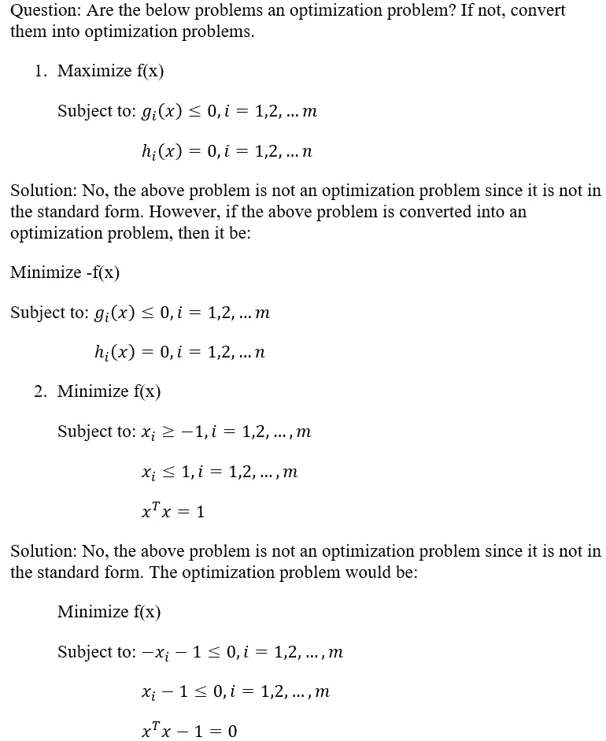

注意，所有的优化问题不一定都是凸优化问题。

现在，让我们看看**可行点**是什么。位于优化问题的域中的任何点，即，位于目标函数的域中并且满足约束的点，被称为可行点。并且，我们可以说一个最优化问题是可行的，如果它至少有一个可行点。所有可行点的集合称为可行集。该集合表示为:

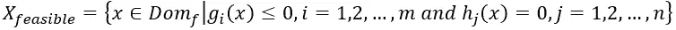

接下来，我们将看到什么是**最佳点**。我们说 x 点是最优的，如果:

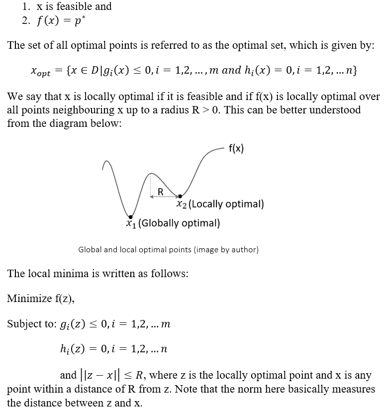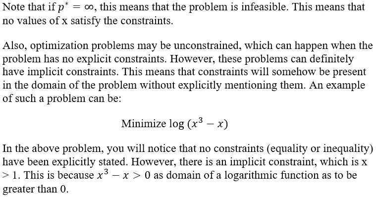

既然我们已经研究了什么是最优化问题，我们将看看**凸最优化问题。**

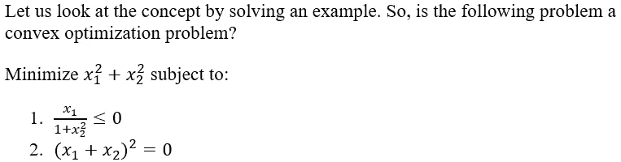

解:对于一个凸优化问题，目标函数和不等式约束(姑且称函数 f(x))需要是凸函数，等式约束(姑且称函数 g(x))应该是仿射函数。目标函数肯定是凸函数，因为它具有抛物面的形式。然而，在检查 f(x)的 Hessian 矩阵时，我们看到它不是半正定的(你可以自己计算和检查)。另外，g(x)不是仿射函数。所以这个问题不是凸优化问题。然而，这并不是故事的结尾。我们肯定可以把问题变成一个凸优化问题。

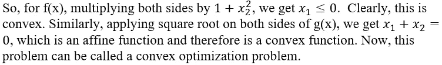

现在我们已经正确理解了凸优化问题应该是什么样子，让我们看看凸可微函数的**一阶最优性条件是什么。在也是可微的凸优化问题中，x 是最优的当且仅当 x 是可行的并且满足以下条件:**

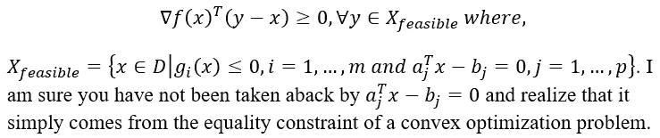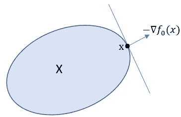

可行集边界上的最优点(图片由作者提供)

在上图中，X 是一个函数所有可行点的集合。几何上，最优点 x 位于可行集的边界。点 x 处的梯度将形成可行点的支撑超平面。这是因为我们从第 3 章[这里](https://medium.com/nerd-for-tech/optimization-algorithms-for-machine-learning-acffa886a343)知道，一个集合的支撑超平面是一个集合中所有点都位于它的一边的超平面。因此，我们可以说，如果 x 是最优的，∇f(x)是最优集的支撑超平面。

这个条件肯定有数学上的证明，但是我们不需要深究。另外，请注意，如果 x 是最优点，在给定约束的情况下，f(x)应该具有目标函数的最佳值。

在这一节中，我们将研究凸优化问题的一些特殊情况。它们是无约束凸优化问题、等式约束凸优化问题和非负正交上的极小化问题。所以，让我们从第一种情况开始:

1.  **无约束凸优化问题:**这个其实挺简单的。下面看看。

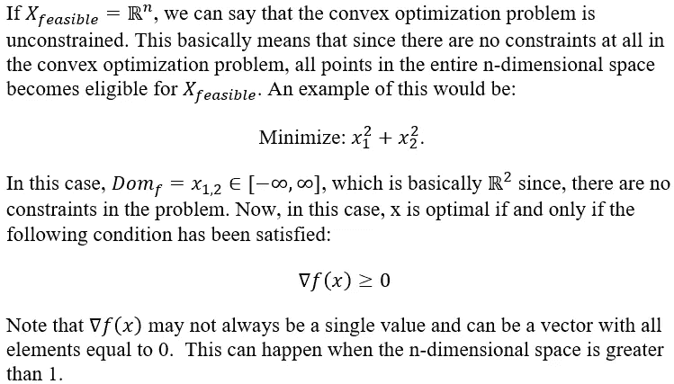

2.**等式约束凸优化问题:**在这种情况下，凸优化问题只有一个等式约束。这种类型的示例如下所示:

最小化 f(x)；服从:Ax = b

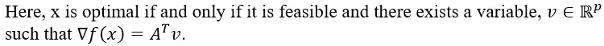

3.**非负正交上的最小化:**需要注意的是，非负正交基本上是指 N 维空间中的非负区域。这种特殊情况将由以下人员给出:

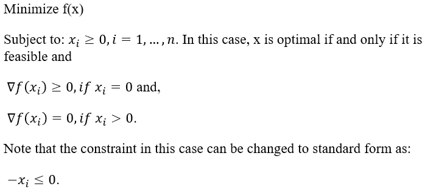

现在我们已经看到了什么是凸优化问题，让我们来看看**等价凸问题。如果一个问题的解很容易从另一个问题的解中获得，那么两个问题是等价的(非正式的)，反之亦然。在这种情况下，有助于保持凸性的一些常见变换是:**

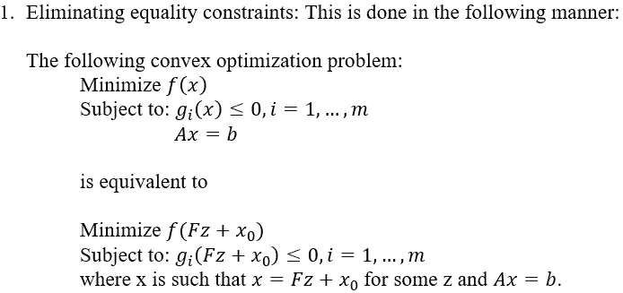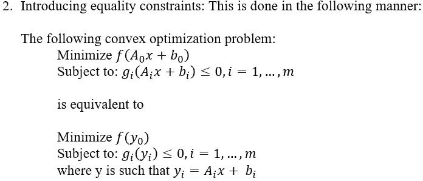

3.引入松弛变量:松弛变量是引入不等式约束以使其成为等式约束的变量。这通过以下方式给出:

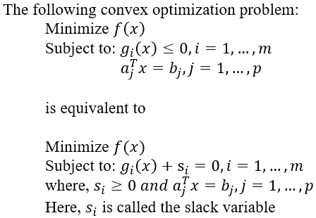

因此，我们已经看到当我们使用等价凸优化问题时，在问题的凸性没有丢失的意义上，等价凸优化问题如何能够帮助保持凸性。

在这一节中，我们将研究几类凸优化问题。我们将研究线性和二次优化问题。

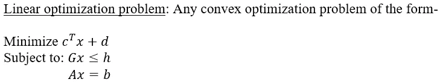

应当注意，在这种情况下，目标函数和约束函数都是仿射函数。同样，这种情况下的可行集是多面体。

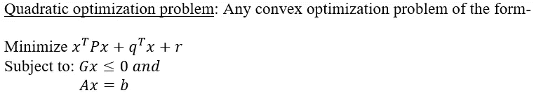

要注意的是，目标将不是仿射函数，而是二次函数。另一方面，约束函数在这种情况下都是仿射函数。

请注意，我们将在后续章节中详细研究这些问题。至此我们结束了这一章的理论部分。

当我们考虑凸集和函数时，让我们看看一些需要记住的要点。

*   如果一个函数的所有子水平集都是凸的，那么这个函数不一定是凸的。例如，拟凸函数的次水平集是凸的，但函数本身可能不是凸的。
*   一个拟凸函数的上图不是凸的，因为如果一个函数的上图需要是一个凸集，那么这个函数必须是一个凸函数。
*   如果一个方阵的所有元素都是正的，那么这个函数要么是半正定的，要么是正定的。
*   凸函数永远不能定义在非凸集合上。
*   凸优化问题可能不总是有最优解，尤其是当问题不可行时。

现在，让我们来看一些问题。

**问题 1:**

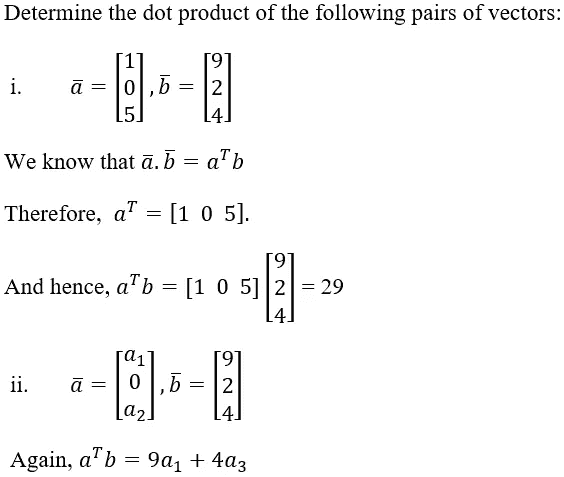

**问题二:**

下面这个问题是凸优化问题吗？如果不是，就把问题转化为凸优化问题，求函数的最优值，最优点，画出可行集。

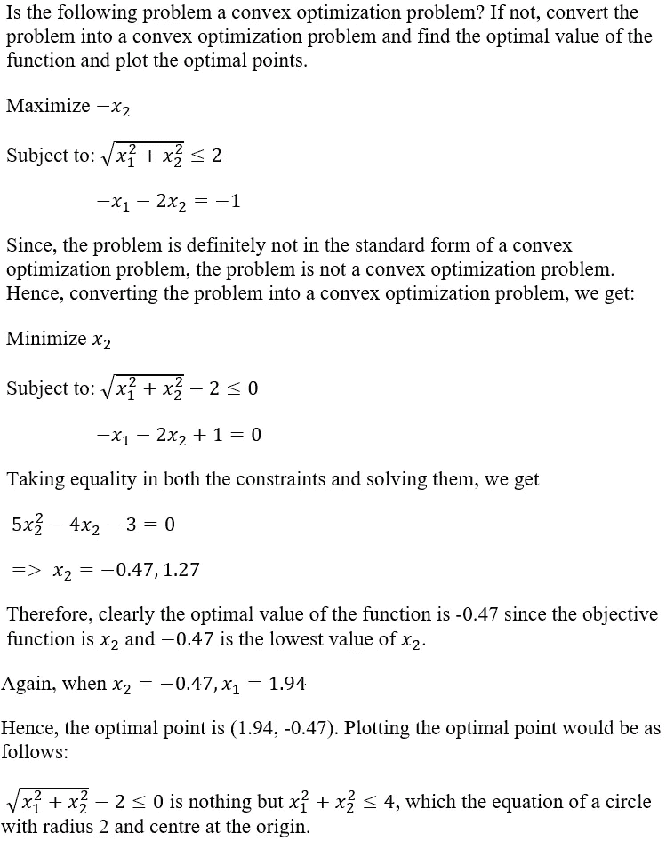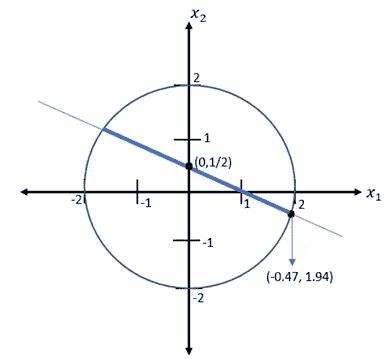

可行集的绘图(图片由作者提供)

上面的粗线满足约束和目标函数。因此，它是可行集。

就这样，我们来到了本章的结尾。