# 机器学习的优化算法

> 原文：<https://towardsdatascience.com/optimization-algorithms-for-machine-learning-d98d0feef53e?source=collection_archive---------19----------------------->

## ***第四章:重要的凸函数和凸性质***

图片来源:[https://www . wallpaperflare . com/clear-crystal-wine-glass-drinking-glass-macro-red-close-up-wallpaper-hut mt](https://www.wallpaperflare.com/clear-crystal-wine-glass-drinking-glass-macro-red-close-up-wallpaper-hutmt)

T 何链接 ***第三章:一些重要的凸集*** 就是这里的。第四章是关于一些将帮助我们更好地理解最优化，甚至帮助我们解决最优化问题的主题。这些主题大多与凸函数的不同性质有关。我们将在本章中讨论的主题有:

*   仿射组合和仿射空间
*   圆锥组合与圆锥壳
*   碑文
*   詹森不等式
*   保持凸性的运算
*   拟凸函数

我们离本系列有趣的部分不远了，在那里我们将处理真正的优化问题。所以坚持住。本章将围绕凸集和函数的性质展开。此外，不要忘记查看我在第三章中提出的问题的解决方案，在本章的最后。

在我们开始学习矢量的仿射组合之前，我们需要稍微回顾一下，看看什么是矢量的线性组合。向量的线性组合由下式给出:

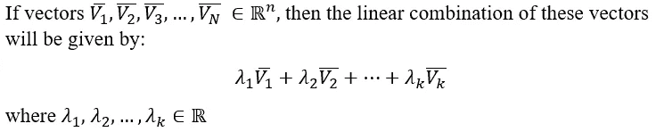

类似于向量的线性组合，向量的仿射组合只不过是向量的线性组合，使得系数的总和为 1。这表现为:

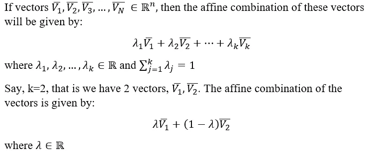

现在，让我们看看仿射跨度。集合中所有向量的仿射组合的集合称为仿射跨度。因此，用“y”表示的仿射跨度为

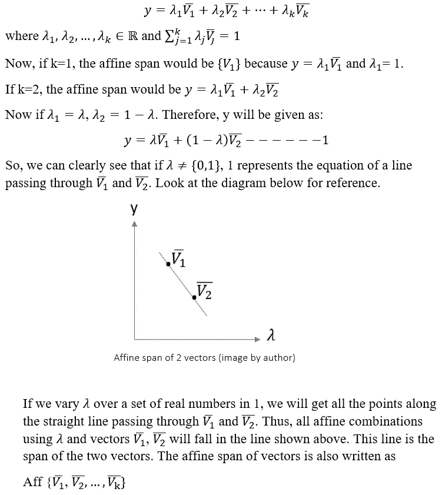

让我们看一个上述概念的实际例子。

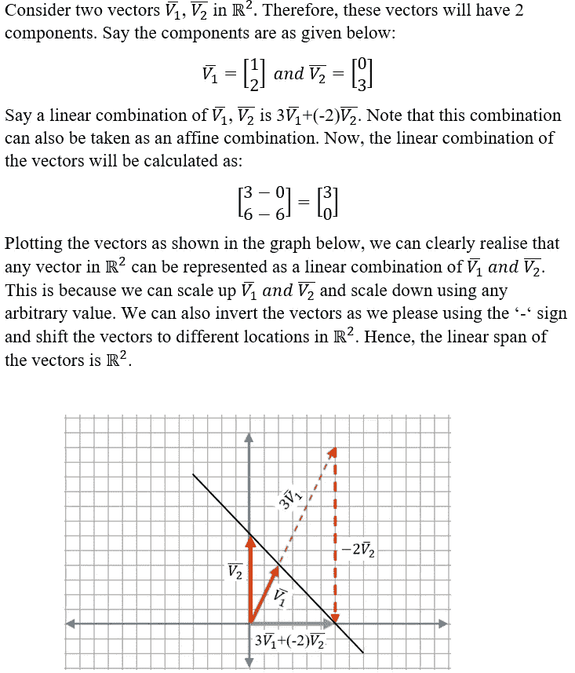

向量的线性和仿射组合(图片由作者提供)

在上图中，你会注意到，矢量 V1 和 V2 的任何仿射组合都将位于同样具有矢量 3V1+(-2V2)的黑线上。注意 3+(-2) = 1。因此，黑线是向量 V1 和 V2 的仿射跨度。这意味着 V1 和 V2 向量的任何组合，使得系数之和为 1，将位于黑线上。这也可以从理论上证明。考虑 V1 和 V2 的仿射组合的任何向量。因此，

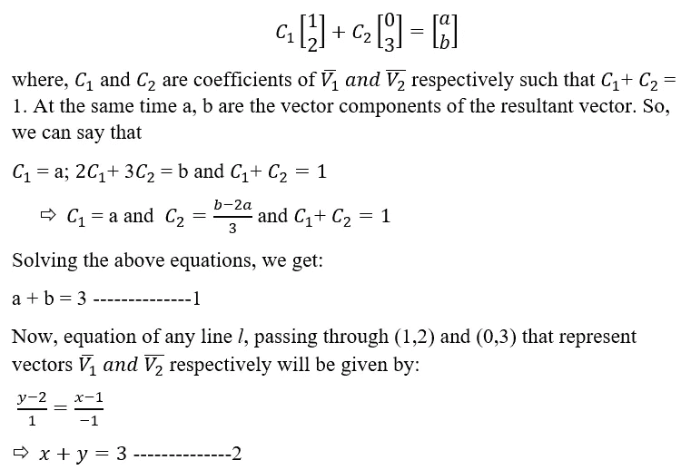

比较等式 1 和 2，我们可以说，满足 V1 和 V2 的仿射组合的任何向量也将位于 V1 和 V2 的连线上。同时，如果你比较仿射跨度的一般方程和凸集的一般方程，你会发现方程几乎是相同的。因此，仿射跨度或仿射空间是凸集。在集合生成器符号中，仿射空间由下式给出:

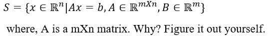

在线 x+y=3 的上述等式中，x 可以用 x1 代替，y 可以用 x2 代替。很明显，x 属于 2D 空间，因此 n=2。同样，b 只有 1 个值。所以，m=1。因此，A 的维数为 mXn，能够乘以“x”产生“b”，在本例中为 1x2。

在这里，我有一个问题要问你。如果 n 个向量的线性组合位于一个 n 维空间，你认为这些向量的仿射组合位于哪个维空间？要找到答案，请看下一章的最后一节[这里](/optimization-algorithms-for-machine-learning-e794f2e7dfa7)。

现在让我们看看**圆锥曲线组合**。圆锥组合类似于仿射组合，但在约束上有所不同。但是，让我们先了解一下什么是凸锥。

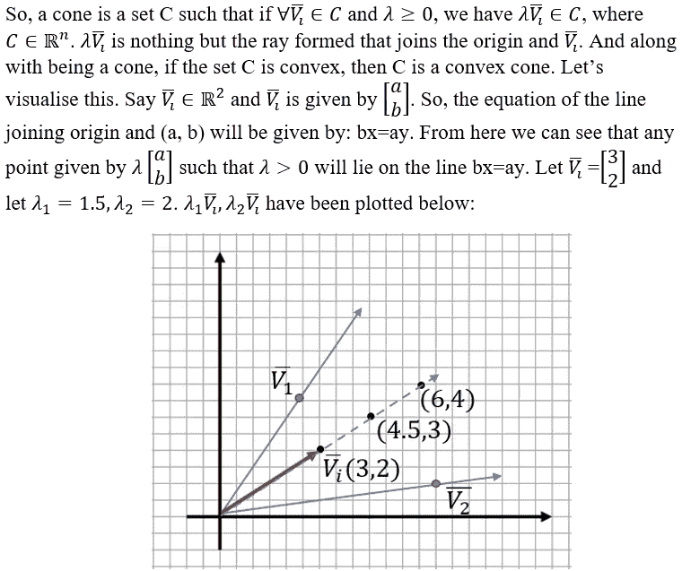

构成圆锥体的向量(图片由作者提供)

从上图中，我们可以说，所有这样的射线，即位于射线中的一个点的一组不同的正倍数，有助于形成一个圆锥。穿过矢量点 V1 和 V2 的光线形成了圆锥体的边界。

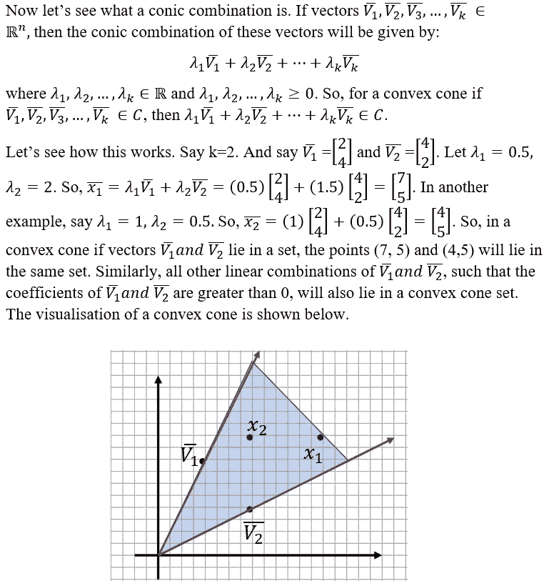

2D 的凸锥(图片由作者提供)

现在我们知道了凸锥，让我们看看什么是锥壳。这个概念与凸包非常相似。集合 S(圆锥 S)的圆锥壳是包含 S 的最小凸锥。它是 S 中所有可能的圆锥组合的集合。在集合生成器符号中，圆锥壳定义为:

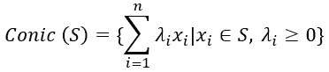

下图显示了一个圆锥和一个凸面(红色)外壳。黑点构成集合 s。由蓝色光线形成的圆锥壳构成可以容纳集合 s 的最小圆锥。圆锥壳的应用类似于凸包的应用，只是在这种情况下，相关的边界形状仅限于圆锥。

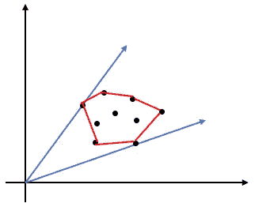

一个凸壳和一个圆锥壳(图片由作者提供)

在这里，我有一个问题要问你。你认为凸圆锥或圆锥壳在三维空间中会是什么样子？要找到答案，请看下一章[的最后一节](/optimization-algorithms-for-machine-learning-e794f2e7dfa7)。

在这一节，我们将探讨词牌的概念。函数 f(x)的上图，其中 x ∈ S 是所有点(x，α)的集合，使得 f(x)≤α。迷茫？不要这样。请参考下图，了解这意味着什么。参考如下所示的 2D 空间:

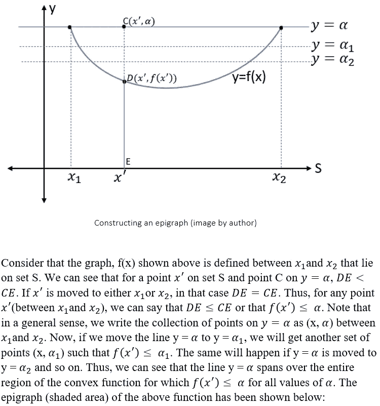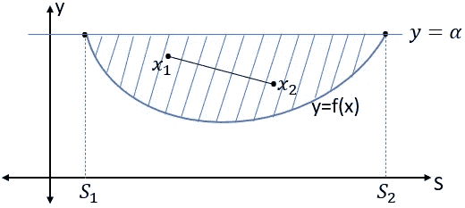

凸函数的题词(图片由作者提供)

注意，α的值必须相关，并且不能小于 f(x)的最小值。要注意的是，点的集合(x，α)位于比集合 S 所在的维度高一个维度的维度中。在这种情况下，x 位于一维直线上，题词位于二维平面上。同样，如果 y=α，那么 S1 和 S2 定义了函数的次水平集。就像上图一样，一个函数是凸的当且仅当它的子水平集也是凸的。在上面的例子中，函数 f(x)的次水平集是一条连接 S1 和 S2 的直线，我们知道这条直线由一个仿射跨度给出，仿射跨度是一个凸集。所以，函数 f(x)也是凸的。在集合生成器符号中，函数的子级集合被定义为:

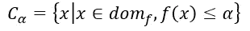

集合构造符号中凸函数的上图由下式给出:

下面是一个三维凸函数的题词。阴影空间形成上图，子水平集由 x-y 平面中的正方形形成。

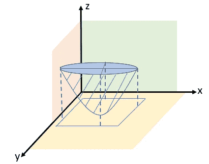

三维凸函数的题图(图片由作者提供)

现在，可以说函数 f 是凸的，当且仅当它的上图是凸集。为了形象化这一点，取上图中任意两点 x1 和 x2。你会注意到，x1 和 x2 连线上的所有点都在词牌内部。这方面的数学证明如下所示。在这种情况下，我们将不得不从双方证明财产。这意味着我们将不得不取一个凸函数，并证明它的上图是一个凸集。之后我们将得到一个凸上图集，并证明相应的函数是凸函数。

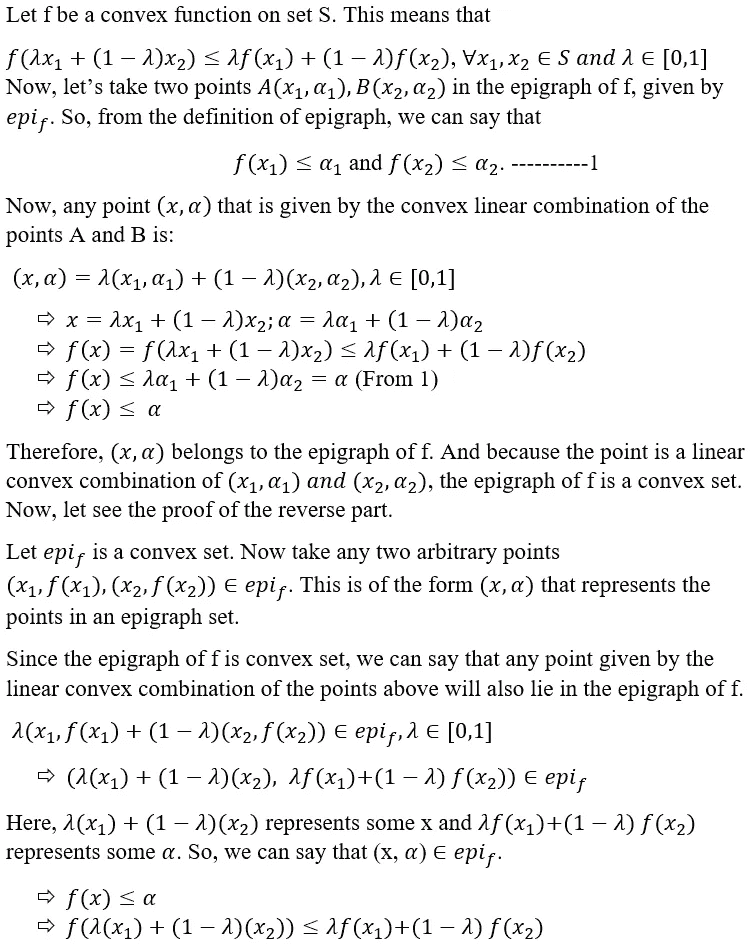

从上面的不等式可以说 f 是凸函数。这样，证明了如果 f 是凸函数当且仅当它的上图是凸集。

在本节中，我们将看到什么是**詹森不等式**。请参考下图。

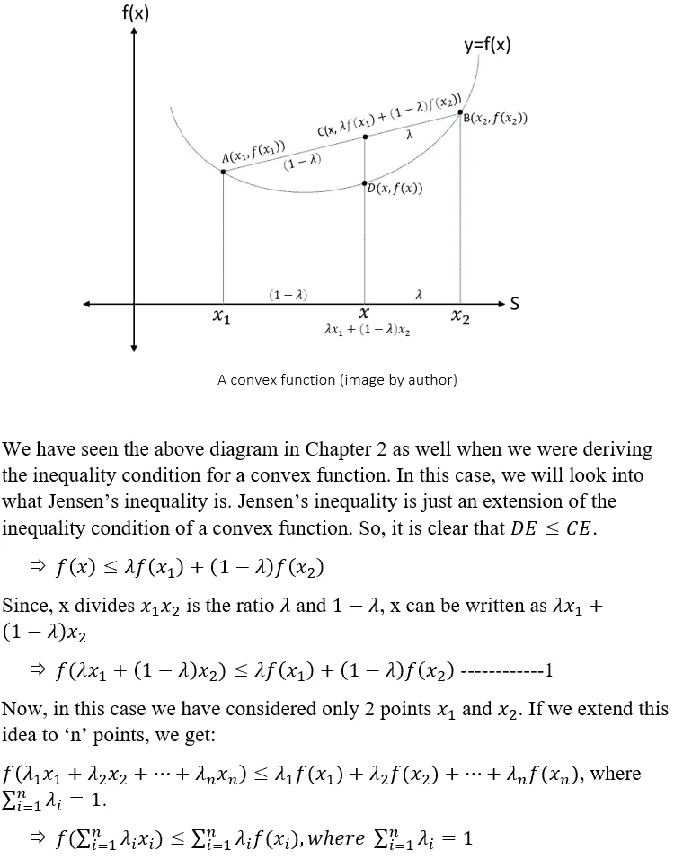

在上面的例子中，我们有有限数量的元素。将这个想法扩展到无限多的元素，我们得到:

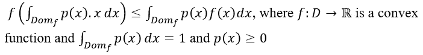

在这一节中，我们将试图从数学上证明一些重要函数是凸函数。

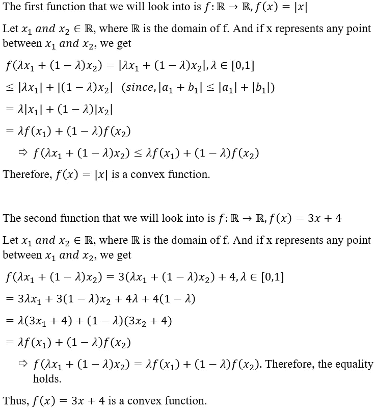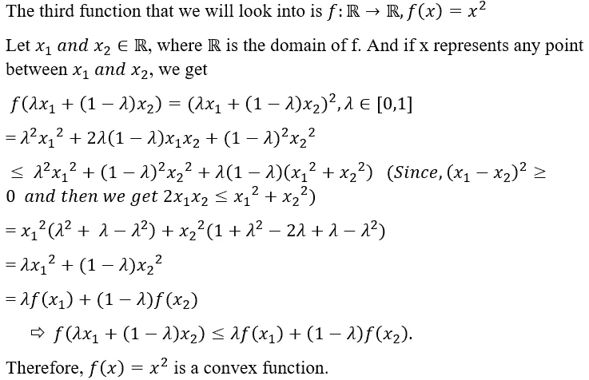

在下一节中，我们将研究一些保持凸性的**运算**和凸函数的一些**性质。保持凸性基本上意味着对凸集的这些运算的结果会产生一个不同的凸集。注意，我们已经在*第二章中详细看到了其中的一些运算:凸集和函数* [*这里*](https://medium.com/nerd-for-tech/optimization-algorithms-for-machine-learning-23a4b71588a9) *。*不过，我还是会在这里提到它们，以保持一个完整的列表。注意，下面 3 点与凸集有关，与凸函数无关。**

*   任何凸集的交集的结果集也是凸集。
*   两个凸集的向量和结果是一个凸集。
*   集合αC 对任何凸集合 C 和标量α都是凸的。

请注意，这些是在第 2 章中已经详细介绍过的。下面是一些保持凸函数凸性的新运算。

*   如果由 f(S)给定的集合 S 的像是凸的，那么如果函数 f 是仿射函数或透视函数或线性分形函数，则前像 S 也将是凸的。透视和线性分形函数不是很重要，尽管这些函数的形式如下所示:

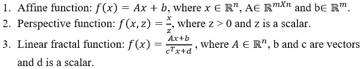

*   设 f1，f2，…，fn 是定义在同一个域 d 上的凸函数，那种情况下这些函数的**非负加权**和，f(x)=w1f1(x)+w2f2(x)+…+wnfn(x)也将是凸函数，其中 wi > 0。例如，下面的函数 f(x)是凸函数:

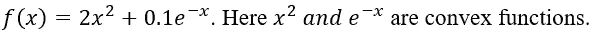

*   如果 f 和 g 是定义在同一个域 D 上的凸函数，那么 f+g，αf (α>0)和 max{f(x)，g(x)}都是凸函数。让我们来看看 f+g 情况的一个证明:

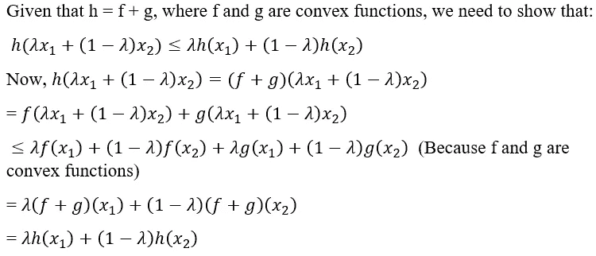

对αf (α>0)和 max{f(x)，g(x)}的证明也可以同样地给出。

*   如果一个函数 f(x)是凸的，另一个函数 g(x)是仿射函数，那么由 f(g(x))给出的 f(x)和 g(x)的合成是凸的。示例:

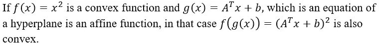

现在让我们看看凸函数的一些性质。

*   凸函数不一定是可微的。此外，它不需要在封闭区间集内连续，因为函数在封闭区间的终点可能不连续。然而，**一个凸在一个开区间**中总是连续的。我们从高中数学中知道，连续的意义就是函数在任何一点都不应该破。对 f 域中任意点 p 连续性的检查如下所示:

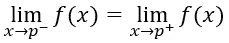

连续和非连续函数的一些例子如下所示:

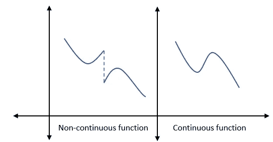

作者图片

同样，函数 f 是可微的，如果它的导数存在于定义域的每个点上。可区分性检查如下所示:

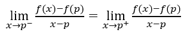

可微和不可微函数的示例如下所示:

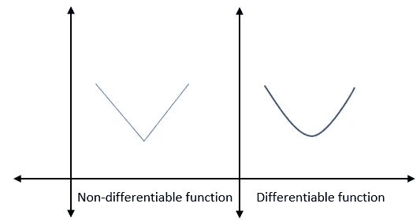

作者图片

*   凸集 S⊆ℝ上的凸函数 f 的每个局部极小值都是全局极小值。让我们首先试着理解什么是局部最小值和全局最小值。考虑定义域为 s 的任何凸函数 f。因此，f(x)的局部极小值在 f(x)定义域中的一点上意味着:

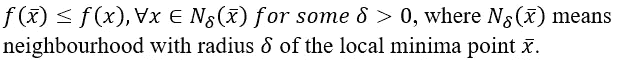

同样，f(x)的全局最小值在 f(x)的定义域中的点 x̄处，如下所示，将意味着:

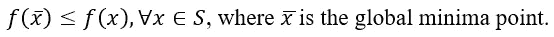

现在，让我们看看这一财产的基础是什么。下面是物业的证明。我们将在这里使用矛盾证明。

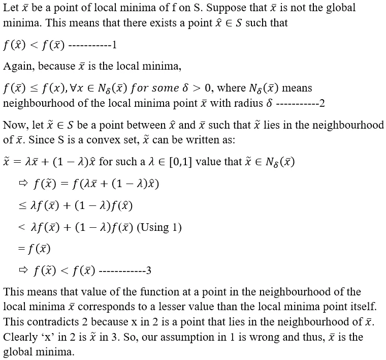

*   设 f1，f2，…，fk 是定义在同一个域 D 上的凸函数，那么函数 f(x)=max{f1(x)，f2(x)，…，fk(x)}也是一个凸函数，其中 dom f=dom f1∩dom f2。这被称为逐点最大值。让我们来看一个例子。

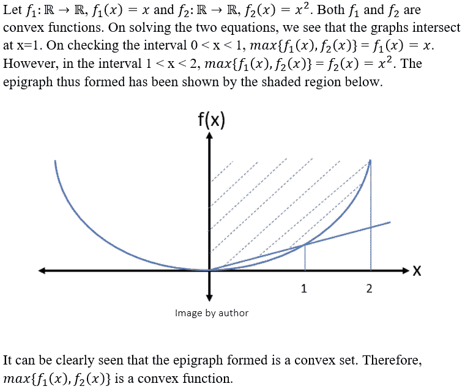

*   凸函数的下一个性质与一个叫做上确界和下确界的概念有关。因此，集合 S 的上确界是大于集合 S 的最高值的最小值。类似地，集合 S 的下确界是小于集合 S 的最小值的最高值。请参考下图以更好地理解。考虑一个定义在实数线上的集合 s，ℝ.

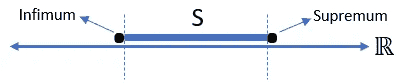

集合的上确界和下确界(图片由作者提供)

所以，该性质说，一族任意凸函数 f1(x)，f2(x)，…，fn(x)的上确界和下确界也是凸函数。凸函数的上确界如下所示:

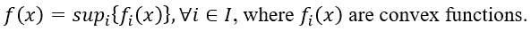

类似地，凸函数的下确界如下所示:

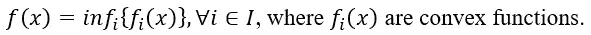

在这一节中，我们将研究一种非常有趣的函数，叫做**拟凸函数。**那么，拟凸是什么意思呢？意思是“仿佛凸”。进一步扩展这一点，拟凸给人一种弱凸感。它不是一个恰当的凸函数，而只是它的一个弱概念。定义拟凸函数有两种不同的方法。

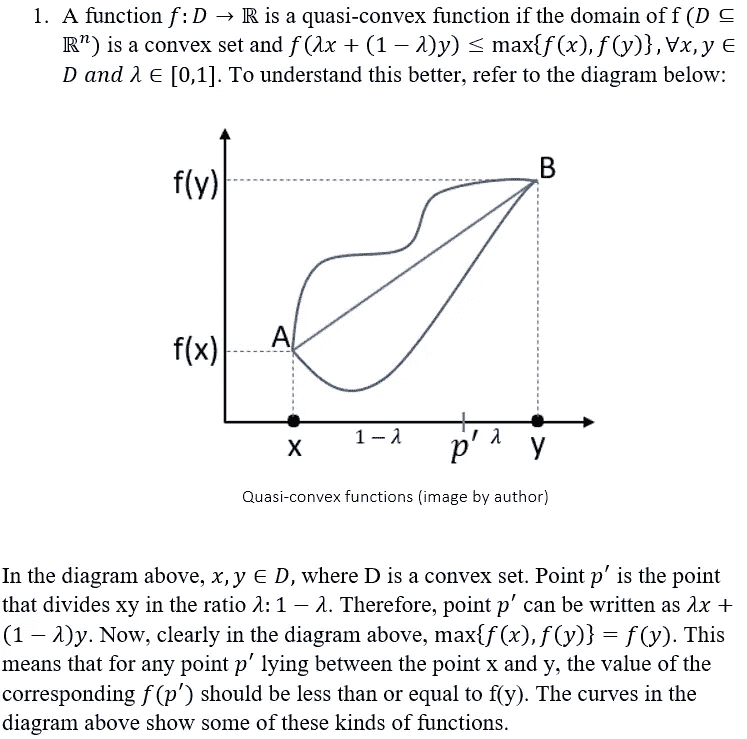

理解拟凸集的另一个定义使用了轮廓的概念。那么什么是等高线呢？轮廓只不过是某物的边界。这个东西可以是任何东西，比如一座山，一个雕塑，一件器具。在我们的例子中，我们将使用集合的轮廓。因此，拟凸函数的第二个定义是:

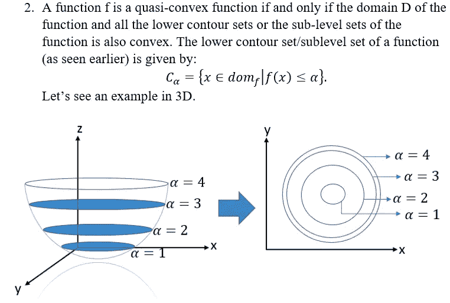

拟凸函数和下等高线/分段图(图片由作者提供)

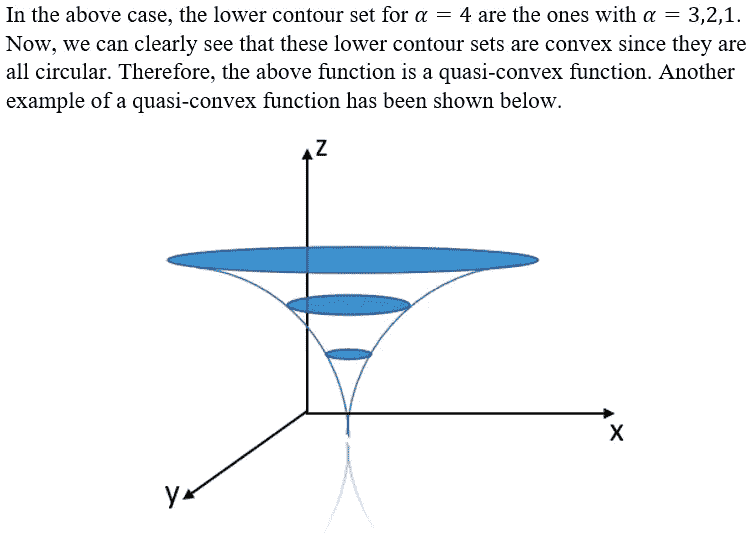

拟凸函数的另一个例子(图片由作者提供)

就这样，我们走到了这一章的结尾。

在前面的 [***第三章:一些重要的凸集***](https://medium.com/nerd-for-tech/optimization-algorithms-for-machine-learning-acffa886a343) 中，我问的第一个问题是“你认为过原点的超平面所创建的半空间的方程会是什么？”答案很简单。

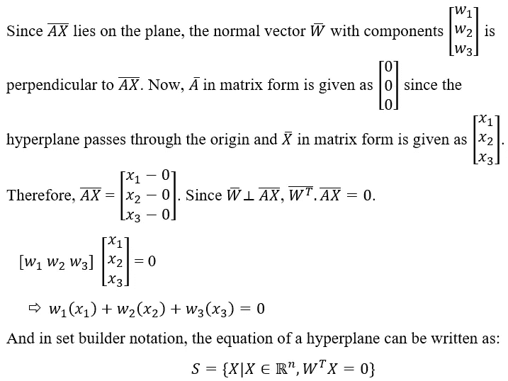

我问的第二个问题是“你能告诉我上图中范数球的向量的大小吗？”这就更简单了。其范数球已被显示的向量的大小是‘r’，这是如图所示的半径。

继续下一章，第 5 章:解决优化问题的先决条件[这里](/optimization-algorithms-for-machine-learning-e794f2e7dfa7)