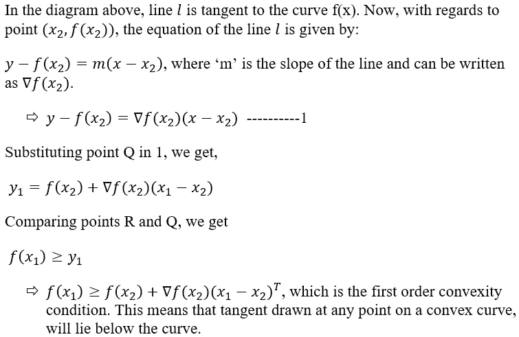
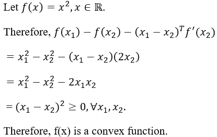
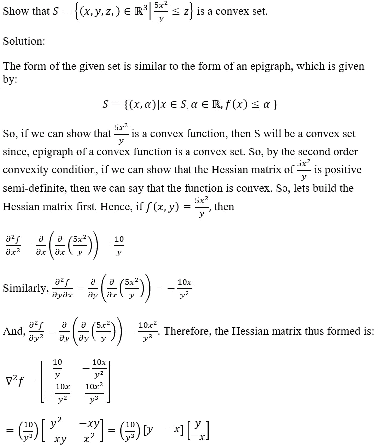

# 机器学习的优化算法

> 原文：<https://towardsdatascience.com/optimization-algorithms-for-machine-learning-e794f2e7dfa7?source=collection_archive---------27----------------------->

## **第 5 章:解决优化问题的先决条件**

约翰·莫斯·鲍恩在 [Unsplash](https://unsplash.com?utm_source=medium&utm_medium=referral) 上的照片

**的链接第四章:重要凸函数和凸性质**这里的[就是](/optimization-algorithms-for-machine-learning-d98d0feef53e)。第五章是关于我们在深入凸优化之前需要考虑的一些最终主题。顾名思义，你可以考虑这些凸优化的先决条件。请注意，当我们稍后解决优化问题时，这些概念将非常重要。因此，本章的重点是数学概念。将涉及的主题有:

*   标量和向量值函数
*   梯度的图形解释
*   海森矩阵
*   半正定矩阵
*   可微凸函数
*   一阶和二阶凸性条件
*   主要次要测验
*   特征值在确定凸性中的作用
*   功能组成
*   一些问题的解决

所以，让我们从**标量和向量值函数开始。**这些概念相当简单。接受一个或多个值，但返回单个值的函数称为标量值函数。标量值函数的示例如下所示:

从上面的等式中可以看出，该函数有 3 个输入(x、y 和 z ),只有一个输出。因此，该函数是一个标量函数。一个 n 变量标量值函数映射自—

更好地理解这一点的一个例子是抛物面函数，由下式给出

现在，我们将研究什么是向量值函数。向量值函数是那些接受一个或多个变量但产生输出向量的函数。二维中的一个例子是:

抛物面和 x-y 平面上的二维向量空间的俯视图(图片由作者提供)

在本节中，我们将研究**梯度**的图形解释。我们在前面的章节中已经看到，在 2D，三维图形的梯度是矢量。因此，如果三维图的中心位于原点，则三维图的梯度向量将远离中心。参考下图，图中显示了抛物面在 x-y 平面上的梯度向量空间。

抛物面在 x-y 平面上的梯度矢量点(图片由作者提供)

抛物面的 x-y 平面上的梯度向量空间如上所示。正如你所看到的，点 p 和 q 在抛物面上的投影已经用点ṕ和α表示出来了。ṕ和α代表抛物面上点 p 和 a 的梯度向量。类似地，向量空间(所有向量所在的空间)表示抛物面中所有点的梯度。想象你正在爬上抛物面。假设你在 P 点，你想知道走的方向，为了最快到达抛物面的顶部。从下面看抛物面，我们可以看到，为了最快地爬上抛物面，我们需要直接离开原点。这是因为在直接远离原点的方向上，抛物面最陡。因此，梯度指向最陡下降的方向，基本上是曲线的切线，在这种情况下是抛物面。参考下图可以更好地理解这一点。

从底部看抛物面和向量空间(图片由作者提供)

在上图中，蓝色的向量代表最陡的方向，因此是梯度向量。用黑色显示的向量代表其他不是最陡的运动方向。还要注意，曲线上一点的梯度向量的长度告诉我们曲线在该点的陡度。

在本节中，我们将了解什么是**海森矩阵**。我们不会马上进入 Hessian 矩阵的应用程序，但会随着系列的进展深入研究这些应用程序。现在，我们只会试着理解这个矩阵是什么。海森矩阵是一个函数的二阶偏导数的方阵。Hessian 矩阵用于识别函数在特定点的局部最小值和局部最大值。Hessian 矩阵的一般形式如下所示:

这里需要注意的是，如果一个函数在某一点的 Hessian 小于 0，那么这个点就是局部极大值。另一方面，如果该值大于 0，则该点是局部极小值。一会儿我们会看到更多的这个概念。

现在，我们将研究什么是**半正定矩阵**。可以理解半正定矩阵的方式是，假设我们有一个沿特定方向移动的向量 Z。如果这个向量 Z 被一个矩阵 A 击中，使得向量改变方向小于 90°，那么我们称这个矩阵是半正定的。这可以使用下图来显示。

半正定矩阵的图形解释(图片由作者提供)

半正定矩阵的数学定义是:

注意，半正定矩阵的概念将用于确定一个函数是否是凸的。

在这一节，我们将研究什么是**可微凸函数**。这里不会真正深入，只知道函数可微时需要成立的条件。可微凸函数的这一性质将在下一节中用到。因此，特性如下所示:

在这一节中，我们将研究一阶和二阶凸性条件。这些条件决定了函数是否是凸的。让我们研究一下**一阶凸性条件。**

理解一阶凸性的图表(图片由作者提供)

既然我们已经理解了一阶凸性条件的图形解释，也就有了上述性质的数学证明。让我们来看看。

现在，让我们来证明故事的另一面:

这里让我们看一个函数的例子，用上面的性质证明它是凸函数。

现在，我们将研究**二阶凸性条件。**这由下式给出:

现在，让我们看看**原理小测**是什么。我们不会涉及太多的细节和这个测试背后的逻辑。我们将简单地研究一下这个测试是如何完成的。注意，主要的次要检验将用于确定一个函数是否是半正定的。为了使用这个测试，我们需要找出函数的 Hessian 矩阵，并遵循下面提到的步骤:

需要记住的一点是，只有当函数的 Hessian 矩阵的所有元素都是常数时，主检验才有效。当然，这些盒子的数量会随着矩阵维数的增加而增加。

现在，我们将看到**特征值**如何帮助我们确定一个矩阵是否是半正定的。同样，我们不会真正进入细节，但我们会看看特征值是如何工作的。如果矩阵的特征值大于或等于 0，则该矩阵是半正定的。那么，我们如何计算特征值呢？

这告诉我们这个矩阵是正定的。注意，如果两个特征值都大于 0，那么矩阵就是正定的。另一点要注意的是，单位矩阵总是半正定的。

现在，我们将看看凸函数的一个非常有趣的性质。这一特性是用 c 语言的**函数组合**来描述的。这意味着给定一个函数 g(x)=f(h(x))，那么，

1.  g 是凸的，如果—

*   h 是凸的，f 是凸且非减的。为了理解什么是非减函数，请看下图。这几乎是不言自明的。你会注意到图中没有一点的斜率小于 0。

非递减函数(图片由作者提供)

*   h 是凹的，f 是凸的，非递增的。非递增函数的示例如下所示:

非递增函数(图片由作者提供)

在这种情况下，g 的几个例子如下:

2.g 是凹的，如果—

*   h 是凹的，f 是凹的且非减的
*   h 是凸的，f 是凹的，非递增的

至此，我们结束了本章的理论部分。在下一节中，我们将解决一些问题，以更好地理解到目前为止我们所看到的概念。

下一章，第 6 章:优化问题，点击[这里](/optimization-algorithms-for-machine-learning-a303b1d6950f)。

这是解决问题的部分。希望那些热爱解决数学问题的人会喜欢这一部分。

**问题 1:**

问题 1 的解答(图片由作者提供)

**问题二:**

**问题 3:**

凸函数和严格凸函数的区别其实很简单。如果连接曲线上任意两点的线段位于曲线上或曲线上方，则该函数是凸函数。如果这条线段“严格地”位于曲线之上，那么这个函数就成了一个严格凸函数。下面的图表有助于你理解这一点。

左图:严格凸函数；右图:凸函数(图片作者提供)

从右图中可以看出，连接点 x3 和 x4 的线段位于图上。因此，图是凸函数。注意还有一个概念叫“强凸性”。我们将在本系列的后续章节中对此进行研究。

所以，我们在这里可以形成的命题是，如果函数 f 是两次可微的，那么

*   f 是凸的当且仅当 f 的 Hessian 大于或等于 0。
*   如果 f 的 Hessian 严格大于 0，则 f 是严格凸的。

**问题 4:**

就这样，我们到了这一章的结尾。最好的部分是，从下一章开始，我们将最终深入适当的优化概念。到目前为止，我们一直只处理辅助主题，这将有助于我们理解和解决优化问题。

在前一章第四章:重要的凸函数和凸性质[这里](/optimization-algorithms-for-machine-learning-d98d0feef53e)我曾问过“如果 n 个向量的线性组合位于一个 n 维空间，你认为这些向量的仿射组合位于哪个维空间？”。答案很简单。向量将位于 n-1 维空间中。我们可以从这样一个事实得到一个想法，当一些向量的线性组合是一个二维平面时，相同向量的仿射组合是一条线。

我问的下一个问题是“你认为凸锥体或圆锥壳在三维空间中会是什么样子？”。这就更简单了。这些看起来像一个圆锥体，就像一个冰淇淋蛋卷，就是这样！

点击[这里](/optimization-algorithms-for-machine-learning-a303b1d6950f)进入下一章，第 6 章:优化问题。