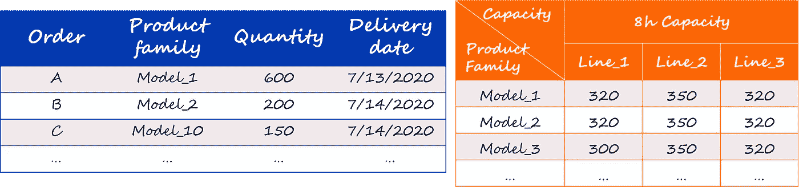
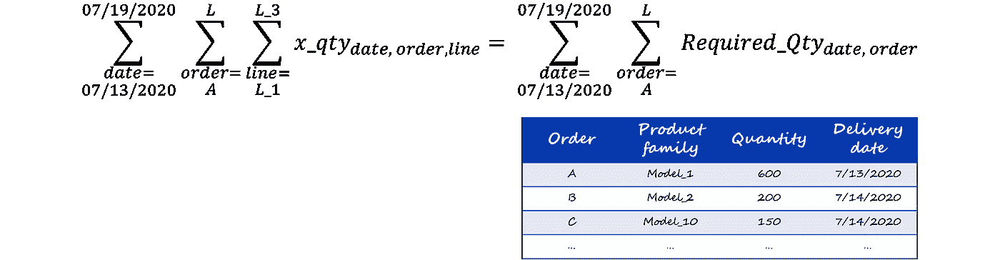

# 用 Python 和 Gurobi 优化周生产计划——第 3 部分

> 原文：<https://towardsdatascience.com/optimization-of-a-weekly-production-plan-with-python-and-gurobi-part3-2d8da1d3fc4c?source=collection_archive---------6----------------------->

## [实践教程](https://towardsdatascience.com/tagged/hands-on-tutorials)

## 了解如何使用 Python 和数学求解器 Gurobi 解决优化问题

我们在之前的[文章](/optimization-of-a-weekly-production-plan-with-python-and-gurobi-part2-6ebcefe85e52)中研究了如何在几条生产线之间分配工作量，以满足需求，同时减少劳动力、库存和短缺成本。

这个模型有一些限制，可能无法在自然环境中使用。事实上，在大多数情况下，需求是根据客户订单列表的发货数量。还有，每种材料的周期时间不一样。

我们将在这里看到在这种情况下如何优化生产计划。


照片由雷米·吉林拍摄| [Unsplash](https://unsplash.com/photos/alxnBRdFGJI)

# 1.语境

## 最终装配计划

总装调度的想法是通过在每日级别调度生产订单来细化每日需求。我们的目标是通过平滑生产负荷来降低成本，从而减少劳动力成本，同时及时生产以减少库存和短缺成本。

我们采用的是**按订单生产方案**，其中**三条生产线并行**。工厂的组织方式使得**单件流**始终受到尊重，生产材料的所有任务都在同一条生产线上完成。每天 7 到 12 小时之间，每条生产线都可以额外收取加班费用。

我们需要安排生产订单，以满足客户订单清单所表达的要求。

除了我们在前面的文章中所做的，我们将为我们工厂正在生产的每个产品系列添加周期时间的概念。该周期时间通过一个矩阵用作输入，该矩阵显示了 8 小时轮班的演示能力。由于不同生产线的设备不同，产能不仅取决于产品系列，还取决于装配线，如下图所示。



客户订单和生产线产能|图片由作者提供

> **如何根据这些输入提出一个最小化成本的最终装配计划？**

本文给出的算法基于第 1 部分和第 2 部分给出的算法。在本文中，我们将只坚持新引入的概念。

下面是我们将使用 Python 和 Gurobi solver 解决的问题的摘要。

```
**Inputs**
- Customer requirements
- Capacity matrix
- Labor cost per hour
- Inventory cost per material per day
- Shortage cost per material per day**Variables**
- x_qty[date, order, assembly line]: quantity of materials produced per day for each order on a given assembly line
- x_time[date, order, assembly line]: working time per day for each order on a given assembly line. Defined according to the cycle time for each model.**Constraints** - Produce the quantity required by our customers
- From 7 to 8 standard working hours per day
- From 0 to 4 overtime working hours per day**Objective function to minimize**
Sum of all costs considered
- Labor cost
- Inventory cost
- Shortage cost
```

# 2.编程我们的调度算法

## 输入

‣ ***提取数据***

这一次，为了提出一个更好地满足专业环境需求的模型，输入来自一个 Excel 文件，该文件可以从我们的 ERP 中提取。我们的算法将读取客户的要求，并使用相同的模板在另一个 Excel 文件中生成优化的生产计划。

我们将使用 pandas 的库来拟合这些信息，并转换数据以用于我们的优化算法。

用作输入的第二个 Excel 文件是每种产品每条生产线的演示产能。理想情况下，所有的装配线都应该有相同的流程，因此也应该有相同的能力。然而，在我们的小装配厂却不是这样。

展示的能力不是基于理论路线时间，并且已经考虑了由于缺乏效率而造成的损失。以下是每条生产线 8 小时的产能:

现在让我们从 Excel 中获取数据，并将其加载到 pandas 数据框中:

之前呈现并保存在两个 Excel 文件中的数据没有保存到变量的 ***customer_orders*** 和 ***capacity*** 中。此外，为了创建我们的算法，我们需要将产能转换为周期时间，即生产一个项目所需的时间。这些信息存储在变量 ***【周期 _ 时间】*** *中。*

从本地文件中提取这些数据后，我们需要设置劳动力、库存和短缺成本。这是以与前几篇文章相同的方式完成的，这里不再赘述。

与前面的文章相反，我们操作的日历是基于客户订单文件构建的。如果需要，可以在我的 [Git Hub](https://github.com/baptistesoulard/Production-plan-optimization/tree/master/Planning_optimization_part3) 上找到代码。

现在我们已经访问了所有要处理的信息，我们将创建字典来使用求解器 Gurobi 求解我们的模型。

‣ ***创作辞书***

首先，我们需要创建一个包含与周期时间相关的信息的字典。我们想知道在每条装配线上生产一个订单单位所需的时间。

由于我们还不知道每个订单的周期时间，我们需要将本文第一部分创建的两个数据框架联系起来，即客户订单和产能数据框架。我们还将借此机会格式化日期。

我们现在已经拥有了在一个数据框中构建词典所需的所有信息。

根据记录，字典用于存储按键索引的数据。因为我们需要知道在每条装配线上生产每份订单的一个单位所需的时间，所以用于索引周期时间字典的关键字是元组(订单，装配线)。

为了创建字典，我们将在 ***customer_orders*** 数据框架中查找周期时间信息，并迭代每个订单和每条装配线。

输出将是:

```
cycle_times = {('A','Line_1'): 0.025, ('A','Line_2'): 0.0228, … ,('L','Line_2'): 0.0228,('L','Line_3'): 0.025}
```

同样，我们创建了包含日常需求(即客户需求)的字典。

```
daily_requirements = {('2020/07/13','A'): 600, ('2020/07/13','B'): 0, … ,('2020/07/19','K'): 0, ('2020/07/19','L'): 200}
```

在这一点上，我们已经成功地提取和提炼了将用于优化问题的数据。现在让我们开始定义我们的变量。

## 变量

与前两篇文章相比，这里是主要的创新之处。

在前面的文章中，我们在二维空间工作，我们的变量是每天在每条装配线上工作的时间。这次我们增加一个维度，这个变量所关注的顺序。

我们有一个主优化变量 ***x_qty*** 和一个从属变量 ***x_time*** 使用 ***cycle_times*** 字典定义。一个三维的元组代表了它们。

*   ***x _ qty[日期，订单，装配线]*** :给定装配线上每个订单每天生产的产品数量
*   ***x _ time[日期，订单，装配线]*** :给定装配线上每个订单每天的工作时间

除了这些新变量，我们将使用在以前的文章中定义的变量。以下是对这些变量的提醒:

‣ ***时间变量***

这些变量用于根据我们工厂的规定设置工作时间的限制。

```
 • ***reg_hours[date, assembly line]***: regular working time on each assembly line• ***OT_hours[date, assembly line]***: overtime working hours on each assembly line
 • ***line_opening[date, assembly line]***: binary variable telling if an assembly line is opened each day
 • ***total_hours[date, assembly line]***: total working hours on each assembly line. It is the sum of regular and overtime working hours on the days the line is opened.
```

‣ ***数量变量***

这些变量用于计算库存和短缺成本。

```
 • ***early_prod[date, order]***: quantity of items produced early for each order• ***late_prod[date, order]***: quantity of items produced late for each order
```

## 限制

正如在简介中看到的，我们对每天的工作时间有一些限制，这是满足我们客户要求的一个障碍。

在每个变量的定义中设定了限制工作时间的约束条件，设定了下限和上限以符合规定。

为了满足我们客户的需求，我们想生产出准确的订单数量。为此，我们将设置以下约束:



## 目标函数

我们的目标是提出一个考虑到劳动力成本、库存成本和短缺成本的具有成本效益的计划。我们将所有这些变量添加到我们的目标函数中，然后最小化这个函数。

# 3.解决方案和分析

最小化目标函数后，我们的优化算法返回以下生产计划:

你可以在下图中看到客户的需求是如何在我们的生产线之间分布的。我们可以注意到，每个订单的生产都是在需要最大限度减少库存的当天实现的。

订单 L 的情况并非如此，因为它仅代表几个小时的生产，并且禁止在少于 7 小时的时间内打开生产线。订单 L 在 7 月 18 日生产，它将建立一个 200 件的库存，将在 7 月 19 日发货。

我们可以检查每天工作时间的限制是否得到遵守。这些限制是根据当地法规定义的。

在我们的案例中，现行法规规定每天最少工作 7 小时，最多 12 小时，8 小时是 100%负载的理想工作时间。下图中的灰色线条代表了这些极值。

每条线路上的每日工作时间总是落在 7 至 12 小时之间，并且遵守规定。

现在，让我们显示该计划建议中预期的库存和短缺。

从生产计划中可以看出，订单 L 在一天内增加了 200 件 model 7 库存，从而影响了我们的库存水平。没有后期生产，客户的要求得到满足，没有任何短缺。

**第一天客户要求太高无法处理怎么办？**

让我们看看我们的调度优化算法如何在时间框架的开始处理一个重要的客户订单。

下面的计划显示了如果第一个客户订单量较高，我们的模型所建议的生产计划。在本例中，订单 A 的数量是 2000 件，而在我们的第一次测试中是 600 件。这个量一天也处理不过来，即使我们三条线满负荷运转。

我们可以看到，我们的模型通过建议在第二天生产这些材料来管理这种类型的请求。这在下面的短缺报告中更加明显，我们可以看到我们无法生产 515 件。它们将在 7 月 13 日生产。

当然，这不应该发生，因为它会对客户满意度产生负面影响。

# 4.结论

通过这三篇文章，我们一步一步地学习了如何形式化一个优化问题，以及如何使用 Python 和 Gurobi solver 来解决它。

这种方法已被应用于需要安排生产以降低成本(包括劳动力、库存和短缺)的按订单生产工厂。

没有考虑所有的限制和所有的成本；一些需要改进的地方包括:

*   考虑不同型号之间的转换时间
*   模拟一个更复杂的工厂，各种任务按照特定的顺序在不同的生产线上执行

# 资源

</optimization-of-a-weekly-production-plan-with-python-and-gurobi-part-1-d1257ad29a9>  </optimization-of-a-weekly-production-plan-with-python-and-gurobi-part2-6ebcefe85e52>  

这个项目在我的 GitHub 上的仓库:[https://GitHub . com/soula bat/Production-plan-optimization/tree/master/Planning _ optimization _ part 1](https://github.com/soulabat/Production-plan-optimization/tree/master/Planning_optimization_part1)

解释 SAP 如何在其计划优化模块中使用线性优化:[http://www . guro bi . com/pdf/user-events/2017-Frankfurt/SAP . pdf](https://www.gurobi.com/pdfs/user-events/2017-frankfurt/SAP.pdf)

古罗比文档:[https://www . guro bi . com/documentation/8.0/examples/work force 5 _ py . html](https://www.gurobi.com/documentation/8.0/examples/workforce5_py.html)

如果你需要更多的信息或者想就这个问题交换意见，请随时联系我。你可以在 LinkedIn 上找到我。