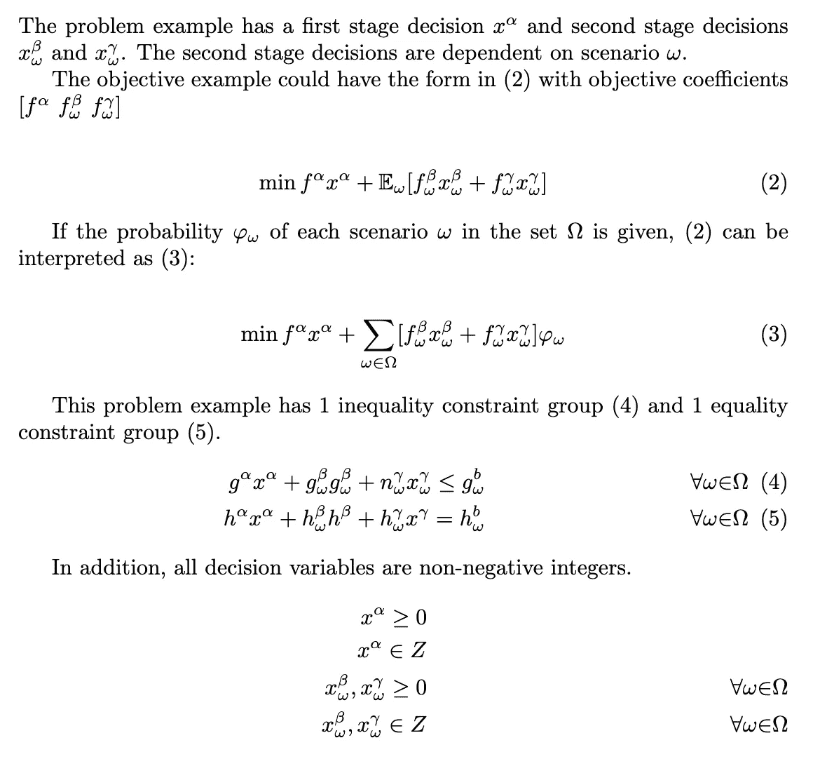
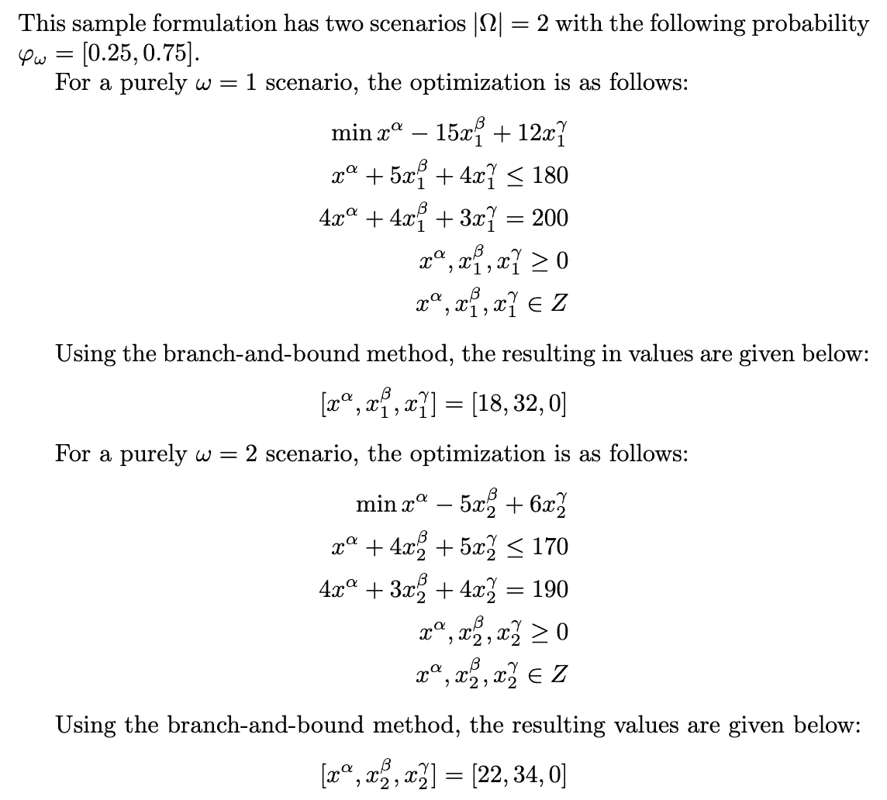
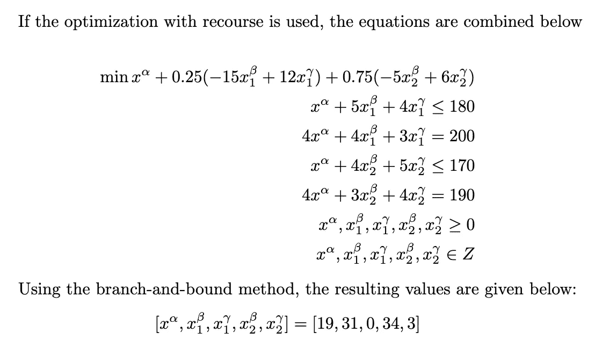
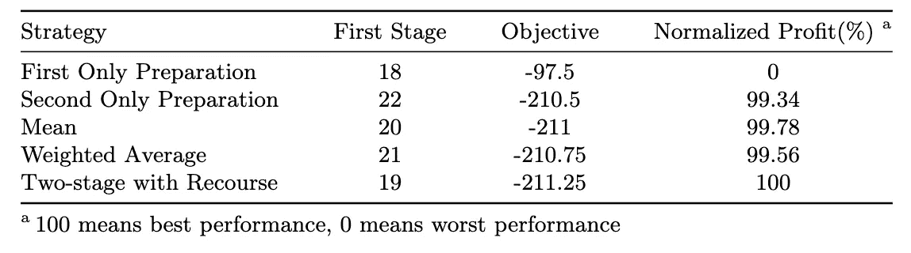

# 资源优化教程

> 原文：<https://towardsdatascience.com/optimization-with-recourse-tutorial-6985748a94e6?source=collection_archive---------31----------------------->

## 带有数字示例的快速指南

罗伯特·鲁杰罗在 [Unsplash](https://unsplash.com/s/photos/uncertainty?utm_source=unsplash&utm_medium=referral&utm_content=creditCopyText) 上的照片

我们将首先介绍什么是优化，以及优化的一些特殊形式，包括带资源的优化。然后我们会有一个快速的公式和一个数值例子。在本教程结束时，希望你能理解为什么有追索权的优化是随机用例的有用工具，以及有追索权的优化与均值和加权平均等常用的平均方法有何不同。

# 优化基础

对于给定的问题场景，优化已经成为有效分配有限资源的关键工具。标准数学程序通常为单个决策者做出的单个目标提供一组决策。在实践中，许多优化问题都是在考虑多个决策者和多个阶段的情况下建模的。多级规划涉及多个级别或阶段，其中每个阶段可以有多个目标，这些目标可以由多个决策者制定。

两阶段随机优化程序是多层规划的一个子集。随机程序通常基于概率分布对不确定参数建模。当不确定性已知时，根据决策，不确定性分两个阶段出现，如带追索权的优化情况。

# 为什么要追索？

当单个决策者可能需要在不同阶段优化目标时，就会出现带追索权的两阶段优化。在可行集 *X* 的决策 *x* 必须在实现来自可能集*ω*的场景 *ω* 之前做出的情况下，具有追索权的随机优化适合于解决这样的问题。

追索程序指的是随机优化，在不确定性被披露后，从可行集合 *Y* 中采取追索行动 *y* 。决策可以分为两个阶段。追索行动 *y* 被称为第二阶段决策。在 *ω* 公开之前做出的 *x* 决策称为第一阶段决策。在这个框架中，不确定的约束被视为软约束，它可能被违反，但具有影响选择 *x* 的惩罚成本。第二阶段必须考虑可能情况的预期。惩罚偏差促进了第一阶段决策的可行性，并对不常见的极端异常变得稳健。如果样本空间能够以概率 *φ* 可数或近似为集合*ω*中的场景 *ω* ，则期望最小追索权𝔼可以使用基于 *φ* 的求和来表示。

# 样本问题公式

我们将从第一阶段和第二阶段决策开始，如下所示:

作者图片

# 样本数值解

作者图片

作者图片

请注意，在有追索权的两阶段优化中考虑这两种情况时，第一阶段的决策发生了变化。由此产生的第一阶段决策不一定是第二阶段两个方案的平均值或加权平均值。表 1 显示了产生的第一个决策及其相关值。

作者图片

# **总结**

如果给我们一个用例，其中必须在场景公开之前做出决策，而不是仅仅使用均值、加权资源或单级优化，那么尝试使用资源优化可能是一个好主意。这样的工具变得必不可少，尤其是当我们想要从给定的信息和风险中获得最大收益的时候。