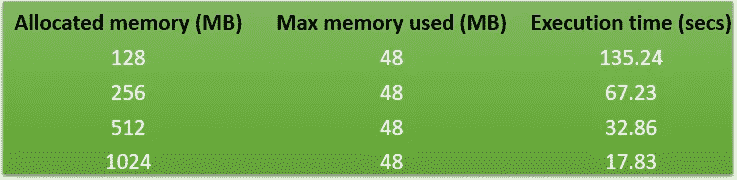
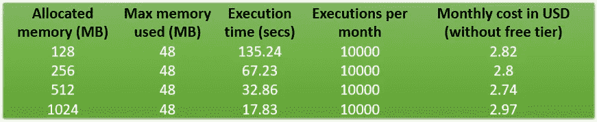
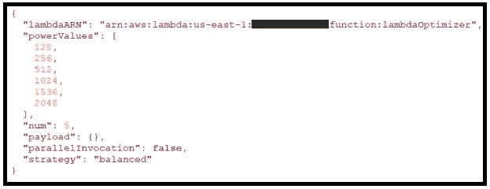
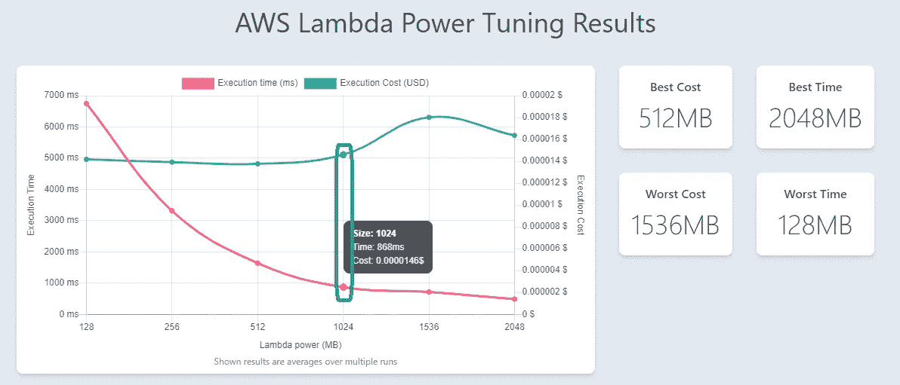

# 优化 AWS Lambda 内存

> 原文：<https://towardsdatascience.com/optimize-aws-lambda-memory-more-memory-doesnt-mean-more-costs-51ba566fecc7?source=collection_archive---------7----------------------->

## 关于如何决定 lambda 函数的内存需求的见解


埃里克·麦克林在 [Unsplash](https://unsplash.com?utm_source=medium&utm_medium=referral) 上的照片

对于任何开始无服务器之旅的人来说，AWS lambda 太棒了。你写代码，调用函数，它会为你做工作。打住，真的做到预期了吗？我是说执行时间呢？如何确保我的 lambda 函数以最低的成本实现最佳性能？这是每个人开始生产 lambda 函数时都会思考的问题。相信我，我得到的关于 lambda 函数的问题都很疯狂:

1.  当函数是 CPU 密集型的时，为什么要分配更多的内存？
2.  lambda 函数的 CPU 利用率是多少？
3.  增加内存会增加成本。检查一下你分配了多少内存。

当我第一次开始使用 lambda 时，我感到困惑的是，AWS 可以选择为 lambda 函数分配内存。没有分配 CPU 的选项。CPU 会随着内存的增加而扩展。为了理解它是如何工作的，让我们举一个简单的例子，在不同的内存限制下运行它。

我写了一个简单的函数，打印出介于“下”和“上”值之间的质数。代码如下:

```
import jsonprint('Loading function')def lambda_handler(event, context):
    lower = 2
    upper = 50000
    print("Prime numbers between", lower, "and", upper)

    for num in range(lower, upper + 1):
        if(num > 1):
            for i in range(2, num):
                if (num % i) == 0:
                    break
            else:
                print(num)return {
        'statusCode': 200,
        'body': json.dumps("Function executed successfully")
    }
```

我用 4 个内存限制(128 MB、256 MB、512 MB 和 1024 MB)运行了上面的函数。以下是结果:



作者图片

如你所见，*【使用的最大内存】*总是在 48 MB 左右。不过，有趣的是看到的*“执行时间”。随着我增加内存，执行时间下降了(从 128 MB 的 135 秒到 1024 MB 的 17 秒)。这证明随着内存的增加，分配的 CPU 越来越多。但是成本呢？内存增加会导致更高的成本吗？为了理解成本的含义，我使用了 [AWS 计算器](https://calculator.aws/#/)。我选择找出每月 10000 次执行的无自由层成本，这是我得到的结果:*



作者图片

看着这些数字，我很惊讶。对于 128 MB 的内存，我的执行时间大约是 135 秒，成本是 2.82 美元。将内存增加到 1024 MB，在不增加太多成本的情况下，极大地提高了执行时间。因此，增加内存会增加成本并不总是正确的。

问题是如何为 lambda 函数分配最优内存？我的意思是，我不能对我写的每个函数都做这样的计算。所以我开始在网上搜索，看看是否有工具可以做到这一点，并给我提供内存、执行时间和成本的最佳组合。你猜怎么着，谷歌一如既往地帮我找到了答案。GitHub 上有一个由 Alex Casalboni 编写的独立项目可以完成这项工作。([https://github.com/alexcasalboni/aws-lambda-power-tuning](https://github.com/alexcasalboni/aws-lambda-power-tuning)

# **使用 AWS Lambda 功率调谐**

你可以在 GitHub 文章[https://GitHub . com/alexcasalboni/AWS-lambda-power-tuning/blob/master/README-deploy . MD](https://github.com/alexcasalboni/aws-lambda-power-tuning/blob/master/README-DEPLOY.md)中了解如何安装 power tuner。

我继续使用选项 1，无服务器应用程序存储库进行部署。部署完成后，是时候为我的 lambda 函数执行它了。同样，在文章[https://github . com/alexcasalboni/AWS-lambda-power-tuning/blob/master/README-execute . MD](https://github.com/alexcasalboni/aws-lambda-power-tuning/blob/master/README-EXECUTE.md)中给出了多个执行选项

我使用*选项 3 执行:使用以下输入手动执行状态机(web 控制台)*:



作者图片

1.  被测λ函数的λarn→arn。
2.  powerValues →要测试的内存值列表
3.  num →每个配置的调用次数
4.  策略→可以是我在测试中使用的平衡的`"cost"`或`"speed"`或`"balanced".`。

您可以在此链接中阅读更多关于其他输入值的信息:[https://github . com/alexcasalboni/AWS-lambda-power-tuning/blob/master/README-INPUT-output . MD](https://github.com/alexcasalboni/aws-lambda-power-tuning/blob/master/README-INPUT-OUTPUT.md)

一旦我执行了状态机，我得到了下面的结果(*注意:对于这个测试*，我将‘upper’值减少到了 10000)



作者图片

从上面的描述可以看出，最好的性价比是 512 MB 内存。但当我们看到 1024 MB 的内存时，我们的成本会稍微高一些，但执行时间会大幅减少。我发现这个工具非常适合测量 lambda 函数的内存需求。您可以根据自己的需求在输入中尝试不同的值组合，然后做出决定，而不是进行一些特别的内存分配并期望事情正常工作。