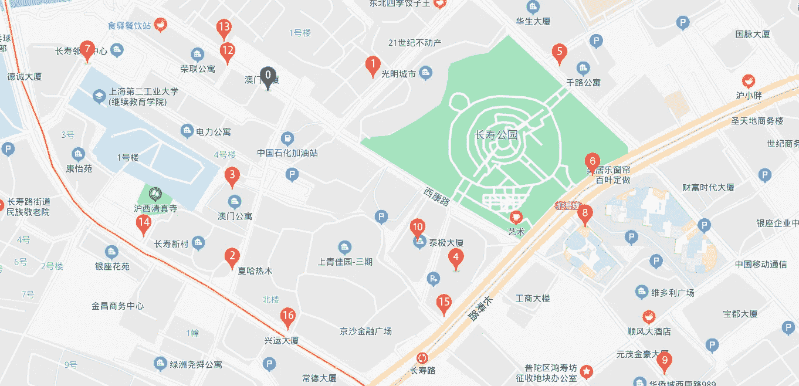
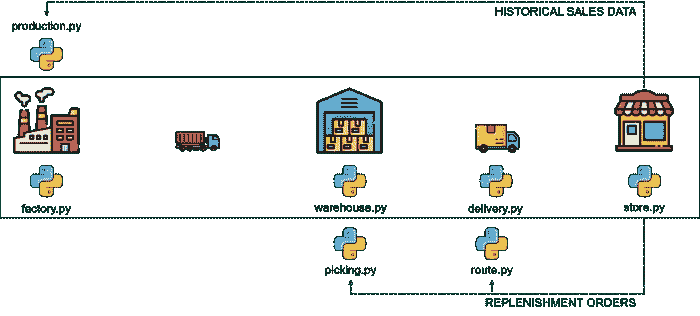

# 使用 Python 优化电子商务的最后一英里交付

> 原文：<https://towardsdatascience.com/optimize-e-commerce-last-mile-delivery-with-python-ab9ba37d214c?source=collection_archive---------11----------------------->

## 使用 python 优化模型组织路径，以最少的驾驶员数量交付包裹


萨姆·巴耶在 [Unsplash](https://unsplash.com/s/photos/express-delivery?utm_source=unsplash&utm_medium=referral&utm_content=creditCopyText) 上拍摄的照片

If you travel to first and second-tier cities of China, you will find on the street many delivery drivers (Chinese: 快递).

They take the parcels from small warehouses called customer service centres (Chinese:客户服务中心) located in each neighbourhood and deliver them to the final customers.

这些中心是中国主要快递公司物流网络的关键要素。它们为最后一英里的交付提供了广阔的地理覆盖范围，并通过提供市场上最佳的服务水平和交付提前期，提供了巨大的竞争优势。

在到达您的家门口之前，您的包裹将从供应商的仓库中取出，经过几个地区配送中心，最终到达您所在社区的服务中心。

当您的包裹到达中心时，您会在手机上收到通知，告知您快递员将在当天为您递送包裹。

本文将提出一个解决方案，优化从这些中心的最后一英里交付，以降低成本，并确保每个司机的工作量均匀分布。

💌新文章免费直入你的收件箱:[时事通讯](https://www.samirsaci.com/#/portal/signup)

# 一、如何用 python 优化最后一公里交付？

## 问题陈述

你是当地服务中心的经理，负责

*   **您团队中的 4 名车手**
*   **每辆车 15 包**容量
*   **16 个目的地**以覆盖名为 D *j* 的街区，j 在[1，16]中
*   **D0** 是中心
*   **每位驾驶员 1 条路线**



示例 0:您的服务中心| 1 … 16:客户的目的地—(图片由作者提供)

## 距离矩阵

要构建您的模型，您需要提供一个距离矩阵 M 作为输入，定义如下

*   M(i，j)与 I，j 在[0，16]中
*   M(i，j)= D*I*和 D *j* 之间的距离

该距离矩阵将从 Excel 文件中加载。你可以在这里找到这个场景的例子:[链接](https://gist.github.com/samirsaci/4e42fa275fc2533a22699b75f9765615)

距离矩阵(m)——(作者)

## 需求:要递送到每个地点的包裹数量

我们将在这里使用一个第一个值为零的 python 列表(因为你不需要在中间传递任何东西)

*   需求= [0，1，1，2，4，2，4，8，8，1，2，1，2，4，4，8，8]

## 目标

*   **用最少数量的司机运送所有包裹**
*   **优化路线以最小化每条路线覆盖的距离**

**结果**

```
**Route for driver 0**
 0 Parcels(0) ->  4 Parcels(4) ->  3 Parcels(6) ->  1 Parcels(7) ->  7 Parcels(15) ->  0 Parcels(15)
Distance of the route: 1552 (m)
Parcels Delivered: 15 (parcels)

**Route for driver 1**
 0 Parcels(0) ->  14 Parcels(4) ->  16 Parcels(12) ->  10 Parcels(14) ->  9 Parcels(15) ->  0 Parcels(15)
Distance of the route: 1552 (m)
Parcels Delivered: 15 (parcels)

**Route for driver 2**
 0 Parcels(0) ->  12 Parcels(2) ->  11 Parcels(3) ->  15 Parcels(11) ->  13 Parcels(15) ->  0 Parcels(15)
Distance of the route: 1552 (m)
Parcels Delivered: 15 (parcels)

**Route for driver 3**
 0 Parcels(0) ->  8 Parcels(8) ->  2 Parcels(9) ->  6 Parcels(13) ->  5 Parcels(15) ->  0 Parcels(15)
Distance of the route: 1552 (m)
Parcels Delivered: 15 (parcels)

Total distance of all routes: 6,208 (m)
Parcels Delivered: 60/60
```

根据这些结果，您可以为四位驾驶员中的每一位分配一条总距离相同的路线

*   100%的包裹在最短距离内送达
*   司机的车辆已满载(15/15)

使用这种模型有助于确保通过送货获得固定报酬的司机能够被公平地分配到一条路线上。

你将避免司机抱怨的问题，因为他们的路线比他们的同事更长。

此外，你正在最大限度地利用你的资源。

[](http://samirsaci.com) [## 萨米尔 Samir 供应链组合的数据科学

### 🏭使用高级数学概念的供应链网络优化👨‍🏭仓储的持续改进…

samirsaci.com](http://samirsaci.com) 

# 二。构建您的模型

用谷歌工具解决有容量限制的车辆路径问题(CVRP)

OR-Tools 是 Google 的一个开源集合，提供了用于组合优化的工具。目标是从大量可能的解决方案中找到最佳解决方案。

让我们尝试使用这个库来构建最佳路线。

> 你可以在这个 Github 资源库中找到完整的代码:[链接](https://github.com/samirsaci/last-mile)
> 我的作品集与其他项目:[萨米尔萨奇](https://samirsaci.com/)

## 1.导入距离矩阵和初始参数

## 2.创建计算距离和订购数量的函数

## 3.用约束条件构建模型

## 4.展示解决方案

# 三。结论

*关注我的 medium，了解更多与供应链数据科学相关的见解。*

该模型可以帮助中心经理

*   充分利用司机和车辆，优化车队
*   确保工作量在每个驱动程序之间平均分配

**问题:**

*   提高每个驱动程序的容量(箱数)会带来什么结果？
*   如果我们有重量或体积限制，会有什么结果？

我让你测试它，并在评论区分享你的结果(或问题)。

## 用 Digital Twin 模拟几个场景

数字孪生是物理对象或系统的数字复制品。

供应链数字模型是一种计算机模型，代表供应链中涉及的各种组件和流程，如[仓库](https://youtu.be/XejgbF2m_8g)、[运输网络](https://youtu.be/aJnrEElPvvs)和[生产](https://youtu.be/130AKb2DejM)设施。

在这个数字模型中，您可以用成本、能源、排放和交付周期参数来模拟端到端供应链的每个元素。



(图片由作者提供)

当你头脑风暴潜在的路线分配策略时，你可以模拟它们对整个配送网络的影响。

举个例子，

*   如果我们增加每辆运输车辆的存储容量，会有什么影响？
*   如果我们使用货车而不是电动自行车，会对[二氧化碳排放量](https://youtu.be/ddthuvFQdGY)产生什么影响？
*   使总成本最小化的[最佳分销网络](https://youtu.be/gF9ds3CH3N4)(你的最后一英里分销中心的位置)是什么？

欲知详情，

[](https://www.samirsaci.com/what-is-a-supply-chain-digital-twin/) [## 什么是供应链数字孪生？

### 供应链优化使用 python 创建一个代表供应链网络的模型，以优化您的…

www.samirsaci.com](https://www.samirsaci.com/what-is-a-supply-chain-digital-twin/) 

## 可持续的数字孪生模型


(图片由作者提供)

假设你使用排放二氧化碳的车辆，你可以修改这个模型来考虑最后一英里配送网络的总排放量。

绿色库存管理可以定义为以环境可持续的方式管理库存。


(图片由作者提供)

对于分销网络而言，这可能涉及一系列旨在减少订单传输、准备和交付的环境影响的流程和规则。

> *如果我们降低商场补货的频率，对二氧化碳排放会有什么影响？*

在本例中，我们使用数据分析来模拟商店补货频率的变化，并衡量对整体环境的影响。

[](https://www.samirsaci.com/green-inventory-management-case-study/) [## 绿色库存管理-案例研究

### 可持续发展如何减少时尚零售物流运作的二氧化碳排放量？

www.samirsaci.com](https://www.samirsaci.com/green-inventory-management-case-study/) 

# 关于我

让我们在 [Linkedin](https://www.linkedin.com/in/samir-saci/) 和 [Twitter](https://twitter.com/Samir_Saci_) 上连线，我是一名供应链工程师，正在使用数据分析来改善物流运营和降低成本。

如果你对数据分析和供应链感兴趣，可以看看我的网站

[](https://samirsaci.com) [## Samir Saci |数据科学与生产力

### 专注于数据科学、个人生产力、自动化、运筹学和可持续发展的技术博客

samirsaci.com](https://samirsaci.com) 

# 参考

[1] Google AI，Google OR-Tools 库，[链接](https://developers.google.com/optimization)