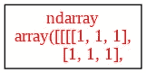
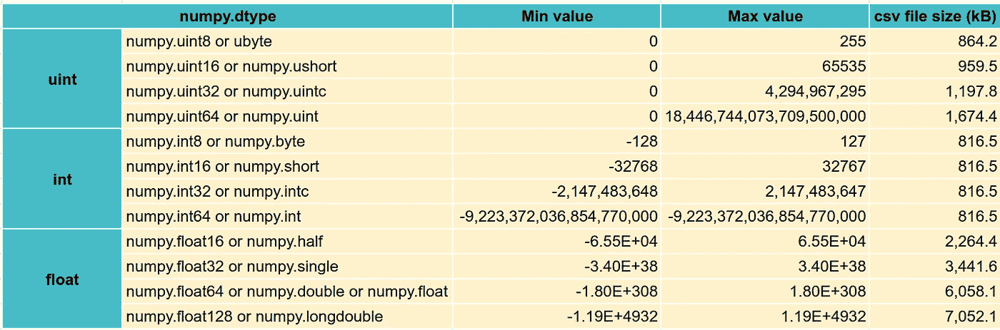
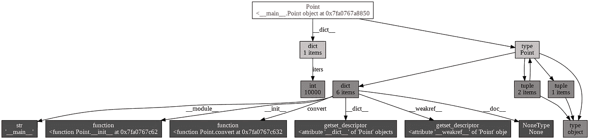
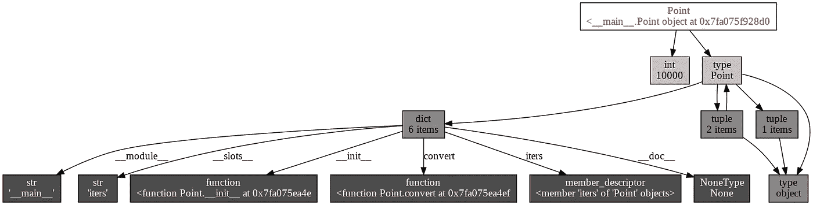
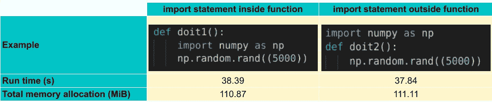

# 在 Python 中优化内存技巧

> 原文：<https://towardsdatascience.com/optimize-memory-tips-in-python-3bbb44512937?source=collection_archive---------1----------------------->

## 在 Python 中跟踪、管理和优化内存使用是一件很好理解的事情，但是缺乏对方法的全面总结。这篇文章介绍了提高内存利用率的最常见和最有效的方法。


来源:费德里科·贝卡里于 [Unsplash](https://unsplash.com/photos/ahi73ZN5P0Y)

Python 中的内存管理不是一个简单的问题，它需要对 Python 对象和数据结构有很好的理解。与 C/C++不同，用户无法控制内存管理。它由 Python 自己接管。然而，有了关于 Python 如何工作和内存支持模块的一些见解，我们可以在如何控制这个问题上找到一些线索。

# 分配了多少内存？

在 Python 中有几种方法可以获得对象的大小。你可以使用`sys.getsizeof()`来获得对象的确切大小，`objgraph.show_refs()`来可视化一个对象的结构，或者`psutil.Process().memory_info().rss` 来获得当前所有的内存分配。



“ob”的结构(sample-graph.png)-来源:作者图片

[**tracemalloc**](https://docs.python.org/3/library/tracemalloc.html) 也是另一种选择。它包含在 Python 标准库中，并提供内存分配的块级跟踪、程序整体内存行为的统计。

最常用的文件是 arr 对象，它占用 2 个内存块，总大小为 2637 MiB。其他对象很少。

另一个重要的技术是估计进程运行需要多少内存。这可以通过监控进程的内存使用峰值来推测。要测量峰值内存，您可以在过程结束时使用下面的代码。

```
### For Linux (in KiB) and MacOS (in bytes)
from resource import getrusage, RUSAGE_SELF
print(getrusage(RUSAGE_SELF).ru_maxrss)### For Windows
import psutil
print(psutil.Process().memory_info().peak_wset)
```

有了放入进程的峰值和数据量，就可以通过某种方式判断下一个进程要消耗的内存量。

## **1。利用 Pytorch 数据加载器**

训练大型数据集是您的内存瓶颈，如果整个数据集无法同时放入您的内存，您将永远无法训练完整的模型，尤其是对于图像、文本、语音等非结构化数据……但是，使用 Pytorch DataLoader，您可以为整个数据集设置各种小批量，并且每个小批量都不间断地加载到您的模型中(样本数量取决于您的内存容量)。你可以在这里看到<https://pytorch.org/tutorials/beginner/data_loading_tutorial.html>**使用 Pytorch DataLoader 的教程。**

**然而，如果你想在不使用深度学习的情况下(因此，不使用 Pytorch)在表格数据上训练机器学习模型，或者你没有访问数据库的权限，只能在内存上工作，那么内存优化的选择是什么？**

## ****2。优化的数据类型****

**通过了解数据是如何存储和操作的，并为任务使用最佳的数据类型，它将为您节省大量的内存空间和计算时间。在 Numpy 中，有多种类型，包括 bool(布尔)、integer (int)、Unsigned integer (uint)、float、complex、datetime64、timedelta64、object_ 等…**

```
### Check numpy integer
>>> import numpy as np>>> ii16 = np.iinfo(np.int16)
>>> ii16
iinfo(min=-32768, max=32767, dtype=int16)### Access min value
>>> ii16.min
-32768
```

**我将它们缩小到 **uint、int 和 float** ，因为这些是在 Python 中训练模型、处理数据时最常见的。根据不同的需求和目标，使用足够多的数据类型变得至关重要。要检查类型最小值和最大值，可以使用函数`numpy.iinfo()`和`numpy.finfo()`进行浮点运算。**

**以下是每种类型的摘要信息。**

****

**与 numpy.float32 相比，如果数据类型转换为 numpy . float 64(numpy . array 的默认类型), CSV 文件的大小会加倍。因此，float32 是使用的最佳数据类型之一(Pytorch 数据类型也是 float32)。**

**由于默认的数据类型`numpy.float()`是 **float64** 而`numpy.int()`是 **int64** ，所以在创建 numpy 数组时要记得定义 dtype，这样会节省大量的内存空间。**

**使用 DataFrame 时，还有另一种常见类型，即“**object”**。对于具有各种重复的特征，从对象到类别的转换将有助于加快计算时间。**

**下面是一个优化 pd 的示例函数。标量和字符串的数据类型。**

**另一种简单有效地减少`pd.DataFrame`内存占用的方法是使用`pd.read_csv()`中的`usercols`参数导入特定列的数据**

## ****3。避免使用全局变量，而是使用局部对象****

**Python 检索局部变量比检索全局变量更快。此外，将太多变量声明为全局变量会导致内存不足的问题，因为这些变量会保留在内存中，直到程序执行完成，而一旦函数结束，局部变量就会被删除，并释放它所占用的内存空间。在[阅读更多数据科学家必须掌握的真实技能](/the-real-life-skill-set-that-data-scientists-must-master-8746876d5b2e)**

**</the-real-life-skill-set-that-data-scientists-must-master-8746876d5b2e>  

## **4。使用 yield 关键字**

Python yield 返回一个生成器对象，该对象将给定的表达式转换为生成器函数。要获得对象的值，必须对其进行迭代，以读取 yield 的值。要读取生成器的值，可以使用 list()、for loop 或 next()。

```
>>> def say_hello():
>>>    yield "HELLO!"
>>> SENTENCE = say_hello()
>>> print(next(SENTENCE))
HELLO!
```

但是，生成器是一次性使用的对象。如果您第二次访问它，它返回空的。

```
>>> def say_hello():
>>>    yield "HELLO!"
>>> SENTENCE = say_hello()
>>> print(next(SENTENCE))
HELLO!
>>> print("calling the generator again: ", list(SENTENCE))
calling the generator again: []
```

因为除非迭代生成器对象，否则不会返回值，所以在定义 Yield 函数时不会使用内存，而在函数中调用 Return 会导致内存分配。

因此， **Yield** 适用于大型数据集，或者当您不需要存储所有输出值，而只需要存储主函数每次迭代的一个值时。

```
>>> import sys
>>> my_generator_list = (i*2 for i in range(100000))
>>> print(f"My generator is {sys.getsizeof(my_generator_list)} bytes")
My generator is 128 bytes>>> timeit(my_generator_list)
10000000 loops, best of 5: 32 ns per loop

>>> my_list = [i*2 for i in range(1000000)]
>>> print(f"My list is {sys.getsizeof(my_list)} bytes")
My list is 824472 bytes>>> timeit(my_list)
10000000 loops, best of 5: 34.5 ns per loop
```

看上面的代码，list comprehension 比生成器重 6441 倍，运行速度比另一个生成器慢。

## **5。Python 的内置优化方法**

使用 Python 内置函数提高代码性能，[函数列表](https://docs.python.org/3/library/functions.html)。

## *在定义类*中使用 __slots__。

Python 类对象的属性以字典的形式存储。因此，定义数千个对象就相当于给内存空间分配数千个字典。并添加了`__slots__`(通过为固定数量的属性分配空间，减少了空间的浪费，加快了程序的速度。)



没有 _ _ slots _ _(PointWithDict _ structure . png)的点模块的结构-来源:图片由作者提供



带 __slots__ 的点模块结构，不再有 __dict__ 了(PointWithSlots_structure.png) -来源:图片作者

关于内存使用，假设类对象中不再有 __dict__，内存空间会从(64+16+120)=200 字节显著减少到 56 字节。

## 使用 join()代替“+”来连接字符串

由于字符串是不可变的，所以每次通过“+”操作符向字符串添加元素时，都会在内存空间中分配一个新的字符串。字符串越长，消耗的内存越多，代码的效率就越低。使用`join()`可以提高速度> 30%比'+'运算符。

还有其他提高速度和节省内存的方法，查看详情 [**这里**](https://wiki.python.org/moin/PythonSpeed) 。

## itertools

或者用 itertools.chain()展平列表

```
### Concatenate string using '+' operation
def add_string_with_plus(iters):
    s = ""
    for i in range(iters):
        s += "abc"
    assert len(s) == 3*iters

### Concatenate strings using join() function
def add_string_with_join(iters):
    l = []
    for i in range(iters):
        l.append("abc")
    s = "".join(l)
    assert len(s) == 3*iters

### Compare speed
>>> timeit(add_string_with_plus(10000))
100 loops, best of 5: 3.74 ms per loop
>>> timeit(add_string_with_join(10000))
100 loops, best of 5: 2.3 ms per loop
```

查看 [**itertools**](https://docs.python.org/3/library/itertools.html#module-itertools) 文档了解更多方法。我建议探索:

*   **ITER tools . accumulate(iterable，func)** :通过 iterable 进行累加。func 可以是 operator.func 或默认 Python 函数，如 max、min…
*   **ITER tools . compress(iterable，selectors)** :用另一个对象过滤 iterable(另一个对象可以当作一个条件)
*   **itertools.filterfalse(谓词，iterable)** :过滤并删除满足谓词的值。这对于过滤列表对象来说既有用又快速。
*   **itertools.repeat(object[，times])** :将一个对象值重复 N 次。然而，我更喜欢使用列表乘法`['hi']*1000` 来重复‘hi’1000 次，而不是使用`itertools.repeat('hi', 1000)`(分别为每循环 12.2 秒和每循环 162 秒)
*   **ITER tools . zip _ longest(* iterables，fillvalue=None)** :将多个 iterables 压缩成元组，并用`fillvalue`中指定的值填充 None 值。

## 6。导入报表开销

**import** 语句可以从任何地方执行。然而，在函数外部执行将比在函数内部运行快得多，即使该包被声明为全局变量(doit2)，但反过来，比另一个占用更多的内存空间。



导入执行位置的比较。来源:作者图片

## **7。数据块**

我很自信地说，大多数时候你不会一次使用所有的数据，一次加载一大堆数据可能会导致内存崩溃。因此，将数据分块或装入小块，处理数据块，并保存结果是防止内存错误的最有用的技术之一。

pandas 让你在`pandas.read_csv()`和`pandas.read_sql()`中的`chunksize`或`iterator` 参数的帮助下完成这项工作。sklearn 还支持在大多数模型上使用`partial_fit()`方法进行小块训练。

# 外卖📖

在 Python 中处理内存错误是一项棘手的任务，如果换一种方式，根本原因可能永远也不会被发现。

*   首先，调查哪个进程/变量是导致内存溢出问题的核心原因。
*   其次，对该对象应用适用的内存优化方法，估计新的内存占用量，并检查新的内存占用量是否能解决问题。
*   如果没有，尝试优化相关进程(比如减少全进程内存消耗，为核心对象节省更多空间)。
*   尝试上面的技巧，如果问题仍然存在，考虑在外部数据库服务的支持下，使用块/批处理操作构建流程。**