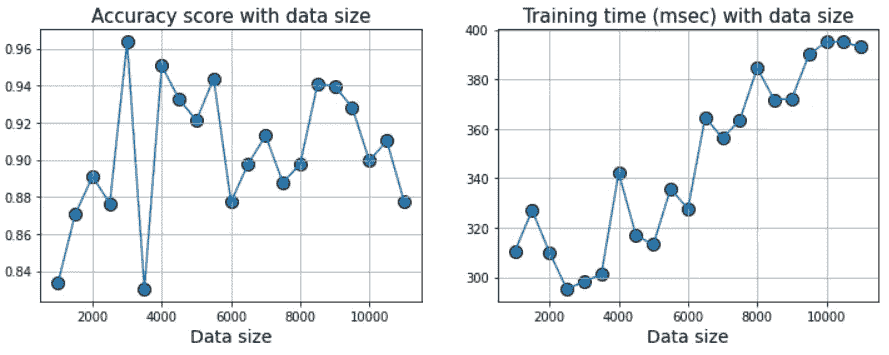
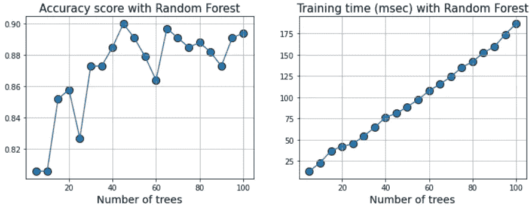
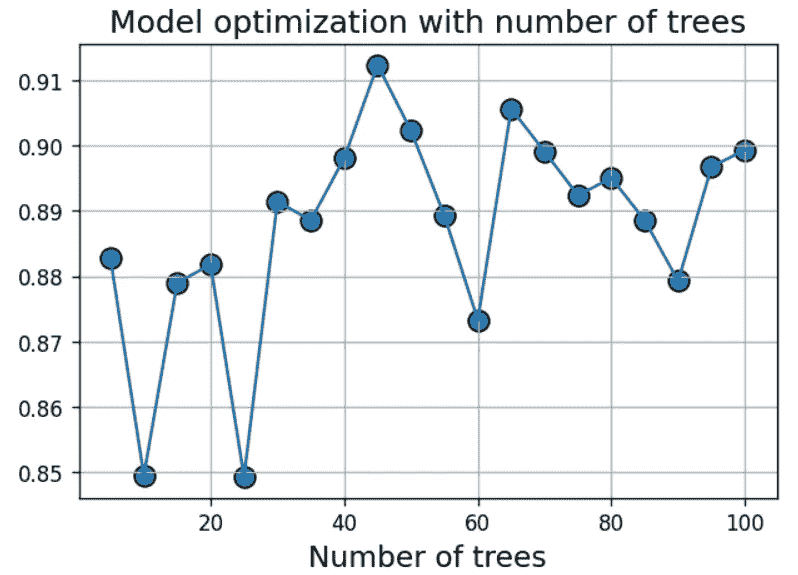

# 使用计时装饰器优化 ML 建模

> 原文：<https://towardsdatascience.com/optimize-ml-modeling-using-a-timing-decorator-2b113c6b60d9?source=collection_archive---------23----------------------->

## 使用定时装饰器记录 ML 训练的执行时间，并将其用于生产数据科学和 ML 优化


**图片来源** : [Pixabay](https://pixabay.com/illustrations/business-man-balancing-3160009/) (免费使用)

# 为什么测量时间很重要

我们可以继续提供成百上千的论据和引用来说明为什么测量在科学技术中如此重要。这是一个强有力的例子，

> 一个精确的测量值抵得上一千个专家的意见。—格蕾丝·赫柏

根据[开尔文勋爵](https://en.wikipedia.org/wiki/William_Thomson,_1st_Baron_Kelvin)，

> 如果你不能衡量它，你就不能改进它。

我们想做[高效的数据科学](https://medium.com/productive-data-science/why-and-how-should-you-learn-productive-data-science-53377b473f37)。这意味着我们希望**提高我们机器学习(ML)训练**和推理的效率。自然，我们需要测量将特定的 ML 模型拟合到数据所花费的时间。

[](https://medium.com/productive-data-science/why-and-how-should-you-learn-productive-data-science-53377b473f37) [## 为什么以及如何学习“生产数据科学”？

### 什么是生产数据科学，它有哪些组成部分？

medium.com](https://medium.com/productive-data-science/why-and-how-should-you-learn-productive-data-science-53377b473f37) 

也许，我们想用各种模型进行实验，并测量它们在相同测试数据上的表现。或者，我们可能希望改变模型的超参数，并查看训练时间和性能如何变化。

在任何情况下，我们都必须测量多次运行的训练函数的执行时间。这是因为我们可能希望对 ML 模型调优如何提高执行时间和性能进行系统研究。

或者，我们可能对联合优化时间和性能指标感兴趣(例如，过于复杂的模型可能只会略微提高性能，但运行速度会慢得多)。

让我向您展示一种简单的方法，使用简单的 Python 代码来完成这种日志记录。

# 计时装饰器和“functools”

大多数数据科学家使用 Jupyter 笔记本进行他们的探索性工作，它提供了[神奇的功能](https://stackoverflow.com/questions/29280470/what-is-timeit-in-python)，如 **%timeit** 和 **%%timeit** ，用于测量代码块的执行时间。然而，这对于笔记本电池中的单次运行是好的，但是对于多次运行的时间的灵活记录不是很有用。

## 计时装饰师

进入 [**装饰器**](https://realpython.com/primer-on-python-decorators/) 和内置 Python 模块`**functools**`。

为了简洁起见，我们将不讨论这些实用程序的具体细节。然而，可以说它们利用了这样一个事实，即 [**函数是 Python**](https://python.plainenglish.io/treat-functions-as-first-class-object-in-python-fde635eec951) 中的一级对象，人们可以 [**包装一个函数来提取关于它的执行以及正常运行的有用信息**](https://stackoverflow.com/questions/308999/what-does-functools-wraps-do) 。

我们可以编写一个计时装饰器来测量函数的执行时间，并加以利用。下面是构建这样一个装饰器的代码，

```
def timing(func):
    [@wraps](http://twitter.com/wraps)(func)
    def wrap(*args, **kw):
        ts = time()
        result = func(*args, **kw)
        te = time()
        tdelta = round(1000*(te-ts),3)
        print (f"Function '{func.__name__}' took {tdelta} milliseconds to run")
        return result
    return wrap
```

注意使用了`*args`和`**kw`来允许任何一组通用的参数和关键字传递给底层函数`func`。该代码的主要目的是测量 time-delta ( `tdelta = round(1000*(te-ts),3)`)，即函数完成执行前后的时间差，以提取执行时间。因为执行可能非常快，所以我们将它乘以 1000，将其标准化为毫秒。

现在到了我们在一个简单的演示函数中使用它的部分。

```
[@timing](http://twitter.com/timing)
def list_length(a):
    if isinstance(a,list):
        time.sleep(0.1)
        s = len(a)
        return s
    else:
        print("Argument is not a list")
```

这是一个简单测量给定列表长度的函数。它还有一个`time.sleep(0.1)`代码，只是为了演示的目的而强制延迟。如果没有它，执行速度会很快，以至于我无法向您展示任何有意义的结果。

我们测试它，

```
list_length([1,2,3])>> Function 'list_length' took 111.291 milliseconds to run
>> 3
```

注意，这个输出多酷啊！第一个打印的语句来自`wrap`函数，第二个结果 3 来自`list_length`函数。它们通过包装器/装饰器机制相互联系。当然，111.291 毫秒的时间是由于我们设置的延迟造成的，并且会因系统不同或运行不同而略有不同。

如果我们使用单个数字而不是传递一个列表来测试它，

```
list_length(5)>> Argument is not a list
>> Function 'list_length' took 0.0 milliseconds to run
```

在这种情况下，`list_length`函数中的条件块跳过了`time.sleep(0.1)`部分，因此几乎立即返回，记录了接近零的执行时间。

## 仅返回执行时间

现在，上面的代码仅用于演示，不应在实践中使用，因为它实际上并不返回执行时间，而只是打印出来。下面是稍微修改过的代码，

```
def time_return(func):
    [@wraps](http://twitter.com/wraps)(func)
    def wrap(*args, **kw):
        ts = time()
        result = func(*args, **kw)
        te = time()
        tdelta = round(1000*(te-ts),3)
        **return tdelta**
    return wrap
```

该代码没有打印语句，并显式返回`tdelta`测量值。

我们可以用它包装另一个演示函数，

```
[@time_return](http://twitter.com/time_return)
def numpy_matmul(a,b):
    return (np.matmul(a,b))
```

因此，它将测量从两个给定的 Numpy 数组计算矩阵乘法所需的时间。

我们来测试一下。

```
SIZE = 1000
a = np.random.beta(1.0,2.0,size=(SIZE,SIZE))
b = np.random.beta(1.0,2.0,size=(SIZE,SIZE))
numpy_matmul(a,b)>> **16.48**
```

所以，计算两个大小为(1000，1000)的随机数(Beta 分布)的 Numpy 矩阵的矩阵乘法需要 16.48 毫秒。

用不同的`SIZE`参数再次运行。

```
SIZE = 2000
a = np.random.beta(1.0,2.0,size=(SIZE,SIZE))
b = np.random.beta(1.0,2.0,size=(SIZE,SIZE))
numpy_matmul(a,b)>> **111.301**
```

所以，现在双倍大小的矩阵需要 111.301 毫秒。我们知道矩阵乘法的时间不是线性的:-)

但是这样做的主要好处是**现在我们可以用这个函数编写一个紧凑的循环，并观察执行时间如何随输入大小变化**，

```
SIZE = [500,1000,2000,3000,4000,5000]
for s in SIZE:
    a = np.random.beta(1.0,2.0,size=(s,s))
    b = np.random.beta(1.0,2.0,size=(s,s))
    t = numpy_matmul(a,b)
    print(f"Matrix multiplication of size ({s}x{s}) took {t} milliseconds")
```

在我的电脑上，我得到了以下结果，

```
Matrix multiplication of size (500x500) took 3.0 milliseconds
Matrix multiplication of size (1000x1000) took 17.031 milliseconds
Matrix multiplication of size (2000x2000) took 111.501 milliseconds
Matrix multiplication of size (3000x3000) took 359.307 milliseconds
Matrix multiplication of size (4000x4000) took 835.614 milliseconds
Matrix multiplication of size (5000x5000) took 1611.042 milliseconds
```

## 将最大似然估计器融入其中

为了不浪费更多的时间，我们将 ML 估计器(来自 Scikit-learn)加入到这个组合中。现在，因为我们对执行速度和 ML 性能都感兴趣，所以在这种情况下，**我们返回时间增量和 ML 度量**。下面的代码与我们之前写的代码非常相似，只是我们返回了一个元组:`return (tdelta, result)`

```
def time_estimator(func):
    [@wraps](http://twitter.com/wraps)(func)
    def wrap(*args, **kw):
        ts = time()
        result = func(*args, **kw)
        te = time()
        tdelta = round(1000*(te-ts),3)
        return (tdelta, result)
    return wrap
```

这个**修饰了一个实际上符合给定数据**的评分函数，并返回准确度分数(在测试/验证集上)

```
[@time_estimator](http://twitter.com/time_estimator)
def classifier_accuracy(estimator,x,y):
    X_train, X_test, y_train, y_test = train_test_split(x, y, 
                                                    test_size=0.33, 
                                                    random_state=42)
    estimator.fit(X_train,y_train)
    score = estimator.score(X_test,y_test)
    return round(score,3)
```

我们制作了一些合成数据，并举例说明了一个逻辑回归估计。

```
data = make_classification(n_samples=1000, n_features=20, n_informative=20, n_redundant=0, flip_y=0.05, class_sep=1.5)x,y = data[0],data[1]log_model = LogisticRegressionCV()
```

当我们运行`classifier_accuracy`函数时，我们得到了执行时间和准确性分数，

```
classifier_accuracy(log_model,x,y)>> (312.083, 0.836)
```

第一个数字是执行时间，即 312.083 毫秒，第二个数字是准确度分数 0.836。

现在，我们有办法**计算具有任意输入的一般 ML 估计器的时序和性能度量**。

让我们把这个派上用场。

## 更改数据并记录执行时间

我们可以针对各种数据大小运行估计器，并通过一个简单的循环记录性能和执行时间。

```
SIZE = [1000+500*i for i in range(21)]
log_model = LogisticRegressionCV()
model_time, model_acc = [],[]for s in SIZE:
    data = make_classification(n_samples=s, n_features=20, n_informative=20,n_redundant=0, flip_y=0.05, class_sep=1.5)
    x,y = data[0],data[1]
    **m_time, m_acc = classifier_accuracy(log_model,x,y)**
    model_time.append(m_time)
    model_acc.append(m_acc)
```

突出显示的关键代码行是修饰函数`classifier_accuracy`，它返回一组执行时间和准确性分数。

一个简单的绘图代码为我们提供了以下内容:



**图片来源**:作者生成

因此，获取更多的数据会使 ML 训练变慢，但实际上并没有改善执行时间。这是因为在合成数据生成中存在`**flip_y = 0.05**`参数，该参数实际上翻转了 5%数据的标签，从而使基本噪声基底固定在 0.05。这就是为什么大多数准确度分数徘徊在 0.95 左右或以下，并且不能超过该值。

因此，这项研究的启示是，我们可以放弃一个小数据集，从而减少执行时间，以节省计算成本。**这就是我们如何优化 ML 培训练习的性价比。**

## 玩估算器优化性价比

让我们假设我们使用一个随机森林估计器来解决这个问题，我们希望通过改变模型中的树的数量来优化准确性和执行时间。

可以像以前一样编写类似的代码。

```
num_trees = [5*x for x in range(1,21)]
model_time, model_acc = [],[]
data = make_classification(n_samples=1000, n_features=20, 
                           n_informative=20, n_redundant=0, 
                           flip_y=0.05,class_sep=1.0)
x,y = data[0],data[1]
for n in num_trees:
    rf_model = RandomForestClassifier(n_estimators=n)
    m_time, m_acc = classifier_accuracy(rf_model,x,y)
    model_time.append(m_time)
    model_acc.append(m_acc)
```

现在，当我们绘制精度和执行时间时，我们得到，



**图片来源**:由作者生成

显然，我们可以确定树木的最佳数量。例如，我们可以创建如下的成本函数，

```
**model_opt = model_acc + 1/model_time**
```

这抓住了我们想要在最小化执行时间的同时最大化准确性的意图。

如果我们画出来，我们会得到，



**图片来源**:由作者生成

显然，我们可以为这个模型选择大约 45 棵树。

样板代码在我的 Github repo 这里是 [**。**](https://github.com/tirthajyoti/Machine-Learning-with-Python/blob/master/Timing-decorator/Timing-decorator-ML-optimization.ipynb)

# 摘要

我们描述了如何使用 Python decorator 和`functools`模块为一般的 Python 函数创建一个实用的 decorator，特别是一个 ML 估计器。我们还展示了这种包装器/装饰器在数据或模型实验中的使用，以及如何利用 ML 模型优化的思想。

这种时间测量和想法在 Auto-ML 包的内部是常见的，他们用 ML 模型运行了许多实验，并选择了最好的一个。为了同时优化计算资源和性能，数据科学家应该发现这种测量工具在他们的日常任务中很有用，并定期部署它。

*喜欢这篇文章吗？成为* [***中等会员***](https://medium.com/@tirthajyoti/membership) *继续* ***无限制学习*** *。如果您使用下面的链接，* ***，我将收取您的一部分会员费，而不会对您产生额外费用*** *。*

[https://medium.com/@tirthajyoti/membership](https://medium.com/@tirthajyoti/membership)