# 为大型数据集优化 Pandas 的内存使用

> 原文：<https://towardsdatascience.com/optimize-pandas-memory-usage-while-reading-large-datasets-1b047c762c9b?source=collection_archive---------7----------------------->

## 有效利用数据类型来防止内存崩溃

来自 [Pixabay](https://pixabay.com/?utm_source=link-attribution&amp;utm_medium=referral&amp;utm_campaign=image&amp;utm_content=932180) 的[图卡皮克](https://pixabay.com/users/tookapic-1386459/?utm_source=link-attribution&amp;utm_medium=referral&amp;utm_campaign=image&amp;utm_content=932180)的图片

Pandas 是一个流行的用于数据科学的 Python 包，因为它为数据探索和可视化提供了强大、富于表现力和灵活的数据结构。但是当处理大规模数据集时，它失败了，因为它不能处理大于内存的数据。

Pandas 提供了大量用于数据探索和可视化的 API，这使得它在数据科学家社区中更受欢迎。 ***Dask、modin、Vaex*** 是一些开源包，可以提升 Pandas 库的性能，处理大型数据集。

当数据集的大小相对大于内存时，最好使用这样的库，但是当数据集大小相对等于或小于内存大小时，我们可以在读取数据集时优化内存使用。在本文中，我们将讨论如何在使用`**pandas.read_csv()**`、`**pandas.read_excel()**` 或`**pandas.read_excel()**`函数加载数据集时优化内存使用。

# 想法:

数据类型是 Python 用来理解如何存储和操作数据的内部构造。在使用 Pandas `read_`函数读取数据集时，默认数据类型被分配给每个要素列。通过观察特征值，Pandas 决定数据类型并将其加载到 RAM 中。

对于整数值，Pandas 赋值为 int64，float64 赋值为 float 64，string 值作为对象赋值。其思想是通过观察最大和最小特征值来降级特征数据类型。熊猫分配的默认数据类型列表有:

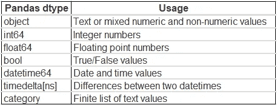

(作者图片)，熊猫默认数据类型

> 与 int64 数据类型相比，int8 数据类型的值占用的内存少 8 倍。

按照下面提到的列表获取每个数据类型的范围:

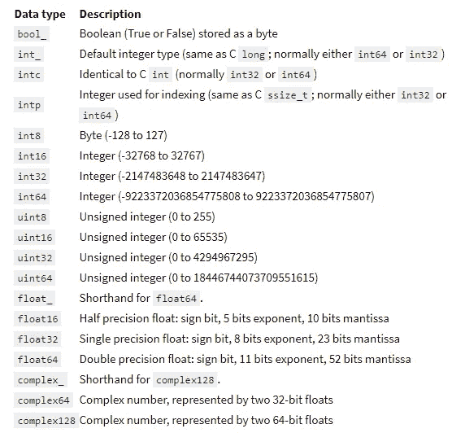

([来源](https://jakevdp.github.io/PythonDataScienceHandbook/02.01-understanding-data-types.html))、数据类型及其范围

## 数据:

我们将使用来自 Kaggle 的[纽约出租车行程持续时间数据集进行进一步演示。用熊猫读取数据，占用 467MB。使用 Pandas `**.info()**` 函数可以观察默认的数据类型和内存使用情况。](https://www.kaggle.com/c/nyc-taxi-trip-duration)

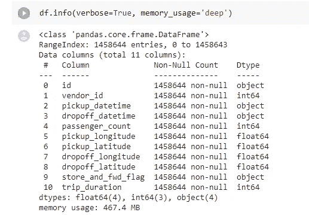

(图片由作者提供)、分配的默认数据类型和内存使用情况

# 数字特征:

对于所有数值，Pandas 将 float64 数据类型分配给至少有一个 float 值的特性列，将 int64 数据类型分配给所有特性值都为整数的特性列。

## 整数:

在[New York Taxi Trip Duration dataset](https://www.kaggle.com/c/nyc-taxi-trip-duration)中，默认情况下`vendor_id`、`passenger_count`、`trip_duration` 列被指定为 int64 数据类型。

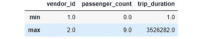

通过观察特性`vendor_id`、`passenger_count`的最小值和最大值，可以在 int8 数据类型中调整，特性`trip_duration`可以在 int32 数据类型中调整。

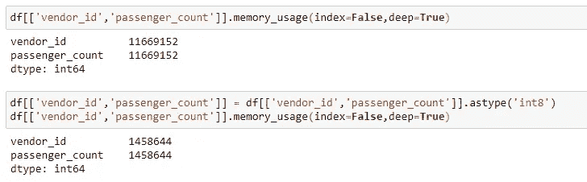

int64 数据类型的`vendor_id`、`passenger_count`功能的内存使用量分别为 11，669，152 字节，减少了约 88%，为 1，458，644 字节。

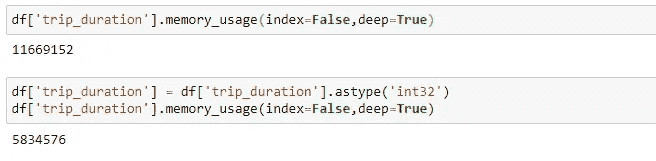

int64 数据类型的`trip_duration`特性的内存使用量分别为 11，669，152 字节，减少了约 50%，为 5，834，576 字节。

## 浮动:

在[纽约出租车行程持续时间数据集](https://www.kaggle.com/c/nyc-taxi-trip-duration)中，默认情况下`pickup_longitude`、`pickup_latitude`、`dropoff_longitude`、`dropoff_latitude`列被指定为 float64 数据类型。

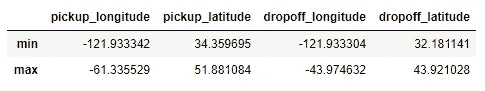

通过观察上述特性的最小值和最大值，我们可以将数据类型从 float64 降级到 float16。

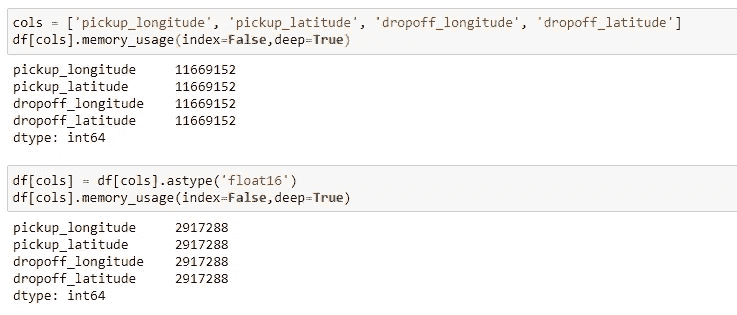

使用 float64 数据类型的上述特性的内存使用量分别为 11，669，152 字节，减少了约 75%，为 2，917，288 字节。

# 日期时间:

默认情况下，`pickup_datetime`、`dropoff_datetime` 列被指定为对象数据类型，可以降级为日期时间格式。

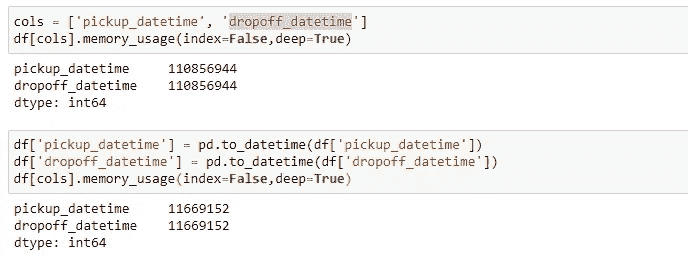

具有 object 数据类型的上述功能的内存使用量分别为 110，856，944 字节，减少了约 90%，为 11，669，152 字节。

# 分类:

熊猫将非数字特征列指定为对象数据类型，该类型可以降级为类别数据类型。通常，非数字特征列具有分类变量，这些变量通常是重复的。例如，性别特征列只有“男性”和“女性”两个类别，这两个类别在所有重新占用空间的实例中反复出现。将其分配给[类别](https://pandas.pydata.org/pandas-docs/stable/user_guide/categorical.html)数据类型是一种相对紧凑的表示。

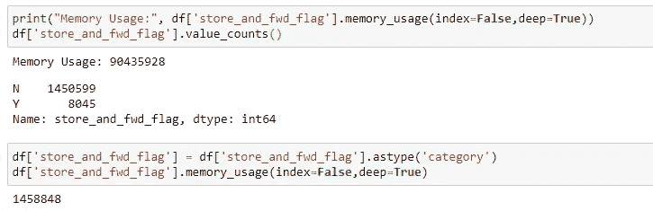

数据类型为 object 的特性`store_and_fwd_flag`的内存使用量为 90，435，928 字节，减少了约 98%，为 1，458，848 字节。

当任何分类特征的唯一类别数相对小于数据集实例数时，必须将其转换为类别数据类型。

# 读取数据时进行类型转换:

`pandas.read_csv`带有一个`type` 参数，该参数接受用户提供的键值格式的数据类型，可以使用该格式代替默认格式。DateTime 特性列可以传递给`parse_dates`参数。

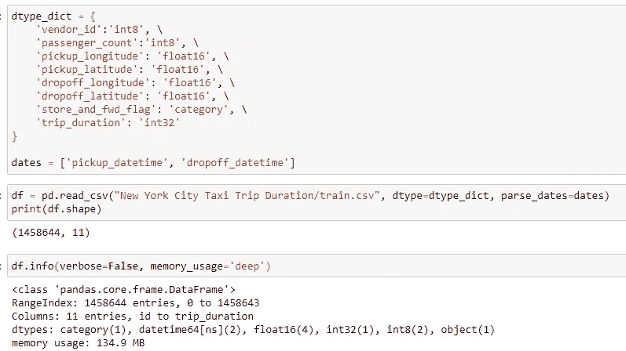

> 使用默认数据类型读取相同的[纽约出租车行程持续时间数据集](https://www.kaggle.com/c/nyc-taxi-trip-duration)使用了 427MB 内存。在类型转换之后，内存使用减少了大约 70%,只有 135MB。

# 结论:

本文讨论的类型转换技术可以在一定程度上减少 Pandas read 函数对数据的内存占用。如果数据集的大小与 RAM 相比非常大，那么优化数据类型可能没有帮助。对于如此大的数据集，必须尝试并行化库，如 Dask、Vaex、Modin。

为了更好的理解，请跟随我的一些关于扩大熊猫环境的文章:

*   [**4 个可以并行化现有熊猫生态系统的库**](/4-libraries-that-can-parallelize-the-existing-pandas-ecosystem-f46e5a257809)
*   [**Dask 如何加速熊猫生态系统？**](/how-dask-accelerates-pandas-ecosystem-9c175062f409)
*   [**使用 Vaex**](/process-dataset-with-200-million-rows-using-vaex-ad4839710d3b) 处理 2 亿行数据集
*   [**通过改变一行代码**](/speed-up-your-pandas-workflow-by-changing-a-single-line-of-code-11dfd85efcfb) 来加速你的熊猫工作流程

# 参考资料:

[1]熊猫文档:[https://Pandas . pydata . org/Pandas-docs/stable/reference/io . html](https://pandas.pydata.org/pandas-docs/stable/reference/io.html)

> 感谢您的阅读