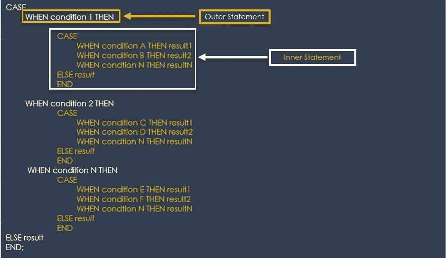
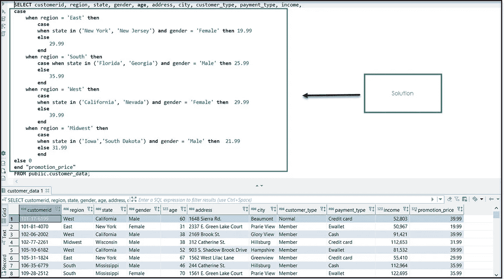

# 以意想不到的方式使用 CASE 表达式优化 SQL 查询

> 原文：<https://towardsdatascience.com/optimize-sql-queries-with-case-expressions-in-unexpected-ways-52a8641814c5?source=collection_archive---------12----------------------->

## 辅导的

## 是时候通过嵌套的 Case 表达式将您的 SQL 技能从一般提高到非凡了

杰斯·斯洛顿，佩克斯

> 是那些意想不到的事情改变了我们的生活。—珊达·瑞姆斯

我是**黑人**，我在一个有**帮派**的街区长大。和我一起长大的大多数朋友都死了，在监狱里，嗑药了，或者**只是卡住了**。他们一直将我就读的学校排在最后一名。现在，我正在给一群像我一样的数据极客写技术文章，他们发现生活是一个有待解决的数据问题的未解之谜。**真是意想不到。**

如果你读过我的其他教程，你会意识到现在我把编程看作是一种艺术努力。挫折中的冒险。每条码线都有自己的**色相**，美感和质感。它反映了**在**痛苦的**检查或反思的几个小时里对编码器的一个**贴心的选择。编码员在**画布**上描绘她的解决方案**宽广**，反映了她的视角和经验。在写这些教程时，我避开了所有技术复杂性的伪装。真是意想不到。我不会使用过于复杂的术语或例子。我喜欢分享知识，所以我尽量使用通俗易懂的语言。因此，像其他教程一样，本教程向编码人员的**库**添加了一个工具。

储存库是大量储存贵重物品的**百宝箱**。**案例表达式**应该是 SQL 编码人员百宝箱的一部分。所以，我正在写一系列关于以**意想不到的**方式使用 Case 表达式的文章。这是**系列的第二部**:

*   第一部分: [**案例**表达式和窗口函数](/sql-window-functions-64c26bd643fd)
*   第二部分:**嵌套案例**表达式
*   第 3 部分:子查询和**案例**表达式( ***即将推出*** )

这些方法可以让你从平庸走向卓越。所以，系好安全带，享受**旅程**。

# 嵌套 Case 表达式

**嵌套 CASE** 表达式扩展了 **CASE** 表达式的功能和精度。**案例**表达式具有以下特征:

*   **CASE** 表达式遍历所有条件，并在满足第一个条件时返回值(类似于 if-then-else 语句)。所以，一旦条件为真，它将停止读取并返回值。
*   **CASE** 允许你显示一列中实际值的替代值。
*   **CASE** 的一个常见用法是用更可读的值替换代码或缩写。
*   一个**案例**可以用计算好的指标构建列。

或者，**嵌套 CASE** 表达式具有以下特征:

*   **嵌套案例**包含了**案例**的所有特征。
*   使用**嵌套案例，**您可以将数据分成子组或段。不同的逻辑可以应用于每个子组。

# **嵌套 CASE 表达式语法**

作者，大小写语法

在**嵌套 CASE** 表达式中，外层语句执行，直到满足一个条件。一旦满足条件，内部的 **CASE** 表达式就会执行并返回一个结果。如果外部语句中不满足条件， **CASE** 表达式返回 **ELSE** 语句中的值。

## 使用案例

我们虚构的公司在美国有四个分部。该公司希望在每个部门测试不同的定价策略。活动经理要求为每个部门提供一份符合以下要求的数据文件:

*   **东**:如果顾客是 F **女**住在**纽约**或**新泽西**的话，顾客会收到 19.99 美元的产品报价。留在北方的其他客户获得 29.99 美元的标准报价。
*   **南**:如果顾客是住在**佛罗里达州**或**佐治亚州**的 M **ale** 的顾客，顾客会收到 25.99 美元的产品报价。留在北方的其他客户获得 35.99 美元的标准报价。
*   **西**:如果顾客是**女**住在**加州**或内华达州**的话，顾客会收到 29.99 美元的产品报价。留在北方的其他客户收到 39.99 美元的标准报价。**
*   **中西部**:西部:如果顾客是**男**住在**爱荷华**或**南达科他，顾客会收到 21.99 美元的产品报价。留在北方的其他客户收到 31.99 美元的标准报价。**

## 数据:动手操作

请访问 [Github](https://github.com/bensondavies/DataFiles.git) 或 [Google Drive](https://drive.google.com/drive/folders/1TBR3UqqYjpWwxSIZY79hzFE06flPZ_S3?usp=sharing) 上的数据和 SQL 代码，以便跟进。我使用 Postgres 数据库构建了这个解决方案。因此，您需要将数据上传到 Postgres 数据库。或者，您可以更改语法并使用另一个数据库，如 MySQL、Redshift、Oracle 或 SQL Server。

## 解决方案

当我**没有经验**的时候，我会查看这些类型的**需求**和**以我的**方式找到解决方案。我可以想象使用单独的`WHERE`子句分割数据，然后使用一系列的`UNION`查询合并数据。最后，通过`CREATE`和`UPDATE`表格陈述得出解决方案。我会为我花了两天时间来完成“挑战”而感到骄傲。作为一名伟大的 SQL 战士，我杀死了另一个敌人。我觉得我的努力是英勇的，值得为 T21 鼓掌。回想起来，他们既不是**也不是**。只是因为缺乏经验，所以缺乏想象力或创造力。下面显示的**更好的解决方案**使用了一个**嵌套 CASE** 表达式。

作者，嵌套 Case 表达式解决方案

**嵌套 CASE** 表达式将数据分割成多个部分。一旦细分完成，我们将根据州和性别应用单独的业务需求。结果是一个`promotion_price`栏目在一两个小时内完成。没有斗争，不眠之夜或争论。真是意想不到。

最后，获得优秀 SQL 技能的途径包括掌握 **CASE** 表达式以及通用表表达式(CTE 的)、窗口函数和派生表。我将在接下来的教程中分享更多关于这些的内容。不断学习，不断成长，不断分享。那是意料之中的。

## 如果你喜欢这篇文章，这里有一篇你可能会喜欢的系列文章:

 [## SQL 嵌套窗口函数

### 嵌套的 Case 表达式:无限可能

towardsdatascience.com](/sql-window-functions-64c26bd643fd) 

***分享的灵感*** *:每次分享的教训，都让我想起朱利叶斯·邓肯先生。我记得第一天***我遇见了他。穿着* ***白大褂*** *朝我们家门口走来，我以为他是医生。相反，他是我见过的***和* ***最伟大的人*** *。为了帮助单身母亲，他接受了低于成本的工作。他慷慨地分享他的时间、信仰和资源。对他来说，支付大学课本或以其他方式帮助是很平常的事。当他去世时，排队致敬的队伍持续了一个多小时。他是一个普通的* ***英雄*** *。******黑暗*** *。不断分享并激励他人变得比他们想象的更伟大。*****

**[1] Chris Fehily，SQL 的《可视化入门指南》(2008 年)。**